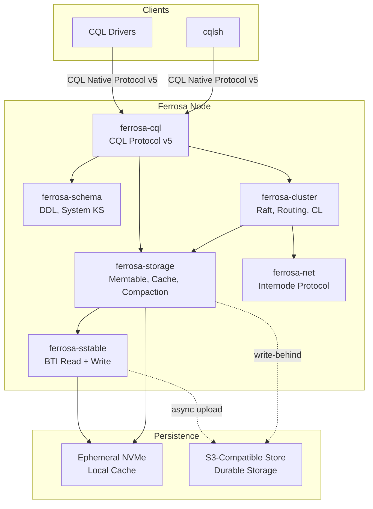

# Ferrosa

A Rust reimplementation of Apache Cassandra with S3-backed storage.

Ferrosa is a distributed database that speaks the CQL protocol, enabling existing
Cassandra applications to connect without modification. Under the hood, it replaces
Cassandra's local-disk storage model with a write-behind architecture where ephemeral
local storage serves as a fast cache and S3-compatible object storage provides
durability.

## Why Ferrosa?

Apache Cassandra is a proven distributed database based on the
[Amazon Dynamo paper](https://www.allthingsdistributed.com/files/amazon-dynamo-sosp2007.pdf).
It works well, but carries decades of accumulated complexity: non-idiomatic Java for
performance reasons, tightly coupled subsystems, and a storage engine designed around
assumptions (cheap local disk, persistent nodes) that don't match cloud-native
infrastructure.

Ferrosa starts from a deep analysis of Cassandra's architecture — understanding what
it does, what's essential, and what's accidental complexity — then builds a clean Rust
implementation that takes advantage of modern hardware and cloud infrastructure.

### Design Principles

- **S3 as the source of truth.** Nodes are ephemeral. SSTables live in object storage.
  A new node can serve reads within seconds by fetching from S3, not hours of streaming.
- **CQL compatibility.** Existing applications, drivers, and tools work unchanged.
  Ferrosa speaks CQL native protocol v5.
- **Rust-native, not a transliteration.** Ferrosa is built as idiomatic Rust with clean
  ownership boundaries, not a line-by-line port of Java code.
- **Cassandra's consistency model.** Tunable consistency levels (ONE, QUORUM, ALL) work
  as expected. Replication factor and consistency level semantics are preserved.
- **Independent crates.** Each subsystem is a standalone Rust crate with its own tests
  and documentation. `ferrosa-sstable` can read Cassandra SSTables and is useful on
  its own for migration tooling.

## Architecture



### Storage Model: Write-Behind Async S3

Writes go to a local commit log and memtable, then acknowledge to the client based on
the configured consistency level. SSTables are flushed to local ephemeral storage and
asynchronously uploaded to S3. The commit log is also shipped to S3 on a short interval
(configurable interval) for crash recovery.

Data durability during the async upload window is protected by:

1. **Quorum writes** — data exists on multiple replicas before acknowledgment
2. **Commit log shipping** — small, frequent uploads to S3 (seconds, not minutes)
3. **Upload priority** — freshly-flushed SSTables upload before compaction output
4. **Replica coordination** — at least one replica confirming S3 upload marks data fully durable
5. **Increased quorum (optional)** — users can set write CL=ALL or higher RF for maximum durability during migration

Reads check memtable first, then local SSTable cache, falling back to S3 on cache miss.
Bloom filters and partition indices are always cached locally.

### SSTable Compatibility

Ferrosa implements Cassandra's SSTable formats in phases:

- **BTI format** (trie-based, Cassandra 5.x default) — primary read/write format, implemented first
- **Big format** (legacy) — read support planned for migrating older Cassandra deployments

Storage I/O is abstracted behind `ReadAt`/`WriteAt` traits, enabling the same SSTable code to
read from local files or S3. A future native Ferrosa format optimized for S3 access patterns
is planned behind a feature flag.

### Cluster Coordination

- **Metadata consensus:** Raft (via `openraft`) for schema, topology, and token management
- **Data consistency:** Cassandra-compatible tunable consistency levels
- **Failure detection:** Heartbeat-based with configurable thresholds
- **Internode protocol:** Custom binary protocol over TCP with TLS

Distributed transactions (Accord-style) are a research item, not yet implemented.

## Crates

| Crate | Description |
|-------|-------------|
| `ferrosa` | Binary — composes all crates into the running database |
| `ferrosa-cluster` | Raft metadata, node membership, tunable CL, request routing |
| `ferrosa-cql` | CQL native protocol v5, query parsing, execution |
| `ferrosa-graph` | Graph query engine — Cypher parser, adjacency index, HTTP endpoint |
| `ferrosa-index` | Pluggable secondary indexes — B-tree, hash, composite, phonetic, vector |
| `ferrosa-storage` | Memtable, commit log, compaction, S3 write-behind, cache management |
| `ferrosa-schema` | Table/keyspace definitions, auth, audit, system keyspaces |
| `ferrosa-sstable` | Read/write BTI SSTables, trie indices, Bloom filter, compression |
| `ferrosa-net` | Internode protocol, connection management, priority-lane RPC |
| `ferrosa-ctl` | CLI admin tool with TUI monitoring dashboard |
| `ferrosa-common` | Shared types: Token, PartitionKey, DecoratedKey, CQL types |

## Migrating from Cassandra

Ferrosa provides tools for importing data from existing Cassandra clusters:

```bash
# Inspect a Cassandra SSTable
ferrosa-sstable-dump /path/to/cassandra/data/keyspace/table/

# Import SSTables into Ferrosa's S3 storage
ferrosa-sstable-import \
  --source /path/to/cassandra/data/ \
  --target s3://ferrosa-data/cluster-1/ \
  --keyspace my_keyspace
```

Migration is a one-way import: Cassandra SSTables are read and uploaded to S3 in BTI
format. Ferrosa clusters are standalone — they do not join existing Cassandra clusters.

## Testing

Ferrosa uses [Hunter](https://github.com/datastax-labs/hunter) (DataStax) for automated
performance regression detection via change point analysis on benchmark time-series data.

Test infrastructure runs on [Sprites](https://docs.sprites.dev/) (Firecracker VMs) and
[fly.io](https://fly.io/) for fast, ephemeral multi-node clusters:

- **Data integrity** — write/read verification, node kill/recovery, S3 cold start
- **Performance** — YCSB workloads against Cassandra baseline (the floor to beat)
- **Chaos** — node crash, network partition, S3 outage, disk full
- **CQL compatibility** — driver matrix, protocol conformance

## Project Status

All 11 crates are implemented with ~68,000 lines of Rust and ~1,370 tests. Pair-mode
two-node operation is production-ready; full Raft-based cluster mode (Phase 2) is
complete and Phase 3 (production cluster wiring) is next. See the
[architecture specs](specs/README.md) for the full specification and status.

## License

[Apache License 2.0](LICENSE)
