# Commit Log Replay & Compaction Execution Design

> Last updated: 2026-03-13
> Status: Draft

## Goal

Wire commit log replay into StorageEngine startup and implement compaction merge I/O, enabling data durability across restarts and bounded SSTable growth on a single node.

## Architecture

Both features are **integration tasks** — the building blocks (replay reader, merge algorithm, SSTable writer, STCS strategy, executor thread) are fully implemented. The work is wiring them together and adding the missing glue code.

```mermaid
graph TB
    subgraph "Startup Path (Part 1)"
        Boot[StorageEngine::open] --> Replay[CommitLog::open_and_replay]
        Replay --> Filter[Filter mutations by checkpoint]
        Filter --> Register[Caller registers table schemas]
        Register --> Apply[replay_mutations into TableStore memtables]
        Apply --> Flush[Flush replayed tables to SSTable]
        Flush --> Discard[discard_completed per table]
        Discard --> DeleteSegs[Delete old segment files]
    end

    subgraph "Compaction Path (Part 2)"
        Trigger[Periodic check] --> Strategy[STCS select candidates]
        Strategy --> Submit[Submit CompactionTask]
        Submit --> Exec[CompactionExecutor thread]
        Exec --> Read[SSTableReader per input]
        Read --> Merge[merge_partitions]
        Merge --> Write[SSTableWriter]
        Write --> Swap[Atomic swap: new SSTable replaces inputs]
        Swap --> Cleanup[Delete old SSTable files]
    end
```



## Dependencies

- `ferrosa-storage`: CommitLog, TableStore, merge, flush, compaction modules
- `ferrosa-sstable`: SSTableReader, SSTableWriter
- `ferrosa-common`: Partition, Row, CellValue types

No new crate dependencies.

## Part 1: Commit Log Replay on Startup

### What Exists

| Component | Status |
|-----------|--------|
| `CommitLog::open_and_replay()` | Implemented — scans segments, validates CRCs, filters by checkpoint |
| `SegmentReader` | Implemented — follows marker chain, skips corruption |
| `Checkpoint` | Implemented — atomic JSON saves, per-table position tracking |
| `CommitLog::discard_completed()` | Implemented — removes tables from segments, deletes old files |
| `Mutation` serialization | Implemented — round-trip tested with property tests |

### What Needs Wiring

#### 1.1 Two-phase startup: open, register, replay

**Problem**: `StorageEngine::new()` creates the engine with an empty `tables` HashMap. Tables are registered later via `register_table()`. But replay needs tables registered first to route mutations. This is a chicken-and-egg problem.

**Solution**: Split into two phases. `open()` returns both the engine and the pending mutations. The caller registers tables, then calls `replay_mutations()`:

```rust
// Phase 1: Open commit log, collect pending mutations.
let (engine, pending) = StorageEngine::open(config, runtime)?;

// Phase 2: Register table schemas (from schema store / CQL layer).
engine.register_table(users_schema)?;
engine.register_table(events_schema)?;

// Phase 3: Replay pending mutations into registered tables.
engine.replay_mutations(pending)?;
```

`StorageEngine::open()` replaces `new()` and calls `CommitLog::open_and_replay(config)` instead of `CommitLog::new(config)`. It returns `(Self, Vec<Mutation>)`.

`replay_mutations()` iterates over the mutations:

```rust
pub fn replay_mutations(&self, mutations: Vec<Mutation>) -> Result<()> {
    let tables = self.tables.read();
    for mutation in mutations {
        let table_id = TableId::new(&mutation.keyspace, &mutation.table);
        if let Some(state) = tables.get(&table_id) {
            for row in &mutation.rows {
                state.store.write_from_replay(&mutation.key, row.clone())?;
            }
        }
        // Unknown tables are silently skipped — schema may have changed
    }
    drop(tables);
    // Post-replay flush (see 1.2)
    self.flush_replayed_tables()?;
    Ok(())
}
```

`write_from_replay()` is a new method on `TableStore` that writes directly to the memtable without appending to the commit log (avoiding circular writes). Signature: `fn write_from_replay(&self, key: &DecoratedKey, row: Row) -> Result<()>`.

#### 1.2 Post-replay flush and segment cleanup

After replay, flush all tables that received mutations to SSTable, then clean up old segments:

```rust
fn flush_replayed_tables(&self) -> Result<()> {
    let tables = self.tables.read();
    for (table_id, state) in tables.iter() {
        if state.store.has_unflushed_data() {
            state.store.flush()?;
            if let Some(position) = state.store.last_commit_log_position() {
                self.commit_log.discard_completed(table_id, position)?;
            }
        }
    }
    Ok(())
}
```

**Durability invariant**: `open_and_replay()` must NOT delete old segment files. The current implementation deletes segments before mutations are flushed to SSTables — if the process crashes after `open_and_replay` returns but before flush completes, replayed mutations are lost (neither in commit log nor in SSTables). Fix: remove the segment deletion from `open_and_replay()` and let `discard_completed()` handle cleanup after flush succeeds. This requires a one-line change to `open_and_replay()` (delete the `for (_, path) in &segment_files { let _ = fs::remove_file(path); }` loop).

Post-replay flush is important for performance — without it, the memtable holds all replayed data in memory until the next natural flush threshold.

#### 1.3 Flush-time checkpoint updates

When `TableStore::flush()` completes during normal operation (not just replay), the engine must call `commit_log.discard_completed(table_id, position)`. This ensures old segments are cleaned up as data becomes durable in SSTables.

The `StorageEngine::flush()` method already calls `TableStore::flush()`. Add the `discard_completed` call after it succeeds.

#### 1.4 Track commit log position per write

Each `StorageEngine::write()` call appends to the commit log and gets back a `CommitLogPosition`. This position must be associated with the table so that `discard_completed` can report the correct position at flush time.

`TableStore` needs a `last_commit_log_position` field, updated on each write, read at flush time. Since `CommitLogPosition` is 16 bytes (`segment_id: u64` + `offset: u64`), use `parking_lot::Mutex<Option<CommitLogPosition>>` for simplicity. The mutex is per-table and only taken briefly for a copy — contention is negligible. Note: this introduces a lock on the write path, which technically violates the "writes are lock-free" doc comment on `StorageEngine`. For MVP this is acceptable; a future optimization could use `AtomicU128` or `ArcSwap<CommitLogPosition>` if profiling shows contention. Update the doc comment to reflect this.

### Error Handling

- **Corrupted entries**: Already handled by `SegmentReader` — silently skipped, next valid entry used. This is WAL standard practice.
- **Unknown tables**: Mutations for tables not in the current schema are skipped. This handles schema changes between crash and restart.
- **Empty replay**: If no segments exist or all are checkpointed, `open_and_replay` returns an empty vec. No special handling needed.
- **Checkpoint write failure**: Fatal — startup fails. Without a valid checkpoint, we cannot safely skip already-flushed entries on next restart.

### Testing

- **Replay round-trip**: Write mutations via engine, kill without flush, restart, verify data is present.
- **Checkpoint filtering**: Write, flush (updates checkpoint), write more, restart — only unflushed mutations should replay.
- **Corruption tolerance**: Corrupt a segment file, restart — corrupted entries skipped, valid entries replayed.
- **Empty replay**: Fresh start with no segments — engine starts normally.
- **Schema change**: Write to table, drop table from schema, restart — mutations for dropped table silently skipped.
- **Multi-table replay**: Write mutations to multiple tables, restart — verify correct routing to each table's memtable.

## Part 2: Compaction Execution (STCS)

### What Exists

| Component | Status |
|-----------|--------|
| `SizeTieredStrategy::select()` | Implemented — bucket grouping, threshold logic |
| `CompactionExecutor` | Implemented — background thread, channel, task/result types |
| `merge_partitions()` | Implemented — LWW, deletion suppression, static row merge |
| `SSTableWriter` | Implemented — all 7 components, delta-encoding, bloom, trie |
| `SSTableReader` | Implemented — reads all 7 components |
| `SSTableMetadata` | Implemented — lightweight carrier for strategy decisions |
| `FlushTarget` / `FileFlushTarget` | Implemented — parallel file writes with generation counter |

### What Needs Wiring

#### 2.1 CompactionExecutor: implement merge I/O

`execute_task()` currently returns placeholder metadata. Replace with:

1. **Read**: Open each input SSTable via `SSTableReader::open(path)`
1. **Collect**: Read all partitions from each reader into memory
1. **Group**: Group partitions by decorated key across all inputs
1. **Merge**: For each key group, call `merge_partitions()` to produce a single merged partition
1. **Sort**: Ensure output partitions are in token order (SSTableWriter requires this)
1. **Header**: Build `SerializationHeader` by scanning merged partitions (reuse `build_serialization_header()` from flush)
1. **Write**: Create `SSTableWriter`, add all merged partitions, call `finish()`
1. **Output**: Write the 7 component files to `task.output_dir` via `FileFlushTarget`
1. **Return**: `CompactionResult` with output SSTable metadata

**Schema propagation**: `CompactionTask` currently only has `inputs: Vec<SSTableMetadata>` and `output_dir: PathBuf`. Steps 6-7 need a `TableSchema` to build the `SerializationHeader` and create the `SSTableWriter`. Extend `CompactionTask` to include `schema: TableSchema`. This is simpler than giving the executor a schema registry reference and avoids shared state across threads.

**Generation counter**: The output SSTable must use `FileFlushTarget` with the same generation counter as the table's flush path, ensuring monotonically increasing generation numbers. The `CompactionTask` should include a reference to the table's `FileFlushTarget` (or its `next_generation()` method) so the output generation is correctly sequenced.

Memory concern: Loading all partitions into memory works for small-to-medium SSTables. For very large tables, a streaming merge with a priority queue would be needed — but that's a future optimization. The current merge.rs API already works on `Vec<Partition>` and the flush path loads entire memtables, so this is consistent.

#### 2.2 StorageEngine: compaction trigger loop

Add a periodic background task that runs every N seconds (configurable, default 60s):

1. For each `TableStore`, collect SSTable metadata (size, path, token range, timestamps)
2. Run `SizeTieredStrategy::select()` on the metadata
3. If candidates returned, submit a `CompactionTask` to the executor
4. Poll executor for completed results
5. On completion: swap new SSTable in, remove old SSTables from the table's list, delete old files

The trigger loop runs as a tokio async task (`tokio::time::interval`) on the existing runtime. Note that `CompactionExecutor` itself uses a dedicated OS thread with `std::sync::mpsc` — the async trigger task submits tasks via the existing channel and polls results. `StorageEngine::new()` already accepts `Option<&tokio::runtime::Handle>` for the upload manager; the compaction trigger loop also needs this handle. When `runtime` is `None` (tests without tokio), compaction is only triggered synchronously via `flush()` → `maybe_compact()`.

#### 2.3 Atomic SSTable swap after compaction

When compaction completes, the `TableStore` must atomically replace the input SSTables with the output SSTable. Add a new method to `TableStore`:

```rust
pub fn swap_compacted_sstables(
    &self,
    remove: &[PathBuf],      // input SSTable paths to remove
    add: SSTableReader,       // output SSTable reader
) -> Result<()>
```

This uses the same `ArcSwap` pattern as flush:

1. Load current SSTable list from `StoreView`
1. Remove input SSTables (by path matching against `remove`)
1. Insert output SSTable at the correct position (sorted by generation)
1. Store new list via `ArcSwap::store()`

Old SSTable files are deleted after the swap. If deletion fails, log a warning but don't fail — orphan cleanup can handle it later.

#### 2.4 SSTable metadata collection

`TableStore` needs a method to collect `SSTableMetadata` for its current SSTables. This reads the stored statistics (partition count, size, token range, timestamp range) from each `SSTableReader`.

Note: `StorageEngine::collect_sstable_metadata()` is currently a stub returning `Vec::new()` (engine.rs:516-526). This task replaces the stub with real metadata collection.

### Error Handling

- **Reader failure**: If an input SSTable cannot be opened (corrupt, missing), the compaction task fails. The executor reports the error; the trigger loop retries on the next cycle. Input SSTables are not removed.
- **Writer failure**: If the output SSTable cannot be written (disk full, I/O error), the task fails. Input SSTables are preserved — no data loss.
- **Concurrent flush**: Flush and compaction can run concurrently on different tables. For the same table, the ArcSwap pattern ensures atomic visibility — readers always see a consistent snapshot.
- **Shutdown**: `CompactionExecutor::shutdown()` already drains the channel and joins the thread. In-progress tasks complete before shutdown.

### Testing

- **Round-trip compaction**: Flush 4 SSTables (STCS min_threshold), trigger compaction, verify merged output contains all data.
- **LWW correctness**: Write conflicting values across multiple SSTables, compact, verify latest-timestamp wins.
- **Deletion suppression**: Write + delete across SSTables, compact, verify tombstones suppress older values.
- **Concurrent read during compaction**: Start a read, trigger compaction, verify read completes with correct data (ArcSwap atomicity).
- **File cleanup**: After compaction, verify old SSTable files are deleted and new ones exist.
- **Strategy selection**: Verify STCS only triggers when bucket reaches min_threshold.
- **Error recovery**: Corrupt an input SSTable, trigger compaction, verify graceful failure with no data loss.

## Implementation Order

1. **Part 1 first**: Commit log replay. This is prerequisite for meaningful compaction testing — without replay, restarting the engine between test phases loses data.
2. **Part 2 second**: Compaction execution. With replay working, we can write data, restart, verify persistence, then test compaction across multiple flush cycles.

## Crate Structure Changes

No new files needed. All changes are in existing files:

```
ferrosa-storage/src/
├── engine.rs          # Startup replay, flush signaling, compaction trigger
├── store.rs           # write_from_replay(), position tracking, SSTable metadata
├── compaction/
│   └── executor.rs    # Merge I/O implementation
└── (no new files)
```

## Related Specs

- [Storage Part A](2026-03-11-ferrosa-storage-design.md) — memtable, flush, merge
- [Storage Part B](2026-03-11-ferrosa-storage-part-b-design.md) — commit log format and sync
- [Storage Part C](2026-03-12-ferrosa-storage-part-c-design.md) — compaction, S3, engine composition
