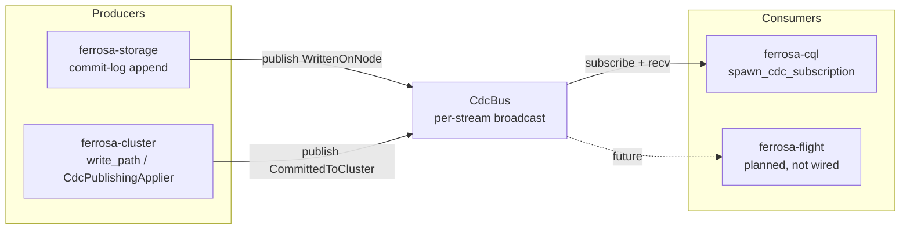

# ferrosa-cdc — Architecture Overview

## Purpose & boundary

`ferrosa-cdc` is the **shared push channel** for Ferrosa's `SUBSCRIBE` feature.
`SUBSCRIBE` was scoped to expose two optional, event-driven change streams rather
than a polled `SELECT` snapshot, so the engine needs a single bus that write-path
producers publish to and streaming consumers read from.

Its boundary is deliberately narrow: it knows the foundation value model
(`DecoratedKey`, `accord::Timestamp` from `ferrosa-common`) and the storage row
shape (`Row` from `ferrosa-sstable`), and nothing about commit-log internals,
Accord/Raft, CQL framing, or transport. It owns *what a change event is* and *how
events fan out to bounded subscribers* — not how they are produced or rendered.

It exists below `ferrosa-storage` in the dependency graph **on purpose**:
`ferrosa-storage` is a producer that depends on `ferrosa-cdc`, so `ferrosa-cdc`
must not depend back on it. That is why `CdcEvent` reuses
`ferrosa_sstable::types::Row` and never embeds `ferrosa_storage::Mutation`.

## Module map

| Module | Responsibility |
|--------|----------------|
| `lib` (`src/lib.rs`, ~285 LoC incl. tests) | `CdcStream`, `CdcEvent`, `CdcRecvError`, `CdcBus`, `CdcSubscription` — the entire public surface |

This is a single-module crate; the type set is small and intentionally flat.

## Core types

- **`CdcStream`** — `WrittenOnNode` (local durable commit-log writes) or
  `CommittedToCluster` (Accord commit / regular-CL quorum ack). `Copy`/`Eq`/`Hash`.
- **`CdcEvent`** — `stream`, `keyspace`, `table`, `key: DecoratedKey`,
  `rows: Vec&lt;Row&gt;`, `timestamp: i64` (microseconds; ordering key),
  `accord_ts: Option&lt;Timestamp&gt;` (Some only on Accord-committed events),
  `mutation_id: [u8; 16]` (dedup key for at-least-once delivery).
- **`CdcBus`** — two `tokio::sync::broadcast` senders, one per stream, behind a
  single `Arc`-wrapped bus.
- **`CdcSubscription`** — one consumer's `broadcast::Receiver` plus the stream it
  follows; owns its bounded queue.
- **`CdcRecvError`** — `Lagged { skipped }`, `Empty`, `Closed`.

## Data flow

**Publish path:** a producer first calls `has_subscribers(stream)` to avoid
building/cloning a `CdcEvent` when nobody is listening; if there is at least one
subscriber it constructs the event and calls `publish`. `publish` routes by
`event.stream` to the matching broadcast sender. A send with zero receivers is
*not* an error — it returns `0` delivered, because a producer must never block or
fail on absent consumers (the write path stays hot).

**Consume path:** a consumer `subscribe`s to one stream and drives `recv`
(async) or `try_recv`. Each subscription has its own bounded queue sized by the
bus `capacity`. When that queue overflows, the oldest events are dropped from
*that subscriber's* queue only and the next receive returns
`Lagged { skipped }`; delivery then resumes from the oldest retained event.

## Key invariants

1. **No silent drop.** Bounded-queue overflow is always surfaced as
   `CdcRecvError::Lagged { skipped }`. A consumer that sees `Lagged` must resync
   from a checkpoint; it is never given a quietly truncated stream (FMEA F16/F18).
2. **Producers never block on slow consumers.** Per-subscriber bounded queues +
   broadcast semantics mean a lagging subscriber affects only itself. `publish`
   with zero receivers returns `0`, not an error.
3. **No dependency on `ferrosa-storage`.** Enforced structurally — the reverse
   edge already exists, so a dependency here would form a cycle. `CdcEvent` uses
   `ferrosa_sstable::types::Row`, never `ferrosa_storage::Mutation`.
4. **`mutation_id` is the at-least-once dedup key.** Delivery is at-least-once;
   consumers deduplicate on `mutation_id`.
5. **Streams are isolated.** A `WrittenOnNode` event is never delivered to a
   `CommittedToCluster` subscriber, and vice versa.

## Wiring status

Producers and the shared bus are wired end to end: `ferrosa/src/main.rs`
constructs `CdcBus::new(1024)` and attaches it via `storage.set_cdc_bus(...)`;
`ferrosa-storage` publishes `WrittenOnNode`; `ferrosa-cluster` publishes
`CommittedToCluster` (regular-CL in `write_path.rs`, Accord via
`CdcPublishingApplier`); `ferrosa-cql` consumes via `spawn_cdc_subscription`. The
`ferrosa-flight` (Arrow Flight) consumer named in the lib docs is **not yet
wired** — that crate exists but does not subscribe to the bus.

## Position in the dependency graph

Foundation-layer / leaf-adjacent: depends only on `ferrosa-common` and
`ferrosa-sstable`. Depended on by `ferrosa`, `ferrosa-cluster`, `ferrosa-cql`,
and `ferrosa-storage`. See the root crate index for the full graph.

> Note: the lib-doc reference to
> `specs/proposed/arrow-flight-endpoint/subscribe-cdc-architecture.md` points at a
> file not present in this checkout — see [fmea.md](fmea.md) (CDC-6).
