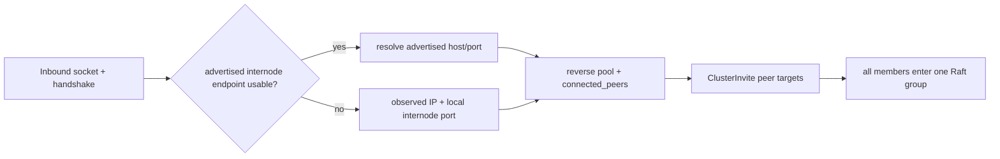
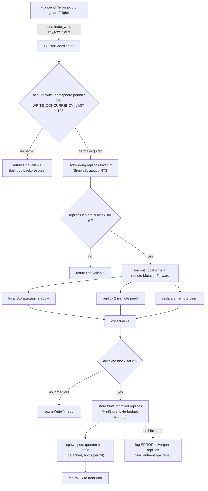
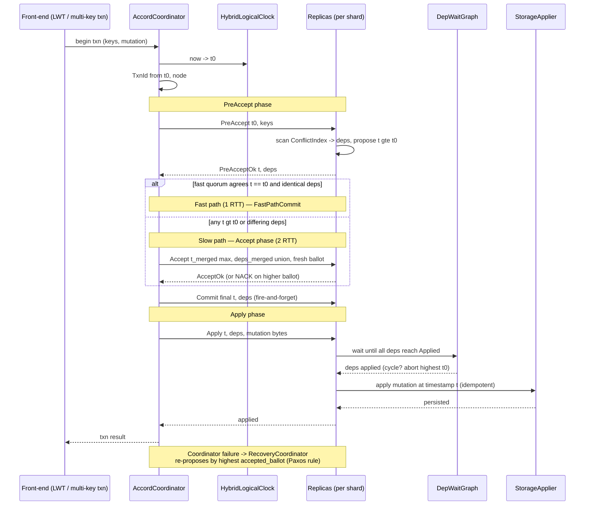

# ferrosa-cluster — Data Flow

Three end-to-end flows: **formation endpoint discovery**, a
**tunable-consistency write** (the eventually-consistent data path), and an
**Accord transaction** (the strict-serializable path). They share the
`TokenRing` for replica selection and run over `ferrosa-net` peers.

> Note: identifiers below are written without raw angle brackets so the diagrams
> render — e.g. `Option Partition` rather than the generic-parameter form.

## 1. Formation endpoint discovery

An inbound TCP source port is ephemeral and is never a valid reverse-dial
target. The handshake's advertised internode host/port is authoritative when
present; observed IP plus the receiver's local internode port is a compatibility
fallback for older peers. The selected endpoint feeds both the outbound pool
and `connected_peers`, whose addresses are carried in `ClusterInvite`.

## 2. Tunable-CL write coordination

A front-end (e.g. `ferrosa-cql`) hands a mutation to
`ClusterCoordinator::coordinate_write*`. The coordinator gates on the write
semaphore (backpressure protecting Raft), resolves replicas, fans out, and
returns once `cl.block_for(rf)` acks arrive — hinting failed replicas.

Key points: the permit is held by the post-quorum drain task so stragglers are
captured as hints without blocking the client. NTS / `LOCAL_QUORUM` /
`EACH_QUORUM` variants compute per-DC ack thresholds via `block_for_dc`. The
symmetric read path issues one full read plus `block_for - 1` digest reads, then
on digest mismatch fail-loud re-fetches the newest copy and repairs stale
replicas inline before returning.

## 3. Accord transaction (strict-serializable)

`AccordCoordinator` runs the EPaxos-family protocol across the shards a
transaction touches. The common case commits in one round trip (fast path); a
conflict forces the Accept phase (slow path). Apply waits on conflicting
dependencies before writing to storage at the agreed HLC timestamp.

Fast/slow quorum sizes: `slow = rf/2 + 1`; `fast = (3f+1)/2 + 1` where
`f = rf - slow`. Cross-shard transactions dispatch PreAccept to every
participating shard and abort atomically if any shard fails. Cross-DC apply routes
`AccordApply` entries through per-DC Raft, buffered by HLC in a reorder buffer and
deduplicated by an applied-txn ledger (ADR-015).

> Correctness caveat: both flows are validated by deterministic in-crate tests
> only. The fast/slow-path, recovery, and dep-wait logic have property + scenario
> coverage, but there is **no external Jepsen run** confirming these flows hold
> under real partitions, clock skew, and disk faults — see [fmea.md](fmea.md)
> CL-1 and [../specs/todo/jepsen-e2e-test-plan.md](../specs/todo/jepsen-e2e-test-plan.md).
