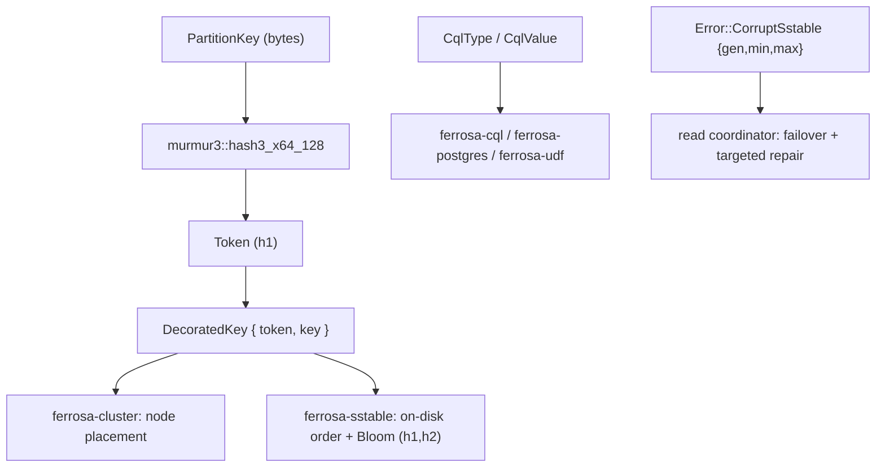

# ferrosa-common — Architecture Overview

## Purpose & boundary

`ferrosa-common` is the **single shared type vocabulary** for the workspace. Its
boundary is deliberately minimal: pure data types plus small, total methods, with
no I/O anywhere except `HybridLogicalClock` reading the system clock. It knows
nothing about wire framing, query planning, storage layout, transport, or
consensus orchestration — those live in the crates above it.

It exists because many crates must agree **byte-for-byte and bit-for-bit** on a
handful of primitives: the hash-ring `Token`/`DecoratedKey`, the storage
`CellValue`, the CQL type model, and the workspace `Error`. Placing them at the
bottom of the graph lets cycle-prone types be shared without an upward
dependency — `CqlType`/`CqlValue` were moved out of `ferrosa-cql` so
`ferrosa-udf` can use them without the large CQL crate, and `TableSchema` lives
here so storage and schema share it without a cycle through `ferrosa-sstable`.

## Module map

| Module | LoC | Responsibility |
|--------|-----|----------------|
| `accord` (`src/accord.rs`) | 1177 | Accord `Timestamp`, `TxnId`, ballot newtypes, `HybridLogicalClock` (lock-free, drift-checked `merge`), `BallotGenerator`, `TxnPhase`/`TxnState` |
| `schema` (`src/schema.rs`) | 637 | `TableSchema`, `ColumnDefinition`, `PinConfig`; fail-loud `fixed_width_for_marshal_type` / `validate_cell_bytes` / `validate_clustering_shape`; legacy column-order detector |
| `geometry` (`src/geometry.rs`) | 436 | `Geometry` (Point + single-ring Polygon), WKB `marshal_wkb` / `parse_wkb` |
| `cql_type` (`src/cql_type.rs`) | 334 | `CqlType` (full type tree + `type_id`), `CqlValue` (runtime value, IEEE-754-total `Ord`), bigint serde |
| `murmur3` (`src/murmur3.rs`) | 283 | Cassandra-bit-compatible `hash3_x64_128` (preserves the tail sign-extension bug) |
| `key` (`src/key.rs`) | 176 | `PartitionKey`, `DecoratedKey` (cached token, token-then-bytes order, `filter_hash`) |
| `error` (`src/error.rs`) | 168 | `Error` / `Result`; typed `CorruptSstable` repair signal; `is_backpressure` |
| `cell` (`src/cell.rs`) | 151 | `CellValue` live/expiring/tombstone + sentinels |
| `data_type` (`src/data_type.rs`) | 89 | `DataType` scalar descriptor (`#[non_exhaustive]`) |
| `token` (`src/token.rs`) | 79 | `Token` newtype + `from_key` |
| `task_pool` (`src/task_pool.rs`) | 71 | `TaskPool` runtime-aware spawn helper |
| `test_generators` (`src/test_generators.rs`) | 48 | proptest strategies (feature `test-generators`) |
| `lib` (`src/lib.rs`) | 39 | module declarations + headline re-exports |

## Data flow / role

`ferrosa-common` is not a pipeline; it is the **shared alphabet** the pipelines
speak. Two representative roles:

**Placement.** A partition key's raw bytes →
`Token::from_key` (`murmur3::hash3_x64_128` `h1`) → `DecoratedKey { token, key }`.
The cluster layer uses the token to pick owning nodes; the storage/SSTable layer
uses the same `DecoratedKey` ordering (token, then key bytes) for on-disk
position; `filter_hash` feeds Bloom double-hashing. One hash, computed once,
agreed on everywhere.

**Typed failure.** When a read can't be resolved because an SSTable is corrupt,
`ferrosa-storage` raises `Error::CorruptSstable { gen, min_token, max_token }`.
The read coordinator calls `corrupt_sstable_range()` (never string-matches the
message) to fail over to another replica and target anti-entropy repair at
exactly the corrupt token range.

## Key invariants

1. **Leaf crate — no Ferrosa dependency.** `ferrosa-common` depends on no other
   workspace crate. This is structural: it is what lets `CqlType`/`CqlValue` and
   `TableSchema` be shared without cycles. Adding a Ferrosa dependency here would
   re-introduce the cycle the move was meant to break.
2. **Murmur3 is bit-identical to Cassandra.** `hash3_x64_128` must reproduce
   `org.apache.cassandra.utils.MurmurHash.hash3_x64_128` exactly, **including**
   the asymmetric tail handling (sign-extended tail bytes vs. zero-extended
   body). Characterization vectors enforce this; changing it re-tokenizes every
   key and silently corrupts placement.
3. **`DecoratedKey` orders by token, then key bytes.** Matches Cassandra's
   `DecoratedKey.compareTo`; both SSTable order and ring ownership depend on it.
4. **`CqlValue` has a total order across all variants.** Float/Double/Vector use
   `total_cmp` and a fixed cross-type discriminant index, so `Ord` is total even
   for NaN — required wherever values are used as sorted keys.
5. **`CorruptSstable` is a typed signal, never string-matched.** The repair range
   is read via `corrupt_sstable_range()`.
6. **`#[non_exhaustive]` on `Error` and `DataType`.** New variants can be added
   without a semver break; downstream matches must keep a wildcard arm.

## Position in the dependency graph

The bottom. Depends on no Ferrosa crate (external only: `num-bigint`, `serde`,
`uuid`, `tokio`, optional `proptest`). Depended on by essentially every other
crate in the workspace — see the [README dependency list](../README.md#dependencies)
and the [root crate index](../../specs/crates.md) for the full graph.
