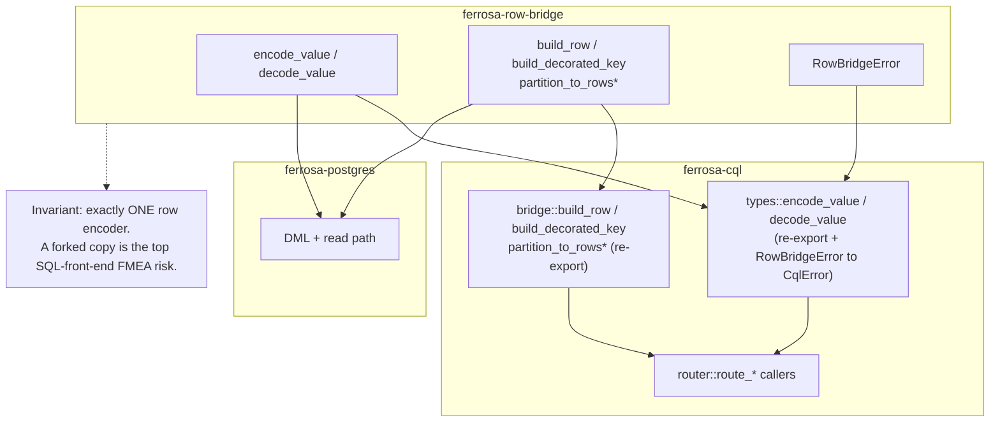

# ferrosa-cql — Data Flow

How a CQL frame becomes a storage mutation or a read, and how the row codec is
shared with `ferrosa-postgres` via `ferrosa-row-bridge` (D10).

All type names in the diagrams escape angle brackets (e.g. `Vec&lt;T&gt;`) so the
Mermaid renderer does not treat them as HTML.

## INSERT path (write)

A client `INSERT` arrives as a QUERY (or EXECUTE) frame, is parsed, permission-
checked, converted to a storage row via the re-exported `ferrosa-row-bridge`
builders, and applied through the session/storage engine.

```mermaid
sequenceDiagram
    autonumber
    participant Drv as CQL driver
    participant Codec as frame::CqlCodec
    participant Conn as connection (per-conn task)
    participant Par as lexer + parser
    participant Rt as router::route
    participant Br as bridge (+ row-bridge re-export)
    participant Eng as SessionCore / StorageEngine

    Drv->>Codec: QUERY/EXECUTE frame bytes
    Codec->>Conn: CqlFrame (decoded header + body)
    Conn->>Par: CQL text
    Par-->>Conn: Statement::Insert (AST)
    Conn->>Rt: route(state, ctx, stmt)
    Rt->>Rt: check_permission (M8), batch cap (M12)
    Rt->>Br: term_to_cql_value (range-checked, M5)
    Br->>Br: build_decorated_key + build_row<br/>(re-exported from ferrosa-row-bridge)
    Br-->>Rt: DecoratedKey + storage Row
    Rt->>Eng: write mutation (tunable CL)
    Eng-->>Rt: ack
    Rt-->>Conn: RouteResult (void / [applied])
    Conn->>Codec: RESULT frame body
    Codec-->>Drv: encoded RESULT bytes
```

LWT variants (`IF NOT EXISTS` / `IF <cond>` with serial consistency) branch at
`route()` into `accord_router::route_lwt_via_accord` when `peer_manager` and
`accord_clock` are present; in standalone/pair mode that path fails loud with a
`ServerError` (FMEA CQL-1).

## SELECT path (read)

```mermaid
sequenceDiagram
    autonumber
    participant Drv as CQL driver
    participant Codec as frame::CqlCodec
    participant Conn as connection (per-conn task)
    participant Par as lexer + parser
    participant Rt as router::route_select
    participant Pl as planner (scan + ORDER BY)
    participant Eng as StorageEngine
    participant Br as bridge (row-bridge re-export)
    participant Res as result encoder

    Drv->>Codec: QUERY/EXECUTE frame bytes (+ fetch_size/paging_state)
    Codec->>Conn: CqlFrame
    Conn->>Par: CQL text
    Par-->>Conn: Statement::Select (AST)
    Conn->>Conn: decode_query_params → PagingParams<br/>(page_size flag 0x04, paging_state flag 0x08)
    Conn->>Rt: route(state, ctx{paging}, stmt)
    Rt->>Rt: check_permission (M8)
    Rt->>Pl: classify scan + ORDER BY plan
    Pl-->>Rt: ScanPlan (inline or spillable temp-sort)
    Rt->>Eng: read Partition(s)
    Eng-->>Rt: Vec&lt;Partition&gt;
    Rt->>Br: partition_to_rows_with_storage_mapping<br/>(tombstone/TTL skip, storage→table order)
    Br-->>Rt: Vec&lt;Vec&lt;Option&lt;CqlValue&gt;&gt;&gt;
    Rt->>Res: project + LIMIT + paging_state
    Res-->>Conn: Rows RESULT frame body
    Conn->>Codec: frame
    Codec-->>Drv: encoded rows (+ paging_state if more)
```

When more rows remain, `result.rs` attaches an opaque `paging::PagingState`
cursor (pk + ck + remaining flag).

**Ingress decode (t_a0f922a3 LIVE):** the client's `fetch_size` and echoed
cursor arrive in the QUERY/EXECUTE `<query_parameters>` section, decoded by
`connection::decode_query_params` in FIXED wire order (flags → values →
`page_size` (0x04) → `paging_state` (0x08)) and threaded onto `ctx.paging`.
The router's paged-scan arm and the coordinator's resume path were already
correct; the LIVE failure was that these two wire fields were never parsed —
the handlers built `PagingParams::default()`, so a paged `SELECT` re-served
page 1 forever and ignored `fetch_size`. Router-level tests that hand-built
`ctx.paging` passed while the live wire path was broken, which is why the
regression must be pinned through the real codec
(`live_wire_paged_scan_advances_and_terminates_exactly`).

**Prepared SELECT metadata.** A PREPARE frame follows the same parse path but
stops before routing: `connection::handle_prepare` counts AST bind markers,
resolves table-backed columns, and emits a Prepared RESULT with the matching
ordered variable specifications. Statement-only values do not go through table
schema lookup: `LIMIT ?` emits the synthetic `[limit]` variable with CQL type
`int` after any WHERE or ANN variables. This lets the driver encode every bound
value before the later EXECUTE reaches `router::route_select`.

## Bridge re-export relationship (D10)

The CQL row codec and `Partition`→row decomposition physically live in
`ferrosa-row-bridge`; `ferrosa-cql` re-exports them at their original public
paths so in-crate callers are unchanged and `ferrosa-postgres` can reuse the
*identical* encoder without depending on this ~54k-LoC crate.



Key point: there is **one** encoder. `ferrosa-cql` never re-implements the codec;
it only adapts `RowBridgeError` into `CqlError` at the boundary (`error.rs`).
