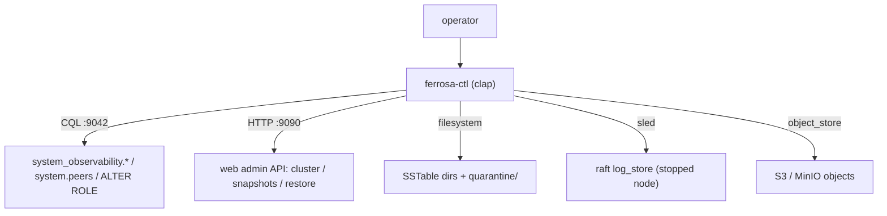

# ferrosa-ctl — Architecture Overview

## Purpose & boundary

`ferrosa-ctl` is the single administrative/observability binary for a Ferrosa
node. Its boundary is "anything an operator does from outside the node process":
look at live state, drive cluster membership, and recover a damaged node's
on-disk state. It deliberately spans **three transports**, because the
operations it serves live behind three different node surfaces.

It is the **leaf** of the workspace dependency graph — no crate depends on it.

## The three channels

| Channel | Used for | Surface |
|---------|----------|---------|
| CQL native protocol (`--host`, default `:9042`) | observability reads, `auth set-password` | `system_observability.*`, `system.peers`, `ALTER ROLE` |
| Web admin HTTP API (`--web-port`, default `:9090`) | cluster membership, ring, repair, snapshot/restore, learner lifecycle, leader transfer | `POST/GET /api/cluster/*`, `/api/snapshots`, `/api/restore` |
| Offline (filesystem / sled / object store) | SSTable triage & salvage, Raft-log inspect/truncate/reset | data dir, sled raft store, `FERROSA_S3_*` |

## Module map

| Module | LoC | Responsibility |
|--------|-----|----------------|
| `main` (`src/main.rs`) | ~1411 | clap `Cli` + `Commands`/sub-action enums, `#[tokio::main]` dispatch, exit codes |
| `commands` (`src/commands.rs`) | ~2182 | CQL observability `run_*`, web-API cluster commands, offline raft reset/inspect/truncate, `cluster bootstrap-dc`, table/empty printers |
| `commands::sstable` (`src/commands/sstable.rs`) | ~1717 | offline SSTable scan / inspect / quarantine / salvage / reingest / s3-clean |
| `tui` (`src/tui.rs`) | ~517 | ratatui dashboard: `Panel`, `AppState`, `render*`, `event_loop` |
| `auth` (`src/auth.rs`) | ~440 | `set-password` flow: validation, `ALTER ROLE` builder w/ escaping, admin-pw resolution, `CqlExecutor` trait |
| `lib` (`src/lib.rs`) | 8 | re-exports `commands`/`auth`/`tui` for the integration tests |

The binary is structured so I/O is separable from logic: the TUI splits
`render`/state from terminal I/O; `auth` splits `validate_new_password` /
`build_alter_role_statement` / `run_set_password` from connect+prompt; `sstable`
splits `*_report` / `*_plan` from the `sstable_*` print wrappers. This is what
lets 178 tests run without a node.

## Data flow

**Observability read** (`status`, `connections`, `queries`, `storage`,
`topology`, `peers`): `CqlClient::connect(addr)` → one `SELECT` → `QueryResult`
→ optional client-side sort → `print_table` (`tabled`, UTF-8 cells, `<binary>` /
`NULL` fallbacks) or `print_empty`.

**TUI** (`monitor`): one `CqlClient`, a synchronous `event_loop` polling
crossterm with a 100 ms timeout, refreshing all three virtual tables every 2 s
via the tokio runtime handle. A failed query becomes an `error_result` panel
row, not a crash.

**Cluster (HTTP)**: build URL + JSON body → `reqwest` → on success print
server text; on `404`/`501` emit a "not yet wired" diagnostic with a spec
pointer; on other non-2xx return the status+body as an error.

**Offline SSTable**: `StorageEngine::list_generations_in_dir` enumerates gens;
`StorageEngine::smoke_test_generation` is the **authoritative** OK/CORRUPT
verdict (same call startup uses); the BTI `SSTableReader` supplies component
sizes, partition counts, and the resilient `salvage` row reader. `reingest`
additionally opens a live `CqlClient`, fetches the table layout, reconstructs
rows preserving original timestamps, and re-inserts through the fixed write path.

**Offline Raft**: `SledLogStore::{reset, inspect, truncate_from}` operate on a
stopped node's sled dir; `reset` avoids opening sled (no flock contention).

## Key invariants

1. **ctl's corruption verdict equals the node's.** SSTable OK/CORRUPT is always
   `StorageEngine::smoke_test_generation`; ctl never re-implements detection.
2. **Destructive offline ops are gated.** `quarantine`/`reingest`/`s3-clean`
   default to dry-run (`--apply`); `raft log-truncate` requires `--yes` and a
   mandatory `--from`; quarantine moves files, never deletes.
3. **Fail loud, never fake.** Unwired HTTP endpoints surface `404`/`501` with a
   spec reference; a specified-but-unset `--admin-password-env` errors instead
   of silently using the seed default; the server (not ctl) hashes passwords.
4. **Two ports, one host.** `--host` is parsed to a `SocketAddr` for CQL; its IP
   is reused with `--web-port` for HTTP. A bad `--host` exits 1 immediately.

## Position in the dependency graph

Leaf binary. **Runtime** deps: `ferrosa-cluster` (raft `SledLogStore`,
`RaftGroupId`), `ferrosa-cql` (`CqlClient`, prepared statements),
`ferrosa-sstable` (BTI reader/marshal), `ferrosa-storage`
(`StorageEngine` smoke test + generation listing), `ferrosa-common`
(`DecoratedKey`, `NO_TIMESTAMP`). **Dev-only** deps wiring the integration
harness: `ferrosa-schema`, `ferrosa-session`, `ferrosa-udf`. Nothing depends on
`ferrosa-ctl`. See the [root crate index](../../specs/crates.md) for the full graph.
