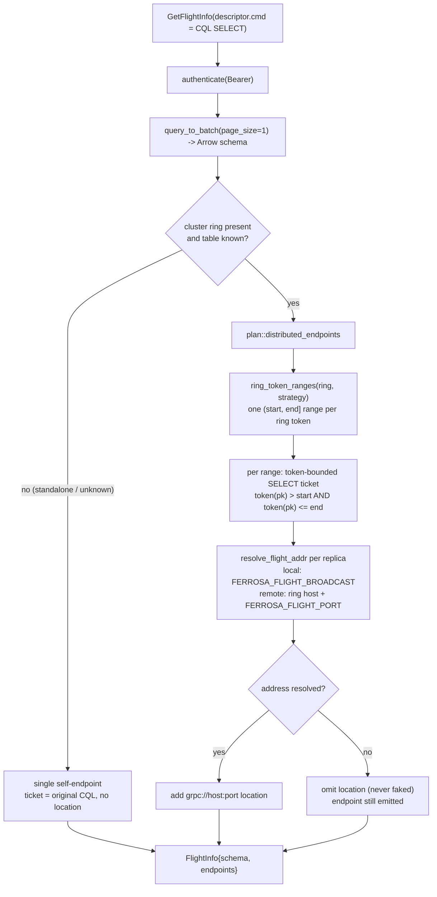
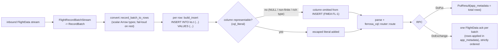

# ferrosa-flight — Data Flow

How a client goes from credentials to streamed Arrow: `Handshake` → bearer
token → `DoGet` (CQL ticket) → `ferrosa-cql` execution → paged Arrow stream.
Every RPC after `Handshake` carries `authorization: Bearer <token>` and is
authenticated before it touches the query path (decision D4).

## End-to-end: Handshake then DoGet

```mermaid
sequenceDiagram
    autonumber
    participant C as Arrow Flight client
    participant F as FerrosaFlight (service.rs)
    participant T as token.rs (HMAC-SHA256)
    participant S as ferrosa-schema (authenticate)
    participant R as ferrosa-cql router (route_select_raw)
    participant V as convert.rs (rows_to_record_batch)

    Note over C,F: Handshake — establish a bearer token
    C->>F: Handshake(payload = "username\0password")
    F->>S: Schema::authenticate(user, pass)
    S-->>F: AuthContext{role, is_superuser}
    F->>T: issue(signing_key, Claims{role, is_superuser, expires_at})
    T-->>F: signed token = hex(payload)"."hex(hmac)
    F-->>C: HandshakeResponse{payload = token}

    Note over C,F: DoGet — redeem a CQL SELECT ticket
    C->>F: DoGet(Ticket = CQL SELECT, header: Bearer token)
    F->>T: verify_with_keys(keys, token, now)
    T-->>F: Claims (or Unauthenticated)
    F->>F: parse ticket, require SELECT (else InvalidArgument)

    loop one CQL page per step (unfold over paging cursor)
        F->>R: route_select_raw(ctx{page_size=1024, paging_state})
        R-->>F: page{column_types, rows: Vec&lt;Vec&lt;Option&lt;CqlValue&gt;&gt;&gt;, paging_state}
        F->>V: rows_to_record_batch(names, types, rows)
        V-->>F: Arrow RecordBatch
        F-->>C: FlightData (Arrow IPC stream)
    end
    Note over F,C: stream ends when route_select_raw returns no paging_state
```

The first batch is always emitted (even for zero rows) so the client receives
the schema. Peak server memory is bounded to a single page rather than the whole
result set (FMEA FL-5).

## GetFlightInfo — distributed read planning (W-002)



A single whole-ring plan collapses back to the standalone single self-endpoint,
since it is indistinguishable from the non-clustered case.

## DoPut / DoExchange — write path



`DoExchange` here is an upsert-with-ack channel, **not** a live CDC subscribe
stream (FMEA FL-3) — a real change-feed over `DoExchange` is post-v1.

## Token format (token.rs)

`token = hex(payload) "." hex(hmac_sha256(key, payload))`, where
`payload = "{expires_at}:{is_superuser as 0|1}:{role}"`. `verify` checks the
HMAC in constant time *before* trusting the payload, then checks expiry last (so
a forged token never reports "expired"). `verify_with_keys` accepts a set of
keys (current + recently retired) to give key rotation an overlap window.
