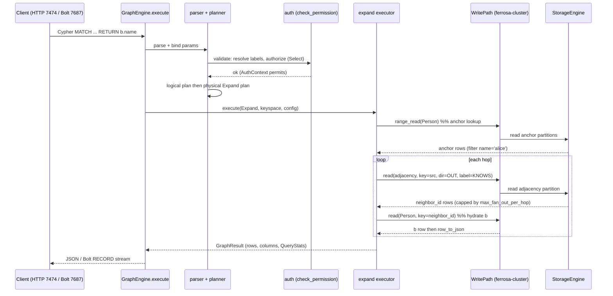

# ferrosa-graph — Data Flow

Two paths matter for understanding the crate: a **read** (a Cypher `MATCH` that
expands through the adjacency index) and a **write** (an edge create that keeps
the adjacency index consistent). Both go through the same composition root
(`GraphEngine`) and delegate persistence to `ferrosa-cluster`'s `WritePath`.

## 1. Read: a `MATCH` expand traversal

`MATCH (a:Person {name:'alice'})-[:KNOWS]->(b) RETURN b.name`

The engine resolves and authorizes the statement, looks up the anchor vertex,
then reads `system_graph_<ks>.adjacency` once per hop to find neighbors — it never
scans the edge table to traverse.



Notes: the anchor is read with `range_read`; each hop reads the adjacency index
for `(direction, edge_label, neighbor_id)`. Limits (`max_fan_out_per_hop`,
`max_result_rows`, `query_timeout`, and `max_var_path_visited` for `[*]`) bound
cost. Because traversal reads the index rather than the edge table, an
adjacency-index desync (FMEA G-1/G-2) shows up here as **missing rows, not an
error** — which is exactly why the consistency invariant below matters.

## 2. Write: an edge create keeping the adjacency index consistent

`CREATE (a)-[:KNOWS]->(b)` (or any edge-table write)

The edge row is written through `WritePath`. The `AdjacencyIndexObserver` is
registered on the edge table as a **synchronous** `WriteObserver`, so the storage
engine asks it to derive the matching adjacency mutations and applies them in the
**same** write — the OUT row under `src` and the IN row under `tgt`. The index is
therefore consistent with the committed edge, not eventually.

```mermaid
sequenceDiagram
    participant E as GraphEngine (Create/Merge plan)
    participant W as WritePath (ferrosa-cluster)
    participant S as StorageEngine
    participant O as AdjacencyIndexObserver (Sync)
    participant R as reconciler (background fallback)

    E->>W: write(edge_table, src, row, ts)
    W->>S: apply edge mutation
    S->>O: on_write(edge_table, mutation)
    Note over O: requires graph.source + graph.target ext;<br/>else returns empty (FMEA G-2)
    O-->>S: derived OUT row (under src) + IN row (under tgt)
    S->>S: apply adjacency mutations in the same write
    S-->>W: committed (edge + adjacency together)
    W-->>E: ok

    Note over R: fallback only - not the primary path
    loop every reconciliation_interval (0 = disabled by default)
        R->>W: range_read(edge_table)
        R->>W: read(adjacency) per edge row
        alt OUT/IN entry missing
            R->>W: write make_adjacency_mutation (repair)
        end
        R->>W: range_read(adjacency) then read(edge_table)
        alt adjacency row has no surviving edge
            R->>W: write tombstone (remove orphan)
        end
    end
```

### The adjacency-consistency invariant

For every live edge `(src)-[label]->(tgt)` the index holds exactly two rows:

- OUT: partition `src`, clustering `(OUT, label, tgt)`
- IN: partition `tgt`, clustering `(IN, label, src)`

Each clustering component is wire-encoded as `[u16 BE length][bytes]` for
`(direction:1B, edge_label:text, neighbor_id:blob)` — the layout the SSTable
composite parser requires. The **synchronous observer** is the primary
enforcement (index commits with the edge). The **reconciler is the fallback**: it
repairs entries the observer missed (dropped mutation under backpressure, crash
between edge and index visibility) and tombstones orphans whose edge is gone. It
is idempotent and observable (`ReconcileMetrics`), but a safety net — never the
source of truth. Caveat (FMEA): it is disarmed by the default config and repairs
at hardcoded RF=1, so the fallback is currently weaker than the invariant it
guards.
