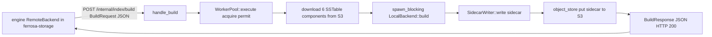

# ferrosa-index-builder — Architecture Overview

## Purpose & boundary

`ferrosa-index-builder` exists to move the CPU and IO cost of building secondary
indexes off the engine's hot path. It is a **service binary**, not a library:
its only consumer reaches it over HTTP, so the JSON wire contract — not a Rust
API — is its boundary.

It knows how to: build an S3 client, download the six SSTable component files,
invoke `ferrosa_storage::index::LocalBackend::build()`, write a sidecar with
`SidecarWriter`, and upload it. It deliberately reuses the engine's *own*
build code (`LocalBackend`) so a remote build is byte-identical to an in-process
build — the service is plumbing around that shared core.

## Module map

| Module | LoC (approx) | Responsibility |
|--------|--------------|----------------|
| `main` (`src/main.rs`) | ~150 | `clap` CLI, tracing init, `AmazonS3Builder` construction, push/pull dispatch |
| `server` (`src/server.rs`) | ~80 | `axum` router + `handle_build` / `handle_health` |
| `worker` (`src/worker.rs`) | ~470 | `WorkerPool` (semaphore-bounded), `BuildRequest`/`BuildResponse`, download→build→upload→cleanup, type/priority parsing |
| `pull` (`src/pull.rs`) | ~140 | manifest poll loop, sidecar diff, build enqueue |
| `lib` (`src/lib.rs`) | ~17 | module declarations + crate docs |

## Data flow

**Push path** (engine-driven, default mode):

**Pull path** (`backend=off` deployments): a timer fires `fetch_manifest`
against the engine's `GET /internal/manifest`; for each declared
`(index_name, column_position)` the watcher `head`s the expected sidecar key in
S3; on `NotFound` it spawns a `WorkerPool::execute` for a default `btree` build.

## BuildRequest / BuildResponse contract

`BuildRequest` carries: `sstable_id`, `index_name`, `index_type`,
optional `artifact_kind` + `direct_upload` (quantized vectors), S3 coordinates
(`s3_endpoint` / `s3_bucket` / `s3_prefix`), `table` as a
`(keyspace, table)` pair, `column_position`, `priority`, and an optional
`filter_predicate` (`Option&lt;FilterPredicate&gt;`, present only for `filtered`
builds).

`BuildResponse` carries `status` (`"completed"` | `"failed"`), optional `error`,
and on success either `sidecar_s3_path` + `entries_built` (sidecar builds) or an
`artifact_manifest_entry` (quantized builds), plus `elapsed_ms`.

## Key invariants

1. **App errors are HTTP 200; transport errors are HTTP 5xx.** `handle_build`
   always returns 200 with `status: "failed"` for an in-band build failure. The
   engine relies on this split to distinguish a down service from a build that
   ran and failed.
2. **A `filtered` build must apply the predicate at build time.** The wire
   `filter_predicate` is threaded through `build_job` into the `IndexBuildJob`
   so `LocalBackend` filters rows; otherwise the remote sidecar would be an
   UNFILTERED superset — a silent correctness bug.
3. **Quantized `.qvec` direct-upload fails closed.** `is_quantized_direct_upload`
   short-circuits to `status: "failed"` rather than emitting an unvalidated
   artifact the engine cannot publish.
4. **Remote build == in-process build.** The service wraps the engine's own
   `LocalBackend`; it adds no second index encoder.
5. **`CompressionInfo.db` is optional; every other component is mandatory.** A
   missing mandatory component fails the job and cleans up the temp dir.

## Position in the dependency graph

A binary leaf: it depends on `ferrosa-common`, `ferrosa-index`,
`ferrosa-sstable`, and `ferrosa-storage`, and **nothing depends on it via
cargo**. Its sole consumer — the engine — is decoupled across an HTTP boundary.
See the [root crate index](../../specs/crates.md) for the full graph.
