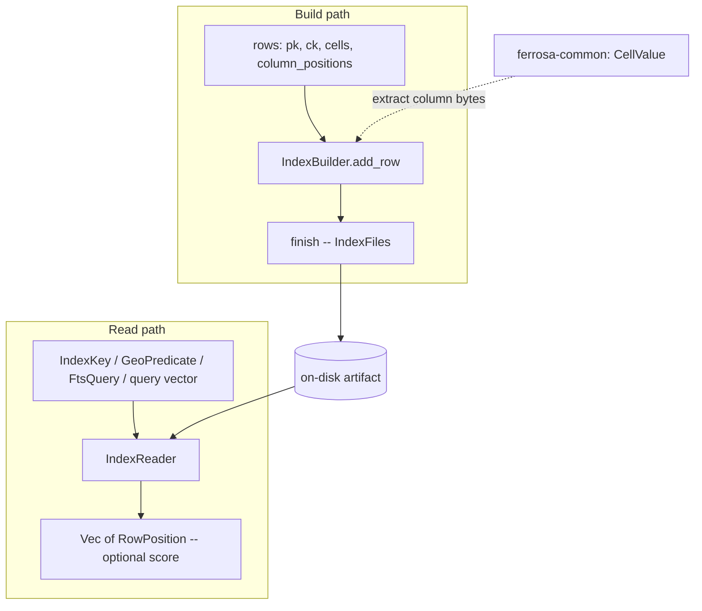

# ferrosa-index — Architecture Overview

## Purpose & boundary

`ferrosa-index` is the **index data-structure layer**. Its contract is narrow:
ingest rows as `(partition_key, clustering_key, cells, column_positions)`,
extract the configured column bytes, and persist a structure that resolves a key
(or a query) back to a set of `RowPosition`s. It knows `CellValue`
(`ferrosa-common`) and byte-encoded keys, and nothing about CQL grammar, query
planning, schema DDL, replication, or the SSTable container format. Everything
above it — the engine pipeline, the query router, the standalone builder —
treats this crate as the place index *kinds* live.

It depends on exactly **one** ferrosa crate (`ferrosa-common`), which keeps it
near-leaf and lets `ferrosa-index-builder` build indexes out of process without
pulling in the engine.

## The four API surfaces (read this first)

This crate is **not** one uniform trait. It hosts four parallel surfaces because
the query shapes genuinely differ:

| Surface | Trait/API | Kinds | Maturity |
|---------|-----------|-------|----------|
| Root secondary | `IndexFactory` / `IndexBuilder` / `IndexReader` (crate root) | B-tree, Hash, Composite, Phonetic, Filtered | Mature |
| Vector | `vector::IndexFactory` / `IndexReader` / `IndexBuilder` (own copies, own `RowPosition`/`IndexCapability`) | HNSW, IVFFlat, quantized | HNSW/IVFFlat mature; quantized staged path new; Q1 tier experimental |
| Full-text | `FullTextIndexBuilder` → bytes → `FullTextIndexReader` (byte-buffer, not the root traits); `stream::stream_search_term` for bounded-memory single-term sidecar search; `search_top_k` for query-derived `LIMIT k` bounds (t_ee98faa0 layer 2) | inverted index + BM25 | Mature |
| Geo | pure functions over a BTree sidecar (no factory) | point index, cover/refine | Phase 1 (point only; polygon paths partial) |

The crate-root `IndexType` enum (BTree / Hash / Composite / Phonetic / Filtered
/ Vector / FullText / Geo) is the shared discriminator callers route on; its
bincode tag order is asserted stable (`lib.rs::bincode_index_type_variant_tag_stability`).

## Module map

| Module | Responsibility |
|--------|----------------|
| `lib` (~611 LoC) | Root traits, `IndexType`/`IndexConfig`/`IndexFiles`/`IndexKey`/`RowPosition`, `IndexError`, the `FilterPredicate`/`FilterClause`/`FilterOp` model with dual-shape back-compat serde, and the big-endian vector codec |
| `btree` (~466) | Sorted length-prefixed secondary index; point + range |
| `hash` (~344) | `HashMap`-backed point-lookup index |
| `composite` (~737) | Multi-column key; full-key + prefix scan |
| `phonetic/*` (~431 + algos) | Soundex / Metaphone / Double Metaphone / Caverphone fuzzy-match index |
| `filtered` (~840) | Predicate-at-build wrapper + planner soundness helpers |
| `vector/hnsw` (~669) | HNSW graph ANN (JSON artifact) |
| `vector/ivfflat` (~504) | k-means inverted-file ANN (JSON artifact) |
| `vector/quantized/*` (~2200) | Paged `.qvec` container, scalar codec, deterministic quantized-IVF builder, staged page-budget reader |
| `fulltext/*` (~2600) | Analyzer, builder, BM25 reader (`search` + bounded `search_top_k`), query parser, scoring, compaction merge, streaming sidecar term search (`stream`), bounded top-k selection (`topk`) |
| `geo/*` (~2300) | Cell-id encode, bbox/radius/k-NN cover, exact refine, R-tree, ST predicates |

## Data flow

**Build.** A caller streams rows into the builder during memtable flush or
compaction (in process via `ferrosa-storage`/`ferrosa-cluster`, or out of process
via `ferrosa-index-builder`). The builder extracts the bytes at
`column_positions`, encodes a key, and on `finish()` writes the artifact(s):
compact length-prefixed binary (secondary), JSON (HNSW / IVFFlat), or a paged
`.qvec` container (quantized). Full-text serializes to a single byte buffer;
geo writes cell ids through a BTree sidecar.

**Read.** A reader is opened from `IndexFiles` and answers `lookup` /
`range` / `nearest` (secondary), ANN search returning ranked `RowPosition`s
(vector), BM25-scored `FtsHit`s (full-text), or cell-id ranges refined to exact
geometry (geo).

## Key invariants

1. **Vector cell codec is big-endian and must match CQL.** `bytes_to_vec_f32` /
   `vec_f32_to_bytes` decode/encode `vector<float, N>` cells big-endian, matching
   `ferrosa_cql::types::encode_value`. A mismatch ranks byte-swapped garbage —
   ANN results are silently wrong. Asserted in `lib.rs` tests.
2. **`IndexType` bincode tags are stable.** Persisted index metadata
   (`system_schema.indexes`, Raft log) decodes across upgrades; tag order is
   pinned by test.
3. **`FilterPredicate` accepts both wire shapes.** The custom serde decodes the
   legacy flat single-clause form *and* the v2 conjunction form, in JSON and
   bincode, so old schema rows / Raft entries keep deserializing. An empty
   conjunction retains nothing (fail safe), never "match everything".
4. **Capabilities are honest.** `nearest`/`range` return
   `IndexError::Unsupported` on kinds that cannot serve them (B-tree `nearest`;
   hash `range`+`nearest`; phonetic `range`+`nearest`) rather than faking an
   empty result.
5. **Geo is pure.** The `geo` module never performs I/O; it only computes cell
   ids, ranges, and exact predicates. Storage wiring lives in the caller.
6. **Quantized staged reads are page-bounded.** The staged IVF reader range-reads
   centroid pages under a budget and rejects malformed pages loudly rather than
   loading whole artifacts into memory.

## Position in the dependency graph

Near-leaf: depends only on `ferrosa-common`. Depended on by `ferrosa-cluster`,
`ferrosa-cql`, `ferrosa-index-builder`, `ferrosa-schema`, `ferrosa-sparql`,
`ferrosa-storage`, and `ferrosa-worker`. See the
[root crate index](../../specs/crates.md) for the full graph.
