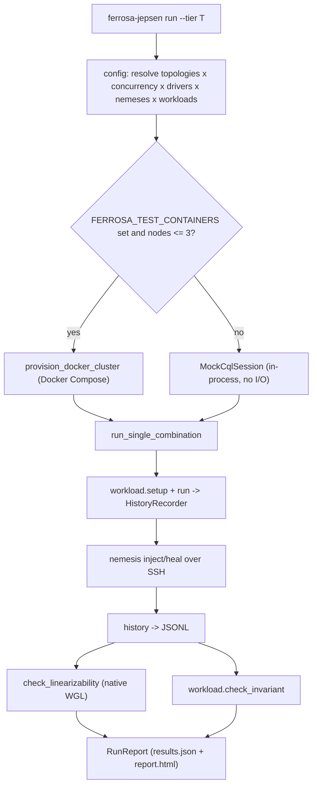
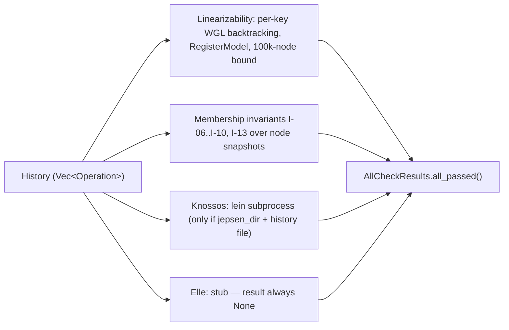

# ferrosa-jepsen — Architecture Overview

## Purpose & boundary

`ferrosa-jepsen` is the project's **distributed-correctness test harness**. It
is a library plus a `ferrosa-jepsen` binary; it is not part of the shipped
database and nothing in the workspace depends on it. Its job is to subject a
Ferrosa cluster (real, or a `ferrosa-sim` model) to concurrent workloads under
fault injection, record a history of operations, and run correctness checkers
over that history to produce pass/fail evidence.

The boundary: it owns workload generation, nemesis/fault injection, history
recording, the checkers, and cluster provisioning. It does **not** own the
database internals — it talks to a cluster over CQL (`scylla` driver) and over
SSH (`russh`) for fault injection, and to the simulator via `ferrosa-sim`.

## Module map

| Module | Responsibility |
|--------|----------------|
| `orchestrator` (`src/orchestrator.rs`) | Run loop: provision → iterate combinations → record → check → `RunReport`. Resolves real-cluster vs `MockCqlSession`. |
| `config` (`src/config.rs`) | `Tier`, `Topology` (T1–T4), `Concurrency`, `RunConfig` and their tier-driven resolution. |
| `workload` (`src/workload/`) | `Workload` trait + registry: `register`, `bank`, 16 `lwt-*`, `forward-probe`, `membership-churn`, `late-join-flood`. |
| `chaos` (`src/chaos/`) | `NemesisAction` trait + registry: network, process, clock, disk, WAN/cross-DC, composed nemeses. Inject/heal via SSH (`iptables`/`tc`/signals). |
| `checker` (`src/checker/`) | Linearizability (native WGL backtracking), membership invariants, Knossos (subprocess), Elle (stub). |
| `driver` (`src/driver/`) | `rust_driver` (real `scylla` connection); `ContainerDriver` (per-language Docker images, not in default tiers). |
| `docker_provision` (`src/docker_provision.rs`) | **Wired** cluster backend: Docker Compose 3-node cluster, `container_runtime()` (docker→podman). |
| `firecracker` / `cluster` | microVM provisioning primitives — present but **not wired** into the run path. |
| `flyio` (`src/flyio.rs`) | Fly.io machine management for T3/T4 — present but **not wired**. |
| `endurance` / `endurance_sim` | `ferrosa-sim`-backed sim-equivalent 24h endurance run (W8.9, ADR-016). |
| `history` (`src/history.rs`) | `Operation`/`Op`/`OpResult`, JSONL I/O, per-key filtering. |
| `report` / `alert` / `archive` / `ssh` / `cql_session` / `test_env` | Reporting (JSON/HTML/timeline/anomaly/comparison), webhook alerting, run archiving, SSH client, CQL session, env helpers. |
| `main` (`src/main.rs`) | CLI: `run`, `report` (stubs), `tier-endurance-sim`. |

## Run pipeline

The orchestrator currently provisions via Docker only; when no container
runtime is requested it runs every combination against the in-process
`MockCqlSession`, so unit-level combinations execute without infrastructure.
Firecracker and Fly.io paths are not reached from this loop.

## Checker stack

Only the native linearizability checker and the membership-invariant checks run
in default `cargo test`/CI. Knossos requires a Clojure/`lein` project and a
written history; Elle is type-only (`elle_result = None`).

## Key invariants

1. **Fail loud on harness breakage.** A Knossos invocation failure is surfaced
   as an explicit `checker-error` anomaly with `valid = false`, never silently
   swallowed (`checker/mod.rs`).
2. **No missing-infra body passes silently.** Live-infra tests are gated behind
   the `live-infra-tests` feature and `panic!` with setup instructions when
   their `FERROSA_TEST_*` prerequisite is absent; `live_infra_contract.rs`
   pins that every such test carries the `cfg(feature)` attribute.
3. **Mock vs real is an explicit decision.** `resolve_session_source` returns
   `Real` only when a cluster was provisioned, else `Mock`; pinned by unit
   tests after a Sprint 2 bug where the cluster argument was discarded.
4. **Sim endurance is a real gate.** The tri-DC endurance sim must report zero
   conservation failures, zero learner divergence, and final convergence — it
   runs under default `cargo test`, not behind live-infra gating.

## Position in the dependency graph

Leaf test-harness crate. **Calls** `ferrosa-sim` (the dual-DC bank simulator
for the endurance path). **Called by** nothing. See the
[root crate index](../../specs/crates.md) for the full graph.
