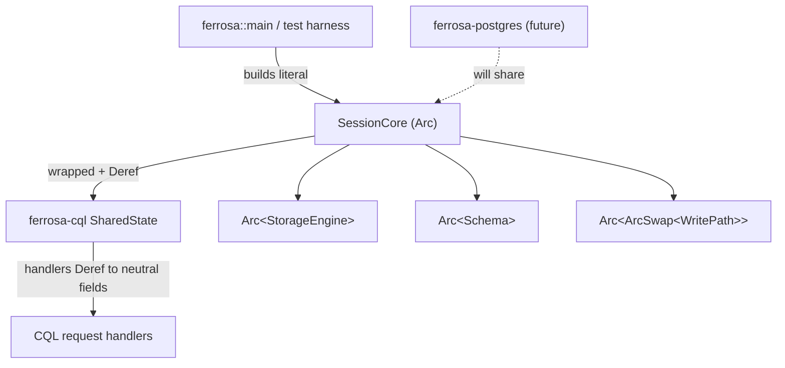

# ferrosa-session — Architecture Overview

## Purpose & boundary

`ferrosa-session` owns exactly one thing: `SessionCore`, the **neutral subset of
engine state** that every query front-end needs regardless of wire protocol.
Its boundary is deliberately data-only — it holds `Arc` handles to the storage
engine, schema, cluster-mode routing, UDF executor, Accord clock and peer
manager, and exposes one derived predicate (`accord_enabled`). It contains no
request handling, no protocol framing, and no routing *logic* — only the handles
that such logic dereferences.

It exists because **more than one** front-end must share *identical* engine
state. Decision **D10**: extract the neutral fields into a leaf-adjacent crate
that `ferrosa-postgres` can depend on without pulling in `ferrosa-cql`'s protocol
machinery (prepared-statement cache, EVENT channel, CQL metrics, trackers).

## Extraction status

This is an **in-progress extraction** (board item: "land ferrosa-session
extraction as standalone soaked PR"). What has and has not moved:

| Concern | Location today |
|---------|----------------|
| Neutral field bundle (`SessionCore`) | **extracted → `ferrosa-session`** |
| `accord_enabled()` predicate | **extracted → `ferrosa-session`** (no callers yet) |
| `SharedState` wrapper + `Deref` | still in `ferrosa-cql/src/router.rs` |
| Request handlers / routing logic | still in `ferrosa-cql` |
| Prepared-statement cache, EVENT channel, CQL metrics, trackers, topology policy | still in `ferrosa-cql` (intentionally CQL-specific) |
| Construction of `SessionCore` | duplicated literal at 12+ call sites; no constructor here |

## Module map

| Module | LoC | Responsibility |
|--------|-----|----------------|
| `lib` (`src/lib.rs`) | ~69 | `SessionCore` struct (11 pub fields) + `accord_enabled()` |

There is a single module. No submodule tree, no constructor, no tests.

## Data flow

`ferrosa-session` is passive — it is *held*, not *driven*. The lifecycle:

1. A front-end host (`ferrosa::main`, or a `ferrosa-cql` test harness) builds a
   `SessionCore` literal from already-constructed engine/schema/cluster handles.
2. It wraps it: `Arc&lt;SessionCore&gt;` inside `ferrosa-cql`'s `SharedState`.
3. `SharedState` `Deref`s to `SessionCore`, so request handlers reach
   `self.engine`, `self.schema`, `self.write_path`, etc. transparently.
4. On cluster-mode transitions, the host swaps `write_path` / `ddl_path` /
   `cluster_state` via their `ArcSwap` wrappers — no rebuild of `SessionCore`.

## Key invariants

1. **Acyclic dependency direction.** `ferrosa-cql` / `ferrosa-postgres` →
   `ferrosa-session` → `ferrosa-cluster` / `ferrosa-storage` / `ferrosa-schema` /
   `ferrosa-net` / `ferrosa-udf` / `ferrosa-common`. `ferrosa-session` must
   **never** depend on a front-end crate (it would create a cycle).
2. **Neutral-only.** No CQL- or Postgres-specific state may be added here. The
   test is: "would a second front-end need this field with identical semantics?"
   If not, it stays in the front-end.
3. **`accord_clock` implies `peer_manager`.** `accord_clock` is `None` whenever
   `peer_manager` is `None`; `accord_enabled()` checks both. This is a documented
   invariant on the fields, **not currently enforced by a constructor or test.**
4. **Hot-swappable routing.** `write_path` / `ddl_path` / `cluster_state` are
   `ArcSwap`-wrapped so mode transitions re-point routing in place.

## Position in the dependency graph

Mid-graph, not a leaf: it sits *above* the engine/cluster/schema crates and
*below* the front-ends. Depended on by `ferrosa`, `ferrosa-cql`, `ferrosa-ctl`
(and, by design, the in-progress `ferrosa-postgres`). See the
[root crate index](../../specs/crates.md) for the full graph.
