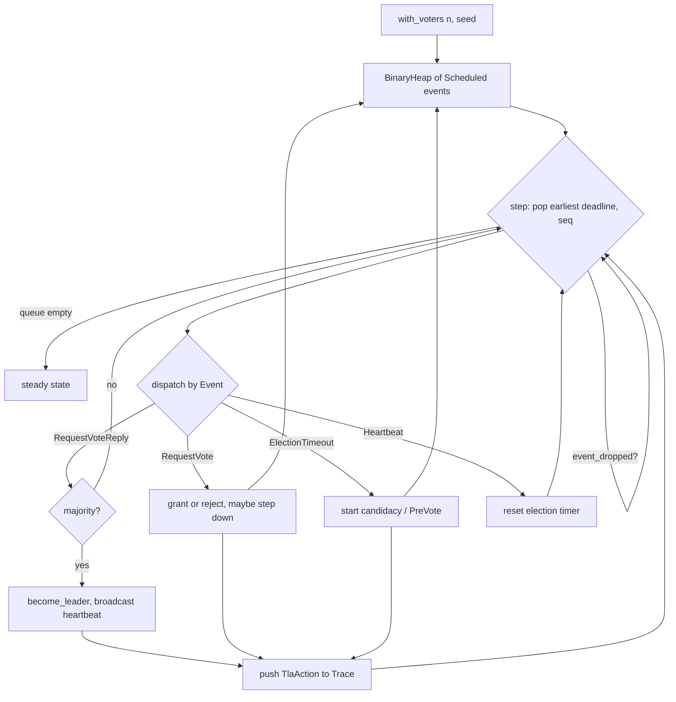

# ferrosa-sim — Architecture Overview

## Purpose & boundary

`ferrosa-sim` is a **testing/simulation** crate. Its job is to make Raft-layer
behaviour *reproducible* and *checkable*: a single `u64` seed drives a
deterministic event loop, every transition is recorded as a named `TlaAction`,
and the resulting `Trace` is replayed against a Rust interpretation of the TLA+
spec at `specs/tla/raft.tla`.

Its boundary is deliberately narrow and **self-contained**: it depends on no
other ferrosa crate (decision **ADR-017**). It models only the *protocol-level*
variables the spec cares about — term, vote, role, log length, commit index,
membership — and **mirrors** any shape it needs from `ferrosa-cluster`
(`DeploymentMode`, the bootstrap phases, the multi-DC apply types) by hand,
keeping the copies in lock-step manually. The full `FerrosRaft` (sled,
networking, schema replay) is *not* run here; that belongs to the in-process
harness in `ferrosa-cluster/tests/`.

## Module map

| Module | Responsibility |
|--------|----------------|
| `rng` (`src/rng.rs`) | `SeededRng` — splitmix64, the only source of randomness; no global state |
| `node` (`src/node.rs`) | `SimulatedNode`, `NodeId`, `Role` — one Raft participant's protocol state |
| `cluster` (`src/cluster.rs`) | `SimulatedCluster` — the N-voter discrete-event loop, election/vote/heartbeat/PreVote handling, nemesis mutators, joint-consensus membership |
| `nemesis` (`src/nemesis.rs`) | `Nemesis` trait + `PartitionHalves`, `KillMinority`, `AddNode` |
| `bootstrap` (`src/bootstrap.rs`) | 8-phase `BootstrapPhase` pre/post-condition pipeline mirroring `ferrosa-cluster` |
| `trace` (`src/trace.rs`) | `Trace`, `TraceEntry`, `TlaAction` — the append-only action log |
| `refinement` (`src/refinement.rs`) | `check_trace`/`check_step` — Rust interpreter of the spec's transitions |
| `spec` (`src/spec.rs`) | snapshot safety invariants (`ElectionSafety`, `LeaderAppendOnly`, …); pins the spec + workflow file paths |
| `multi_dc` (`src/multi_dc.rs`) | `DualDcBankSim` — a *separate* cross-DC Accord-apply bank model (the part ferrosa-jepsen consumes) |
| `deployment` (`src/deployment.rs`) | `DeploymentMode` mirror of `ferrosa-cluster::mode::DeploymentMode` |

## The event loop

`SimulatedCluster::with_voters(n, seed)` builds an `n`-voter cluster, each voter
armed with a randomized election deadline drawn from the seeded RNG. Progress
comes from the drivers `run_until_leader(deadline)` and `run_for(duration)`,
which repeatedly call `step()`:

Each dispatched transition pushes a `TlaAction` onto the `Trace`. The
`refinement` module replays that trace; `spec` checks the live cluster snapshot.

The `multi_dc::DualDcBankSim` is a separate model that does **not** use this
event loop — it drives a mocked Accord coordinator and per-DC HLC-ordered apply
buffers directly, exercising cross-DC apply ordering, idempotence, and balance
conservation under a `dc-partition` nemesis.

## Key invariants

1. **Determinism: same seed = same `Trace`.** Integer-only clock, single thread,
   seeded splitmix64, `(deadline, seq)`-keyed event queue, `BTreeMap`/`BTreeSet`
   everywhere — never `HashMap`. Pinned by `same_seed_produces_same_trace`.
2. **Refinement: every simulated transition is a legal TLA+ step.** `check_trace`
   rejects term regressions and two-leaders-at-the-same-term (Election Safety);
   verified across a 1000-seed sweep (`refinement_holds_across_1000_seeds`).
3. **Bank conservation (multi-DC).** Each DC — and each learner replica — totals
   `n_accounts × initial` at every step, holding through partition + heal, with
   idempotent replay never double-spending.
4. **No dependency on any ferrosa crate.** Structural; mirrored shapes are kept
   in lock-step by hand (a tracked drift risk — see roadmap).

## What is modelled vs. not

**Modelled:** leader election, term/vote bookkeeping, PreVote, heartbeats,
crash/partition/add-node nemeses, joint-consensus membership change, the 8-phase
bootstrap pipeline, and cross-DC Accord apply ordering/idempotence.

**Not modelled (yet):** AppendEntries *log replication* (the cluster carries
`log_len` as a counter, not a `Vec<LogEntry>`), snapshots/InstallSnapshot, and
Apalache-driven model checking (the refinement check is a Rust re-implementation
of the spec; `specs/tla/raft.tla` is the canonical artifact but is not run under
Apalache in CI).

## Position in the dependency graph

A leaf: depends on no ferrosa crate (only `serde`, `tracing`, dev-only
`proptest`). Depended on by `ferrosa-jepsen`. See the
[root crate index](../../specs/crates.md) for the full graph.
