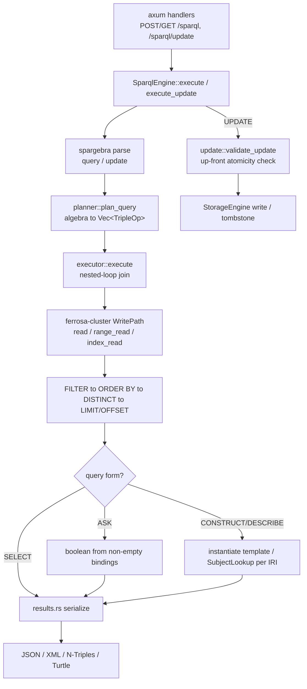

# ferrosa-sparql — Architecture Overview

## Purpose & boundary

`ferrosa-sparql` is the W3C SPARQL front-end. It owns SPARQL parsing, algebra →
storage planning, query execution, SPARQL UPDATE, and result serialization. It
does **not** own storage durability, replication, indexing, or schema — it
delegates reads to `ferrosa-cluster`'s `WritePath` and writes to
`ferrosa-storage`'s `StorageEngine`.

The RDF data model is mapped onto exactly one CQL table per keyspace:

```
rdf_triples : ((graph, subject), predicate, object)
              regular cols: object_type, datatype, language
```

The partition key is the composite `(graph, subject)` where `graph` is the
keyspace name — so there is **one logical RDF graph per keyspace**. This is the
crate's defining boundary: anything that addresses a distinct named graph is
rejected, never silently mapped onto the default graph.

## Module map

| Module | Responsibility |
|--------|----------------|
| `engine` (`src/engine.rs`, ~600 LoC) | `SparqlEngine`: parse→plan→execute orchestration, `SparqlResult`, ASK/CONSTRUCT/DESCRIBE graph assembly, JSON/XML/NT/Turtle dispatch |
| `planner` (`src/planner.rs`, ~770 LoC) | `spargebra` algebra → `QueryPlan` of `TripleOp`s; per-pattern access-method selection; CONSTRUCT/DESCRIBE mode detection |
| `executor` (`src/executor.rs`, ~970 LoC) | Nested-loop join over triple patterns, FILTER/ORDER BY/DISTINCT/LIMIT, composite-key decode, tombstone skipping, ObjectScan index |
| `update` (`src/update.rs`, ~730 LoC) | INSERT/DELETE DATA, DELETE WHERE, DELETE/INSERT WHERE, CLEAR, DROP, CREATE; up-front atomicity validation; one shared tombstone primitive |
| `property_path` (`src/property_path.rs`, ~420 LoC) | `+ * ? ^` evaluation via in-memory BFS with cycle detection |
| `filter` (`src/filter.rs`, ~490 LoC) | `Expression` evaluation: comparisons, boolean ops, arithmetic, a function subset; `unsupported_expr` gate for ORDER BY fail-loud |
| `results` (`src/results.rs`, ~415 LoC) | `Binding`, `SparqlJsonResults`, `ResultFormat`; JSON / W3C XML / N-Triples serializers |
| `http` (`src/http.rs`, ~234 LoC) | axum router, content negotiation, 1 MiB body limit, error→status mapping |
| `triple_store` (`src/triple_store.rs`) | `rdf_triples` schema, composite partition-key encoding, `ObjectType` |
| `rdf_star` (`src/rdf_star.rs`) | RDF\* annotation evaluation stub — fail-loud, not implemented |
| `namespace` (`src/namespace.rs`) | Standard prefix table (rdf, rdfs, owl, xsd, foaf, …) |

## Data flow



**Read path.** A bound subject plans to `SubjectLookup` (point read on the
partition key); a bound predicate to `PredicateScan` (range read + filter); a
bound object to `ObjectScan` (secondary index `rdf_triples_object_idx`, falling
back to a capped range scan); nothing bound to `FullScan`. The executor folds
each `TripleOp`'s rows into the running binding set with a compatibility check on
both value and `binding_type`.

**Write path.** UPDATE first validates **every** operation (atomicity), then
applies them sequentially. Inserts write a live row; every delete form funnels
through one `tombstone_triple` primitive that writes a deletion-marker row with
`LivenessInfo::NONE` and clustering identical to the live row it must shadow.

## Key invariants

1. **One graph per keyspace.** The `graph` partition-key component equals the
   keyspace. Operations addressing a different named graph fail loud, never
   retarget (`check_quad_graph_pattern`, `check_pattern_graph_reads`).
2. **UPDATE atomicity by up-front rejection.** Because execution has no rollback,
   `validate_update` rejects the whole request before any mutation if any op is
   unaddressable — preventing a desugared `Drop` from wiping data before a later
   op fails.
3. **Tombstone clustering must shadow the live row exactly.** Inserts and deletes
   share `encode_triple_clustering` (strict `[u16 len][bytes]`, no separator), so
   a tombstone matches the row it deletes; `LivenessInfo::NONE` prevents
   resurrection.
4. **Fail loud over silent wrong answers.** RDF\* annotation, `LOAD`,
   cross-graph ops, and unsupported ORDER BY expressions return
   `SparqlError::Plan`, not approximate results.
5. **Deleted rows never surface.** The executor skips any row whose deletion
   marker is non-live (URS-QEC-D05).

## Position in the dependency graph

Front-end leaf: depends on `ferrosa-cluster`, `ferrosa-storage`,
`ferrosa-common`, `ferrosa-sstable`, `ferrosa-index`, `ferrosa-schema`; depended
on only by the `ferrosa` binary. See the
[root crate index](../../specs/crates.md) for the full graph.
