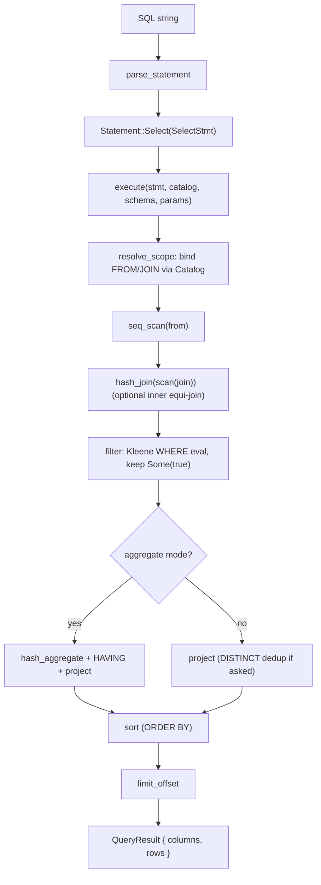

# ferrosa-sql — Architecture Overview

## Purpose & boundary

`ferrosa-sql` turns a SQL string into a `QueryResult` over an abstract row
source. Its boundary is narrow and explicit: it knows the SQL **subset** it
parses, a `Value`/`Row`/`RelSchema` model it computes over, and a `Catalog` /
`TableProvider` contract for pulling rows. It knows **nothing** about the Postgres
wire protocol, transactions (those route through Accord in the front-end),
storage framing, or S3 — those belong to `ferrosa-postgres` and the storage
layer.

Decision **D3**: build a bespoke engine rather than embed DataFusion, so the type
system, NULL semantics, and row ordering are owned. The engine is deliberately
small — a first-milestone (M1) slice centered on single-table scans plus one
inner equi-join — and widens outward.

## Module map

| Module | LoC | Responsibility |
|--------|-----|----------------|
| `types` (`src/types.rs`) | ~488 | `Value` enum, `Row`, `Column`, `ColumnType`, `RelSchema`; `Value::sql_cmp` three-valued comparison + numeric normalization |
| `exec` (`src/exec.rs`) | ~791 | Physical operators: `seq_scan`, `filter`, `project`, `hash_join`, `sort`, `hash_aggregate`, `limit_offset`; `Predicate`, `CmpOp`, `AggFunc` |
| `parser` (`src/parser.rs`) | ~1752 | Hand-written lexer + recursive-descent parser; `parse`, `parse_statement`, `ParseError`, typed-literal parsing |
| `plan` (`src/plan.rs`) | ~1598 | Binder + planner: `execute`, `describe`, `infer_param_types`; scope resolution, Kleene WHERE/HAVING eval, `ExecError` |
| `ast` (`src/ast.rs`) | ~207 | Logical AST: `Statement`, `SelectStmt`, DML statements, `Expr`, `Operand`, `Projection`, `OrderItem` |
| `catalog` (`src/catalog.rs`) | ~81 | `Catalog` trait + `MapCatalog`; name → provider resolution (fail-loud on miss) |
| `provider` (`src/provider.rs`) | ~39 | `TableProvider` scan contract + `InMemoryTable` |

## Data flow

**Execute path** (table query):

Aggregate mode is entered iff `GROUP BY` is present, `HAVING` is present, or any
select item is an aggregate. `describe` and `infer_param_types` reuse
`resolve_scope` to derive the output column shape / parameter types **without**
scanning rows — so the Postgres extended-query path can answer `RowDescription`
and `ParameterDescription` before binding parameters.

## Key invariants

1. **Three-valued (Kleene) NULL logic.** `Value::sql_cmp` returns `None`
   (UNKNOWN) for NULL operands, type mismatches, or NaN. WHERE keeps only
   `Some(true)`; `AND`/`OR`/`NOT` follow Kleene tables (`kleene_and`/`kleene_or`).
   NULL join keys never match; `NULL = NULL` is UNKNOWN, not true.
2. **C-collation / total ordering for sort + keys.** `sort` is stable and
   multi-key with Postgres NULL placement (ASC ⇒ NULLS LAST, DESC ⇒ NULLS FIRST).
   `Float` is wrapped in `OrderedFloat` so `Value` keeps `Eq`/`Hash`/`Ord` and is
   usable as a hash-join / group key.
3. **Normalized `Numeric` equality.** `Value::numeric` strips trailing decimal
   zeros so `1.50` and `1.5` are the same `Value` (correct GROUP BY / DISTINCT /
   join-key behavior); `sql_cmp` aligns scales via `BigInt` (no float).
4. **Fail loud at the binder, never empty-on-missing.** A missing table/column,
   ambiguous unqualified column, aggregate-in-WHERE, non-grouped column, or
   unbound `$N` returns a typed `ExecError` — the catalog must not substitute an
   empty relation for a missing table.
5. **No second SQL engine / no DataFusion.** Decision D3 — the value model and
   semantics live here once.

## Position in the dependency graph

True leaf: **zero** `ferrosa-*` dependencies (verified against `Cargo.toml` —
only `ordered-float`, `num-bigint`, `uuid`, `chrono`). Depended on by
`ferrosa-postgres`. See the [root crate index](../../specs/crates.md) for the
full graph.
