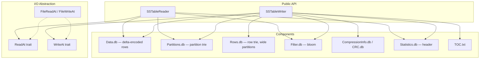

# ferrosa-sstable — Architecture Overview

## Purpose & boundary

`ferrosa-sstable` is the **on-disk format layer** of the storage engine. It is
the single place that understands the byte layout of a BTI SSTable: the trie
indexes, the delta-encoded Data.db rows, the compression chunk framing, the
bloom filter, and the Statistics.db serialization header.

Its boundary is narrow and downward-facing. It depends only on
`ferrosa-common` for the shared key/value/hash types and produces/consumes the
format-specific shapes (`Partition`, `Row`, `LivenessInfo`, `DeletionTime`)
defined in its own `types` module. It knows nothing about CQL planning, schema
DDL, cluster routing, or transports — those live in the crates that call it.

All I/O is **synchronous** and flows through the `ReadAt`/`WriteAt` traits, so
the identical reader/writer code runs over a local file or an S3 object. The
async/S3 wrapper (`S3ReadAt`) deliberately lives one layer up in
`ferrosa-storage`, keeping this crate runtime-free.

## Format scope (what BTI-only means)

| Capability | Status |
|------------|--------|
| BTI write (all 7 components) | Implemented |
| BTI read (point + streaming) | Implemented |
| Legacy Big format (`*-big-*`) read | **Out of scope** (deferred, ADR-004) |
| Range tombstone markers | **Deferred** — writer does not emit, reader skips |
| Complex columns (collections/UDT/tuple/frozen) | **Deferred** in Data.db codec |
| Compression | None / LZ4 / Zstd (Snappy/Deflate not supported) |

## Module map

| Module | LoC (approx) | Responsibility |
|--------|------|----------------|
| `reader` (`src/reader.rs`) | ~3130 | `SSTableReader`, `PartitionIter`, point lookup, salvage, bounded token-summary seek index |
| `writer` (`src/writer.rs`) | ~3650 | `SSTableWriter`, `WriteOptions`, `SSTableOutput[Files]`, self-readback verify |
| `data` (`src/data.rs`) | ~2700 | Data.db row/cell codec, delta-decode vs header |
| `io` (`src/io.rs`) | ~1165 | `ReadAt`/`WriteAt`, `FileReadAt`/`FileWriteAt`, `CachedReadAt` block cache |
| `trie/{node,builder,walker,mod}` | ~2160 | On-disk trie used by both indexes |
| `statistics` (`src/statistics.rs`) | ~1006 | Statistics.db, `SerializationHeader` |
| `partition_index` / `row_index` | ~875 | Trie-backed Partitions.db / Rows.db |
| `byte_comparable` | ~347 | Byte-comparable key encoding for the index |
| `compression` | ~348 | `Compression` enum, chunk compress/decompress + CRC |
| `varint` / `marshal` | ~473 | Cassandra VInt codec, `AbstractType` marshalling |
| `bloom` | ~293 | Cassandra-compatible double-hashing bloom filter |
| `toc` | ~156 | TOC.txt read/write, standard component lists |
| `types` | ~237 | `Partition`, `Row`, `LivenessInfo`, `DeletionTime` |

## Component layout

A BTI SSTable is 7 files (compressed variant uses `CompressionInfo.db`;
uncompressed uses `CRC.db`):

## Data flow

**Write path** (engine memtable/compaction → disk): the caller adds `Partition`
values in token order via `add_partition`. Cell timestamps, TTLs, and local
deletion times are **delta-encoded** as unsigned VInts against the baseline in
the `SerializationHeader`. The writer builds the bloom filter, the partition
trie, and — for wide clustered partitions past `ROW_INDEX_MIN_ROWS` — the row
trie alongside Data.db. `finish()` emits all components; by default
(`verify_output`) it reopens the result and asserts the partition count
(self-readback Gate B).

**Read path** (disk → engine): `SSTableReader::open` parses the bloom filter,
compression info, and statistics header, and opens the partition trie.
`get_partition` checks the bloom filter, walks the trie to a Data.db offset, and
decodes the partition — decompressing only the needed chunks through a bounded
LRU (`decompressed_chunks`) when compressed. `partitions_iter` streams in token
order with constant per-partition memory; `seek_to_token` uses a **bounded,
downsampled** token summary so a reader's resident seek index is O(max_entries),
not O(num_partitions) — the fix for a repair-scan OOM.

## Key invariants

1. **Byte-exact BTI compatibility.** The trie, VInt, and row encodings must
   match Cassandra 5.x exactly; verified by `tests/cassandra_compat.rs` against
   fixtures generated from the Cassandra submodule.
2. **Partitions added in token order.** `SSTableWriter::add_partition` assumes
   sorted input; out-of-order input corrupts the index.
3. **Cells delta-encoded against the header.** Read and write must share the
   same `SerializationHeader` baseline or every timestamp/TTL decodes wrong.
4. **Bounded allocation on read.** Any length-prefixed buffer over
   `MAX_VALUE_LEN` (256 MiB) is rejected as corruption before allocating.
5. **No async dependency.** Positional I/O is synchronous; the S3/runtime
   wrapper lives in `ferrosa-storage`.

## Position in the dependency graph

A near-leaf crate: it calls only `ferrosa-common`. It is one of the most
widely-depended-on crates in the workspace — `ferrosa-cdc`, `ferrosa-cluster`,
`ferrosa-cql`, `ferrosa-ctl`, `ferrosa-graph`, `ferrosa-index-builder`,
`ferrosa-loadgen`, `ferrosa-postgres`, `ferrosa-row-bridge`, `ferrosa-schema`,
`ferrosa-sparql`, `ferrosa-storage`, and `ferrosa-worker` all consume its
reader/writer or `types`. See the [root crate index](../../specs/crates.md) for
the full graph.
