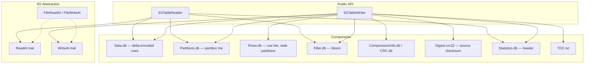

# ferrosa-sstable — Architecture Overview

## Purpose & boundary

`ferrosa-sstable` is the **on-disk format layer** of the storage engine. It is
the single place that understands the byte layout of a BTI SSTable: the trie
indexes, the delta-encoded Data.db rows, the compression chunk framing, the
bloom filter, and the Statistics.db serialization header.

Its boundary is narrow and downward-facing. It depends only on
`ferrosa-common` for the shared key/value/hash types and produces/consumes the
format-specific shapes (`Partition`, `Row`, `LivenessInfo`, `DeletionTime`)
defined in its own `types` module. It knows nothing about CQL planning, schema
DDL, cluster routing, or transports — those live in the crates that call it.

All I/O is **synchronous** and flows through the `ReadAt`/`WriteAt` traits, so
the identical reader/writer code runs over a local file or an S3 object. The
async/S3 wrapper (`S3ReadAt`) deliberately lives one layer up in
`ferrosa-storage`, keeping this crate runtime-free.

## Format scope (what BTI-only means)

| Capability | Status |
|------------|--------|
| BTI write (all 8 components) | Implemented |
| BTI read (point + streaming) | Implemented |
| Legacy Big format (`*-big-*`) read | **Out of scope** (deferred, ADR-004) |
| Range tombstone markers | **Deferred** — writer does not emit, reader skips |
| Complex columns (collections/UDT/tuple/frozen) | **Deferred** in Data.db codec |
| Compression | None / LZ4 / Zstd (Snappy/Deflate not supported) |
| Source checksums (Digest.crc32, CRC.db) | Implemented (T-011) — writer always computes, reader verification is opt-in via `load_digest`/`load_crc_table` |

## Module map

| Module | LoC (approx) | Responsibility |
|--------|------|----------------|
| `reader` (`src/reader.rs`) | ~3450 | `SSTableReader`, `PartitionIter`, point lookup, salvage, bounded token-summary seek index, CRC.db-verified chunk reads |
| `writer` (`src/writer.rs`) | ~4300 | `SSTableWriter`, `WriteOptions`, `SSTableOutput[Files]`, self-readback verify, source checksums |
| `checksum` (`src/checksum.rs`) | ~230 | `DigestCrc32`/`ChunkCrc` (write-time), `ChunkCrcTable` (read-time) — Cassandra-compatible `Digest.crc32`/`CRC.db` formats (T-011) |
| `data` (`src/data.rs`) | ~2700 | Data.db row/cell codec, delta-decode vs header |
| `io` (`src/io.rs`) | ~1200 | `ReadAt`/`WriteAt`, `FileReadAt`/`FileWriteAt`, `CachedReadAt` block cache. `FileReadAt::open` maps an index component only up to `FERROSA_SSTABLE_INDEX_MMAP_MAX_BYTES` (default 16 MiB); larger components use the bounded fd-cached `pread` path (a streaming buffer bound, never a cap) |
| `trie/{node,builder,walker,mod}` | ~2160 | On-disk trie used by both indexes |
| `statistics` (`src/statistics.rs`) | ~1006 | Statistics.db, `SerializationHeader` |
| `partition_index` / `row_index` | ~875 | Trie-backed Partitions.db / Rows.db |
| `byte_comparable` | ~347 | Byte-comparable key encoding for the index |
| `compression` | ~500 | `Compression` enum, chunk compress/decompress + CRC. `compress_bound`/`compress_into` (T-036) compress into a caller-owned buffer for the write pump's `ChunkCompressor` (T-038) |
| `varint` / `marshal` | ~473 | Cassandra VInt codec, `AbstractType` marshalling |
| `bloom` | ~293 | Cassandra-compatible double-hashing bloom filter |
| `toc` | ~156 | TOC.txt read/write, standard component lists |
| `types` | ~237 | `Partition`, `Row`, `LivenessInfo`, `DeletionTime` |
| `pump` | ~3000 | `PumpConfig` (T-030); `SegmentSink` seam + `FileSink` (T-032, now also `pwritev`); `AlignedPump` — `depth = 0` synchronous (T-032, behind `direct::DirectWriter`) **and, from T-033, `depth >= 1`**: a dedicated flusher OS thread over pre-filled `crossbeam_channel::bounded` `full`/`free`/error channels, thread-local batching, coalesced `pwritev`, a non-blocking-then-watchdog-`select!` producer wait, and `write_pump_*` Prometheus metrics. **T-034**: the watchdog's first genuine wait uses `select!`'s own `default(duration)` arm instead of racing `recv(after(..))` — removes `after()`'s one-shot-channel allocation per park specifically. **T-081** initializes cached wait storage and avoids rendezvous abort packets. Pump open exercises the producer's timed park path before accepting writes; `FERROSA_SSTABLE_PUMP_WAIT_WARMUP_TIMEOUT_MS` defaults to 1 ms and accepts 1–100 ms (see FMEA ST-16). `AbortSignal`/`NeverAbort` (T-021 `CancelToken` shim, T-033). `test_support` (`RecordingSink`/`FaultySink`/`GateSink`, now `pub`); `live_flusher_threads()` test-only thread-count instrumentation (T-034) |
| `dio_align` | ~250 | `resolve_block`/`probe`/`block_for` — O_DIRECT alignment probe via a raw `SYS_statx` syscall + `STATX_DIOALIGN` against a hand-rolled kernel-UAPI `KernelStatx` (not `libc::statx`, which is gnu-only in libc 0.2.186 — see FMEA ST-13). Runs on gnu and musl Linux alike; non-Linux is the `Unsupported` stub. Wired into the write path by `pump::FileSink` (T-032) |

## Component layout

A BTI SSTable is 8 files (compressed variant uses `CompressionInfo.db`;
uncompressed additionally uses `CRC.db`; `Digest.crc32` is written for both):

```mermaid
graph TB
    subgraph API["Public API"]
        Reader[SSTableReader]
        Writer[SSTableWriter]
    end
    subgraph Comp["Components"]
        Data[Data.db &mdash; delta-encoded rows]
        Part[Partitions.db &mdash; partition trie]
        Rows[Rows.db &mdash; row trie, wide partitions]
        Filter[Filter.db &mdash; bloom]
        CI[CompressionInfo.db / CRC.db]
        Digest[Digest.crc32 &mdash; source checksum]
        Stats[Statistics.db &mdash; header]
        TOC[TOC.txt]
    end
    subgraph IO["I/O Abstraction"]
        ReadAt[ReadAt trait]
        WriteAt[WriteAt trait]
        FileImpl[FileReadAt / FileWriteAt]
    end
    Reader --> Part
    Reader --> Filter
    Reader --> Stats
    Reader --> Data
    Writer --> Data
    Writer --> Part
    Writer --> Rows
    Writer --> Filter
    Writer --> CI
    Writer --> Digest
    Writer --> Stats
    Writer --> TOC
    Reader --> ReadAt
    Writer --> WriteAt
    FileImpl -.-> ReadAt
    FileImpl -.-> WriteAt
```

## Data flow

**Write path** (engine memtable/compaction → disk): the caller adds `Partition`
values in token order via `add_partition`. Cell timestamps, TTLs, and local
deletion times are **delta-encoded** as unsigned VInts against the baseline in
the `SerializationHeader`. The writer builds the bloom filter, the partition
trie, and — for wide clustered partitions past `ROW_INDEX_MIN_ROWS` — the row
trie alongside Data.db. `finish()` emits all components; by default
(`verify_output`) it reopens the result and asserts the partition count
(self-readback Gate B). `Digest.crc32` (every table) and `CRC.db` (uncompressed
tables) are accumulated as Data.db bytes are written — never by a separate
re-read — via `ChecksummedDataDbWriter`/`checksum::ChunkCrc`; for the
uncompressed file-backed rename path the accumulator lives on `DataBuffer`
itself, since that path never touches `ChecksummedDataDbWriter`.

**Read path** (disk → engine): `SSTableReader::open` parses the bloom filter,
compression info, and statistics header, and opens the partition trie.
`get_partition` checks the bloom filter, walks the trie to a Data.db offset, and
decodes the partition — decompressing only the needed chunks through a bounded
LRU (`decompressed_chunks`) when compressed, or verifying against a loaded
`CRC.db` through the parallel `verified_uncompressed_chunks` LRU when
uncompressed. `partitions_iter` streams in token order with constant
per-partition memory; `seek_to_token` uses a **bounded, downsampled** token
summary so a reader's resident seek index is O(max_entries), not
O(num_partitions) — the fix for a repair-scan OOM.

**Checksum verification is opt-in, not automatic.** `SSTableReader::open`
never loads `Digest.crc32`/`CRC.db` on its own — callers that want read-time
verification call `load_digest`/`load_crc_table` after opening (as
`ferrosa-storage`'s `flush.rs` open helpers do for every generation they
control). A reader that never loads them reads exactly as before T-011:
uncompressed chunks unchecked, `verify_digest()` a no-op — logged once per
generation, never an error, so an SSTable older than T-011 (or a caller that
skips the opt-in) keeps working.

## Key invariants

1. **Byte-exact BTI compatibility.** The trie, VInt, and row encodings must
   match Cassandra 5.x exactly; verified by `tests/cassandra_compat.rs` against
   fixtures generated from the Cassandra submodule.
2. **Partitions added in token order.** `SSTableWriter::add_partition` assumes
   sorted input; out-of-order input corrupts the index.
3. **Cells delta-encoded against the header.** Read and write must share the
   same `SerializationHeader` baseline or every timestamp/TTL decodes wrong.
4. **Bounded allocation on read.** Any length-prefixed buffer over
   `MAX_VALUE_LEN` (256 MiB) is rejected as corruption before allocating.
5. **No async dependency.** Positional I/O is synchronous; the S3/runtime
   wrapper lives in `ferrosa-storage`.
6. **Checksums cover on-disk bytes, not logical content.** `Digest.crc32`
   covers exactly what is on disk — compressed payload + per-chunk CRC
   trailers for a compressed table, raw bytes for an uncompressed one —
   matching Cassandra's contract. `CRC.db`'s chunk size is the table's
   `WriteOptions.chunk_size`, independent of any compression chunking.

## Compression into caller-owned buffers (T-036)

`Compression::compress` allocates a fresh `Vec` per call — fine for the
current whole-buffer writer, not for the streaming write pump
(`ferrosa-suite/specs/sstable-write-pump/architecture.md` § Bounded-ring
rule), which pre-allocates its `ChunkCompressor` input/output buffers once at
open and must not allocate per chunk after that. `compress_bound(len)` /
`compress_into(src, dst)` add that path without changing `compress`'s
behavior or output:

- **`None`**: `compress_bound = len`; `compress_into` is a `copy_from_slice`.
- **`Lz4`**: `compress_bound = 4 + lz4_flex::block::get_maximum_output_size(len)`;
  `compress_into` writes the 4-byte little-endian length prefix itself (the
  same on-disk shape `lz4_flex::compress_prepend_size` produces, so
  `decompress_size_prepended` reads either), then calls
  `lz4_flex::block::compress_into` for the body.
- **`Zstd { level }`**: `compress_bound = zstd_safe::compress_bound(len)`;
  `compress_into` drives `zstd_safe::CCtx` directly through
  `compress_stream`/`end_stream` — the same two calls `zstd::encode_all`
  makes underneath its `Write`-based `Encoder` — reusing one `CCtx` per
  thread. Two more obvious options were tried and rejected: `zstd::bulk::
  Compressor::compress_to_buffer` (`ZSTD_compress2`) hands zstd the whole
  buffer in one call with immediate `ZSTD_e_end`, which auto-pledges the
  exact input length and produces a *different* frame header than
  `encode_all` (confirmed empirically — a byte-for-byte diff on every fixed
  test case); `zstd::stream::write::Encoder` (the streaming wrapper
  `encode_all` itself uses) matches byte-for-byte but allocates a fresh
  32 KiB `Vec` per encoder with no public way to reclaim and reuse it across
  calls.

`compress_into`'s output is proven byte-identical to `compress`'s for every
codec, across empty/1-byte/16 KiB/64 KiB fixed cases plus a `0..=65536`-length
proptest (`compress_into_matches_compress_*`,
`ferrosa-sstable/src/compression.rs`), and `dst` shorter than
`compress_bound` always errors before writing anything.

**Allocation reality, not aspiration**: `tests/compress_into_alloc.rs` (a
separate integration-test binary with its own counting `#[global_allocator]`)
proves `None` and `Zstd` allocate nothing after one warm-up call. `Lz4` does
not reach that bar: `lz4_flex` 0.11's public `block` API allocates a fresh
match-finding hash table (`HashTable4KU16`/`HashTable4K`, boxed, 8–16 KiB) on
every call, with no reusable-state entry point exposed outside the crate. The
test measures and asserts this (a bounded, constant one allocation per call,
not scaling with chunk size) instead of a false "zero" claim — a real
regression (the count growing) still fails the test.

## Position in the dependency graph

A near-leaf crate: it calls only `ferrosa-common`. It is one of the most
widely-depended-on crates in the workspace — `ferrosa-cdc`, `ferrosa-cluster`,
`ferrosa-cql`, `ferrosa-ctl`, `ferrosa-graph`, `ferrosa-index-builder`,
`ferrosa-loadgen`, `ferrosa-postgres`, `ferrosa-row-bridge`, `ferrosa-schema`,
`ferrosa-sparql`, `ferrosa-storage`, and `ferrosa-worker` all consume its
reader/writer or `types`. See the [root crate index](../../specs/crates.md) for
the full graph.

## Component output through the aligned pump (T-040)

`finish_to_directory` sends every metadata component through a synchronous
`ComponentWriter` wrapping `AlignedPump`. Both direct and explicitly buffered
output follow the pump's write, sync and tail-truncate protocol, including the
Data.db path used when a memory writer is finalized to files. Component lengths
come from the pump's logical byte counter. The existing streaming Data.db pump
keeps its configurable depth; streaming CompressionInfo keeps its patched-header
depth-0 pump. The owned-byte `finish()` API remains available without file I/O.

Consumed key bounds and headers move into finalization. The partition footer is
appended to the trie builder's returned buffer instead of copying the entire
trie into a second buffer. T-081 now streams production trie nodes and CRC words
rather than returning table-sized buffers; Bloom serialization borrows its bitset.

## Streaming metadata (T-081)

`io::AppendSink` lets the same trie, Bloom and CRC encoders target owned bytes or
a component pump. `TrieBuilder<S>` emits completed branches immediately and
retains only active-depth descriptors, a shared child-pointer arena and bounded
node scratch. The arena is truncated as each branch becomes one parent pointer.
Row tries reset their **local** position after each partition while continuing
to append to Rows.db; the footer adds the global row-trie start to its root.
This preserves page padding and pointer widths byte for byte.

`ChunkCrc<S>` emits its header at open and one word per completed chunk. It
retains only the current hasher and byte count. `BloomFilter::write_to` borrows
existing words. Compatibility `finish()`/`into_bytes()` APIs explicitly return
owned bytes; production `finish_to_directory()` does not read components back.

Open allocations comprise component pump segments, trie workspaces (initial
64-byte key depth, 16,640 child entries, one page of node bytes, nine payload
bytes, two 256-entry distance buffers) and the existing fixed Bloom bitset.
Longer or more deeply branching keys may expand reusable frontier storage;
row count and total encoded component size never require retained output.

Test-support pump hooks are scoped by output directory and wrap each real sink
once at open. Integration tests can record effective segment/depth/mode or inject
backpressure without process environment changes; guards unregister on drop.
Production builds do not include the hook registry or its locks.

### Pump wiring acceptance (T-045)

Fixed component labels count pump opens by I/O mode, successful physical bytes (including padding), and sink write requests. The counters use atomics and resolve labels once per file; no per-write allocation or registry lock is added. Scoped test traces preserve real file I/O and detect known legacy component-write routes.

## Backpressure evidence (T-041)

`backpressure_test_support::WriteGate` is compiled only for tests/test-support.
It wraps real sinks, has fixed state, uses explicit permits and timeout-bounded
condition-variable waits, and releases on controller drop. It introduces no
production synchronization. Writer tests use the T-045 path-scoped open hook;
the codec checkpoint is `cfg(test)` and runs once before a full batch.

The ring contains `depth + 1` segments; one device permit admits one syscall,
which can coalesce multiple segments. Read-ahead holds one current and one
prefetched window; the producer may additionally hold its current input slice
while the pump owns its ring. Tests account for these separately.

Read-ahead now preallocates two payload windows (one without prefetch), each
bounded by the smaller of file length and configured window. The old current
buffer moves through the existing request channel as the next spare; the worker
returns that same buffer on success or error. No new lock, payload copy or
per-window payload allocation is added. Random access, failed request sends and
cancelled in-flight input reads have explicit ownership regression tests.
