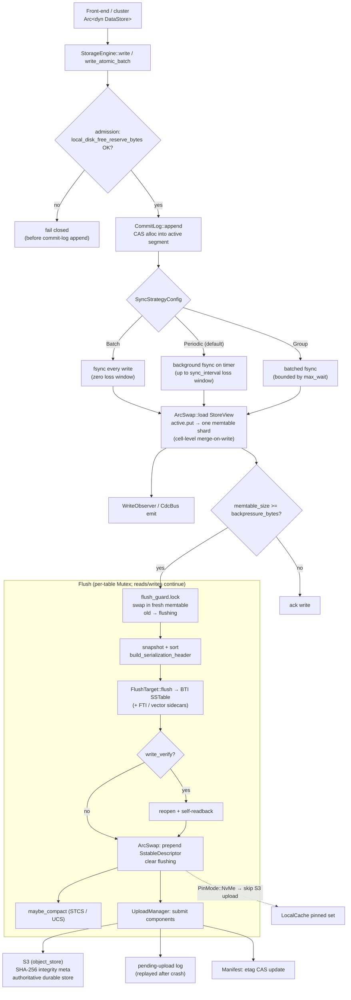
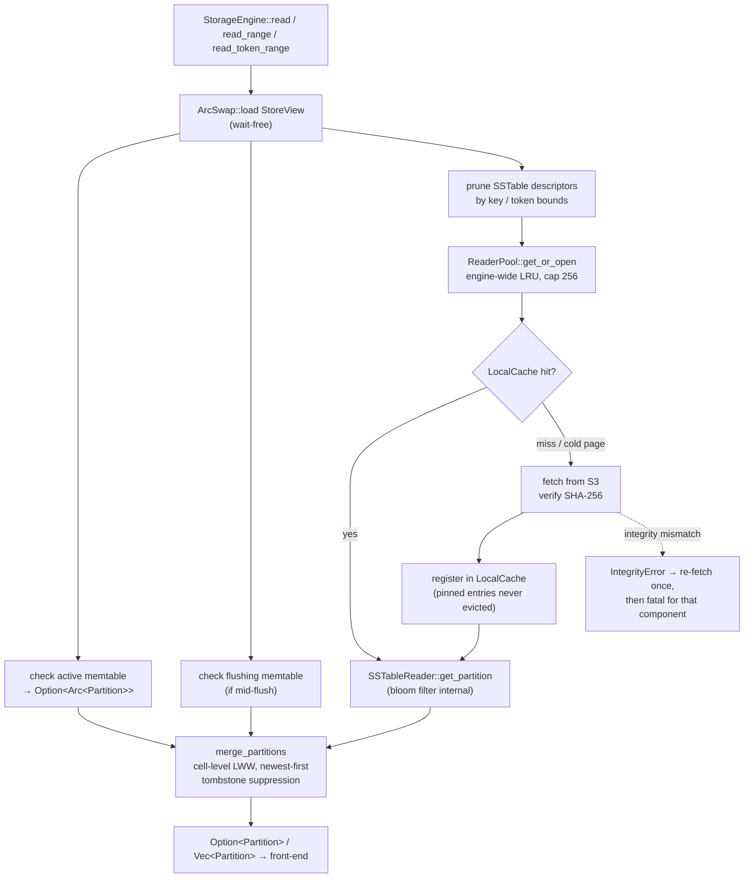

# ferrosa-storage — Data Flow

Two canonical paths: the **write path** (memtable → commit log → flush → S3) and
the **read path** (memtable → cache → S3). All view transitions are
`ArcSwap<StoreView>` swaps, so reads are wait-free and only flushes contend (on a
per-table `Mutex`).

## Write path

A write is made durable by the commit log first, then applied to the memtable.
A memtable that crosses the flush / backpressure thresholds is sealed and flushed
to a BTI SSTable, which is then uploaded to S3 as write-behind.

## Read path

A read loads an immutable `StoreView`, checks the in-memory tiers, then opens
only the SSTables whose key/token bounds could contain the key — filling pages
from the local cache and falling back to S3. Results are merged newest-first with
cell-level last-write-wins.

## Notes

- **Durability boundary.** A write is durable only after its commit-log entry is
  fsynced. Under the default `Periodic` strategy that fsync is deferred up to
  `sync_interval`, so an acked write can be lost on an unclean stop (FMEA ST-1).
  `Batch` closes the window at a latency cost.
- **S3 is authoritative.** Local NVMe is a write-behind cache. Cache eviction
  removes only local copies of remotely-durable objects; manifest-pinned entries
  are never evicted, and `PinMode::NvMe` tables deliberately keep no S3 copy.
- **Crash recovery.** On `open`, the engine first loads the size-bounded,
  discriminated registry `schema.json`; if no registry snapshot exists, a
  storage-only consumer can use the separately owned `storage-schema.json`.
  Both files stream through bounded serde readers, and the storage list is
  published through stage/fsync/verify/atomic-rename/directory-fsync rather
  than a whole-file buffer. The engine then replays commit-log segments into
  memtables (bounded) and the pending-upload log so in-flight S3 uploads
  complete. Pending-upload replay scans both flat
  SSTable components and generation-directory components produced by S3 restore.
- **Quarantine.** A row that fails cell/clustering validation at flush or replay
  is written to a durable `quarantine/*.jsonl` sidecar and skipped; the flush
  continues and `FLUSH_QUARANTINED_ROWS_TOTAL` increments.
