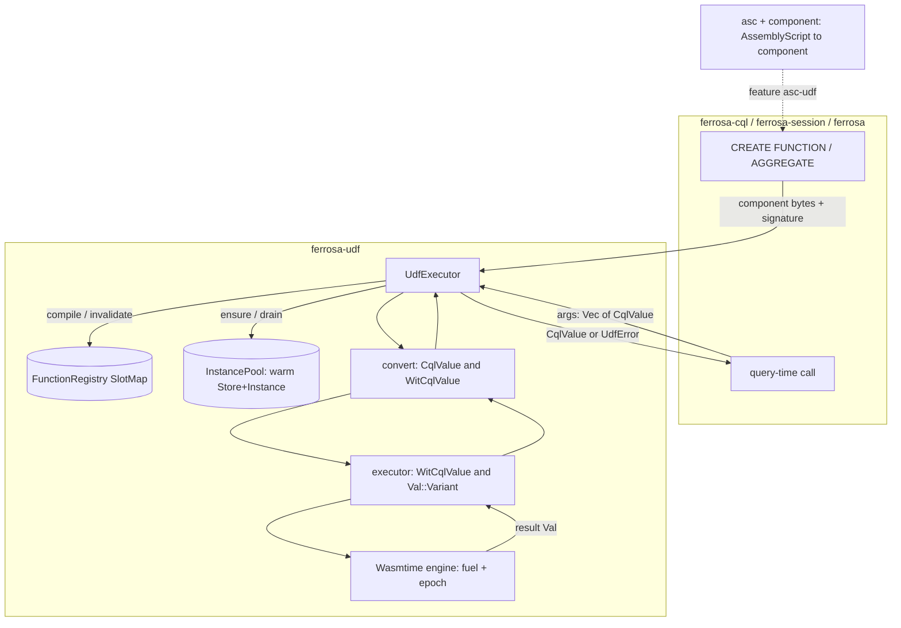

# ferrosa-udf — Architecture Overview

## Purpose & boundary

`ferrosa-udf` is the **execution sandbox** for CQL UDFs/UDAs. Its boundary is
deliberately narrow: it knows about `CqlValue`/`CqlType` (`ferrosa-common`) and
WASM components, and nothing about CQL parsing, schema metadata, DDL replication,
or query planning. Callers own those concerns and hand this crate compiled
component bytes plus a CQL signature; it returns a typed `CqlValue` or a
`UdfError`. All Wasmtime internals (engine config, fuel, epoch, `Val` encoding)
are encapsulated so no caller depends on Wasmtime directly.

## Module map

| Module | Responsibility |
|--------|----------------|
| `executor` (`src/executor.rs`, ~1868 LoC) | `UdfExecutor`, `FunctionRegistry` (SlotMap), `InstancePool`, fuel/epoch wiring, `Val` `<->` `WitCqlValue` encode/decode, streaming-aggregate driver |
| `convert` (`src/convert.rs`, ~754 LoC) | `WitCqlValue` enum + type-directed `cql_to_wit` / `wit_to_cql` (all 26 cases) |
| `sandbox` (`src/sandbox.rs`) | `SandboxConfig` resource limits (memory, fuel, epoch timeout, cache, upload size) |
| `arena` (`src/arena.rs`) | `UdfArena` per-query bump allocator |
| `error` (`src/error.rs`) | `UdfError` |
| `asc` (`src/asc.rs`, feature `asc-udf`) | inline AssemblyScript -> core-WASM via QuickJS + wasmtime-backed `WebAssembly` shim |
| `component` (`src/component.rs`, feature `asc-udf`) | adapter codegen + `wit-component` core-module -> `udf`-world component |
| `src/wit/ferrosa-udf.wit` | the `udf` and `uda` WIT worlds (the host/guest contract) |

## The ABI

The WIT `cql-value` variant is **recursive** — `list-val`, `set-val`, `map-val`,
`tuple-val`, and `udt-val` all carry `cql-value` payloads. The Component Model's
`bindgen!` macro rejects recursive types, so the executor uses the **dynamic
`Val` API** and encodes each case as `Val::Variant(discriminant, payload)` with
the WIT kebab-case name. Two worlds exist:

- `udf`: `export invoke: func(args: list&lt;cql-value&gt;) -> result&lt;cql-value, string&gt;`
- `uda`: `init` / `accumulate` / `merge` / `serialize-state` / `finalize`, driven
  by `ferrosa-cql` via the raw `(Store, Instance)` from `create_uda_instance`.

The componentization path in `component.rs` uses a **reduced** WIT world that
drops the recursive collection cases (WIT's topological resolver cannot encode
them), so asc-compiled UDFs currently support numeric / text / ascii / blob
signatures only.

## Data flow

**Compile path**: caller supplies `(keyspace, name, arg_types, wasm_bytes)`.
`compile` rejects oversized binaries, validates via `Component::new`, registers
in the SlotMap (replacing any prior entry — CREATE OR REPLACE), and pre-allocates
a pool slot. `compile_streaming_aggregate` additionally requires the
`ferrosa:streaming-aggregate:v1` marker.

**Call path**: `call` looks up the component, acquires a warm instance from the
pool (or instantiates fresh on miss), resets fuel + epoch deadline, converts args
through `cql_to_wit` -> `Val::Variant`, invokes `invoke`, decodes the
`result<cql-value, string>` back through `wit_to_cql`, and returns the instance to
the pool only on success.

## Key invariants

1. **Every invocation is resource-bounded.** Each `Store` gets `max_fuel` (or
   `max_aggregate_fuel`) and `epoch_deadline_trap` + `set_epoch_deadline(1)`. A
   background `udf-epoch-ticker` thread increments the engine epoch every
   `max_execution_time`, so a CPU-bound guest traps as `OutOfFuel` or on the
   epoch deadline rather than hanging the host.
2. **Stale code is never reused.** `invalidate` removes the registry slot *and*
   drains the instance pool for that key; instances are returned to the pool only
   on a successful call (errors discard the instance).
3. **The conversion is total and type-directed.** `cql_to_wit` handles all 26
   `CqlValue` cases; `wit_to_cql` reconstructs collections/UDT/tuple using the
   declared `CqlType`, and errors loudly (`TypeMismatch`) on a shape mismatch or
   an unparseable uuid/inet rather than silently returning NULL.
4. **No second encoder.** The host-side `cql-value` `Val::Variant` encoding in
   `executor.rs` is the only one; the asc adapter in `component.rs` writes the
   same canonical-ABI layout.

## Position in the dependency graph

Leaf-adjacent: depends only on `ferrosa-common` (plus external Wasmtime/QuickJS
toolchain crates). Depended on by `ferrosa`, `ferrosa-cql`, `ferrosa-ctl`, and
`ferrosa-session`. See the [root crate index](../../specs/crates.md) for the full
graph.
