# ferrosa-view — Architecture Overview

## Purpose & boundary

`ferrosa-view` is the **pure core** of ferrosa materialized views. It owns three
things every materialized-view code path must agree on, kept free of I/O:

1. the schema-replicated **description** of a view (`ViewMetadata`),
2. the **DDL validation** gate (`validate_view_def`), and
3. the **incremental-maintenance** state machine (`compute_view_delta`).

Its boundary is deliberately narrow. It depends only on `ferrosa-schema` (for
the base `TableMetadata` it validates against) and **never** on
`ferrosa-storage`, `ferrosa-cluster` (Accord), or any protocol frontend. The
`#![forbid(unsafe_code)]` and the absence of storage/transport types are
structural enforcement of that boundary — see
`specs/materialized-views/dsm-coupling.md` and `dsm-proposed.md` for the
forbidden-edge rules.

## Integration status — island

This crate is an **island**: the primitives exist and are tested, but they are
not yet consumed.

- **No crate depends on `ferrosa-view`.** A workspace scan finds it in no other
  crate's `Cargo.toml` and no `use ferrosa_view` in production code.
- The maintenance *execution* — the read-before-write that produces a `prior`
  `RowSnapshot`, the Accord-coordinated base+view commit, predicate/UDF
  evaluation, and schema-replication of `ViewMetadata` — lives in the engine
  layer and is **pending**.

The crate is therefore correct to document as a standalone core. Its green test
suite proves the primitives, not end-to-end materialized views.

## Module map

| Module | LoC (with tests) | Responsibility |
|--------|------------------|----------------|
| `metadata` (`src/metadata.rs`) | ~162 | `ViewMetadata`, `ViewKind`, `ViewColumn`, `ColumnSource`, `ViewPredicate`; `primary_key()` / `source_of()` |
| `validate` (`src/validate.rs`) | ~465 | `validate_view_def`, `ViewDefError`; the per-rule check functions |
| `delta` (`src/delta.rs`) | ~302 | `compute_view_delta`, `ViewDelta`, `RowSnapshot`; the pure transition state machine |
| `lib` (`src/lib.rs`) | ~27 | module wiring + public re-exports |

## Data flow

The crate models the maintenance pipeline but does not run it. Two pure stages:

**Validation stage** (DDL time): a frontend parses `CREATE MATERIALIZED VIEW`
into a `ViewMetadata`, then calls `validate_view_def(base, view, base_is_view)`.
On `Ok(())` the frontend would hand the `ViewMetadata` to schema replication
(not in this crate); on `Err` it surfaces the typed `ViewDefError`.

**Maintenance stage** (write time): the engine observes a base-row transition.
It builds a `prior` and `next` `RowSnapshot` (from the read-before-write it owns)
and calls `compute_view_delta(view, prior, next, timestamp)`. The returned
`Vec&lt;ViewDelta&gt;` (`Upsert` / `Delete`, each carrying the base timestamp) is
translated by the engine into real storage mutations under Accord. The
read-before-write and the commit are **the engine's job, not this crate's.**

```mermaid
flowchart TD
    DDL["frontend: CREATE MATERIALIZED VIEW"] --> VM["ViewMetadata"]
    VM --> VAL["validate_view_def(base, view, base_is_view)"]
    VAL -->|Ok| REPL["schema replication (engine, pending)"]
    VAL -->|Err| ERR["ViewDefError"]
    WRITE["engine: base-row mutation (pending)"] --> SNAP["prior / next: RowSnapshot"]
    SNAP --> DELTA["compute_view_delta(view, prior, next, ts)"]
    DELTA --> OUT["Vec&lt;ViewDelta&gt;: Upsert / Delete"]
    OUT --> COMMIT["Accord base+view commit (engine, pending)"]
```

## Projection model

A base row is *projected* into the view iff **every view primary-key column is
non-null** (the Cassandra `IS NOT NULL` baseline). `compute_view_delta` derives
the four outcomes from whether the row was projected before vs. after:

| before \ after | not projected | projected |
|----------------|---------------|-----------|
| **not projected** | no delta | `Upsert` |
| **projected** | `Delete` | `Upsert` (same PK) or `Delete`+`Upsert` (PK changed) |

The optional ferrosa-extension predicate (`ViewPredicate::extra`) and UDF-column
projection are **not** evaluated here — they are deferred to later engine cycles.

## Key invariants

1. **Purity.** No I/O, no storage row types, no Accord. `RowSnapshot` is a plain
   `BTreeMap<String, Vec<u8>>` precisely so storage types never leak in (a
   forbidden dependency edge).
2. **One validation gate.** `validate_view_def` is the single place the
   Cassandra-baseline + ferrosa rules are enforced; every frontend routes
   through it. No second validator exists.
3. **Deterministic deltas.** `compute_view_delta` is a pure function of its
   inputs; the same transition yields the same deltas (test
   `delta_is_deterministic`). This underpins the strict-serializable guarantee
   (D2) once the engine drives it.
4. **`ViewKind` discriminator is forward-stable.** Name-tagged serde encoding so
   adding `Snapshot` later is a non-breaking schema change (gate G1, D1).
5. **No dependency on `ferrosa-cql`/storage/cluster.** Structural; enforced by
   the dependency graph.

## Position in the dependency graph

Leaf-adjacent: depends only on `ferrosa-schema`. Depended on by **no crate yet**
— it is an island awaiting the engine integration. See the
[root crate index](../../specs/crates.md) for the full graph.
