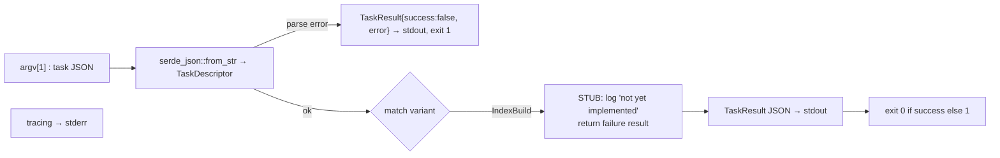

# ferrosa-worker — Architecture Overview

## Purpose & boundary

`ferrosa-worker` is the **standalone task-executor binary** for the workspace.
Its stated design contract (from the `main.rs` doc comment) is intentionally
minimal:

> No cluster membership, no Raft, no persistent state.
> Pure function: input → compute → output.

The intent is to move expensive, embarrassingly-parallel background work — first
secondary-index construction, eventually compaction — out of the main engine
process into a short-lived child process that reads a descriptor, does one unit
of work, prints a result, and exits. This pairs with the engine's
`FERROSA_INDEX_BACKEND` modes (`local` / `remote` / `off`), where an external
builder offloads index construction.

**Boundary:** it knows only how to (a) parse a `TaskDescriptor`, (b) dispatch on
its variant, and (c) emit a `TaskResult`. It owns no persistence, no networking,
no scheduling. It is a leaf, executable component.

## Maturity: nascent

This crate is at an early stage and the docs say so plainly. The CLI envelope
and the serde types are implemented and tested; the **work itself is a stub**.
The single `IndexBuild` arm logs "not yet implemented" and returns a failure
result. Treat this overview as describing the *contract and skeleton*, not a
working index builder.

## Module map

| Module | LoC | Responsibility |
|--------|-----|----------------|
| `main` (`src/main.rs`) | ~159 | `TaskDescriptor` / `TaskResult` types, `tracing` init, argv parsing, dispatch, JSON I/O, exit codes |
| `tests/cli_test.rs` | ~59 | Black-box CLI integration tests over the built binary |

There is **no `src/lib.rs`** — the types are private to the binary.

## Data flow

**Today's path:** `argv[1]` in, stdout out, stderr logs. The doc comment also
promises **stdin** and **S3** as task sources and **S3** as a result sink; those
are not yet coded.

## Types

- `TaskDescriptor` — internally-tagged enum (`#[serde(tag = "type")]`). One
  variant: `IndexBuild` with `sstable_s3_paths: Vec&lt;String&gt;`, `keyspace`,
  `table`, `index_name`, `index_metadata_json`, `table_schema_json`, and
  `output_s3_prefix`. The two `*_json` fields carry opaque JSON blobs (an
  `IndexMetadata` and a `TableSchema`) rather than typed structs — a deliberate
  decoupling so the worker need not link the schema crate to *parse* a task.
- `TaskResult` — `{ success: bool, output_paths: Vec&lt;String&gt;, error: Option&lt;String&gt; }`.
  Emitted on every path, including parse failures, so the caller always gets
  machine-readable output.

## Key invariants / contract

1. **Always emit a `TaskResult` to stdout**, even on usage/parse errors. The
   caller never has to distinguish "no output" from "failure".
2. **Exit code mirrors `success`.** Non-zero exit on any failure; this is what an
   out-of-process orchestrator keys on.
3. **Logs to stderr, results to stdout.** Clean separation so stdout is always
   parseable JSON.
4. **Stateless.** No Raft, no membership, no disk state — re-running a descriptor
   must be safe (idempotency of the *real* work is a future concern, see FMEA).

## Position in the dependency graph

**Calls:** `ferrosa-common`, `ferrosa-index`, `ferrosa-sstable` — declared as
path dependencies (for the forthcoming real index build) but **not yet
referenced** in source.

**Called by:** none. No ferrosa crate lists `ferrosa-worker` as a path
dependency; it appears only in the workspace `members` list. It is expected to
be driven **out-of-process** (spawned as a child binary) rather than linked. See
the [root crate index](../../specs/crates.md) for the full graph.
