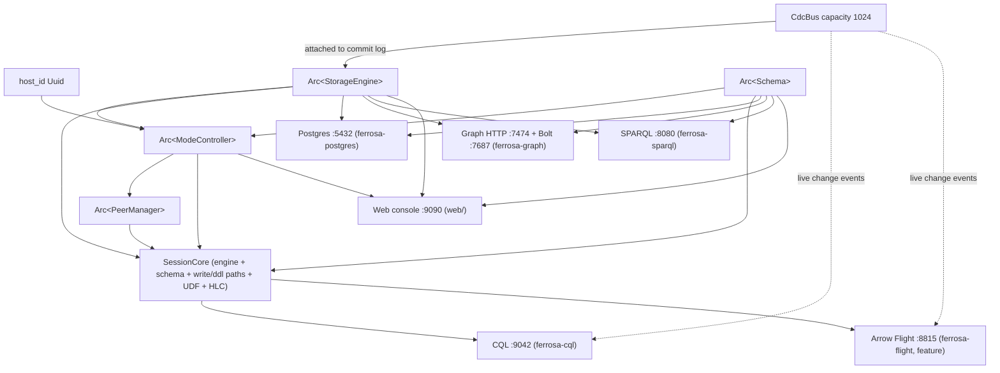
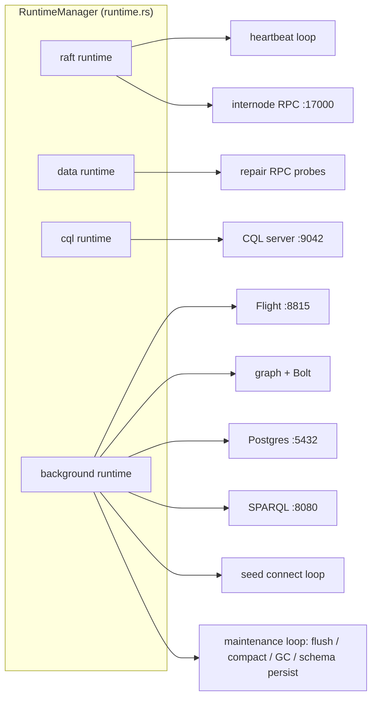

# ferrosa — Startup & Composition Data Flow

This is the binary's composition root: it constructs each subsystem crate in a
fixed order and binds every listener. The diagrams below trace that sequence and
the shared instances that flow between subsystems. All shared services are
`Arc`-wrapped and cloned into consumers — exactly one of each per process.

## Startup sequence

```mermaid
sequenceDiagram
    autonumber
    participant Main as main()
    participant Cfg as config (env then TOML)
    participant Store as ferrosa-storage
    participant Cdc as ferrosa-cdc CdcBus
    participant Schema as ferrosa-schema
    participant Cluster as ferrosa-cluster ModeController
    participant Net as ferrosa-net PeerManager + RPC
    participant Front as front-end listeners

    Main->>Main: init tracing (non-blocking; OTel if enabled)
    Main->>Cfg: load FERROSA_CONFIG TOML (file wins)
    Cfg->>Cfg: preserve internode broadcast host/port for handshake
    Main->>Main: load/generate host_id (classify state)
    Main->>Store: open() replay commitlog OR new()
    Main->>Store: probe S3 CAS; register system tables
    Main->>Cdc: CdcBus::new(1024)
    Cdc-->>Store: set_cdc_bus() attach to commit log
    Main->>Schema: Schema::new(config)
    Schema->>Schema: seed roles if auth; restore local then S3 then fresh
    Schema->>Store: re-register indexes, UDTs, UDFs, perms
    Main->>Store: replay pending commitlog mutations
    Main->>Cluster: ModeController::new(cfg, net_cfg, host_id, store, schema, registry)
    Main->>Net: PeerManager::new(net_cfg, host_id, mode_controller)
    Net-->>Cluster: PeerManager set as PeerEventListener
    Main->>Net: spawn heartbeat loop; spawn self-heal (live peer probe)
    Main->>Net: RpcServer.start_and_get_addr() bind :17000
    Main->>Front: build SessionCore (store, schema, paths, HLC, peer mgr)
    Main->>Front: CqlServer.start_background() bind :9042
    Main->>Front: Arrow Flight bind :8815 (feature flight)
    Main->>Front: web console bind :9090
    Main->>Cluster: spawn auto-repair (verified replica view + scheduler)
    Main->>Front: graph HTTP :7474 + Bolt :7687 (if enabled)
    Main->>Front: Postgres :5432; SPARQL :8080 (if enabled)
    Main->>Net: background connect to FERROSA_SEED peers (backoff)
    Main->>Store: spawn maintenance loop (flush, compact, GC, schema persist)
    Main->>Main: await SIGINT or SIGTERM
    Main->>Main: graceful drain (cluster, internode, flush, persist) within 30s
```

## Shared-instance wiring

Each box below is constructed once and shared. Edges are `Arc` clones. Note the
`CdcBus` feeding both live-CQL `SUBSCRIBE` and the Flight stream, and the single
`SessionCore` behind both the CQL router and the Flight service.



## Listener / runtime placement



The main tokio runtime stays supervisor-only; routing subsystems to dedicated
runtimes keeps bulk CQL writes from starving Raft heartbeats.

## Notes

- **Config precedence** at every resolver: TOML
  (`/etc/ferrosa/ferrosa.toml`), then environment variable, then hard default.
  `[internode].broadcast` retains both its resolved socket and exact configured
  host/port; the latter is sent in peer handshakes.
- **Auth flag** (`auth_disabled`) is derived once from
  `FERROSA_AUTH_ENABLED` / `[cql].auth_enabled` and threaded into CQL, web,
  graph HTTP, and Bolt so the kill-switch is uniform.
- **Graceful shutdown** order on SIGINT/SIGTERM: cancel cluster tasks, drain
  internode, flush memtables, persist schema (local + S3) — within a 30 s
  timeout.
