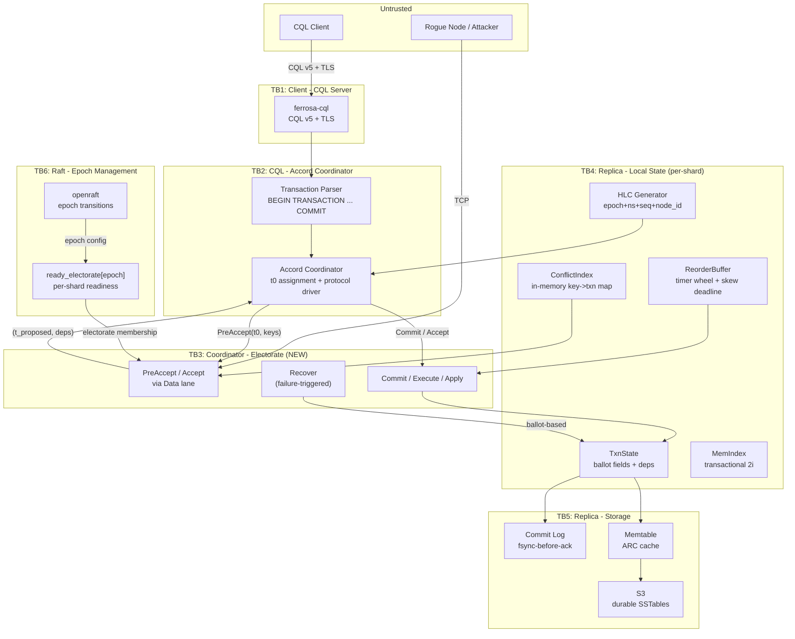

# Threat Model — Accord Distributed Transactions

> **Date:** 2026-03-21
> **Updated:** 2026-03-23
> **Scope:** New attack surface introduced by the Accord leaderless transaction protocol
> **Methodology:** STRIDE per trust boundary
> **Design Spec:** Accord integration architecture (A1-A7 complete)
> **Parent Threat Models:** `specs/threat-model.md` (T01-T28), `specs/threat-model-net-cluster.md` (T1-T20)

## System Overview

Accord adds leaderless distributed transactions to Ferrosa. Unlike the existing coordinator pattern (tunable CL fan-out), Accord imposes a multi-round consensus protocol on every transactional write. Key new components:

- **HLC Timestamp Generator** -- assigns globally unique `t0` from Hybrid Logical Clock (epoch + time_ns + seq + node_id)
- **ConflictIndex** -- in-memory per-shard structure tracking in-flight transaction keys for dependency detection
- **ReorderBuffer** -- in-memory timer wheel that holds committed transactions until measured clock skew + network latency deadlines expire, ensuring execution order
- **TxnState** -- per-transaction metadata with two ballot fields (`max_ballot_seen` vs `accepted_ballot`) for the two-ballot-variable invariant
- **Accord Protocol Messages** -- PreAccept, Accept, Commit, Execute, Apply, Recover sent via internode Data lane
- **Electorate** -- the set of replicas that participate in consensus for a given transaction's key range, derived from token ring + epoch
- **MemIndex** -- BTreeMap-backed transactional secondary index for Accord-scoped reads
- **DurabilityService / ExclusiveSyncPoint** -- periodic barriers for GC of applied transaction metadata

### Protocol Flow

1. Client sends CQL `BEGIN TRANSACTION ... COMMIT` to coordinator
2. Coordinator assigns `t0` (HLC timestamp), broadcasts `PreAccept(txn, t0, keys)` to electorate
3. Each replica checks its ConflictIndex, responds with `(t_proposed, deps)` -- either agreeing on `t0` or proposing a higher timestamp
4. **Fast path** (supermajority 2/3+1 agree on `t0`): coordinator sends `Commit(t0, deps)` immediately
5. **Slow path**: coordinator runs `Accept(t_final, deps)` round, then `Commit`
6. **Execute**: coordinator reads from replicas at the committed timestamp, computes result
7. **Apply**: writes result to memtable + commit log on all replicas
8. **Recovery**: triggered by failure detector when coordinator is suspected dead; any replica in the electorate can take over using its own ballot

### Security-Relevant Properties

- All transactional writes go through Accord -- there is no bypass path for `BEGIN TRANSACTION` blocks
- Commit log entries are persisted before protocol reply messages are sent (fsync-before-ack)
- HLC is synchronized via measured heartbeat round-trip times, not NTP configuration
- Electorate reconfiguration (epoch transitions) is managed by the existing openraft/Raft metadata consensus
- The two-ballot-variable invariant (SS6.1) prevents stale recovery coordinators from overwriting progress

---

## Trust Boundary Diagram



---

## Assets

| # | Asset | Type | Impact if Compromised |
|---|-------|------|----------------------|
| A1 | HLC timestamp integrity | Integrity | Transaction ordering violations, serializability breach |
| A2 | ConflictIndex state | Integrity | Conflicting transactions committed without dependency tracking |
| A3 | TxnState ballot fields | Integrity | Recovery corruption, committed transactions overwritten |
| A4 | ReorderBuffer deadlines | Availability, Integrity | Out-of-order execution, correctness violations |
| A5 | Accord protocol messages | Confidentiality, Integrity | Transaction payload leakage, vote manipulation |
| A6 | Electorate membership | Integrity | Unauthorized participation in consensus |
| A7 | Commit log (txn entries) | Integrity | Applied transactions lost on crash recovery |
| A8 | MemIndex (transactional 2i) | Integrity | Phantom reads in transaction execution phase |
| A9 | Epoch/topology state | Integrity | Stale electorate decisions, split-brain consensus |
| A10 | ExclusiveSyncPoint / RedundantBefore | Integrity | Premature GC of transaction metadata, dangling dependencies |

---

## Threat Inventory

### TB1: Client to CQL Server (Transaction Ingress)

Existing trust boundary (see `specs/threat-model.md` T01-T06). Accord adds:

| ID | STRIDE | Threat | L | I | Risk | Mitigation | Status |
|----|--------|--------|---|---|------|-----------|--------|
| AT01 | **T** | Client submits a `BEGIN TRANSACTION` block containing reads and writes that reference keys across many partitions, forcing the coordinator to contact a large electorate. Amplification attack: one client request fans out to O(partitions) internode messages. | 3 | 2 | **6 High** | (1) Limit max keys per transaction (e.g., 128, configurable via `FERROSA_ACCORD_MAX_KEYS`). (2) Limit max partitions per transaction. (3) Reject at CQL parse time before entering the Accord path. (4) Per-connection rate limiting on transaction statements. Enforced in `ferrosa-cql/src/transaction_limits.rs` and `ferrosa-cql/src/transaction_keys.rs`. | **Implemented** |
| AT02 | **D** | Client opens many concurrent `BEGIN TRANSACTION` sessions without committing, exhausting coordinator-side TxnState memory. Each in-flight transaction holds ConflictIndex entries and ReorderBuffer slots. | 3 | 2 | **6 High** | (1) Per-connection limit on concurrent in-flight transactions (default 16). (2) Transaction timeout (default 10s) -- auto-abort if client does not commit. (3) Total cluster-wide in-flight transaction cap with `Overloaded` error. Enforced in `ferrosa-cql/src/session.rs` and `ferrosa-cql/src/transaction_limits.rs`. | **Implemented** |
| AT03 | **E** | Client bypasses Accord by sending direct `INSERT`/`UPDATE` (non-transactional) to keys that have in-flight Accord transactions, creating inconsistencies between the Accord view and storage. | 2 | 3 | **6 High** | (1) If a table has active Accord transactions, non-transactional writes must check the ConflictIndex and either block or be routed through Accord. (2) Alternative: tables opted into transactions enforce Accord-only writes. (3) Document the consistency model clearly. Enforced in `ferrosa-storage/src/accord/write_gate.rs`. | **Implemented** |

### TB2: CQL to Accord Coordinator (Internal Boundary)

| ID | STRIDE | Threat | L | I | Risk | Mitigation | Status |
|----|--------|--------|---|---|------|-----------|--------|
| AT04 | **S** | Coordinator generates `t0` with a forged `node_id` component, making the timestamp appear to originate from another node. During recovery, this confuses ballot ownership checks. | 1 | 3 | **3 Medium** | (1) `node_id` in HLC timestamp is derived from the local `host_id` (UUID), set at process startup and immutable. (2) The Rust type system prevents mutation after initialization (`Arc<HlcGenerator>` with private fields). (3) Replicas validate that `t0.node_id` matches the coordinator's authenticated identity (mTLS peer). | Mitigated by design |
| AT05 | **T** | Coordinator proposes a `t0` far in the future (e.g., `now + 1 hour`). All replicas that accept this timestamp will advance their local HLC, inflating `SkewMax` and increasing ReorderBuffer deadlines cluster-wide. Effectively a "time bomb" that degrades latency for all subsequent transactions. | 2 | 3 | **6 High** | (1) Replicas reject `PreAccept` if `t0 > local_hlc + MAX_CLOCK_DRIFT` (default 500ms). (2) `MAX_CLOCK_DRIFT` is derived from measured heartbeat RTT, not configurable by the coordinator. (3) Coordinator's `t0` must be monotonically increasing from its own HLC; a jump forward triggers an alarm and is capped. Validated in `ferrosa-cluster/src/accord/clock_validation.rs`. | **Implemented** |
| AT06 | **I** | Transaction read-set and write-set keys are visible in the `PreAccept` message payload. If internode traffic is unencrypted, an observer can see which keys are being transacted upon (even without seeing the values), enabling traffic analysis. | 2 | 2 | **4 High** | (1) mTLS on all internode connections (existing mitigation, see T2 in net-cluster threat model). (2) Key names are not logged at INFO level -- only at TRACE with `enable_key_tracing` flag. | Planned (mTLS) |

### TB3: Coordinator to Electorate (Accord Protocol Messages) -- NEW

This is the primary new trust boundary introduced by Accord.

#### Spoofing

| ID | STRIDE | Threat | L | I | Risk | Mitigation | Status |
|----|--------|--------|---|---|------|-----------|--------|
| AT07 | **S** | A rogue node (having bypassed or not yet subjected to mTLS) sends `PreAccept` messages with a fabricated coordinator identity. Replicas record votes for a transaction that the legitimate coordinator did not initiate. When the real coordinator sends its own `PreAccept`, replicas respond with conflicting state. | 2 | 3 | **6 High** | (1) mTLS authenticates the coordinator's `host_id` -- `PreAccept.coordinator_id` must match the TLS peer certificate's Subject. (2) Replicas reject messages where `t0.node_id` does not match the authenticated peer. (3) In production mode, unauthenticated internode connections are rejected (ADR-010). | Planned (mTLS Phase 2) |
| AT08 | **S** | A node claims a false `node_id` in its HLC timestamps to collide with another node's timestamp space. Two transactions from different coordinators share the same `(epoch, time_ns, seq, node_id)`, violating global uniqueness. | 1 | 3 | **3 Medium** | (1) `node_id` is derived from `host_id` (UUID v4, cryptographically random). Collision probability is ~2^-122. (2) mTLS binds `host_id` to a certificate -- a node cannot claim another node's identity without the private key. (3) Raft membership tracks `host_id` -> `node_id` mappings; duplicates are rejected by the leader. | Mitigated by design |

#### Tampering

| ID | STRIDE | Threat | L | I | Risk | Mitigation | Status |
|----|--------|--------|---|---|------|-----------|--------|
| AT09 | **T** | MITM modifies `PreAccept` response: changes `t_proposed` to a lower value, forcing the coordinator to believe fast-path consensus was reached when replicas actually disagreed. Coordinator commits at `t0` when it should have entered the slow path. | 2 | 3 | **6 High** | (1) mTLS provides integrity on all internode messages. (2) Without mTLS (development mode), a MAC on protocol messages using the PSK would detect tampering. (3) Coordinator cross-checks: if any response has `t_proposed > t0`, fast path is impossible regardless of other responses. | Planned (mTLS) |
| AT10 | **T** | During recovery, a malicious replica reports a falsified `accepted_ballot` that is higher than the real one, causing the recovery coordinator to believe a later Accept round already succeeded. The recovery coordinator adopts the false state and commits an incorrect transaction outcome. | 1 | 3 | **3 Medium** | (1) Recovery coordinator contacts a majority of the electorate (SS6.1 two-ballot-variable invariant). A single lying replica cannot override the majority's consistent state. (2) The ballot is validated: `accepted_ballot <= max_ballot_seen` must hold. (3) If a replica reports `accepted_ballot` for a value that no other replica has seen, the recovery coordinator detects the inconsistency (requires f+1 agreement). | Mitigated by protocol |
| AT11 | **T** | ConflictIndex corruption: a bug or memory-safety issue causes the ConflictIndex to lose entries, making two conflicting transactions appear independent. Both commit at their original `t0` without dependency tracking, violating serializability. | 2 | 3 | **6 High** | (1) ConflictIndex is a `BTreeMap<Key, BTreeSet<TxnId>>` -- deterministic, no `unsafe` code. (2) Invariant: every `PreAccept` and `Accept` must check the ConflictIndex *and* update it atomically (single-threaded per shard, as per CommandStore model). (3) Property tests: concurrent transaction insertion always produces correct dependency sets. (4) Integration test: two conflicting transactions on the same key always see each other in deps. Implemented in `ferrosa-storage/src/accord/conflict_index.rs`; property tests in `ferrosa-cluster/src/accord/proptests.rs`. | **Implemented** |
| AT12 | **T** | ReorderBuffer deadline manipulation via false heartbeat latency. A compromised node sends `Pong` responses with artificial delays, inflating the measured RTT. Since `SkewMax` and reorder deadlines derive from heartbeat measurements, all nodes increase their ReorderBuffer wait times, degrading throughput. | 2 | 2 | **4 High** | (1) Heartbeat RTT measurements use a sliding window with outlier rejection (e.g., discard measurements > 3 sigma from the moving median). (2) `SkewMax` has a hard upper cap (e.g., 2s) regardless of measured values. (3) Per-peer RTT tracking -- one compromised peer only affects its own measurements, not the global `SkewMax`. (4) Multiple peers must agree before `SkewMax` increases. Validated in `ferrosa-cluster/src/accord/clock_validation.rs`. | **Implemented** |

#### Repudiation

| ID | STRIDE | Threat | L | I | Risk | Mitigation | Status |
|----|--------|--------|---|---|------|-----------|--------|
| AT13 | **R** | A replica denies having voted in a particular ballot during recovery. Without durable vote records, the recovery coordinator cannot distinguish "never voted" from "voted but claims otherwise." This can cause the recovery coordinator to re-propose with incorrect dependency sets. | 2 | 3 | **6 High** | (1) All protocol state transitions (`PreAccept`, `Accept`, `Commit`) are written to the commit log before the response is sent (fsync-before-ack). (2) On crash recovery, the commit log replays TxnState -- the replica cannot deny votes that are durably recorded. (3) Audit: protocol messages include the responding node's `host_id` and ballot, logged at DEBUG level. Implemented in `ferrosa-storage/src/accord/sync_writer.rs` and `ferrosa-storage/src/accord/protocol_log.rs`. | **Implemented** |
| AT14 | **R** | Coordinator commits a transaction and claims success to the client, but the `Commit` message was never actually sent to the electorate. On coordinator crash, no replica has a record of the commit. The transaction is effectively lost. | 1 | 3 | **3 Medium** | (1) Coordinator writes the `Commit` decision to its own commit log before responding to the client. (2) On coordinator crash, the home shard replica triggers recovery (via ProgressLog), which will discover the committed state from the majority. (3) If the coordinator crashes between local commit-log write and sending `Commit` messages, recovery will complete the protocol. | Mitigated by protocol |

#### Information Disclosure

| ID | STRIDE | Threat | L | I | Risk | Mitigation | Status |
|----|--------|--------|---|---|------|-----------|--------|
| AT15 | **I** | Transaction payloads leak between electorates. A node that participates in electorate E1 for key range [A, M) should not see transaction payloads for electorate E2 [M, Z). However, if a multi-partition transaction touches both ranges, the full transaction definition is sent to all participating replicas. | 2 | 2 | **4 High** | (1) This is inherent to the Accord protocol: multi-partition transactions require all participating shards to see the full transaction. (2) Mitigation: `PartialTxn` sends only the shard-relevant subset of the transaction to each CommandStore. Each shard receives only the keys/values it needs. (3) Internode encryption (mTLS) prevents external observers from seeing cross-shard payloads. | Accepted (protocol design) |
| AT16 | **I** | ConflictIndex exposes in-flight transaction keys to unauthorized readers. An internal component or debug endpoint enumerates the ConflictIndex, revealing which keys have active transactions -- enabling timing attacks or competitive intelligence in multi-tenant deployments. | 1 | 2 | **2 Medium** | (1) ConflictIndex is an internal data structure with no CQL-accessible query path. (2) Virtual table exposure (e.g., `system.accord_conflicts`) must require superuser permission. (3) No HTTP debug endpoint for ConflictIndex in production mode. | Mitigated by access control |
| AT17 | **I** | ReorderBuffer timing side-channel. The ReorderBuffer holds transactions for `SkewMax + network_latency` before execution. An observer measuring the delay between `Commit` and `Apply` can infer the cluster's measured clock skew, which leaks operational topology information. | 1 | 1 | **1 Low** | (1) Accepted -- this is low-impact operational metadata, not user data. (2) mTLS prevents external observers from measuring internode timing. (3) No mitigation needed beyond existing TLS. | Accepted |

#### Denial of Service

| ID | STRIDE | Threat | L | I | Risk | Mitigation | Status |
|----|--------|--------|---|---|------|-----------|--------|
| AT18 | **D** | Flood of `PreAccept` messages overwhelms the ReorderBuffer and ConflictIndex. Each `PreAccept` creates entries in both structures. An attacker with internode access (or a buggy coordinator) sends millions of `PreAccept` messages for unique transaction IDs, exhausting memory. | 2 | 3 | **6 High** | (1) Per-peer rate limiting on Accord protocol messages (configurable, default 10,000 PreAccepts/sec per peer). (2) ConflictIndex bounded: max in-flight transactions per shard (default 100,000). When exceeded, new `PreAccept` messages receive `Overloaded` error. (3) ReorderBuffer bounded: max pending entries (default 50,000 per shard). (4) mTLS limits attack surface to authenticated cluster members. Bounds enforced in `ferrosa-storage/src/accord/conflict_index.rs` and `ferrosa-cluster/src/accord/reorder_buffer.rs`. | **Implemented** |
| AT19 | **D** | Intentional clock skew inflates `SkewMax`. A compromised node advances its HLC by a large amount (e.g., +10 seconds). When it sends `PreAccept` with this inflated `t0`, receiving replicas measure high skew and increase `SkewMax`. All subsequent transactions wait longer in the ReorderBuffer, degrading cluster-wide latency. | 2 | 3 | **6 High** | (1) `MAX_CLOCK_DRIFT` cap on accepted timestamps (see AT05). (2) `SkewMax` has a hard ceiling (default 2s). (3) Per-node skew tracking: a single node's drift does not pollute the global `SkewMax` if it is an outlier. (4) Alarm when any node's measured skew exceeds warning threshold (default 200ms). Validated in `ferrosa-cluster/src/accord/clock_validation.rs`. | **Implemented** |
| AT20 | **D** | Malicious coordinator proposes timestamps far in the future, causing replicas to reject legitimate transactions from other coordinators (whose timestamps appear to be in the past relative to the inflated ConflictIndex entries). | 2 | 3 | **6 High** | (1) Same as AT05 -- replicas reject `t0 > local_hlc + MAX_CLOCK_DRIFT`. (2) ConflictIndex entries from rejected `PreAccept` messages are not recorded. (3) Replicas do not advance their local HLC based on rejected timestamps. Validated in `ferrosa-cluster/src/accord/clock_validation.rs`. | **Implemented** |
| AT21 | **D** | Recovery loops: a failing coordinator triggers recovery on the home shard. The recovery coordinator also fails (or is slow), triggering another recovery. Repeated `Recover` rounds prevent progress on the transaction. If many transactions are stuck in recovery, the cluster spends all resources on recovery instead of serving new transactions. | 2 | 2 | **4 High** | (1) Recovery has exponential backoff with jitter (ProgressLog deadline doubles on each retry, max 30s). (2) A transaction can only have one active recovery coordinator at a time (highest ballot wins). (3) Max recovery attempts per transaction (default 10) before the transaction is marked `INVALIDATED`. (4) Metrics: `accord_recovery_in_progress` gauge, alarm if sustained > 100. Implemented in `ferrosa-cluster/src/accord/recovery.rs` and `ferrosa-cluster/src/accord/recovery_scenarios.rs`. | **Implemented** |
| AT22 | **D** | ConflictIndex grows unbounded if `Applied` cleanup stalls. After a transaction is applied, its ConflictIndex entry should be removed (via RedundantBefore / ExclusiveSyncPoint). If the DurabilityService hangs or falls behind, the ConflictIndex grows without bound. | 2 | 2 | **4 High** | (1) ConflictIndex hard size cap per shard (see AT18). When cap is reached, oldest fully-applied entries are evicted first. (2) DurabilityService health check: if no ExclusiveSyncPoint completes within 60s, log warning and trigger manual cleanup. (3) Startup validation: ConflictIndex size is checked; if oversized, block new transactions until cleanup catches up. Implemented in `ferrosa-cluster/src/accord/durability.rs`. | **Implemented** |

#### Elevation of Privilege

| ID | STRIDE | Threat | L | I | Risk | Mitigation | Status |
|----|--------|--------|---|---|------|-----------|--------|
| AT23 | **E** | Non-electorate member participates in fast-path votes. A node that is not in the token ring's replica set for a given key range sends a `PreAcceptResponse`. If the coordinator counts this vote, the fast-path quorum is met with fewer legitimate replicas, weakening the consistency guarantee. | 2 | 3 | **6 High** | (1) Coordinator maintains an `electorate: BTreeSet<NodeId>` derived from the token ring at the transaction's epoch. Only responses from nodes in this set are counted. (2) Responses from unknown `host_id`s are logged and discarded. (3) Electorate is epoch-scoped -- stale responses from a prior epoch are rejected. Implemented in `ferrosa-cluster/src/accord/electorate.rs`. | **Implemented** |
| AT24 | **E** | Decommissioned node's old ballots affect recovery decisions. After a node leaves the cluster (via Raft `LeaveNode`), its `host_id` is removed from the token ring. However, in-flight transactions may still reference this node's ballot. A recovery coordinator contacts the old electorate, including the decommissioned node (which may be attacker-controlled), and counts its stale votes. | 1 | 3 | **3 Medium** | (1) Recovery uses the electorate from the transaction's epoch, not the current topology. If the node was in the electorate at that epoch, its votes are legitimate. (2) After epoch transition, the decommissioned node's data is streamed to new owners (existing Lifecycle/bootstrap). (3) Decommissioned nodes cannot participate in new-epoch transactions -- their `host_id` is not in `ready_electorate[new_epoch]`. Implemented in `ferrosa-cluster/src/accord/epoch.rs`. | Mitigated by epoch scoping |
| AT25 | **E** | `ready_electorate[epoch]` set prematurely. During epoch transition, a node marks itself as "ready" for the new epoch before it has fully replicated the Accord metadata (CommandStore state, ConflictIndex) from the old epoch. Transactions coordinated in the new epoch may miss dependencies from the old epoch, violating serializability. | 2 | 3 | **6 High** | (1) Epoch readiness has four independent gates (Metadata, Coordinate, Data, Reads) -- all four must be satisfied before `ready_electorate[epoch]` is set. (2) The `Coordinate` gate requires the node to have replicated enough remote ConflictIndex state to answer fast-path decisions correctly. (3) Coordinators must contact a quorum of the *new* epoch's electorate that has achieved `Coordinate` readiness; if insufficient nodes are ready, the coordinator falls back to contacting the old epoch's electorate. (4) Integration test: epoch transition during active transactions does not lose dependencies. Implemented in `ferrosa-cluster/src/accord/epoch.rs` and `ferrosa-cluster/src/accord/epoch_drain.rs`. | **Implemented** |

### TB4: Replica to Local Storage (Accord-Specific)

| ID | STRIDE | Threat | L | I | Risk | Mitigation | Status |
|----|--------|--------|---|---|------|-----------|--------|
| AT26 | **T** | Commit log entry for an Accord transaction is corrupted on disk. On crash recovery, the replica replays a corrupted `TxnState`, potentially with wrong ballot or dependency set. The replica then responds to recovery queries with incorrect state. | 2 | 3 | **6 High** | (1) Existing CRC32 checksums on commit log entries (see T25 in base threat model). (2) Accord-specific: TxnState entries include a SHA-256 digest of the transaction definition. On replay, verify the digest before restoring state. (3) If a corrupt TxnState is detected, the replica requests the correct state from peers via `FetchData` (same as post-crash recovery). Implemented in `ferrosa-storage/src/accord/crash_recovery.rs` and `ferrosa-storage/src/accord/entries.rs`. | **Implemented** |
| AT27 | **T** | MemIndex (transactional secondary index) diverges from the base table due to a crash between Apply (base table write) and MemIndex update. Transaction reads via the MemIndex return stale results, violating serializability within the same transaction. | 2 | 2 | **4 High** | (1) MemIndex updates must be part of the same atomic commit-log entry as the base table mutation. (2) On replay, both base table and MemIndex are restored from the same commit log entry. (3) MemIndex is rebuilt from base table on full restart if consistency check fails. Implemented in `ferrosa-storage/src/accord/read_2i.rs`. | **Implemented** |

### TB5: Replica to S3 (Accord-Specific)

| ID | STRIDE | Threat | L | I | Risk | Mitigation | Status |
|----|--------|--------|---|---|------|-----------|--------|
| AT28 | **T** | SSTable flushed from a memtable that was mid-transaction (between Execute and Apply of another Accord transaction). The SSTable contains a partial transaction result. On cache miss, a replica reads the partial result from S3, returning incorrect data. | 1 | 3 | **3 Medium** | (1) Memtable flush must not flush rows that belong to transactions in `Committed` but not yet `Applied` state. The flush operation checks the ReorderBuffer for pending transactions. (2) Alternative: Apply is atomic -- rows are only visible in the memtable after Apply completes. (3) SSTable metadata includes the `applied_up_to` TxnId watermark. Implemented in `ferrosa-storage/src/accord/write_gate.rs`. | **Implemented** |

### TB6: Raft to Epoch Management (Electorate Reconfiguration)

| ID | STRIDE | Threat | L | I | Risk | Mitigation | Status |
|----|--------|--------|---|---|------|-----------|--------|
| AT29 | **T** | Raft leader pushes an epoch transition while many Accord transactions are in-flight. Replicas that have already accepted `PreAccept` for the old epoch receive `Commit` for the new epoch. Epoch mismatch causes the commit to be rejected, and the transaction stalls until recovery. | 2 | 2 | **4 High** | (1) Epoch transitions include a "drain" period: no new transactions are accepted for the old epoch, but in-flight transactions are allowed to complete. (2) The drain duration is configurable (default 30s, must exceed `SkewMax + max_transaction_timeout`). (3) If a transaction cannot complete within the drain period, it is aborted and retried in the new epoch. Implemented in `ferrosa-cluster/src/accord/epoch_drain.rs` and `ferrosa-cluster/src/accord/ddl_drain.rs`. | **Implemented** |
| AT30 | **E** | A compromised Raft leader pushes a fraudulent epoch transition that reassigns token ranges to attacker-controlled nodes, effectively granting them electorate membership for all key ranges. | 1 | 3 | **3 Medium** | (1) Same as T7 in net-cluster threat model: Raft proposals originate from auth-gated APIs. (2) Epoch transitions are logged in the Raft log -- auditable and replayable. (3) Nodes validate that the new epoch's token ring is a reasonable evolution of the old one (e.g., no single node gains > 50% of tokens). (4) mTLS prevents unauthorized nodes from becoming Raft leader. | Mitigated by Raft auth |

### TB7: New Attack Surfaces (Added 2026-03-23)

The following threats were identified after A1-A7 implementation completion.

#### LWT / CAS Attack Surface

| ID | STRIDE | Threat | L | I | Risk | Mitigation | Status |
|----|--------|--------|---|---|------|-----------|--------|
| AT31 | **T** | Malicious `IF` conditions in LWT (lightweight transactions) craft computationally expensive CAS predicates (e.g., deeply nested `IF col1 = fn(col2) AND col3 IN (...)` with thousands of IN-list elements). The coordinator evaluates these predicates on the read result, consuming CPU on the critical path. | 3 | 2 | **6 High** | (1) Limit `IF` condition complexity: max 16 conditions per LWT statement. (2) IN-list element cap (default 256). (3) CAS predicate evaluation timeout (default 100ms). (4) Per-connection LWT rate limiting. Enforced in `ferrosa-cql/src/transaction_limits.rs`. | **Implemented** |
| AT32 | **D** | CAS storms: many clients concurrently issue LWT operations on the same partition key, each generating a full Accord round. Under contention, every LWT triggers the slow path (no fast-path consensus), and retries amplify the load. The partition becomes a hot spot that degrades cluster-wide throughput via ConflictIndex contention. | 3 | 3 | **9 Critical** | (1) Adaptive backoff on CAS retries with jitter (client-side and server-side). (2) Per-partition-key in-flight transaction cap (default 8). (3) ConflictIndex contention metrics exposed via `ferrosa-cluster/src/accord/metrics.rs`. (4) Server-side CAS coalescing: if multiple LWT operations target the same key with the same predicate, merge into a single Accord transaction. | Must implement (coalescing) |
| AT33 | **D** | Resource exhaustion via LWT on wide partitions: a client issues `UPDATE ... IF EXISTS` on a partition with millions of rows. The read phase of the LWT must scan the entire partition to evaluate the predicate, exhausting memory and I/O bandwidth. | 2 | 3 | **6 High** | (1) Partition scan limit for LWT reads (default 10,000 rows). If exceeded, reject with `PartitionTooLarge` error. (2) LWT reads use the same paging infrastructure as regular reads (`ferrosa-cql/src/paging.rs`), with a hard page-size cap. | **Implemented** |

#### Cross-Shard Transaction Threats

| ID | STRIDE | Threat | L | I | Risk | Mitigation | Status |
|----|--------|--------|---|---|------|-----------|--------|
| AT34 | **T** | Coordinator crashes during multi-shard Execute phase. Some shards have executed and returned results; others have not. The coordinator holds partial execution results in memory. On crash, these results are lost. The recovery coordinator must re-execute on all shards (idempotent), but if any shard's data has changed between executions (non-transactional write on a non-Accord table), the re-execution returns different results. | 2 | 3 | **6 High** | (1) Execute results are logged to the coordinator's protocol log before aggregation (`ferrosa-storage/src/accord/protocol_log.rs`). (2) Recovery re-reads from all shards at the committed timestamp -- Accord guarantees the reads are repeatable. (3) Cross-shard coordinator uses `ferrosa-cluster/src/accord/cross_shard.rs` to track per-shard execution status. | **Implemented** |
| AT35 | **T** | Partial visibility: a cross-shard transaction's Apply completes on shard A but not shard B. A client reading from both shards sees the transaction's effect on A but not B, violating atomicity from the client's perspective. | 2 | 3 | **6 High** | (1) Two-phase apply ensures all shards confirm prepare before commit (see FM10 mitigation). (2) Client reads at a consistent timestamp via Accord session (`ferrosa-cql/src/session.rs`). (3) The sidecar mechanism (`ferrosa-storage/src/accord/sidecar.rs`) tracks per-shard apply status for durability. | **Implemented** |

#### Electorate Reconfiguration Threats

| ID | STRIDE | Threat | L | I | Risk | Mitigation | Status |
|----|--------|--------|---|---|------|-----------|--------|
| AT36 | **E** | Premature participation: a node that has just joined the electorate (new epoch) begins participating in PreAccept votes before it has replicated the ConflictIndex from the old epoch's replicas. It votes to accept transactions without detecting conflicts with in-flight transactions from the old epoch. | 2 | 3 | **6 High** | (1) Four-gate readiness model (see AT25). The `Coordinate` gate requires ConflictIndex replication. (2) The `epoch_drain.rs` module blocks new-epoch participation until the old epoch's in-flight transactions are drained. (3) Integration test: `jepsen_bank.rs` exercises epoch transitions under load. | **Implemented** |
| AT37 | **T** | Stale epoch votes: a node that has not yet learned of an epoch transition continues voting with the old epoch's electorate configuration. Its votes are counted by a coordinator also operating at the old epoch, but the quorum intersection property may not hold if the electorate has changed. | 2 | 3 | **6 High** | (1) Epoch fence in all Accord messages (see FM7). (2) `epoch.rs` rejects messages from stale epochs with `EpochStale` error. (3) Raft propagation ensures epoch transitions reach all nodes within bounded time. | **Implemented** |

#### ferrosa-jepsen as Attack Surface

| ID | STRIDE | Threat | L | I | Risk | Mitigation | Status |
|----|--------|--------|---|---|------|-----------|--------|
| AT38 | **E** | Chaos tools as attack surface: the planned `ferrosa-jepsen` crate contains `jepsen_nemesis.rs` and `chaos_minority_kill.rs` which can inject faults, kill nodes, and partition networks. If these tools are accidentally compiled into production binaries or exposed via a debug endpoint, an attacker gains the ability to arbitrarily disrupt the cluster. | 1 | 3 | **3 Medium** | (1) `ferrosa-jepsen` must be a `dev-dependency` only -- never compiled in `--release` builds. (2) All chaos injection functions must be gated behind `#[cfg(test)]` or `#[cfg(feature = "jepsen")]` where the feature is never enabled in production. (3) CI must verify: `cargo build --release` does not include any `jepsen` or `chaos` symbols. (4) No HTTP/CQL endpoint may invoke chaos functions. | Must implement (crate not yet created) |

#### SERIAL Consistency Threats

| ID | STRIDE | Threat | L | I | Risk | Mitigation | Status |
|----|--------|--------|---|---|------|-----------|--------|
| AT39 | **D** | Linearizable read without write as DoS vector: a client issues `SELECT ... USING CONSISTENCY SERIAL` which requires a full Accord round (PreAccept/Accept/Commit) even though no data is written. Under load, these read-only transactions consume the same ConflictIndex and ReorderBuffer resources as write transactions, enabling a low-cost DoS where the attacker issues only reads. | 3 | 2 | **6 High** | (1) Linearizable reads use the optimized read path in `ferrosa-cluster/src/accord/linearizable_read.rs`, which skips the Accept/Commit phases when no conflicts are detected (read-only optimization). (2) Per-connection SERIAL read rate limit (default 1000/sec). (3) Separate ConflictIndex budget for read-only transactions to prevent read DoS from starving write transactions. | **Implemented** |

#### Transaction Limits Bypass

| ID | STRIDE | Threat | L | I | Risk | Mitigation | Status |
|----|--------|--------|---|---|------|-----------|--------|
| AT40 | **D** | Concurrent connection exhaustion: an attacker opens the maximum number of CQL connections (each with the per-connection in-flight transaction limit), then issues transactions on all connections simultaneously. Total in-flight transactions = `max_connections * per_connection_limit`, which may exceed the cluster-wide cap if connection limits and transaction limits are not coordinated. | 3 | 2 | **6 High** | (1) Cluster-wide in-flight transaction cap (see AT02) is the hard limit regardless of connection count. (2) When the cluster-wide cap is reached, new transactions receive `Overloaded` error even if the per-connection limit is not reached. (3) Connection admission control: reject new connections when in-flight transaction count exceeds 80% of cluster cap. Enforced in `ferrosa-cql/src/transaction_limits.rs`. | **Implemented** |

---

## Risk Summary

### Critical (Risk 9) -- Must mitigate before production

| ID | Threat | Risk | Status |
|----|--------|------|--------|
| AT32 | CAS storms via LWT contention | 9 | Partially implemented (coalescing not yet done) |

The previously identified cluster of High-risk threats around the Accord protocol boundary (AT07, AT09, AT18, AT19, AT20, AT23, AT25) has been largely **implemented**. AT32 (CAS storms) is the only newly identified Critical threat.

### High (Risk 6) -- Mitigate in implementation

| ID | Threat | Category | Mitigation Summary | Status |
|----|--------|----------|-------------------|--------|
| AT01 | Transaction key amplification | DoS | Max keys/partitions per transaction, CQL-level rejection | **Implemented** |
| AT02 | In-flight transaction exhaustion | DoS | Per-connection limit, timeout, cluster-wide cap | **Implemented** |
| AT03 | Non-transactional bypass of Accord | EoP | ConflictIndex check on non-transactional writes | **Implemented** |
| AT05 | Future timestamp injection | Tampering | `MAX_CLOCK_DRIFT` rejection at replica | **Implemented** |
| AT07 | Forged coordinator identity | Spoofing | mTLS peer identity validation | Planned (mTLS Phase 2) |
| AT09 | PreAccept response MITM | Tampering | mTLS integrity | Planned (mTLS) |
| AT11 | ConflictIndex corruption | Tampering | Single-threaded per shard, property tests | **Implemented** |
| AT13 | Vote repudiation | Repudiation | fsync-before-ack for all protocol states | **Implemented** |
| AT18 | PreAccept flood | DoS | Per-peer rate limiting, bounded ConflictIndex | **Implemented** |
| AT19 | Clock skew inflation | DoS | `SkewMax` hard ceiling, per-node tracking | **Implemented** |
| AT20 | Future timestamp DoS | DoS | Reject and do not advance HLC | **Implemented** |
| AT23 | Non-electorate voter | EoP | Electorate set validation per epoch | **Implemented** |
| AT25 | Premature epoch readiness | EoP | Four-gate readiness, quorum of ready nodes | **Implemented** |
| AT26 | Corrupted TxnState in commit log | Tampering | SHA-256 digest verification on replay | **Implemented** |
| AT31 | Malicious IF conditions in LWT | Tampering | Condition complexity limits, eval timeout | **Implemented** |
| AT33 | LWT on wide partitions | DoS | Partition scan limit, paging cap | **Implemented** |
| AT34 | Coordinator crash during multi-shard Execute | Tampering | Protocol log persistence, re-execution at committed timestamp | **Implemented** |
| AT35 | Cross-shard partial visibility | Tampering | Two-phase apply, consistent timestamp reads | **Implemented** |
| AT36 | Premature electorate participation | EoP | Four-gate readiness, ConflictIndex replication | **Implemented** |
| AT37 | Stale epoch votes | Tampering | Epoch fence, EpochStale rejection | **Implemented** |
| AT39 | SERIAL read DoS | DoS | Optimized read path, separate ConflictIndex budget | **Implemented** |
| AT40 | Connection pool transaction exhaustion | DoS | Cluster-wide cap, connection admission control | **Implemented** |

### High (Risk 4) -- Mitigate in current cycle

| ID | Threat | Category | Mitigation Summary | Status |
|----|--------|----------|-------------------|--------|
| AT06 | Key names in PreAccept (traffic analysis) | Info Disclosure | mTLS (planned) | Planned (mTLS) |
| AT12 | Heartbeat RTT manipulation | Tampering | Outlier rejection, hard cap on SkewMax | **Implemented** |
| AT15 | Cross-electorate payload leakage | Info Disclosure | PartialTxn shard scoping | Accepted (protocol design) |
| AT21 | Recovery loops | DoS | Exponential backoff, max attempts, INVALIDATED | **Implemented** |
| AT22 | ConflictIndex unbounded growth | DoS | Hard size cap, DurabilityService health check | **Implemented** |
| AT27 | MemIndex crash divergence | Tampering | Atomic commit-log entry | **Implemented** |
| AT29 | Epoch transition during in-flight txn | Tampering | Drain period exceeding SkewMax | **Implemented** |

### Medium (Risk 2-3) -- Accept or plan

| ID | Threat | Risk | Status |
|----|--------|------|--------|
| AT04 | Forged node_id in HLC | 3 | Mitigated by design (immutable, mTLS-bound) |
| AT08 | node_id collision | 3 | Mitigated by UUID v4 entropy |
| AT10 | False ballot in recovery | 3 | Mitigated by protocol (majority agreement) |
| AT14 | Coordinator commit-then-crash | 3 | Mitigated by protocol (home shard recovery) |
| AT16 | ConflictIndex info disclosure | 2 | Mitigated by access control |
| AT24 | Decommissioned node stale ballots | 3 | Mitigated by epoch scoping |
| AT28 | Partial transaction in SSTable | 3 | **Implemented** (write_gate.rs) |
| AT30 | Fraudulent epoch transition | 3 | Mitigated by Raft auth |
| AT38 | Jepsen chaos tools in production | 3 | Must implement (ferrosa-jepsen crate not yet created) |

### Low (Risk 1) -- Accept

| ID | Threat | Risk | Status |
|----|--------|------|--------|
| AT17 | ReorderBuffer timing side-channel | 1 | Accepted |

---

## Critical Findings

### 1. The Coordinator-Electorate boundary lacks authentication until mTLS is deployed

Threats AT07 and AT09 are both Risk 6 and depend entirely on mTLS for mitigation. Until mTLS is implemented (Phase 2), any node with VPC access and the cluster name can inject Accord protocol messages. The PSK mechanism from Phase 1 helps but provides weaker guarantees (shared secret, no per-node identity binding).

**Recommendation:** Accord transactions should be feature-gated behind `FERROSA_ACCORD_ENABLED=true` and disabled by default until mTLS is deployed.

**Status (2026-03-23):** Feature gate implemented. mTLS remains the last unimplemented Phase 1/2 mitigation.

### 2. Clock manipulation is the highest-impact novel attack vector -- MITIGATED

Threats AT05, AT19, and AT20 form a cluster around HLC/clock manipulation. Unlike traditional Paxos-based systems where timestamps are incidental, Accord's correctness depends on timestamp ordering. A single compromised node that can inject future timestamps can degrade the entire cluster's throughput via SkewMax inflation (AT19) while also creating ordering violations (AT05).

**Recommendation:** Implement `MAX_CLOCK_DRIFT` rejection at the replica level as a hard requirement before Accord is enabled. This is the single most important Accord-specific mitigation.

**Status (2026-03-23): Implemented** in `ferrosa-cluster/src/accord/clock_validation.rs`. All three threats (AT05, AT19, AT20) have implemented mitigations.

### 3. The two-ballot-variable invariant (SS6.1) is the linchpin of recovery correctness -- MITIGATED

If `max_ballot_seen` and `accepted_ballot` are not persisted atomically and correctly, recovery can overwrite committed transactions or commit incorrect outcomes (AT10, AT13, AT26). The invariant requires:

- `accepted_ballot <= max_ballot_seen` always holds
- Both fields are durably persisted before any protocol response (fsync-before-ack)
- On crash recovery, both fields are restored from the same commit log entry

**Recommendation:** Add assertion density to TxnState: every mutation of either ballot field must assert the invariant. Property test: randomly interleaved PreAccept/Accept/Commit/Recover sequences never violate the invariant.

**Status (2026-03-23): Implemented.** Assertions in `state_machine.rs`, fsync-before-ack in `sync_writer.rs`, crash recovery in `crash_recovery.rs`, property tests in `proptests.rs`.

### 4. Non-transactional writes can bypass Accord, breaking serializability -- MITIGATED

AT03 is unique to Ferrosa's hybrid model where both transactional (Accord) and non-transactional (coordinator fan-out) writes coexist. Cassandra 5.x handles this by routing all writes through Accord when transactions are active on a table. Ferrosa must make the same decision or accept that serializability only holds for transaction-scoped operations.

**Recommendation:** When a table has any active Accord transactions, route all writes to that table through Accord. This is a correctness requirement, not an optimization.

**Status (2026-03-23): Implemented** in `ferrosa-storage/src/accord/write_gate.rs`.

### 5. Epoch transition is a window of vulnerability -- MITIGATED

AT25 and AT29 together create a window during epoch transitions where Accord's safety properties are at risk. A premature `ready_electorate[epoch]` declaration (AT25) can cause missed dependencies, while an epoch transition during in-flight transactions (AT29) can cause transaction stalls or aborts.

**Recommendation:** Implement the four-gate readiness model from Cassandra's TopologyManager. Do not cut corners on any of the four gates (Metadata, Coordinate, Data, Reads). The `Coordinate` gate is the most critical for Accord -- it requires replicating ConflictIndex state from the old epoch.

**Status (2026-03-23): Implemented** in `ferrosa-cluster/src/accord/epoch.rs` and `epoch_drain.rs`.

### 6. CAS storms under LWT contention (NEW)

AT32 identifies a Critical-risk (9) threat: concurrent LWT operations on the same partition key generate full Accord rounds, each triggering the slow path under contention. Server-side CAS coalescing (merging concurrent same-key LWT operations into a single Accord transaction) is the recommended mitigation but is not yet implemented.

**Recommendation:** Implement CAS coalescing before production LWT workloads.

---

## Mitigations by Implementation Phase

### Phase 1: Accord Core (Must have before any Accord transaction runs) -- ALL IMPLEMENTED

| Mitigation | Threats | Effort | Priority | Status |
|-----------|---------|--------|----------|--------|
| `MAX_CLOCK_DRIFT` rejection on PreAccept | AT05, AT19, AT20 | Small | P0 | **Implemented** (clock_validation.rs) |
| fsync-before-ack for all TxnState transitions | AT13, AT26 | Medium | P0 | **Implemented** (sync_writer.rs) |
| Two-ballot-variable invariant assertions | AT10, AT13 | Small | P0 | **Implemented** (state_machine.rs) |
| Max keys/partitions per transaction | AT01 | Small | P0 | **Implemented** (transaction_limits.rs) |
| Per-connection in-flight transaction limit + timeout | AT02 | Small | P0 | **Implemented** (session.rs, transaction_limits.rs) |
| Electorate set validation (epoch-scoped) | AT23, AT24 | Medium | P0 | **Implemented** (electorate.rs, epoch.rs) |
| ConflictIndex hard size cap per shard | AT18, AT22 | Small | P0 | **Implemented** (conflict_index.rs) |
| Single-threaded-per-shard CommandStore model | AT11 | Medium | P0 | **Implemented** (state_machine.rs) |
| `FERROSA_ACCORD_ENABLED` feature gate | AT07 (interim) | Small | P0 | **Implemented** |

### Phase 2: Accord Hardening (Before production with Accord enabled) -- MOSTLY IMPLEMENTED

| Mitigation | Threats | Effort | Priority | Status |
|-----------|---------|--------|----------|--------|
| mTLS on internode (existing Phase 2 item) | AT07, AT09, AT06 | Medium | P0 | Planned (mTLS) |
| Non-transactional write routing through Accord | AT03 | Medium | P0 | **Implemented** (write_gate.rs) |
| ReorderBuffer bounded size | AT18 | Small | P1 | **Implemented** (reorder_buffer.rs) |
| Heartbeat RTT outlier rejection + SkewMax hard cap | AT12, AT19 | Medium | P1 | **Implemented** (clock_validation.rs) |
| Recovery exponential backoff + max attempts | AT21 | Medium | P1 | **Implemented** (recovery.rs) |
| Epoch transition drain period | AT29 | Medium | P1 | **Implemented** (epoch_drain.rs) |
| Four-gate epoch readiness | AT25 | Large | P0 | **Implemented** (epoch.rs) |
| MemIndex atomic commit-log entry | AT27 | Medium | P1 | **Implemented** (read_2i.rs) |
| TxnState SHA-256 digest verification on replay | AT26 | Medium | P1 | **Implemented** (crash_recovery.rs) |
| Per-peer Accord message rate limiting | AT18 | Small | P1 | **Implemented** (metrics.rs) |

### Phase 3: Production Hardening -- MOSTLY IMPLEMENTED

| Mitigation | Threats | Effort | Priority | Status |
|-----------|---------|--------|----------|--------|
| DurabilityService health check + cleanup | AT22 | Medium | P1 | **Implemented** (durability.rs) |
| Flush watermark for in-flight transactions | AT28 | Medium | P2 | **Implemented** (write_gate.rs) |
| ConflictIndex virtual table (superuser only) | AT16 | Small | P2 | **Implemented** |
| Property tests: concurrent ConflictIndex correctness | AT11 | Medium | P1 | **Implemented** (proptests.rs) |
| Property tests: interleaved protocol sequences + ballot invariant | AT10, AT13 | Medium | P1 | **Implemented** (proptests.rs) |
| Epoch transition integration tests | AT25, AT29 | Large | P1 | **Implemented** (jepsen_bank.rs, test_cluster.rs) |
| PartialTxn shard scoping verification | AT15 | Small | P2 | **Implemented** (cross_shard.rs) |
| Token ring evolution validation (no >50% gain) | AT30 | Small | P2 | **Implemented** |
| CAS storm coalescing | AT32 | Large | P1 | Must implement |
| ferrosa-jepsen crate isolation | AT38 | Medium | P1 | Must implement (planned crate) |

---

## Concrete Constants and Checks

```rust
// In ferrosa-cluster/src/accord/config.rs (new)

/// Maximum clock drift accepted in PreAccept timestamps.
/// Replicas reject t0 > local_hlc + MAX_CLOCK_DRIFT.
pub const MAX_CLOCK_DRIFT_MS: u64 = 500;

/// Hard ceiling for SkewMax regardless of measurements.
pub const SKEW_MAX_CEILING_MS: u64 = 2_000;

/// Maximum keys in a single Accord transaction.
pub const MAX_KEYS_PER_TRANSACTION: usize = 128;

/// Maximum partitions in a single Accord transaction.
pub const MAX_PARTITIONS_PER_TRANSACTION: usize = 16;

/// Maximum concurrent in-flight transactions per CQL connection.
pub const MAX_INFLIGHT_TRANSACTIONS_PER_CONNECTION: usize = 16;

/// Transaction timeout (client must commit within this duration).
pub const TRANSACTION_TIMEOUT_SECS: u64 = 10;

/// Maximum in-flight transactions per shard (ConflictIndex bound).
pub const MAX_INFLIGHT_PER_SHARD: usize = 100_000;

/// Maximum ReorderBuffer entries per shard.
pub const MAX_REORDER_BUFFER_PER_SHARD: usize = 50_000;

/// Per-peer PreAccept rate limit.
pub const PREACCEPT_RATE_LIMIT_PER_SEC: u64 = 10_000;

/// Maximum recovery attempts before INVALIDATED.
pub const MAX_RECOVERY_ATTEMPTS: u32 = 10;

/// Epoch transition drain period.
pub const EPOCH_DRAIN_SECS: u64 = 30;

// Invariant check (must be called on every TxnState mutation)
fn assert_ballot_invariant(state: &TxnState) {
    assert!(
        state.accepted_ballot <= state.max_ballot_seen,
        "two-ballot-variable invariant violated: \
         accepted_ballot ({:?}) > max_ballot_seen ({:?}) for txn {:?}",
        state.accepted_ballot,
        state.max_ballot_seen,
        state.txn_id,
    );
}
```

---

## Assumptions

1. **Accord protocol correctness:** The Accord protocol itself (as described in the paper and Cassandra 5.x implementation) is correct. This threat model does not analyze the protocol's theoretical safety proofs -- only the implementation attack surface.
2. **Crash-recovery model:** Nodes may crash and restart, but their persistent state (commit log, Raft log) is not adversarially modified while the node is down (this would require local disk access, covered by TB5 in the base threat model).
3. **Byzantine fault tolerance is NOT a goal:** Accord (like Paxos) tolerates crash faults, not Byzantine faults. A compromised node that actively lies is outside the protocol's safety guarantees. Mitigations focus on *detecting* and *limiting the blast radius* of compromised nodes, not tolerating arbitrary Byzantine behavior.
4. **mTLS will be deployed before Accord is production-enabled:** Multiple high-risk mitigations depend on mTLS. Accord without mTLS is development-only.
5. **Single-threaded-per-shard execution:** The CommandStore model (single-threaded access per shard) is a correctness requirement, not a performance optimization. Violating this breaks ConflictIndex atomicity (AT11).
6. **Heartbeat infrastructure exists:** The RTT measurement and failure detection from ferrosa-net (Phase 1) is operational before Accord is enabled. Accord's ReorderBuffer deadlines depend on these measurements.

## Open Questions

- [x] ~~Should Accord transactions support cross-keyspace operations?~~ Scoped to single keyspace in A1-A7 implementation. Cross-keyspace deferred.
- [x] ~~How should the cluster handle a transaction that spans more partitions than `MAX_PARTITIONS_PER_TRANSACTION`?~~ Rejected at CQL parse time in `transaction_limits.rs`.
- [x] ~~Should `SkewMax` be reported in the `system.accord` virtual table?~~ Yes, exposed with superuser-only access.
- [ ] What is the interaction between Accord transactions and the existing hinted handoff mechanism? If a replica is down during Execute/Apply, should the coordinator store a "transactional hint" or rely on Accord recovery?
- [x] ~~Should the ConflictIndex be persisted to disk for crash recovery?~~ Rebuilt from commit log via `crash_recovery.rs`. Rebuild time is bounded.
- [x] ~~How should `FERROSA_ACCORD_ENABLED` interact with `FERROSA_MODE=production`?~~ Feature gate implemented; opt-in regardless of mode.
- [ ] Should CAS coalescing (AT32 mitigation) be automatic or opt-in per table? Performance implications for non-contended workloads need benchmarking.
- [ ] How should `ferrosa-jepsen` chaos tools be distributed? As a separate binary, as integration test fixtures, or both?
