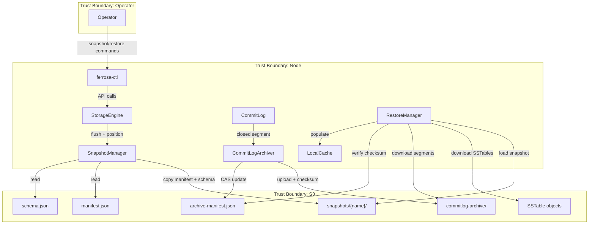

# Threat Model — PITR (Point-in-Time Restoration)

> Last updated: 2026-03-18
> Status: Draft

## Scope

STRIDE analysis of the PITR subsystem: commit log archiving, snapshot management, and point-in-time restoration. Covers S3 interactions, data integrity, and operational security.

## Data Flow Diagram

## Trust Boundaries

| ID | Boundary | Description |
|----|----------|-------------|
| TB1 | Node ↔ S3 | All S3 operations over TLS. IAM or access key authentication. |
| TB2 | Operator ↔ Node | CLI commands over CQL or local socket. Auth required. |
| TB3 | Archived data at rest | Commit log segments contain raw mutations (potentially sensitive data). |

## Threat Inventory

### T1: Snapshot Manifest Tampering (Tampering)

**Target**: `snapshots/{name}/manifest.json` in S3

**Attack**: Attacker with S3 write access modifies a snapshot manifest to reference different SSTables, causing restore to load wrong data.

**Likelihood**: Low (requires S3 credentials)
**Impact**: Critical (silent data corruption on restore)

**Mitigation**:

1. Snapshot `metadata.json` stores SHA-256 of the manifest at creation time
1. Restore verifies manifest checksum before using it
1. S3 bucket policy: restrict write access to the ferrosa service role

**Risk**: Low x Critical = **High**

### T2: Archived Segment Corruption (Tampering)

**Target**: `commitlog-archive/commitlog-{id}.log` in S3

**Attack**: Bit rot, S3 storage error, or attacker modifies archived segment.

**Likelihood**: Very Low (S3 has 11-nines durability + checksums)
**Impact**: High (replayed mutations are wrong; silent data corruption)

**Mitigation**:

1. SHA-256 checksum computed on upload, stored in `archive-manifest.json`
1. Checksum verified on download before replay
1. Checksum mismatch is a fatal restore error (not silently ignored)

**Risk**: Very Low x High = **Medium**

### T3: Incomplete Archive (Denial of Service)

**Target**: Commit log archiver availability

**Attack**: Archiver falls behind (slow S3, backpressure, crash) creating gaps in the archive. PITR restore fails or is incomplete.

**Likelihood**: Medium (operational — S3 throttling, network issues)
**Impact**: High (cannot restore to arbitrary point in time)

**Mitigation**:

1. Monitor archive lag: alert if unarchived segment count exceeds threshold
1. Archiver retries with exponential backoff on S3 errors
1. Local segments are NOT deleted until archiving confirmed (double-buffered)
1. `archive-manifest.json` tracks `oldest_segment_id` / `newest_segment_id` for gap detection
1. Restore validates segment continuity before replay

**Risk**: Medium x High = **High**

### T4: Unauthorized Snapshot Creation (Elevation of Privilege)

**Target**: Snapshot creation API

**Attack**: Unprivileged user creates snapshots, consuming S3 storage, or creates named snapshots that conflict with operational ones.

**Likelihood**: Low (requires CQL access)
**Impact**: Low (storage cost; no data access)

**Mitigation**:

1. Snapshot creation requires `SUPERUSER` or new `BACKUP` permission
1. Snapshot names are validated (alphanumeric + hyphens, max 128 chars)
1. Rate limit: max 1 snapshot per minute per node

**Risk**: Low x Low = **Low**

### T5: Sensitive Data in Archived Segments (Information Disclosure)

**Target**: `commitlog-archive/` in S3

**Attack**: Archived commit log segments contain raw mutation data. If the S3 bucket is misconfigured (public access, overly broad IAM), data is exposed.

**Likelihood**: Low (same risk as SSTable objects already in S3)
**Impact**: Critical (full data exposure)

**Mitigation**:

1. S3 server-side encryption (SSE-S3 or SSE-KMS) for all objects — already required by ADR-010 production mode
1. Bucket policy: block public access, restrict to service role
1. Archived segments use the same S3 prefix/bucket as SSTables (no additional attack surface)
1. Consider client-side encryption for commit log segments (future enhancement)

**Risk**: Low x Critical = **High**

### T6: Restore Replays Malicious Mutations (Tampering)

**Target**: Restore replay path

**Attack**: If an attacker injected mutations into the commit log before archiving, those mutations are faithfully replayed during restore.

**Likelihood**: Very Low (requires node compromise before archiving)
**Impact**: High (persistent data corruption)

**Mitigation**:

1. Commit log entries are CRC32-checksummed — replay validates checksums
1. Mutations include table/keyspace metadata — the restore path validates against the schema snapshot
1. This is an accepted risk: if the node was compromised at write time, the archive reflects the compromise (same as any backup system)

**Risk**: Very Low x High = **Medium** (accepted)

### T7: Snapshot Deletion Causes SSTable Orphaning (Repudiation)

**Target**: SSTable garbage collection

**Attack**: Snapshot is deleted, then its SSTables are garbage collected. Later, another snapshot that transitively referenced those SSTables (via shared compaction lineage) becomes unrestorable.

**Likelihood**: Medium (operational — multi-snapshot lifecycle)
**Impact**: High (permanent data loss)

**Mitigation**:

1. GC sweep must check ALL snapshot manifests, not just the live manifest
1. SSTables are only eligible for GC when referenced by zero manifests (live + all snapshots)
1. Snapshot deletion is a metadata operation only — never deletes SSTable objects directly
1. Consider reference counting on SSTable objects (future enhancement)

**Risk**: Medium x High = **High**

### T8: Restore on Wrong Node (Spoofing)

**Target**: Restore path

**Attack**: Operator accidentally restores a snapshot from node-A onto node-B, mixing token ranges and data ownership.

**Likelihood**: Low (operator error)
**Impact**: Critical (data corruption, split-brain)

**Mitigation**:

1. Snapshot `metadata.json` records `node_id` — restore warns if node_id doesn't match
1. Restore requires explicit `--force` flag to restore a foreign node's snapshot
1. Token range validation: restored manifest's token ranges must match the node's assigned range

**Risk**: Low x Critical = **High**

### T9: Archive Manifest CAS Race (Tampering)

**Target**: `archive-manifest.json` CAS updates

**Attack**: Two archivers (misconfiguration or split-brain) race to update the archive manifest, causing one segment to be dropped from the index.

**Likelihood**: Low (single archiver per node by design)
**Impact**: Medium (gap in archive index; segment still exists in S3 but isn't indexed)

**Mitigation**:

1. CAS with retry (same pattern as main manifest)
1. Restore can scan S3 prefix for segments not in the archive manifest (fallback)
1. Startup assertion: only one archiver per node

**Risk**: Low x Medium = **Medium**

## Risk Summary

| ID | Threat | Category | Risk Rating |
|----|--------|----------|-------------|
| T1 | Snapshot manifest tampering | Tampering | **High** |
| T2 | Archived segment corruption | Tampering | Medium |
| T3 | Incomplete archive (lag) | DoS | **High** |
| T4 | Unauthorized snapshot creation | EoP | Low |
| T5 | Sensitive data in archive | Info Disclosure | **High** |
| T6 | Replay of malicious mutations | Tampering | Medium (accepted) |
| T7 | Snapshot deletion causes orphaning | Repudiation | **High** |
| T8 | Restore on wrong node | Spoofing | **High** |
| T9 | Archive manifest CAS race | Tampering | Medium |

## Mitigation Priority

1. **SHA-256 checksums** on snapshot manifests and archived segments (T1, T2)
1. **SSTable GC must check all snapshots** before deleting (T7)
1. **Archive lag monitoring** with alerts (T3)
1. **Node-id validation** on restore (T8)
1. **S3 encryption + bucket policy** for archived segments (T5)
1. **BACKUP permission** for snapshot operations (T4)

## Related Specs

- [PITR](pitr.md) — architecture spec
- [ADR-011](decisions/011-s3-native-pitr.md) — design decision
- [Threat Model](threat-model.md) — system-wide threat model
- [ADR-010](decisions/010-production-mode.md) — production mode encryption requirements
