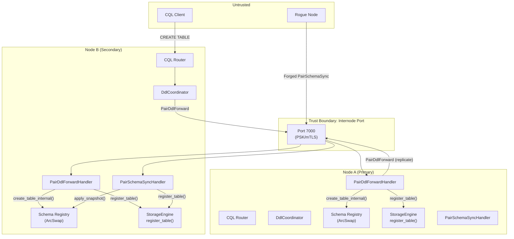

# Threat Model — Schema Replication (Pair Mode)

> **Date:** 2026-03-14
> **Scope:** New attack surface introduced by schema replication (PairSchemaSync, PairDdlForward)
> **Methodology:** STRIDE per element
> **Design Spec:** `superpowers/specs/2026-03-14-schema-replication-design.md`
> **Parent Threat Model:** `specs/threat-model-net-cluster.md` (T1-T20)

## System Overview

Schema replication adds three new internode message types and several internal
methods that bypass auth checks. The new components:

- **PairSchemaSync** — full `SchemaSnapshot` transfer during catch-up (Bulk lane)
- **PairDdlForward** — live DDL forwarding between pair nodes (Data lane)
- **PairDdlAck** — DDL acknowledgment (Data lane)
- **`Schema::apply_snapshot()`** — bulk schema import bypassing auth/audit
- **`Schema::*_internal()` methods** — auth-free DDL for replication
- **`DdlCoordinator`** — routes DDL through primary (like `PairCoordinator`)
- **`DdlPath`** — enum dispatch for DDL routing (Direct/Pair/Unavailable)

## Data Flow Diagram

## Assets

| # | Asset | Type | Impact if Compromised |
|---|-------|------|----------------------|
| A1 | Schema state (keyspaces, tables, columns) | Integrity | Wrong schema → data corruption, query failures |
| A2 | Auth-bypass internal methods | Integrity | Unauthorized DDL bypassing RBAC |
| A3 | Schema snapshot in transit | Confidentiality | Reveals full schema structure (table names, column types) |
| A4 | DDL operations in transit | Integrity | Tampered DDL could create backdoor tables or drop production data |
| A5 | Storage engine table registry | Integrity | Unregistered tables → writes silently dropped; extra tables → resource waste |
| A6 | Role/grant data in snapshot | Confidentiality | Reveals usernames, hashed passwords, permission grants |

## Trust Boundaries

| # | Boundary | From | To |
|---|----------|------|----|
| TB1 | Peer → Schema Sync | Internode (authenticated peer) | `Schema::apply_snapshot()` |
| TB2 | Peer → DDL Forward | Internode (authenticated peer) | `Schema::*_internal()` + `StorageEngine` |
| TB3 | CQL Router → DdlCoordinator | Auth-checked CQL context | Coordinator dispatch |

---

## Threat Inventory

### TB1: Schema Snapshot Sync

### T21: Malicious Schema Snapshot Injection

| Field | Value |
|-------|-------|
| **STRIDE** | Tampering |
| **Component** | `PairSchemaSyncHandler`, `Schema::apply_snapshot()` |
| **Threat** | A compromised or spoofed peer sends a `PairSchemaSync` message containing a tampered `SchemaSnapshot`: (a) Adds tables with permissive column definitions to enable data exfiltration. (b) Removes tables to cause data loss (writes to missing tables silently dropped). (c) Injects a superuser role with a known password hash. (d) Overwrites the entire schema, replacing production tables with attacker-controlled ones. |
| **Likelihood** | 1 — Requires mTLS bypass + peer identity spoofing |
| **Impact** | 3 — Full schema control, potential data loss, backdoor access |
| **Risk** | **3 (Medium)** |
| **Mitigation** | (1) `PairSchemaSync` only accepted during pair formation (not at arbitrary times). Handler rejects messages when already in stable pair mode. (2) mTLS authenticates the peer. (3) `apply_snapshot()` validates snapshot: rejects empty keyspace/table names, rejects system keyspace modifications, checks table column definitions for sanity. (4) Log the full snapshot diff (what changed) for audit. |
| **Status** | Must implement — validation in `apply_snapshot()` |

### T22: Schema Snapshot Leaks Role Credentials

| Field | Value |
|-------|-------|
| **STRIDE** | Information Disclosure |
| **Component** | `PairSchemaSync`, `SchemaSnapshot` serialization |
| **Threat** | `SchemaSnapshot` includes the `roles` HashMap containing hashed passwords (bcrypt/argon2). An attacker intercepting the `PairSchemaSync` message (if TLS not enabled) obtains all hashed passwords for offline cracking. |
| **Likelihood** | 2 — Requires network access to internode traffic (same as T2 in parent model) |
| **Impact** | 2 — Offline password cracking, potential account takeover |
| **Risk** | **4 (High)** |
| **Mitigation** | (1) TLS on internode connections (Phase 2). (2) Argon2 (default hasher) is designed to resist offline cracking. (3) Consider stripping role password hashes from snapshot and syncing roles separately via a dedicated auth-sync mechanism. (4) In Phase 1 (no TLS), PSK authentication limits who can connect, but traffic is still plaintext. |
| **Status** | Partially mitigated — strong hashing helps; TLS (Phase 2) fully mitigates |

### T23: Schema Snapshot Size as DoS Vector

| Field | Value |
|-------|-------|
| **STRIDE** | Denial of Service |
| **Component** | `PairSchemaSyncHandler` |
| **Threat** | Attacker sends an extremely large `PairSchemaSync` body (up to 256 MiB frame limit). The secondary deserializes the entire JSON payload into memory, potentially causing OOM on a resource-constrained node. |
| **Likelihood** | 1 — Requires mTLS bypass |
| **Impact** | 2 — OOM crash on the secondary |
| **Risk** | **2 (Medium)** |
| **Mitigation** | (1) The existing 256 MiB frame body limit applies. (2) Add a schema-specific size limit (e.g., 16 MiB) — any real schema should be well under this. (3) `serde_json::from_slice` with a bounded reader to limit deserialization memory. |
| **Status** | Mitigated by frame limit; add schema-specific limit |

---

### TB2: Live DDL Forwarding

### T24: DDL Injection via Forged PairDdlForward

| Field | Value |
|-------|-------|
| **STRIDE** | Tampering, Elevation of Privilege |
| **Component** | `PairDdlForwardHandler` |
| **Threat** | A compromised peer sends crafted `PairDdlForward` messages to execute unauthorized DDL: (a) `CreateTable` with attacker-controlled column definitions. (b) `DropTable` to destroy production data. (c) `DropKeyspace` to wipe entire keyspaces. These bypass CQL auth because `*_internal()` methods don't check permissions. |
| **Likelihood** | 1 — Requires compromised cluster node (same trust model as T8 in parent) |
| **Impact** | 3 — Unauthorized schema manipulation, data loss |
| **Risk** | **3 (Medium)** |
| **Mitigation** | (1) mTLS ensures only legitimate cluster members can send `PairDdlForward`. (2) This is the same trust model as write forwarding (T8 in parent threat model) — replicas trust peers for forwarded operations. (3) Audit logging: log all DDL applied via internal methods with source peer_id. (4) Accept this risk (standard distributed DB pattern). |
| **Status** | Accepted — same trust model as write forwarding |

### T25: DDL Deserialization Exploits

| Field | Value |
|-------|-------|
| **STRIDE** | Tampering, Denial of Service |
| **Component** | `DdlOperation` serde deserialization |
| **Threat** | Malformed `PairDdlForward` body causes: (a) Panic during `serde_json::from_slice()` on malformed JSON. (b) Deeply nested JSON causing stack overflow. (c) Extremely long strings in keyspace/table names consuming memory. |
| **Likelihood** | 1 — Requires network access + PSK/mTLS bypass |
| **Impact** | 2 — Node crash or hang |
| **Risk** | **2 (Medium)** |
| **Mitigation** | (1) Deserialization returns `Result`, never panics — handle errors gracefully. (2) Validate keyspace/table name lengths (max 48 chars, matching Cassandra). (3) Validate column count (max 1000 per table). (4) Proptest fuzz `DdlOperation` deserialization. |
| **Status** | Must implement — input validation + proptest |

### T26: DDL Forwarding Loop

| Field | Value |
|-------|-------|
| **STRIDE** | Denial of Service |
| **Component** | `PairDdlForwardHandler`, `DdlCoordinator` |
| **Threat** | If both nodes believe they are primary (split brain), a DDL forward from A to B could trigger B to "replicate" back to A, which replicates back to B — infinite loop exhausting CPU and network. |
| **Likelihood** | 1 — Requires split brain (T11 in parent model, mitigated by manual promotion) |
| **Impact** | 2 — Resource exhaustion on both nodes |
| **Risk** | **2 (Medium)** |
| **Mitigation** | (1) Role-based dispatch: handler checks role before replicating. Secondary never replicates, only applies locally. (2) Add a `forwarded: bool` flag to `PairDdlForward` — if true, handler applies locally without re-forwarding. (3) Split brain prevention (T11 mitigations) is the primary defense. |
| **Status** | Mitigated by role-based dispatch; add `forwarded` flag as defense-in-depth |

---

### TB3: Auth Bypass Methods

### T27: Internal Methods Exposed Beyond Replication

| Field | Value |
|-------|-------|
| **STRIDE** | Elevation of Privilege |
| **Component** | `Schema::create_table_internal()`, `Schema::apply_snapshot()` |
| **Threat** | The `*_internal()` methods bypass all auth checks. If accidentally called from a CQL code path (instead of the auth-checked public methods), any CQL user could execute DDL without permissions. |
| **Likelihood** | 1 — Requires a code bug routing CQL through internal methods |
| **Impact** | 3 — Full DDL without authentication |
| **Risk** | **3 (Medium)** |
| **Mitigation** | (1) `*_internal()` methods are `pub(crate)` — only accessible within ferrosa-schema. ferrosa-cluster calls them via `Schema::apply_snapshot()` which is the only public entry point. (2) Code review: CQL router must never import or call `*_internal()` methods. (3) The `DdlCoordinator` in ferrosa-cluster calls the public auth-checked methods locally, and only the RPC handler calls `*_internal()`. (4) Consider a marker type (`ReplicationContext`) required by internal methods to prevent accidental misuse. |
| **Status** | Must implement — `pub(crate)` visibility + review |

### T28: Schema Divergence After Partial DDL Apply

| Field | Value |
|-------|-------|
| **STRIDE** | Integrity |
| **Component** | `DdlCoordinator`, `PairDdlForwardHandler` |
| **Threat** | Primary applies DDL locally (succeeds), then forwards to secondary (fails — network timeout, secondary crash). Now primary has the table but secondary doesn't. Subsequent writes to the table succeed on primary but fail on secondary (unregistered table). CQL client sees intermittent errors depending on which node coordinates. |
| **Likelihood** | 2 — Network issues and node crashes are realistic |
| **Impact** | 2 — Inconsistent schema, intermittent write failures |
| **Risk** | **4 (High)** |
| **Mitigation** | (1) Snapshot-based catch-up on rejoin will reconcile schema. (2) DDL forwarding timeout returns an error to the CQL client — client knows DDL may not have fully propagated. (3) Idempotent `*_internal()` methods allow safe DDL retry. (4) Status endpoint should expose per-node schema version for operator visibility. |
| **Status** | Mitigated by catch-up reconciliation + idempotency |

---

## Risk Summary

### High (Risk 4-6)

| ID | Threat | Risk | Mitigation |
|----|--------|------|------------|
| T22 | Schema snapshot leaks hashed passwords | 4 | TLS (Phase 2), strong hashing (argon2) |
| T28 | Schema divergence after partial DDL apply | 4 | Catch-up reconciliation, idempotent methods, client error |

### Medium (Risk 2-3)

| ID | Threat | Risk | Status |
|----|--------|------|--------|
| T21 | Malicious schema snapshot injection | 3 | Validate snapshot, restrict timing, audit log |
| T24 | DDL injection via forged PairDdlForward | 3 | Accepted — same trust model as write forwarding |
| T25 | DDL deserialization exploits | 2 | Input validation, proptest fuzz |
| T26 | DDL forwarding loop | 2 | Role-based dispatch, `forwarded` flag |
| T27 | Internal methods exposed beyond replication | 3 | `pub(crate)` visibility, code review |
| T23 | Schema snapshot size as DoS | 2 | Frame limit + schema-specific limit |

---

## Mitigations to Implement

### With Schema Replication (This Release)

| Mitigation | Threats | Effort |
|-----------|---------|--------|
| `*_internal()` methods are `pub(crate)` | T27 | Small |
| `apply_snapshot()` validates names, rejects system keyspaces | T21 | Small |
| Role-based dispatch in `PairDdlForwardHandler` | T26 | Small |
| Validate keyspace/table name lengths (max 48 chars) | T25 | Small |
| Validate column count (max 1000 per table) | T25 | Small |
| Proptest fuzz `DdlOperation` deserialization | T25 | Medium |
| `PairSchemaSync` only accepted during pair formation | T21 | Small |
| Audit log all DDL applied via internal methods | T21, T24 | Small |
| Idempotent `*_internal()` methods | T28 | Small |
| Schema-specific size limit on snapshot (16 MiB) | T23 | Small |

### Phase 2 (TLS)

| Mitigation | Threats | Effort |
|-----------|---------|--------|
| TLS on internode — encrypts schema snapshot in transit | T22 | Medium |
| Consider stripping password hashes from snapshot | T22 | Medium |

## Assumptions

1. Pair mode peers are authenticated via PSK (Phase 1) or mTLS (Phase 2)
1. Internal methods are only accessible from within `ferrosa-schema` crate
1. `SchemaSnapshot` serialization via serde_json does not panic on valid input
1. Split brain is prevented by manual-only promotion (T11 in parent model)
1. The existing 256 MiB frame body limit provides an outer bound on all messages

## Open Questions

- [ ] Should password hashes be stripped from `SchemaSnapshot` before transmission?
- [ ] Should `DdlOperation` include an origin timestamp for conflict resolution?
- [ ] Should there be a schema version mismatch alert in the status endpoint?
