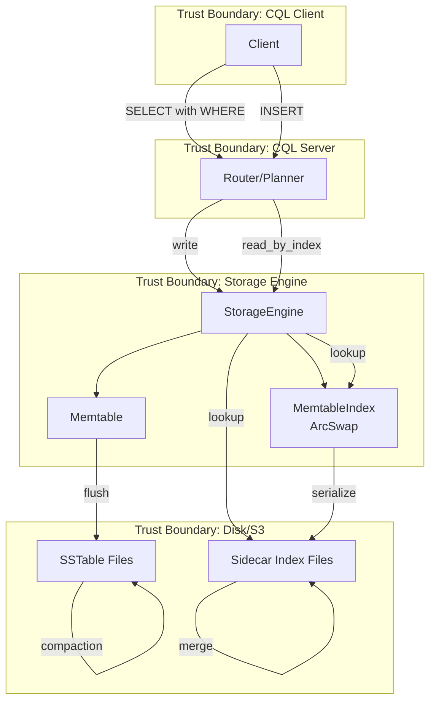

# Threat Model: Secondary Index Pipeline

> Last updated: 2026-03-18
> Status: Draft
> Scope: Secondary index write path, build path, query path, sidecar persistence

## Data Flow Diagram

## STRIDE Analysis

### T1: Tampering — Sidecar Index File Corruption

| | |
|---|---|
| **Threat** | Corrupted sidecar index file returns wrong `RowPosition` values, causing queries to return incorrect rows or miss rows |
| **Component** | Sidecar index files on disk/S3 |
| **Likelihood** | Medium (disk corruption, S3 eventual consistency, partial writes) |
| **Impact** | High (silent wrong results — user gets wrong data) |
| **Risk** | High |
| **Mitigation** | M1: CRC32 checksum in sidecar header, validated on open. M2: After index lookup, verify the fetched row actually matches the indexed column value (post-fetch validation). M3: Sidecar files are rebuildable from SSTable data. |

### T2: Denial of Service — Unbounded Index Lookup Results

| | |
|---|---|
| **Threat** | A low-selectivity index (e.g., boolean column) returns millions of `RowPosition` entries, causing OOM during result materialization |
| **Component** | `StorageEngine::read_by_index()`, `IndexReader::lookup()` |
| **Likelihood** | High (users commonly index low-cardinality columns) |
| **Impact** | High (OOM crash, same class as the P0 bug we just fixed) |
| **Risk** | Critical |
| **Mitigation** | M4: Cap `read_by_index` results at a configurable limit (default 10,000 `RowPosition` entries). Return error if exceeded, suggesting ALLOW FILTERING or a more selective query. M5: Streaming iterator instead of collecting all positions into a `Vec`. |

### T3: Information Disclosure — Index Reveals Column Values

| | |
|---|---|
| **Threat** | Sidecar index files store indexed column values in sorted order, making them a plaintext index of potentially sensitive data (SSN, email, etc.) |
| **Component** | Sidecar index files on disk |
| **Likelihood** | Low (requires disk access) |
| **Impact** | Medium (data exposure, but requires storage-level access) |
| **Risk** | Low |
| **Mitigation** | M6: Document that secondary indexes store column values in plaintext. Encryption-at-rest (S3 SSE, dm-crypt) covers this at the storage layer. No application-level encryption of index keys in v1. |

### T4: Denial of Service — Write Amplification from Many Indexes

| | |
|---|---|
| **Threat** | A table with N secondary indexes requires N memtable index inserts per write plus N sidecar files per flush, amplifying I/O and memory |
| **Component** | Write path integration, flush path |
| **Likelihood** | Medium (users may create many indexes without understanding cost) |
| **Impact** | Medium (degraded write throughput, increased memory) |
| **Risk** | Medium |
| **Mitigation** | M7: Limit max secondary indexes per table (e.g., 8). M8: Log warnings when a table has more than 3 indexes. M9: Track per-index write latency in the virtual table. |

### T5: Tampering — Stale Index After Crash

| | |
|---|---|
| **Threat** | If the process crashes after flushing an SSTable but before writing its sidecar, the index is stale (missing entries). Queries using the index would miss rows. |
| **Component** | Flush path, crash recovery |
| **Likelihood** | Medium (crashes happen in production) |
| **Impact** | High (silent data loss from query perspective) |
| **Risk** | High |
| **Mitigation** | M10: On startup, scan SSTables without matching sidecar files and rebuild their indexes. M11: The `IndexStateTracker` already tracks this — SSTables without indexed status go to pending queue. M12: Query path should fall back to full scan for SSTables without sidecar indexes (never silently skip data). |

### T6: Spoofing — Malicious IndexKey in Query

| | |
|---|---|
| **Threat** | A crafted WHERE clause value produces an `IndexKey` that triggers pathological behavior in the index lookup (e.g., very large key causing allocation, or key that exploits binary search edge cases) |
| **Component** | Query planner, `IndexKey` construction |
| **Likelihood** | Low |
| **Impact** | Medium (DoS via large allocation) |
| **Risk** | Low |
| **Mitigation** | M13: Bound `IndexKey` size to max CQL column value size (64KB). Reject keys exceeding the limit before index lookup. |

## Risk Summary

| ID | Threat | Risk | Mitigations |
|----|--------|------|-------------|
| T1 | Sidecar corruption → wrong results | High | M1 (checksum), M2 (post-fetch validation), M3 (rebuildable) |
| T2 | Low-selectivity index → OOM | Critical | M4 (result cap), M5 (streaming iterator) |
| T3 | Index reveals column values | Low | M6 (document, rely on storage encryption) |
| T4 | Write amplification from many indexes | Medium | M7 (limit per table), M8 (warnings), M9 (metrics) |
| T5 | Stale index after crash | High | M10 (rebuild on startup), M11 (tracker), M12 (fallback to scan) |
| T6 | Malicious IndexKey | Low | M13 (size bound) |
