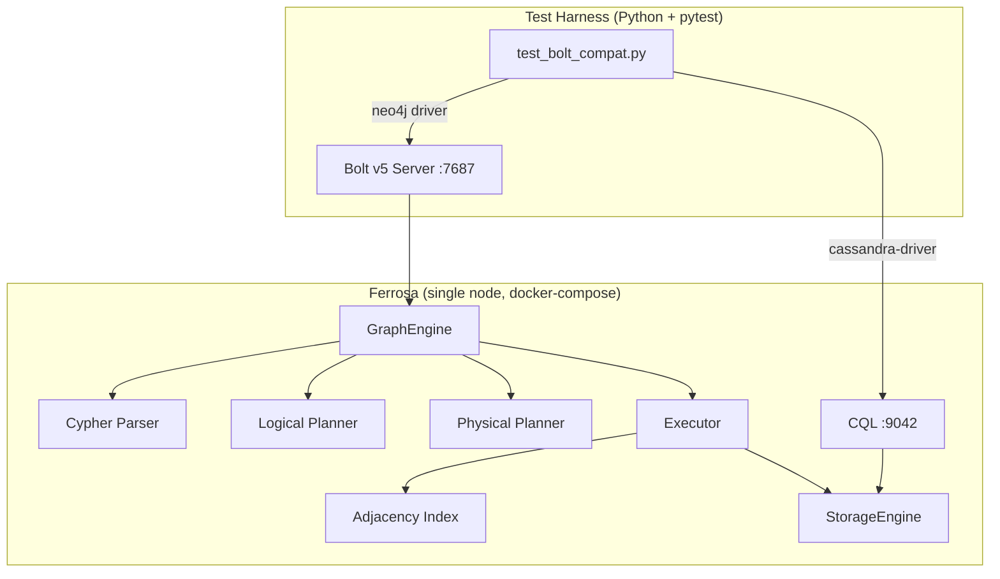

# Bolt & Cypher Wire Compatibility Testing

> Last updated: 2026-04-05
> Status: Draft

## Overview

End-to-end compatibility testing of ferrosa's Bolt v5 server and Cypher engine using the official Neo4j Python driver (`neo4j>=5.0`). Validates wire protocol correctness, Cypher query compatibility, data type fidelity, and index-assisted traversal — not load/performance.

## Architecture



The test harness uses **two connections**:
1. **CQL** (cassandra-driver) — schema DDL, seed data, verify storage state
2. **Bolt** (neo4j driver) — execute Cypher queries, validate results

CQL is used for setup because Cypher CREATE relies on pre-existing CQL table schemas with graph extensions. The Bolt connection is the system under test.

## Test Categories

### Category 1: Bolt Protocol Wire Compatibility

Tests that the Bolt v5 handshake, message framing, and connection lifecycle work correctly with the official Neo4j driver.

| Test | What It Validates |
|------|------------------|
| `test_bolt_connect_and_hello` | Driver can establish TCP, complete handshake, send HELLO, receive SUCCESS |
| `test_bolt_auth_valid_credentials` | Authentication with correct username/password succeeds |
| `test_bolt_auth_invalid_credentials` | Authentication with wrong password returns proper FAILURE |
| `test_bolt_run_pull_cycle` | RUN + PULL returns result records correctly |
| `test_bolt_reset_clears_state` | RESET returns connection to clean state after error |
| `test_bolt_multiple_queries_sequential` | Multiple RUN/PULL cycles on same connection |
| `test_bolt_connection_reuse` | Connection can be reused for many queries without degradation |
| `test_bolt_graceful_close` | Connection closes cleanly (GOODBYE) |

### Category 2: Cypher Query Compatibility

Tests that Cypher queries produce correct results with correct types.

| Test | Cypher Feature | Index Requirement |
|------|---------------|-------------------|
| `test_match_all_vertices` | `MATCH (n:Label) RETURN n` | Label scan via adjacency |
| `test_match_with_property_filter` | `MATCH (n:Person) WHERE n.age > 30 RETURN n.name` | Property filter |
| `test_match_with_relationship` | `MATCH (a:Person)-[:KNOWS]->(b:Person) RETURN a.name, b.name` | Adjacency index OUT traversal |
| `test_match_reverse_relationship` | `MATCH (a:Person)<-[:KNOWS]-(b:Person) RETURN a.name, b.name` | Adjacency index IN traversal |
| `test_match_bidirectional` | `MATCH (a:Person)-[:KNOWS]-(b:Person) RETURN a.name, b.name` | Adjacency index BOTH |
| `test_match_multi_hop` | `MATCH (a)-[:KNOWS]->(b)-[:WORKS_AT]->(c) RETURN ...` | Multi-hop adjacency |
| `test_match_variable_length_path` | `MATCH (a)-[:KNOWS*1..3]->(b) RETURN ...` | BFS with adjacency index + visited set |
| `test_create_vertex` | `CREATE (n:Person {name: 'Test'})` | Write path |
| `test_create_and_read_back` | CREATE then MATCH the same node | Write + read consistency |
| `test_set_property` | `MATCH (n:Person) WHERE n.name = 'Alice' SET n.age = 35` | Read-modify-write |
| `test_delete_vertex` | `MATCH (n:Person) WHERE n.name = 'Test' DELETE n` | Delete path |
| `test_detach_delete` | `MATCH (n:Person) WHERE n.name = 'Test' DETACH DELETE n` | Cascade delete |
| `test_return_distinct` | `MATCH ... RETURN DISTINCT n.name` | Deduplication |
| `test_order_by_asc_desc` | `MATCH ... RETURN ... ORDER BY n.age ASC` | Sorting |
| `test_limit` | `MATCH ... RETURN ... LIMIT 5` | Result truncation |
| `test_where_and_or_not` | Boolean combinations in WHERE | Expression evaluation |
| `test_where_is_null` | `WHERE n.email IS NULL` | NULL handling |
| `test_where_is_not_null` | `WHERE n.email IS NOT NULL` | NULL handling |

### Category 3: Data Type Fidelity

Tests that Bolt PackStream types round-trip correctly between the Neo4j driver and ferrosa.

| Test | Type | Driver Side | Wire Format |
|------|------|-------------|------------|
| `test_type_integer` | Integer | Python `int` | PackStream Int64 |
| `test_type_float` | Float | Python `float` | PackStream Float64 |
| `test_type_string` | String | Python `str` | PackStream String |
| `test_type_boolean` | Boolean | Python `bool` | PackStream True/False |
| `test_type_null` | Null | Python `None` | PackStream Null |
| `test_type_list` | List | Python `list` (via collect()) | PackStream List |
| `test_type_large_string` | Large string (>255 bytes) | Python `str` | PackStream String16/32 |
| `test_type_negative_integer` | Negative int | Python `int` | PackStream Int with sign |
| `test_type_zero` | Zero | Python `0` | PackStream TinyInt |

### Category 4: Aggregation

| Test | Function | What It Validates |
|------|----------|------------------|
| `test_count_star` | `count(*)` | Row count |
| `test_count_property` | `count(n.name)` | Non-null count |
| `test_sum` | `sum(n.age)` | Numeric sum |
| `test_avg` | `avg(n.age)` | Numeric average |
| `test_min_max` | `min(n.age)`, `max(n.age)` | Extremes |
| `test_collect` | `collect(n.name)` | Aggregation to list |
| `test_group_by` | `RETURN n.city, count(*)` | Grouped aggregation |

### Category 5: Error Handling

| Test | What It Validates |
|------|------------------|
| `test_error_syntax_error` | Malformed Cypher returns proper error code and message |
| `test_error_unknown_label` | `MATCH (n:NonExistent)` returns empty result (not error) |
| `test_error_unknown_function` | `RETURN foo()` returns error at plan time |
| `test_error_division_by_zero` | `RETURN 1/0` returns null (FMEA F8) |
| `test_error_type_mismatch_where` | `WHERE n.name > 42` handles gracefully (FMEA F1) |

### Category 6: Index Verification

These tests verify that graph traversals actually use the adjacency index (not full table scans). Use EXPLAIN or query statistics to confirm.

| Test | What It Validates |
|------|------------------|
| `test_index_single_hop_uses_adjacency` | 1-hop MATCH reads from adjacency index, not full edge table scan |
| `test_index_multi_hop_uses_adjacency` | Multi-hop MATCH chains adjacency lookups |
| `test_index_var_length_uses_adjacency` | Variable-length path uses adjacency for BFS frontier |
| `test_index_reverse_traversal_uses_adjacency` | `<-` direction uses IN entries in adjacency |
| `test_index_bidirectional_uses_adjacency` | `-` (both) direction reads both OUT and IN |

## Test Data Schema

```sql
-- Vertex tables
CREATE TABLE social.person_v (
    id TEXT PRIMARY KEY,
    name TEXT,
    age INT,
    city TEXT,
    email TEXT
) WITH extensions = {
    'graph.type': 'vertex',
    'graph.label': 'Person'
};

CREATE TABLE social.company_v (
    id TEXT PRIMARY KEY,
    name TEXT,
    founded INT
) WITH extensions = {
    'graph.type': 'vertex',
    'graph.label': 'Company'
};

-- Edge tables
CREATE TABLE social.knows_e (
    src_id TEXT,
    tgt_id TEXT,
    since_year INT,
    PRIMARY KEY (src_id, tgt_id)
) WITH extensions = {
    'graph.type': 'edge',
    'graph.label': 'KNOWS',
    'graph.source': 'src_id',
    'graph.target': 'tgt_id'
};

CREATE TABLE social.works_at_e (
    src_id TEXT,
    tgt_id TEXT,
    role TEXT,
    PRIMARY KEY (src_id, tgt_id)
) WITH extensions = {
    'graph.type': 'edge',
    'graph.label': 'WORKS_AT',
    'graph.source': 'src_id',
    'graph.target': 'tgt_id'
};
```

## Seed Data

```
Person vertices: Alice(30, NYC), Bob(25, SF), Carol(35, NYC),
                 Dave(28, LA), Eve(32, SF)

KNOWS edges: Alice→Bob, Alice→Carol, Bob→Carol, Carol→Dave, Dave→Eve
WORKS_AT edges: Alice→Acme, Bob→Acme, Carol→Globex, Dave→Globex

Company vertices: Acme(founded=2010), Globex(founded=2015)
```

This graph supports: single-hop, multi-hop (Alice→Bob→Carol), variable-length (Alice→*→Eve via 3 hops), reverse traversal, bidirectional, multi-label traversal (Person→WORKS_AT→Company), aggregation (count by city), and NULL handling (email is NULL for some).

## Infrastructure

Uses existing `tests/drivers/docker-compose.drivers.yml` with Bolt port 7687 exposed. Add `neo4j>=5.0` to `tests/drivers/python/requirements.txt`.

## FMEA Cross-Reference

| Test Category | FMEA Items Covered |
|--------------|-------------------|
| Wire protocol | F10 (malformed PackStream), F11 (version negotiation) |
| Traversal | F2 (cycle detection), F3 (fan-out budget) |
| Data types | F1 (type mismatch), F8 (division by zero), F9 (missing property) |
| Aggregation | F6 (collect size), F7 (group cardinality) |
| Error handling | F12 (nested expressions), F14 (unknown function) |
