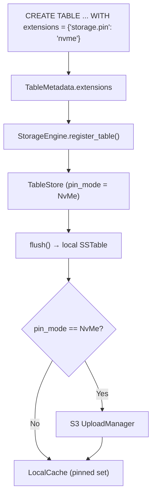

# NVMe Table Pinning — Architecture Spec

> Created: 2026-03-29
> Updated: 2026-03-30
> Status: Implemented — PinConfig, LocalCache pinned set, S3 skip on flush/compaction, max_bytes enforcement, ALTER TABLE pin/unpin, metrics
> Crate scope: ferrosa-storage (pin_config.rs, engine.rs, cache.rs, metrics.rs)

---

## Overview

Per-table attribute that pins a table's SSTables to local NVMe storage, bypassing S3 write-behind. Pinned tables are served entirely from local disk for sub-millisecond read latency. S3 upload is skipped; local cache eviction is suppressed.

Use case: hot lookup tables, session caches, materialized views that tolerate node-loss (rebuilt from source).

---

## Data Flow



---

## Design Decisions

### ADR-NVMe-01: Use table extensions, not TableParams

**Decision:** Store pinning config in `TableMetadata.extensions` (key-value strings), not as typed fields on `TableParams`.

**Rationale:**
- Extensions are already parsed by the CQL router and persisted to schema.json
- Timeseries consolidation uses this exact pattern (`consolidation.interval`, etc.)
- No schema migration needed — extensions are a generic HashMap
- Cassandra compatibility: standard `TableParams` fields map 1:1 to Cassandra; custom fields belong in extensions

**Keys:**
- `storage.pin` — `"nvme"` | `"none"` (default: `"none"`)
- `storage.pin_max_bytes` — optional size cap per table before eviction begins (default: unlimited)

### ADR-NVMe-02: Pinned tables skip S3 upload but still write commit log

**Decision:** Pinned tables write to commit log (durability within a node) and local SSTable files, but do NOT enqueue S3 upload tasks.

**Rationale:**
- The purpose of pinning is low-latency local reads — S3 adds latency and cost
- Commit log provides crash recovery within a single node
- If the node is lost, pinned data is lost — this is the explicit trade-off the user accepts
- Replication (pair mode / cluster mode) still works for HA if configured

**Consequence:** Pinned tables are NOT durable across node replacement. Document this clearly.

### ADR-NVMe-03: Pinned SSTables never evicted from LocalCache

**Decision:** When `storage.pin = "nvme"`, all SSTable IDs for that table are added to `LocalCache.pinned` set.

**Rationale:** `LocalCache.evict_if_needed()` already skips entries in the `pinned` HashSet. No new eviction logic needed.

---

## Components

### 1. Schema: Table Extensions Parsing

**File:** `ferrosa-storage/src/pin_config.rs` (new)

```rust
pub enum PinMode {
    None,   // Default: S3 write-behind, local cache with eviction
    NvMe,   // Local-only: skip S3, pin in cache, commit-log for crash recovery
}

pub struct PinConfig {
    pub mode: PinMode,
    pub max_bytes: Option<u64>,
}

impl PinConfig {
    pub fn from_extensions(ext: &HashMap<String, String>) -> Self {
        let mode = match ext.get("storage.pin").map(|s| s.as_str()) {
            Some("nvme") => PinMode::NvMe,
            _ => PinMode::None,
        };
        let max_bytes = ext.get("storage.pin_max_bytes")
            .and_then(|v| v.parse().ok());
        Self { mode, max_bytes }
    }

    pub fn is_pinned(&self) -> bool {
        matches!(self.mode, PinMode::NvMe)
    }
}
```

### 2. Storage Engine: Conditional S3 Upload

**File:** `ferrosa-storage/src/engine.rs`

In `sync_sstables_to_s3()` and `poll_compactions()`:
```rust
// Before enqueuing UploadTask:
let pin_config = PinConfig::from_extensions(&state.schema.extensions());
if pin_config.is_pinned() {
    // Register in local cache as pinned (never evicted)
    self.local_cache.pin(&sstable_id);
    continue; // Skip S3 upload
}
```

### 3. Local Cache: Pin/Unpin API

**File:** `ferrosa-storage/src/cache.rs`

Add methods:
```rust
pub fn pin(&mut self, id: &str) { self.pinned.insert(id.to_string()); }
pub fn unpin(&mut self, id: &str) { self.pinned.remove(id); }
pub fn pin_table_sstables(&mut self, table_id: &TableId, sstable_ids: &[String]) {
    for id in sstable_ids { self.pinned.insert(id.to_string()); }
}
```

### 4. CQL: ALTER TABLE Support

Allow toggling pin mode on existing tables:
```sql
ALTER TABLE ks.hot_cache WITH extensions = {'storage.pin': 'nvme'};
ALTER TABLE ks.hot_cache WITH extensions = {'storage.pin': 'none'};
```

When switching from `nvme` to `none`:
1. Unpin all SSTable IDs from local cache
2. Enqueue S3 upload for all existing SSTables
3. Resume normal write-behind for new flushes

When switching from `none` to `nvme`:
1. Pin all SSTable IDs in local cache
2. Cancel any pending S3 upload tasks (best-effort)
3. Skip S3 for all new flushes

---

## CQL Syntax

```sql
-- Create a pinned table
CREATE TABLE ks.session_cache (
    session_id uuid PRIMARY KEY,
    user_id uuid,
    data blob,
    last_access timestamp
) WITH extensions = {'storage.pin': 'nvme'};

-- Pin an existing table
ALTER TABLE ks.session_cache WITH extensions = {'storage.pin': 'nvme'};

-- Unpin (resume S3 write-behind)
ALTER TABLE ks.session_cache WITH extensions = {'storage.pin': 'none'};

-- Pin with size cap (evict oldest SSTables beyond 10 GB)
CREATE TABLE ks.hot_lookups (
    key text PRIMARY KEY,
    value blob
) WITH extensions = {'storage.pin': 'nvme', 'storage.pin_max_bytes': '10737418240'};
```

---

## Durability Guarantees

| Scenario | Pinned Table | Normal Table |
|----------|-------------|--------------|
| Process crash | Recovered from commit log | Recovered from commit log |
| Node reboot | Recovered from local SSTables + commit log | Recovered from S3 |
| Disk loss | **DATA LOST** (unless replicated) | Recovered from S3 |
| Node replacement | **DATA LOST** (unless replicated) | Recovered from S3 |

The trade-off is explicit: pinned tables trade durability for latency.

---

## Observability

- `ferrosa_storage_pinned_tables` gauge — count of tables with `storage.pin = nvme`
- `ferrosa_storage_pinned_bytes` gauge — total bytes in pinned SSTables
- `ferrosa_storage_pin_evictions_total` counter — evictions due to `pin_max_bytes` cap
- Log warning on startup if pinned table has no replication configured
