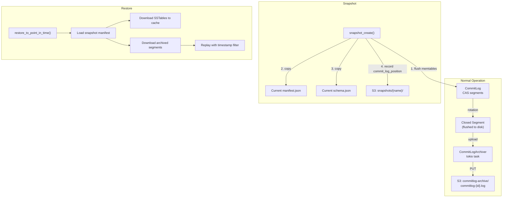
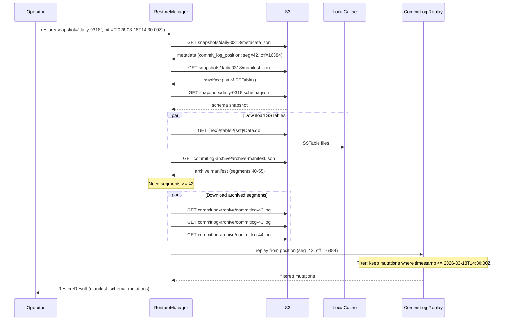

# Point-in-Time Restoration (PITR)

> Last updated: 2026-03-18
> Status: Draft

## Overview

PITR enables restoring a Ferrosa node to any point in time within a configurable retention window. The design adapts Cassandra's snapshot + commit log archiving model for Ferrosa's S3-native storage architecture.

Three core mechanisms compose PITR:

1. **Snapshots** — freeze the current manifest (SSTable inventory) + schema + commit log position
1. **Commit log archiving** — upload closed segments to S3 on rotation
1. **Restoration** — load a snapshot, download SSTables, replay archived segments with timestamp filtering

Because Ferrosa already stores SSTables in S3, snapshots are lightweight metadata operations (no file copying). The main new work is commit log S3 archiving and the restoration replay path.

## Architecture



## S3 Object Layout

```
{prefix}/
  manifest.json                            # live manifest (existing)
  schema.json                              # live schema (existing)
  {hex}/{table_id}/{sstable_id}/...        # SSTable data (existing)

  commitlog-archive/
    commitlog-{segment_id}.log             # archived commit log segments
    archive-manifest.json                  # index of archived segments

  snapshots/
    {snapshot_name}/
      manifest.json                        # frozen copy of live manifest
      schema.json                          # frozen copy of live schema
      metadata.json                        # snapshot metadata
```

### `metadata.json` (Snapshot)

```json
{
  "format_version": 1,
  "name": "daily-2026-03-18",
  "created_at": "2026-03-18T10:30:00Z",
  "expires_at": "2026-03-25T10:30:00Z",
  "commit_log_position": {
    "segment_id": 42,
    "offset": 16384
  },
  "node_id": "node-1",
  "ephemeral": false
}
```

### `archive-manifest.json` (Commit Log Archive)

```json
{
  "format_version": 1,
  "segments": [
    {
      "segment_id": 40,
      "size": 33554432,
      "archived_at": "2026-03-18T10:25:00Z",
      "min_timestamp": 1742294700000,
      "max_timestamp": 1742294730000,
      "checksum": "sha256:abcdef..."
    }
  ],
  "oldest_segment_id": 40,
  "newest_segment_id": 55,
  "retention_days": 7
}
```

## Components

### CommitLogArchiver

**Purpose**: Uploads closed commit log segments to S3 after rotation.

**Location**: `ferrosa-storage/src/commitlog/archiver.rs` (new)

**Lifecycle**: Runs as a tokio task alongside the `UploadManager`. Polls for closed segments on a configurable interval (default 5 seconds, per ADR-001).

```rust
pub struct CommitLogArchiver {
    store: Arc<dyn ObjectStore>,
    prefix: String,
    poll_interval: Duration,
    retention: Duration,
    stop: CancellationToken,
}

impl CommitLogArchiver {
    pub fn new(
        store: Arc<dyn ObjectStore>,
        prefix: String,
        config: ArchiveConfig,
        runtime: &Handle,
    ) -> Self;

    /// Called by CommitLog::force_rotate() after a segment is closed.
    /// Enqueues the segment for async upload.
    pub async fn archive_segment(&self, segment_path: PathBuf, segment_id: u64);

    /// Periodic cleanup: delete archived segments older than retention.
    pub async fn cleanup_expired(&self);

    /// Shuts down the archiver, flushing pending uploads.
    pub async fn shutdown(&self);
}
```

**Upload flow**:

1. `CommitLog::force_rotate()` notifies archiver of a closed segment
1. Archiver reads the segment file from local disk
1. Computes SHA-256 checksum
1. Uploads to `{prefix}/commitlog-archive/commitlog-{segment_id}.log`
1. Updates `archive-manifest.json` with segment metadata (CAS with retry)
1. On success, marks segment as archived (does NOT delete local file — that's still managed by `discard_completed()`)

**Dependencies**: `object_store`, `tokio`, `sha2`

### SnapshotManager

**Purpose**: Creates and lists snapshots. A snapshot is a consistent point-in-time marker, not a data copy.

**Location**: `ferrosa-storage/src/snapshot.rs` (new)

```rust
pub struct SnapshotManager {
    store: Arc<dyn ObjectStore>,
    prefix: String,
}

pub struct SnapshotMetadata {
    pub format_version: u32,
    pub name: String,
    pub created_at: String,
    pub expires_at: Option<String>,
    pub commit_log_position: CommitLogPosition,
    pub node_id: String,
    pub ephemeral: bool,
}

impl SnapshotManager {
    /// Creates a snapshot:
    /// 1. Flush all memtables
    /// 2. Record current commit log position
    /// 3. Copy manifest.json to snapshots/{name}/manifest.json
    /// 4. Copy schema.json to snapshots/{name}/schema.json
    /// 5. Write metadata.json with commit_log_position
    pub async fn create_snapshot(
        &self,
        name: &str,
        commit_log_position: CommitLogPosition,
        node_id: &str,
        ttl: Option<Duration>,
    ) -> Result<SnapshotMetadata>;

    /// Lists all snapshots.
    pub async fn list_snapshots(&self) -> Result<Vec<SnapshotMetadata>>;

    /// Deletes a snapshot (metadata only — SSTables are shared).
    pub async fn delete_snapshot(&self, name: &str) -> Result<()>;

    /// Loads a snapshot's manifest for restoration.
    pub async fn load_snapshot_manifest(
        &self,
        name: &str,
    ) -> Result<(Manifest, SnapshotMetadata)>;
}
```

**Key property**: Snapshots are cheap because SSTables are immutable and already in S3. The snapshot only copies two small JSON files (~1-10 KB each) and writes a metadata file. No SSTable data is duplicated.

**SSTable GC interaction**: SSTables referenced by any live snapshot must NOT be garbage collected. The orphan cleanup sweep (future work in storage.md) must check all snapshot manifests before deleting an SSTable.

### RestoreManager

**Purpose**: Orchestrates point-in-time restoration.

**Location**: `ferrosa-storage/src/restore.rs` (new)

```rust
pub struct RestoreConfig {
    /// Snapshot to restore from.
    pub snapshot_name: String,
    /// Target timestamp for PITR (mutations after this are discarded).
    pub restore_point_in_time: Option<i64>,
    /// Precision of the restore timestamp.
    pub precision: TimestampPrecision,
}

pub enum TimestampPrecision {
    Milliseconds,
    Microseconds,
}

pub struct RestoreManager {
    store: Arc<dyn ObjectStore>,
    prefix: String,
    local_cache: LocalCache,
}

impl RestoreManager {
    /// Full restore workflow:
    /// 1. Load snapshot manifest + metadata
    /// 2. Download all SSTables referenced in manifest to local cache
    /// 3. Load schema from snapshot
    /// 4. Download archived commit log segments from snapshot position forward
    /// 5. Replay segments, filtering by restore_point_in_time
    /// 6. Return (schema_snapshot, manifest, replayed_mutations)
    pub async fn restore(
        &self,
        config: &RestoreConfig,
    ) -> Result<RestoreResult>;
}

pub struct RestoreResult {
    pub manifest: Manifest,
    pub schema_snapshot: Vec<u8>,
    pub mutations: Vec<Mutation>,
    pub segments_replayed: u64,
    pub mutations_filtered: u64,
}
```

**Restore flow**:



### ArchiveConfig

**Location**: `ferrosa-storage/src/commitlog/config.rs` (extend existing)

```rust
/// Configuration for commit log archiving to S3.
#[derive(Debug, Clone)]
pub struct ArchiveConfig {
    /// Enable commit log archiving (default: false).
    pub enabled: bool,
    /// How often to check for archivable segments (default: 5s).
    pub poll_interval: Duration,
    /// How long to retain archived segments (default: 7 days).
    pub retention: Duration,
}
```

Environment variables:

| Env Var | Default | Purpose |
|---------|---------|---------|
| `FERROSA_ARCHIVE_ENABLED` | `false` | Enable commit log archiving |
| `FERROSA_ARCHIVE_POLL_INTERVAL_SECS` | `5` | Archive poll interval |
| `FERROSA_ARCHIVE_RETENTION_DAYS` | `7` | Archived segment retention |

## Data Flow

### Snapshot Creation

1. Operator calls `nodetool snapshot` (via `ferrosa-ctl`) or CQL `SNAPSHOT` command
1. `StorageEngine::create_snapshot()` flushes all memtables
1. After flush, the current commit log position is the snapshot boundary
1. `SnapshotManager::create_snapshot()` copies manifest + schema to S3 snapshot prefix
1. Writes `metadata.json` with the commit log position

### Continuous Archiving

1. `CommitLog::force_rotate()` closes the active segment and starts a new one
1. Notifies `CommitLogArchiver` of the closed segment
1. Archiver uploads segment to S3 asynchronously
1. Updates `archive-manifest.json`
1. Expired segments (older than retention) are deleted from S3 on a periodic sweep

### Point-in-Time Restore

1. Node starts in restore mode (CLI flag: `--restore-snapshot <name> [--restore-point-in-time <ts>]`)
1. `RestoreManager` loads snapshot manifest + schema from S3
1. Downloads all referenced SSTables to local cache
1. Downloads archived commit log segments from snapshot's commit log position forward
1. Replays segments using existing `SegmentReader`, filtering mutations by timestamp
1. Mutations with `timestamp > restore_point_in_time` are discarded
1. Remaining mutations are applied to fresh memtables
1. Node opens normally with restored state

## Integration Points

### StorageEngine Changes

```rust
impl StorageEngine {
    /// Creates a point-in-time snapshot.
    pub async fn create_snapshot(
        &self,
        name: &str,
        ttl: Option<Duration>,
    ) -> Result<SnapshotMetadata>;

    /// Lists available snapshots.
    pub async fn list_snapshots(&self) -> Result<Vec<SnapshotMetadata>>;

    /// Opens in restore mode — loads from snapshot instead of live manifest.
    pub async fn open_from_snapshot(
        config: StorageEngineConfig,
        restore: RestoreConfig,
        runtime: &Handle,
    ) -> Result<Self>;
}
```

### CommitLog Changes

```rust
impl CommitLog {
    /// Returns the current position (for snapshot creation).
    pub fn current_position(&self) -> CommitLogPosition;

    /// Registers an archiver callback for closed segments.
    pub fn set_archive_callback(
        &self,
        callback: Arc<dyn Fn(PathBuf, u64) + Send + Sync>,
    );
}
```

### UploadTask Extension

```rust
pub enum UploadTask {
    SSTable { ... },       // existing
    IndexFiles { ... },    // existing
    CommitLogSegment {     // new
        segment_id: u64,
        data: Bytes,
        checksum: String,
    },
    Shutdown,              // existing
}
```

### ferrosa-ctl Integration

```
ferrosa-ctl snapshot create <name> [--ttl <duration>]
ferrosa-ctl snapshot list
ferrosa-ctl snapshot delete <name>
ferrosa-ctl restore --snapshot <name> [--point-in-time <timestamp>]
```

## Key Decisions

- **No local hard links**: Cassandra uses hard links for zero-copy local snapshots. Ferrosa stores SSTables in S3, so snapshots are S3 object copies of metadata only (manifest + schema). No data duplication.
- **Built-in archiving**: Cassandra delegates archiving to external shell commands. Ferrosa archives directly to S3 using the existing `object_store` crate — no external process dependencies.
- **Archive-manifest index**: Instead of listing S3 objects to find segments (expensive), we maintain an `archive-manifest.json` listing all archived segments. CAS-updated like the main manifest.
- **Timestamp filtering at replay time**: Like Cassandra, mutations are filtered by timestamp during commit log replay, not at the SSTable level. SSTables from the snapshot are used as-is.
- **Shared SSTable ownership**: Snapshot manifests reference the same SSTable objects as the live manifest. GC must check all snapshots before deleting SSTables.

## Concurrency Model

| Operation | Mechanism | Contention |
|-----------|-----------|------------|
| Segment archiving | tokio task, bounded channel | None (async, off hot path) |
| Snapshot creation | Flush all + S3 PUTs | Flush lock per table (existing) |
| Archive manifest update | Etag CAS with retry | CAS contention (rare — single archiver) |
| Restore | Sequential (startup only) | None (node not serving traffic) |

## Failure Modes (Summary)

| Failure | Impact | Mitigation |
|---------|--------|------------|
| Archiver falls behind | Segments accumulate on disk | Monitor archive lag; alert if > N segments unarchived |
| S3 upload fails for segment | Gap in archive — PITR window has a hole | Retry with backoff; keep local segment until confirmed archived |
| Snapshot manifest diverges from SSTables | Restore loads stale manifest | Flush all before snapshot; verify manifest entries exist in S3 |
| Archived segment corruption | Replay fails or produces wrong state | SHA-256 checksum on upload + verify on download |
| Restore overlaps with live data | Data corruption | Restore only runs at startup with node offline |

## Configuration Summary

| Parameter | Env Var | Default | Description |
|-----------|---------|---------|-------------|
| Archive enabled | `FERROSA_ARCHIVE_ENABLED` | `false` | Enable commit log archiving to S3 |
| Archive poll interval | `FERROSA_ARCHIVE_POLL_INTERVAL_SECS` | `5` | Seconds between archive checks |
| Archive retention | `FERROSA_ARCHIVE_RETENTION_DAYS` | `7` | Days to retain archived segments |
| Snapshot TTL | Per-snapshot | none | Optional TTL for auto-expiring snapshots |

## Related Specs

- [Storage](storage.md) — storage engine architecture (commit log, manifest, upload manager)
- [Data Flow](data-flow.md) — write/read paths, S3 lifecycle
- [ADR-001](decisions/001-write-behind-s3.md) — write-behind S3 model (mentions commit log shipping)
- [ADR-011](decisions/011-s3-native-pitr.md) — S3-native PITR design decision
