# Compiled Plan: Cluster Formation State Machine

> Date: 2026-04-01
> Status: READY
> Source artifacts: cluster-formation-architecture.md, dsm-cluster-formation.md, threat-model-cluster-formation.md, fmea-cluster-formation.md, hazards-cluster-formation.md, project-plan-cluster-formation.md
> Methodology: **/tdd** — every task follows red-green-refactor. Tests are written BEFORE implementation.

## Task Inventory

47 tasks across 5 sprints. Each task is self-contained with full context for agent execution.

## TDD Protocol

Every task in this plan MUST follow `/tdd` red-green-refactor cycles:

1. **RED:** Write a failing test that specifies the desired behavior. The test must compile and fail with a clear assertion error (not a compile error).
2. **GREEN:** Write the minimum implementation to make the test pass. No more.
3. **REFACTOR:** Clean up while tests stay green. Extract helpers, rename, simplify.
4. **Repeat:** Next test case for the same task.

**For refactoring tasks** (Sprint 3): Write characterization tests that pin current behavior BEFORE moving any code. The tests must pass before AND after each extraction step. This is the "golden master" pattern — the tests are the safety net.

**For security tasks** (Sprint 0): Start with a test that proves the vulnerability exists (unauthenticated request succeeds), then fix it so the test flips (request returns 401).

**Agents MUST:** Use `/tdd` skill for each task. Commit after each green phase. Never write implementation without a failing test first.

## Dependency DAG

```mermaid
graph TD
    subgraph "Sprint 0 — Security (2 days)"
        S0_1[0.1 Admin API auth]
        S0_2[0.2 Localhost bind]
        S0_3[0.3 Quorum safety]
        S0_4[0.4 Audit logging]
    end

    subgraph "Sprint 1 — Core Protocol (1 week)"
        S1_1[1.1 FormationState enum]
        S1_2[1.2 ClusterInvite messages]
        S1_3[1.3 ClusterInvite handler]
        S1_4[1.4 Forming state]
        S1_5[1.5 Forming timeout]
        S1_6[1.6 Connection-direction roles]
        S1_7[1.7 DegradedPair preservation]
        S1_8[1.8 Block DDL in Forming]
        S1_9[1.9 parking_lot::Mutex]
        S1_10[1.10 Transition lock]
        S1_11[1.11 Invite validation]
        S1_12[1.12 Freeze peers + single init]
        S1_13[1.13 Pair mode enforcement]
    end

    subgraph "Sprint 2 — Degraded + Decommission (1 week)"
        S2_1[2.1 DegradedPair + promote]
        S2_2[2.2 DegradedCluster]
        S2_3[2.3 Decommission streaming]
        S2_4[2.4 Leader decommission]
        S2_5[2.5 Approval in Raft]
        S2_6[2.6 JoinSet tracking]
        S2_7[2.7 CancellationToken]
        S2_8[2.8 Replace sleeps]
    end

    subgraph "Sprint 3 — DSM (1 week)"
        S3_1[3.1 Extract types.rs]
        S3_2[3.2 Extract wire.rs]
        S3_3[3.3 Split controller]
        S3_4[3.4 Extract replica selection]
        S3_5[3.5 Cap collections]
    end

    subgraph "Sprint 4 — Jepsen (2 weeks)"
        S4_1[4.1 Partition during Forming]
        S4_2[4.2 Split brain promote]
        S4_3[4.3 Decommission partition]
        S4_4[4.4 Concurrent 5-node]
        S4_5[4.5 Invite dedup]
        S4_6[4.6 Schema convergence]
    end

    %% Sprint 0 → Sprint 1
    S0_1 --> S1_1
    S0_2 --> S1_1
    S0_3 --> S1_1
    S0_4 --> S1_1

    %% Sprint 1 internal deps
    S1_1 --> S1_4
    S1_1 --> S1_7
    S1_2 --> S1_3
    S1_2 --> S1_11
    S1_4 --> S1_5
    S1_4 --> S1_8
    S1_3 --> S1_12
    S1_9 --> S1_10

    %% Sprint 1 → Sprint 2
    S1_1 --> S2_1
    S1_1 --> S2_2
    S1_7 --> S2_1
    S1_4 --> S2_6
    S1_10 --> S2_6

    %% Sprint 1 → Sprint 3
    S1_1 --> S3_3
    S1_4 --> S3_3

    %% Sprint 2 → Sprint 4
    S2_1 --> S4_2
    S2_3 --> S4_3

    %% Sprint 3 → Sprint 4
    S3_3 --> S4_1
```

## Parallel Batches

### Batch 0 (Sprint 0 — all parallel)

| Task | Files | Agent | Est |
|------|-------|-------|-----|
| 0.1 Admin API bearer token auth | ferrosa/src/web/api.rs, ferrosa/src/web/mod.rs | agent-1 | 2h |
| 0.2 Bind admin to localhost | ferrosa/src/web/mod.rs, ferrosa-cluster/src/config.rs | agent-1 | 30m |
| 0.3 Quorum safety in decommission | ferrosa-cluster/src/controller.rs:451-483 | agent-2 | 1h |
| 0.4 Audit logging for admin calls | ferrosa/src/web/api.rs | agent-1 | 1h |

**TDD cycle for 0.1:**
- RED: `test_promote_without_token_returns_401` — POST /api/cluster/promote with no auth header → assert 401 (currently passes as 200, test fails)
- RED: `test_promote_with_valid_token_succeeds` — POST with `Authorization: Bearer <token>` → assert 200
- RED: `test_password_stored_in_system_auth` — after first node start with password, query `system_auth.roles` → assert admin row exists with bcrypt hash
- RED: `test_change_password_via_cql` — `ALTER ROLE admin WITH PASSWORD = 'new'` → assert subsequent login uses new password
- GREEN: Implement auth middleware, system table storage, CQL password management
- REFACTOR: Extract auth middleware into reusable layer

**Gate:** `cargo test` + manual verify: `curl -X POST localhost:9090/api/cluster/promote` returns 401

### Batch 1 (Sprint 1 — foundation, parallel)

| Task | Files | Agent | Est |
|------|-------|-------|-----|
| 1.1 FormationState enum | ferrosa-cluster/src/mode.rs | agent-1 | 2h |
| 1.2 ClusterInvite messages | ferrosa-net/src/message.rs, ferrosa-net/src/codec.rs | agent-2 | 2h |
| 1.6 Connection-direction roles | ferrosa-cluster/src/pair/mod.rs, ferrosa-cluster/src/controller.rs:536-554 | agent-3 | 2h |
| 1.9 parking_lot::Mutex | ferrosa-cluster/src/controller.rs (17 sites), Cargo.toml | agent-4 | 1h |

**TDD cycles:**
- 1.1: RED: `test_forming_state_exists`, `test_degraded_pair_preserves_peer`, `test_invalid_transitions_rejected` → GREEN: add variants + transition rules
- 1.2: RED: `test_cluster_invite_encode_decode_roundtrip`, `test_cluster_invite_ack_roundtrip` → GREEN: add Message variants + codec
- 1.6: RED: `test_inbound_connection_becomes_primary`, `test_outbound_connection_becomes_secondary` → GREEN: replace UUID election with direction check
- 1.9: RED: existing tests pass (characterization) → GREEN: swap Mutex type, remove `.unwrap()` calls

**Gate:** `cargo test -p ferrosa-cluster -p ferrosa-net`

### Batch 2 (Sprint 1 — depends on Batch 1)

| Task | Files | Agent | Est |
|------|-------|-------|-----|
| 1.3 ClusterInvite handler | ferrosa-cluster/src/controller.rs (new handler) | agent-1 | 4h |
| 1.4 Forming state + transition_to_forming | ferrosa-cluster/src/controller.rs:741-1105 (refactor) | agent-2 | 4h |
| 1.7 DegradedPair preservation | ferrosa-cluster/src/controller.rs:1195-1266 | agent-3 | 3h |
| 1.10 Transition lock | ferrosa-cluster/src/controller.rs:1208-1249 | agent-3 | 2h |
| 1.13 Pair mode enforcement | ferrosa-cluster/src/controller.rs:1222-1248 | agent-4 | 1h |

**Gate:** `cargo test -p ferrosa-cluster`

### Batch 3 (Sprint 1 — depends on Batch 2)

| Task | Files | Agent | Est |
|------|-------|-------|-----|
| 1.5 Forming timeout fallback | ferrosa-cluster/src/controller.rs (new timer) | agent-1 | 2h |
| 1.8 Block DDL during Forming | ferrosa-cluster/src/ddl_path.rs | agent-2 | 1h |
| 1.11 Invite validation (dedup, rate limit, epoch) | ferrosa-cluster/src/controller.rs (handler) | agent-1 | 3h |
| 1.12 Freeze peers + single initialize | ferrosa-cluster/src/controller.rs:950-1034 | agent-3 | 3h |

**Gate:** Integration test: 3 nodes, single seed, all reach Cluster mode. `cargo test -p ferrosa-cluster`

### Batch 4 (Sprint 2 — parallel tracks)

| Task | Files | Agent | Est |
|------|-------|-------|-----|
| 2.1 DegradedPair + operator promote | ferrosa-cluster/src/controller.rs, ferrosa/src/web/api.rs | agent-1 | 4h |
| 2.2 DegradedCluster state | ferrosa-cluster/src/controller.rs | agent-2 | 3h |
| 2.5 Approval check in Raft apply | ferrosa-cluster/src/raft/state_machine.rs | agent-3 | 2h |
| 2.6 JoinSet for spawned tasks | ferrosa-cluster/src/controller.rs (7 sites) | agent-4 | 3h |

### Batch 5 (Sprint 2 — depends on Batch 4)

| Task | Files | Agent | Est |
|------|-------|-------|-----|
| 2.3 Decommission data streaming | ferrosa-cluster/src/streaming/, controller.rs:451-483 | agent-1 | 8h |
| 2.4 Leader decommission via transfer | ferrosa-cluster/src/controller.rs | agent-2 | 4h |
| 2.7 CancellationToken + shutdown | ferrosa-cluster/src/controller.rs | agent-3 | 3h |
| 2.8 Replace sleeps with conditions | ferrosa-cluster/src/controller.rs (lines 643, 664, 725) | agent-4 | 3h |

**Gate:** Integration: promote works; follower decommission streams data; leader decommission transfers first

### Batch 6 (Sprint 3 — all parallel, mechanical refactors)

| Task | Files | Agent | Est |
|------|-------|-------|-----|
| 3.1 Extract types.rs | ferrosa-cluster/src/raft/mod.rs → types.rs | agent-1 | 2h |
| 3.2 Extract wire.rs | ferrosa-cluster/src/pair/coordinator.rs → wire.rs | agent-2 | 2h |
| 3.3 Split controller into modules | ferrosa-cluster/src/controller.rs → controller/ | agent-3 | 6h |
| 3.4 Extract replica selection | ferrosa-cluster/src/coordinator/read.rs → ring/ | agent-4 | 1h |
| 3.5 Cap collections | ferrosa-cluster/src/controller.rs, config.rs | agent-4 | 1h |

**TDD cycle for 3.3 (controller split):**
The refactor uses the **characterization test** / golden master pattern:
1. RED: Write characterization tests that pin ALL current controller behaviors:
   - `test_char_standalone_to_pair_transition` — verify exact field state after transition
   - `test_char_pair_to_cluster_transition` — verify Raft init, handler registration, mode swap
   - `test_char_degraded_on_disconnect` — verify write path becomes unavailable
   - `test_char_force_promote_resets_to_standalone` — verify all side effects
   - `test_char_trigger_cluster_join_proposes_raft` — verify join + token assignment
   - `test_char_concurrent_peer_connect` — verify no double-transition
2. GREEN: All characterization tests pass on current monolithic controller (they should — they describe existing behavior)
3. EXTRACT: Move functions to sub-modules one at a time (tests.rs → token.rs → peer_events.rs → operator.rs → membership.rs → pair.rs → cluster.rs)
4. VERIFY: `cargo test` after EACH file extraction — characterization tests are the safety net
5. REFACTOR: Once split is complete, further decompose 370-line transition_to_cluster into helpers

**Gate:** `cargo clippy --all-targets` clean. `cargo test`. controller/mod.rs < 300 lines.

### Batch 7 (Sprint 4 — Jepsen tests, parallel)

| Task | Files | Agent | Est |
|------|-------|-------|-----|
| 4.1 Partition during Forming | tests/jepsen_formation.rs | agent-1 | 8h |
| 4.2 Split brain promote | tests/jepsen_promote.rs | agent-2 | 8h |
| 4.3 Decommission during partition | tests/jepsen_decommission.rs | agent-3 | 6h |
| 4.4 Concurrent 5-node formation | tests/formation_concurrent.rs | agent-4 | 6h |
| 4.5 Invite dedup + idempotency | tests/invite_dedup.rs | agent-4 | 2h |
| 4.6 Schema convergence after formation | tests/schema_convergence.rs | agent-1 | 4h |

**Gate:** All Jepsen tests pass. Zero split brain. Schema checksums match on all nodes.

## Verification Strategy

All verification follows `/tdd` — tests exist before implementation.

### Tier 1: Unit Tests (per-task, /tdd red-green-refactor)

Each task starts with failing tests, then implements to green. `cargo test -p <crate>`. No infrastructure required. Agents use `/tdd` skill for cycle management.

- **New features:** RED test specifies desired behavior → GREEN minimal impl → REFACTOR
- **Bug fixes:** RED test reproduces the bug → GREEN fix → REFACTOR
- **Refactors:** Characterization tests pin behavior → EXTRACT code → VERIFY tests still green
- **Security:** RED test proves vulnerability (request succeeds without auth) → GREEN fix (returns 401) → REFACTOR

### Tier 2: Integration Tests (per-batch gate)

Multi-node tests using Firecracker VMs (`FERROSA_TEST_FIRECRACKER=1`). Required at batch boundaries. Written TDD-style: failing integration test → implement until green.

### Tier 3: Jepsen-Style Verification (Sprint 4)

Full partition injection, node kill/restart, clock skew. Requires `FERROSA_TEST_FIRECRACKER=1` + nemesis infrastructure. Each Jepsen test is a TDD RED test that must pass after implementation.

## Summary

| Metric | Value |
|--------|-------|
| Total tasks | 47 |
| Parallel batches | 8 (0-7) |
| Max concurrent agents | 4 |
| Estimated duration | 6 weeks (S0: 2d, S1: 1w, S2: 1w, S3: 1w, S4: 2w) |
| Critical path | S0 → S1.1 → S1.4 → S1.12 → S2.3 → S4.3 |
| Threats mitigated | 17 (7 critical) |
| FMEA items addressed | 25 (5 RPN ≥ 250) |
| Hazards fixed | 9 (1 P0, 5 P1, 3 P2) |
| DSM improvements | 4 layering violations → 0 |
