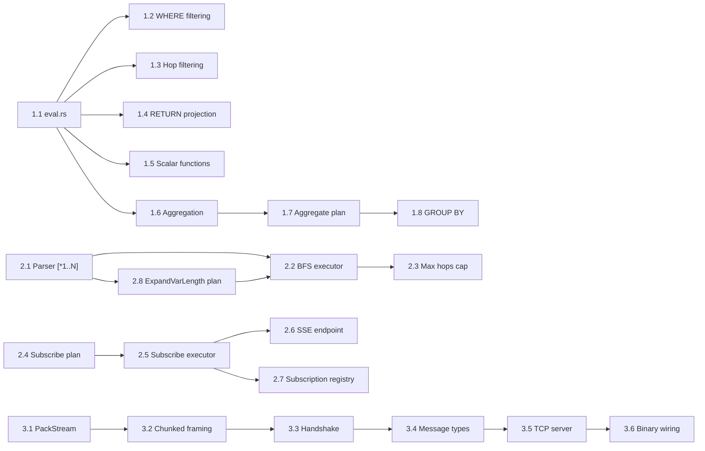

# Graph Gap Closure — Project Plan

> Last updated: 2026-03-30
> Status: Complete — all 3 sprints (23 tasks) implemented

## Summary

Close the 7 remaining gaps in ferrosa-graph across 3 timeboxed sprints plus backlog.
Priority driven by FMEA risk scores and dependency ordering (expression evaluator
is a prerequisite for G2/G4/G5).

## Sprint 1: Expression Evaluator + Aggregation + Hop Filtering (S/M items)

**Timebox:** 1 sprint
**Theme:** Build the expression evaluation foundation and close 3 gaps at once.

| Task | Gap | Size | Source | Success Criteria | Tests |
|------|-----|------|--------|-----------------|-------|
| 1.1 Create `executor/eval.rs` with `eval_expr()` | G2/G4/G5 | M | Architect, FMEA F1 | All `Expr` variants evaluated; type mismatch returns NULL | `eval_compare_*`, `eval_arithmetic_*`, `eval_bool_*`, `eval_property_lookup` |
| 1.2 Wire `eval_expr` into `execute_expand` WHERE filtering | G4 | S | Architect | `MATCH (n:Person) WHERE n.age > 30` filters correctly | `expand_where_filters_rows` |
| 1.3 Implement hop property filtering | G4 | S | Architect, FMEA F9 | `MATCH (a)-[r:KNOWS {since: 2020}]->(b)` reads edge table and filters | `hop_filter_by_property` |
| 1.4 Wire `eval_expr` into RETURN projection | G5 | S | Architect | `RETURN n.name, n.age + 1` evaluates expressions | `return_arithmetic_expression` |
| 1.5 Implement built-in scalar functions | G5 | S | Architect, FMEA F14 | `id()`, `type()`, `labels()`, `keys()`, `toString()`, `coalesce()`, `size()` | `eval_function_id`, `eval_function_coalesce` |
| 1.6 Create `executor/aggregate.rs` | G2 | M | Architect, FMEA F6/F7/F8 | Accumulator trait + count/sum/avg/min/max/collect impls | `aggregate_count`, `aggregate_sum`, `aggregate_avg_empty_null` |
| 1.7 Add `PhysicalPlan::Aggregate` variant | G2 | S | Architect | Planner detects aggregate functions and emits Aggregate plan | `plan_aggregate_count` |
| 1.8 Execute aggregation with GROUP BY | G2 | M | Architect, FMEA F7 | `RETURN n.city, count(n)` groups and counts; max group limit enforced | `aggregate_group_by`, `aggregate_max_groups_exceeded` |
| 1.9 Enforce collect() size limit | G2 | S | FMEA F6 | `collect()` returns error at 10K elements | `aggregate_collect_limit_exceeded` |

**FMEA items resolved:** F1, F6, F7, F8, F9, F14
**Threat mitigations:** T16 (expression type confusion)

## Sprint 2: Variable-Length Paths + SUBSCRIBE (L items)

**Timebox:** 1 sprint
**Theme:** Two independent L-sized features that can be developed in parallel.

| Task | Gap | Size | Source | Success Criteria | Tests |
|------|-----|------|--------|-----------------|-------|
| 2.1 Extend parser for `[*1..N]` syntax | G3 | S | Architect | `MATCH (a)-[*1..3]->(b)` parses; `length_range` populated in AST | `parse_varpath_range`, `parse_varpath_unbounded` |
| 2.2 Create `executor/varpath.rs` with BFS | G3 | L | Architect, FMEA F2/F3 | BFS with visited set + depth tracking; cycle detection | `varpath_one_hop`, `varpath_multi_hop`, `varpath_cycle_terminates` |
| 2.3 Add hard max-hops cap (10) | G3 | S | Threat T13, FMEA F3 | `[*1..100]` clamped to 10; total visited budget (100K) | `varpath_max_hops_capped`, `varpath_budget_exceeded` |
| 2.4 Add `PhysicalPlan::Subscribe` variant | G1 | S | Architect | Physical planner accepts SUBSCRIBE MATCH | `plan_subscribe_match` |
| 2.5 Create `executor/subscribe.rs` | G1 | M | Architect, FMEA F4/F5 | Subscription lifecycle: initial snapshot + periodic re-query | `subscribe_initial_snapshot` |
| 2.6 Add SSE endpoint for streaming | G1 | M | Architect | `POST /graph/subscribe` returns SSE stream; delta mode | `subscribe_sse_stream`, `subscribe_delta_captures_changes` |
| 2.7 Subscription registry + limits | G1 | S | FMEA F4/F5, Threat T12 | Per-connection limit (8), global limit; cleanup on disconnect | `subscribe_limit_per_connection`, `subscribe_cleanup_on_disconnect` |
| 2.8 Add `PhysicalPlan::ExpandVarLength` | G3 | S | Architect | Planner emits ExpandVarLength for patterns with length range | `plan_varpath` |

**FMEA items resolved:** F2, F3, F4, F5, F13
**Threat mitigations:** T12 (SUBSCRIBE exhaustion), T13 (path explosion)

## Sprint 3: Bolt Protocol (XL)

**Timebox:** 1 sprint
**Theme:** Neo4j driver compatibility via Bolt v5 wire protocol.

| Task | Gap | Size | Source | Success Criteria | Tests |
|------|-----|------|--------|-----------------|-------|
| 3.1 PackStream encoder/decoder | G6 | M | Architect, FMEA F10 | Encode/decode all PackStream types; proptest fuzz | `packstream_roundtrip`, `bolt_fuzz_never_panics` |
| 3.2 Bolt chunked framing | G6 | S | Architect | 16-bit chunk length, zero-length terminator | `bolt_frame_roundtrip` |
| 3.3 Bolt handshake + version negotiation | G6 | S | Architect, FMEA F11 | Magic bytes, version list, selected version response | `bolt_handshake_v5`, `bolt_unsupported_version_returns_error` |
| 3.4 Bolt message types (RUN/PULL/DISCARD/RESET) | G6 | M | Architect | Map Bolt messages to GraphEngine operations | `bolt_run_pull_cycle` |
| 3.5 Bolt TCP server + auth | G6 | M | Architect, Threat T15 | Tokio listener on port 7687; same auth as HTTP | `bolt_auth_required`, `bolt_invalid_credentials` |
| 3.6 Wire into ferrosa binary | G6 | S | Architect | `ferrosa/src/main.rs` starts Bolt listener alongside HTTP+CQL | integration test with neo4j driver |

**FMEA items resolved:** F10, F11
**Threat mitigations:** T15 (Bolt injection)

## Backlog

| Task | Gap | Size | Notes |
|------|-----|------|-------|
| WCO joins | G7 | XL | Defer until benchmarks show nested-loop is bottleneck |
| Leapfrog triejoin | G7 | XL | Research — requires sorted iterator API on adjacency index |
| Separate graph query thread pool | — | M | T4 follow-up: isolate graph from CQL runtime |
| Query memory budget tracking | — | M | Per-query byte accounting |
| Graceful reconciliation shutdown | — | S | `CancellationToken` for reconcile task |

## Risk Register

| Risk | Likelihood | Impact | Mitigation |
|------|-----------|--------|-----------|
| Expression evaluator performance on hot path | Medium | Medium | Benchmark eval_expr; consider compiled expressions if >1% of query time |
| Bolt protocol spec ambiguity | Medium | Low | Use neo4j Go driver test suite as oracle; reference bolt-protocol.org spec |
| Variable-length paths on production-scale graphs | High | High | Conservative defaults (max 10 hops, 100K visited); ops documentation |
| SUBSCRIBE memory under sustained load | Medium | Medium | Registry with TTL eviction; connection-scoped cleanup |

## Dependencies

