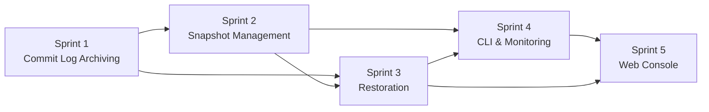

# PITR Project Plan

> Last updated: 2026-03-20
> Status: Complete

## Overview

Implementation plan for point-in-time restoration, organized into 5 sprints prioritized by FMEA risk scores and threat model findings. Each sprint is independently shippable.

## Completion Summary

> All 5 sprints completed as of 2026-03-20.

| Sprint | Status | Key Commits |
|--------|--------|-------------|
| 1 — Commit Log Archiving | **Complete** | `6dd71e5`, `b2c2c9b`, `1e73f66` |
| 2 — Snapshot Management | **Complete** | `a8d4500`, `ed0df9d`, `bf0afdb`, `a0160de`, `31ad2a4` |
| 3 — Point-in-Time Restoration | **Complete** | `9c549ee`, `abf30dc`, `6b03ba8` |
| 4 — Operational Tooling | **Complete** | `d4b0a49`, `faf52e6`, `97c329a` |
| 5 — Web Console & API | **Complete** | `1444060`, `c848710` |

## Sprint 1: Commit Log Archiving (Foundation)

**Goal**: Closed segments uploaded to S3 automatically. This is the prerequisite for everything else.

**Risk justification**: FM1 (RPN 96), FM2 (RPN 105), FM4 (RPN 36) — archiver reliability is the foundation.

| # | Task | Size | Source | Success Criteria | Tests |
|---|------|------|--------|-----------------|-------|
| 1.1 | Add `ArchiveConfig` to `CommitLogConfig` | S | architect | `ArchiveConfig` struct with `enabled`, `poll_interval`, `retention` fields. `from_env()` reads `FERROSA_ARCHIVE_*` vars. Unit test for defaults. | `cargo test -p ferrosa-storage config` |
| 1.2 | Implement `CommitLogArchiver` | L | architect, FM1 | Tokio task that polls closed segments and uploads to S3. Retry with exponential backoff (5 attempts). SHA-256 checksum stored in `archive-manifest.json`. | T1: retry on S3 error; T2: segment retained on failure |
| 1.3 | Add `archived` flag to segment tracker | S | FM4 | `discard_completed()` skips segments not yet archived. Segment file deleted only after both conditions: all tables flushed AND archived. | T6: discard_completed skips unarchived |
| 1.4 | Implement `archive-manifest.json` with CAS | M | architect, FM3 | JSON document in S3 listing archived segments with checksums. CAS update with retry. Tracks `oldest_segment_id`, `newest_segment_id`. | T5: CAS retry on conflict |
| 1.5 | Wire archiver into `StorageEngine` | M | DSM | `StorageEngine::new()` creates archiver when `archive_config.enabled` and S3 configured. Archiver receives closed segment notifications from `CommitLog::force_rotate()`. Shutdown drains pending uploads. | Integration: write, rotate, verify segment in S3 |
| 1.6 | Add `CommitLog::current_position()` | S | architect | Returns `CommitLogPosition` for the current write head. Used by snapshot creation. | Unit: position increases after append |
| 1.7 | Add `UploadTask::CommitLogSegment` variant | S | architect | Extend `UploadTask` enum. Upload manager handles commit log segments with same retry/checksum semantics as SSTables. | Unit: upload + verify in InMemory store |

**Sprint 1 deliverable**: `FERROSA_ARCHIVE_ENABLED=true` causes closed segments to appear in `{prefix}/commitlog-archive/` in S3.

## Sprint 2: Snapshot Management

**Goal**: Create and list snapshots via `StorageEngine` API. Snapshots freeze manifest + schema + commit log position.

**Risk justification**: FM5 (RPN 48), FM6 (RPN 63), FM7 (RPN 90), FM13 (RPN 150) — snapshot integrity and SSTable GC safety.

| # | Task | Size | Source | Success Criteria | Tests |
|---|------|------|--------|-----------------|-------|
| 2.1 | Implement `SnapshotManager` | M | architect | `create_snapshot()`: flush all memtables, record commit log position, copy manifest + schema to snapshot prefix, write metadata.json with SHA-256 of manifest. | T7: fails on flush error; T8: cleans up partial |
| 2.2 | Implement `SnapshotMetadata` serde | S | architect | Serialize/deserialize `metadata.json` with format_version, name, created_at, expires_at, commit_log_position, node_id, ephemeral. Round-trip test. | Unit: serde round-trip |
| 2.3 | Wire `create_snapshot()` into `StorageEngine` | M | DSM | `StorageEngine::create_snapshot()` coordinates flush + SnapshotManager. Returns `SnapshotMetadata`. | Integration: write data, create snapshot, verify S3 objects |
| 2.4 | Implement `list_snapshots()` and `delete_snapshot()` | S | architect | List snapshots by scanning `{prefix}/snapshots/` prefix. Delete removes metadata + manifest + schema (NOT SSTables). | Unit: list returns created snapshots; delete removes metadata |
| 2.5 | SSTable GC safety: check snapshot manifests | L | FM13, T7 | Before deleting any SSTable from S3, scan ALL snapshot manifests. SSTable deleted only when zero references across live manifest + all snapshots. | T15: create snapshot, compact, verify GC keeps snapshot SSTables |
| 2.6 | Snapshot concurrency with compaction | M | FM7 | Snapshot copies manifest atomically. If compaction runs concurrently, the snapshot captures either pre- or post-compaction state (both valid). | T9: concurrent compaction + snapshot, verify manifest consistent |
| 2.7 | Archive retention respects snapshots | M | FM14 | Retention cleanup never deletes segments newer than the oldest snapshot's commit log position. | T16: create snapshot, advance time, verify segments retained |

**Sprint 2 deliverable**: `StorageEngine::create_snapshot("daily")` creates a consistent snapshot in S3 that references existing SSTables without duplicating data.

## Sprint 3: Point-in-Time Restoration

**Goal**: Restore a node from a snapshot with optional timestamp filtering.

**Risk justification**: FM10 (RPN 108), FM11 (RPN 72), FM12 (RPN 56) — restore correctness is critical.

| # | Task | Size | Source | Success Criteria | Tests |
|---|------|------|--------|-----------------|-------|
| 3.1 | Implement `RestoreManager` | L | architect | Full restore workflow: load snapshot, download SSTables, download archived segments, replay with timestamp filter. Returns `RestoreResult`. | E1: full PITR cycle |
| 3.2 | Segment continuity validation | M | FM9, T3 | Before replay, verify no gaps in archived segment sequence from snapshot position to latest. Report missing segment IDs. Abort on gap. | T11: delete segment, verify gap detection |
| 3.3 | Timestamp filtering during replay | M | FM10 | Replay mutations from archived segments. Filter: keep mutations where `timestamp <= restore_point_in_time`. Boundary is inclusive (`<=`). | T12: mutations at exact boundary included |
| 3.4 | Node-id validation on restore | S | FM11, T8 | Warn if snapshot `node_id` doesn't match current node. Require `--force` for cross-node restore. | T13: cross-node restore requires --force |
| 3.5 | Schema validation during replay | M | FM12 | Load schema from snapshot. During replay, validate mutation keyspace/table exists in schema. Skip unknown tables with warning. | T14: unknown table mutations skipped |
| 3.6 | Wire `open_from_snapshot()` into `StorageEngine` | L | DSM | New constructor: `StorageEngine::open_from_snapshot(config, restore_config, runtime)`. Downloads SSTables, replays mutations, opens engine normally. | E2: restore after compaction |
| 3.7 | CLI flag: `--restore-snapshot` | S | architect | Ferrosa binary accepts `--restore-snapshot <name> [--restore-point-in-time <ts>]`. Calls `open_from_snapshot()` instead of `open()`. | Manual: start node with --restore-snapshot |

**Sprint 3 deliverable**: `ferrosa --restore-snapshot daily-0318 --restore-point-in-time 2026-03-18T14:30:00Z` restores the node.

## Sprint 4: Operational Tooling

**Goal**: CLI commands, monitoring, and operational polish.

| # | Task | Size | Source | Success Criteria | Tests |
|---|------|------|--------|-----------------|-------|
| 4.1 | `ferrosa-ctl snapshot create/list/delete` | M | architect | Three new CLI commands. `create` calls StorageEngine API via CQL system command. `list` shows name, created_at, size, commit_log_position. `delete` with confirmation prompt. | Manual: create, list, delete via CLI |
| 4.2 | `ferrosa-ctl restore` command | M | architect | Wrapper for `--restore-snapshot` flag. Validates snapshot exists before restart. Shows estimated restore time (segment count x avg replay rate). | Manual: run restore command |
| 4.3 | Archive lag monitoring | S | FM2, T3 | Virtual table `system_observability.archive_status` with columns: `unarchived_segments`, `oldest_unarchived_age_secs`, `last_archive_success`, `archive_errors_total`. | Query virtual table; verify values match state |
| 4.4 | Snapshot virtual table | S | architect | Virtual table `system_observability.snapshots` with columns: `name`, `created_at`, `expires_at`, `commit_log_position`, `sstable_count`, `size_bytes`. | Query virtual table after snapshot creation |
| 4.5 | Prometheus metrics | S | architect | Counters: `ferrosa_archive_segments_uploaded_total`, `ferrosa_archive_upload_errors_total`, `ferrosa_archive_lag_segments`. Gauges: `ferrosa_snapshots_total`. | Unit: verify metrics increment |
| 4.6 | Snapshot TTL cleanup | S | architect | Background task expires snapshots past their `expires_at`. Runs on configurable interval (default 1 hour). | Unit: expired snapshot cleaned up |
| 4.7 | BACKUP permission | S | T4 | New permission type in ferrosa-schema auth system. Snapshot operations require SUPERUSER or BACKUP permission. | Unit: unprivileged user denied; BACKUP user allowed |

**Sprint 4 deliverable**: CLI tooling and virtual tables for CQL-based monitoring.

## Sprint 5: Web Console & API Integration

**Goal**: PITR management via the web console (port 9090) and REST API endpoints.

**Depends on**: Sprint 2 (snapshots), Sprint 3 (restore), Sprint 4 (virtual tables).

| # | Task | Size | Source | Success Criteria | Tests |
|---|------|------|--------|-----------------|-------|
| 5.1 | `GET /api/snapshots` endpoint | S | architect | Returns JSON array of snapshots from `system_observability.snapshots` virtual table. Same auth as existing `/api/*` endpoints. | Integration: create snapshot, GET /api/snapshots, verify JSON |
| 5.2 | `POST /api/snapshots` endpoint | S | architect | Creates snapshot. Request body: `{"name": "...", "ttl_hours": N}`. Requires BACKUP or SUPERUSER role. Returns `201` with snapshot metadata. | Integration: POST, verify snapshot created in S3 |
| 5.3 | `DELETE /api/snapshots/:name` endpoint | S | architect | Deletes snapshot. Requires BACKUP or SUPERUSER. Returns `204`. 404 if not found. | Integration: create, delete, verify removed |
| 5.4 | `GET /api/archive_status` endpoint | S | architect | Returns archive health from `system_observability.archive_status` virtual table: `{unarchived_segments, oldest_unarchived_age_secs, last_archive_success, archive_errors_total}`. | Integration: verify JSON matches archiver state |
| 5.5 | `POST /api/restore/preflight` endpoint | M | architect | Pre-flight validation without triggering restore. Returns `{snapshot_exists, segments_available, segment_gaps, estimated_mutations, estimated_seconds}`. Operator reviews before committing. | Integration: preflight on valid snapshot returns ok; missing snapshot returns 404 |
| 5.6 | `POST /api/restore` endpoint | M | architect | Triggers restore. Request body: `{"snapshot": "...", "point_in_time": "...", "force": false}`. Validates via preflight, then initiates graceful shutdown + restart with `--restore-snapshot` flag. Returns `202 Accepted` with restart ETA. | Integration: trigger restore, verify node restarts with correct flags |
| 5.7 | Dashboard "Backup & Restore" card | M | architect | New card in `index.html` showing: snapshot table (name, created_at, expires_at, size), "Create Snapshot" button with name input, "Delete" button per row, archive lag indicator (green/yellow/red based on unarchived segment count). | Manual: verify card renders, create/delete works |
| 5.8 | Archive lag indicator in dashboard header | S | architect | Pill badge next to "Connected" status showing archive health. Green (0 unarchived), Yellow (1-5), Red (>5). Polls `/api/archive_status` on same 5s refresh cycle. | Manual: verify color transitions |
| 5.9 | WebSocket subscription for archive_status | S | architect | `{"type": "subscribe", "table": "archive_status"}` streams real-time archive lag updates. Uses existing `Pollable` mode (2s interval). | Unit: subscribe, verify data messages received |
| 5.10 | Restore confirmation dialog | S | architect | When operator clicks "Restore" in web UI, modal shows preflight results (segment count, estimated time, warnings). Requires explicit "Confirm Restore" click. Disables button during preflight fetch. | Manual: verify dialog shows, confirm triggers restore |

**Sprint 5 deliverable**: Operators can manage snapshots and trigger restores from the web console at `:9090`, with real-time archive health monitoring.

## Backlog (Deferred)

| Task | Size | Rationale for deferral |
|------|------|----------------------|
| Client-side encryption for archived segments | L | T5 mitigated by SSE; client-side encryption is defense-in-depth |
| SSTable reference counting | M | FM13 mitigated by manifest scanning; ref counting is optimization |
| Incremental snapshots (delta from previous) | L | Full snapshots are cheap (metadata only); incremental adds complexity |
| Cluster-wide coordinated restore | XL | Node-level restore is sufficient for initial release |
| S3 prefix scan fallback for missing archive manifest entries | M | FM3 mitigated by CAS retry; scan is fallback |
| Parallel segment download during restore | M | Sequential is simpler; parallelize when restore speed is a concern |

## Risk Register

| Risk | Likelihood | Impact | Mitigation | Status |
|------|-----------|--------|------------|--------|
| SSTable GC deletes snapshot-referenced data (FM13) | Medium | Critical | Sprint 2 task 2.5 | Mitigated |
| Timestamp boundary off-by-one (FM10) | Medium | High | Sprint 3 task 3.3 with boundary tests | Mitigated |
| Archiver falls behind under load (FM2) | Medium | High | Sprint 1 task 1.5 + Sprint 4 task 4.3 | Mitigated |
| Restore from wrong node (T8/FM11) | Low | Critical | Sprint 3 task 3.4 | Mitigated |
| Archive gaps from S3 failures (FM1) | Medium | High | Sprint 1 task 1.2 retry logic | Mitigated |

## Dependencies

Sprint 1 is the foundation. Sprints 2 and 3 depend on it. Sprint 4 adds CLI and virtual tables. Sprint 5 builds the web UI on top of the virtual tables and restore API from Sprints 3-4.

## Related Specs

- [PITR](pitr.md) — architecture
- [PITR FMEA](pitr-fmea.md) — failure modes and test plan
- [Threat Model — PITR](threat-model-pitr.md) — security analysis
- [ADR-011](decisions/011-s3-native-pitr.md) — design decision
