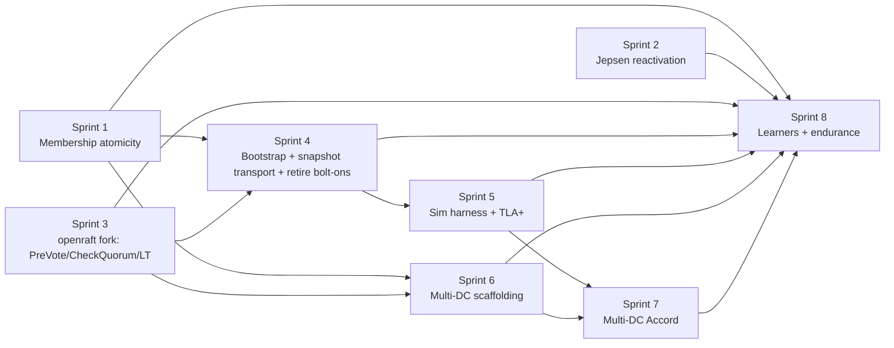

# Sprint Coordinator — Raft Correctness Program

> Dependency graph + parallelization strategy across `specs/in-process/sprint-{01..08}-*.md`.

## TL;DR for an automation loop

Each sprint file is **self-contained** — an agent dispatched with the sprint's "Kickoff prompt" section can execute it without this conversation's context. Strict TDD throughout. Every commit ends green: tests pass, clippy clean, fmt clean, full workspace builds.

When dispatching agents in parallel, respect the dependency waves below. An agent that tries to start a sprint with unmet hard dependencies must abort and report the missing prerequisite.

## Dependency graph



## Parallelization waves

| Wave | Sprints | Can start when |
|---|---|---|
| 1 | **1, 2, 3** | Now. They touch independent code: Sprint 1 in `ferrosa-cluster/src/membership/`, Sprint 2 in `ferrosa-jepsen/`, Sprint 3 in the new openraft fork repo. |
| 2 | **4, 6** | After Sprints 1 + 3 are merged (CheckQuorum/Leadership Transfer required for Sprint 4 retirement; `MembershipChanger` required for Sprint 6 multi-group support). |
| 3 | **5** | After Sprint 4 (sim harness ports Sprint 4 transition tests). |
| 4 | **7** | After Sprints 5 + 6 (Accord adapter needs sim for verification + multi-DC scaffolding for placement). |
| 5 | **8** | After all (endurance run validates the whole stack). |

In wave 1 you can dispatch three agents simultaneously. In wave 2 you can dispatch two. Waves 3–5 are serial.

**Within each sprint**, work items often parallelize further — see each sprint's "Parallelization" section.

## Strict-TDD invariants every sprint enforces

1. **Never write production code without a failing test.** RED first; watch it fail; only then GREEN.
2. **Each commit ends with `cargo test --workspace --lib`, `cargo clippy --all-targets -- -D warnings`, and `cargo fmt --check` all green.** No "fix in next commit" — the system always works.
3. **Each work item is RED→GREEN→REFACTOR**. Refactors do not add behaviour; tests must stay green throughout.
4. **No `#[ignore]`** anywhere (per project test policy in CLAUDE.md). If infrastructure is missing, the test panics with setup instructions.
5. **No silent error returns** in any new code. Every `let _ = ...` or `.ok()?` outside test code is a CI gate failure.
6. **Acceptance criteria are tests.** Every checkbox in a sprint's acceptance criteria corresponds to one or more named tests; the criterion is checked when those tests pass on `main`.
7. **Branch per sprint** off `main` of the inner ferrosa repo: `sprint-NN-<slug>`. PR per sprint to `main`. No cross-sprint commits in one PR.
8. **A sprint is "done" only when its acceptance-criteria tests pass in CI on `main`** — not when work items are completed locally.

## How a sprint agent invokes itself

Each sprint file contains a "Kickoff prompt" section. To dispatch:

```
Agent({
  description: "Execute Sprint N",
  subagent_type: "general-purpose",
  prompt: <contents of the sprint's "Kickoff prompt" section>,
  isolation: "worktree"
})
```

The agent enters its own worktree (named per sprint), executes the work items in TDD order, and reports back with the PR URL. If a work item gets stuck, the agent escalates with concrete state (test name, failure mode, suspected cause) rather than guessing.

## Cross-sprint coordination

- **Shared state**: invariant catalog at `specs/raft-invariants.md`. Every sprint that adds a new invariant updates this file as part of its work item.
- **Shared docs**: each sprint may add scenarios to `specs/raft-failure-mode-matrix.md` if it discovers new failure modes.
- **No cross-sprint dependencies in code** other than the documented hard prerequisites. If a sprint discovers it needs something from an unrelated sprint, escalate first; do not silently merge across sprints.

## Sprint state — to be updated as work begins

| Sprint | Status | Branch | PR | Notes |
|---|---|---|---|---|
| 1 | pending | `sprint-01-membership-atomicity` | — | wave 1 |
| 2 | pending | `sprint-02-jepsen-reactivation` | — | wave 1 |
| 3 | pending | `sprint-03-openraft-fork` | — | wave 1 (cross-repo) |
| 4 | pending | `sprint-04-bootstrap-snapshot-bolt-on` | — | wave 2; depends on 1+3 |
| 5 | pending | `sprint-05-sim-tla` | — | wave 3; depends on 4 |
| 6 | pending | `sprint-06-multi-dc-scaffolding` | — | wave 2; depends on 1+3 |
| 7 | pending | `sprint-07-multi-dc-accord` | — | wave 4; depends on 5+6 |
| 8 | pending | `sprint-08-learners-endurance` | — | wave 5; depends on all |
