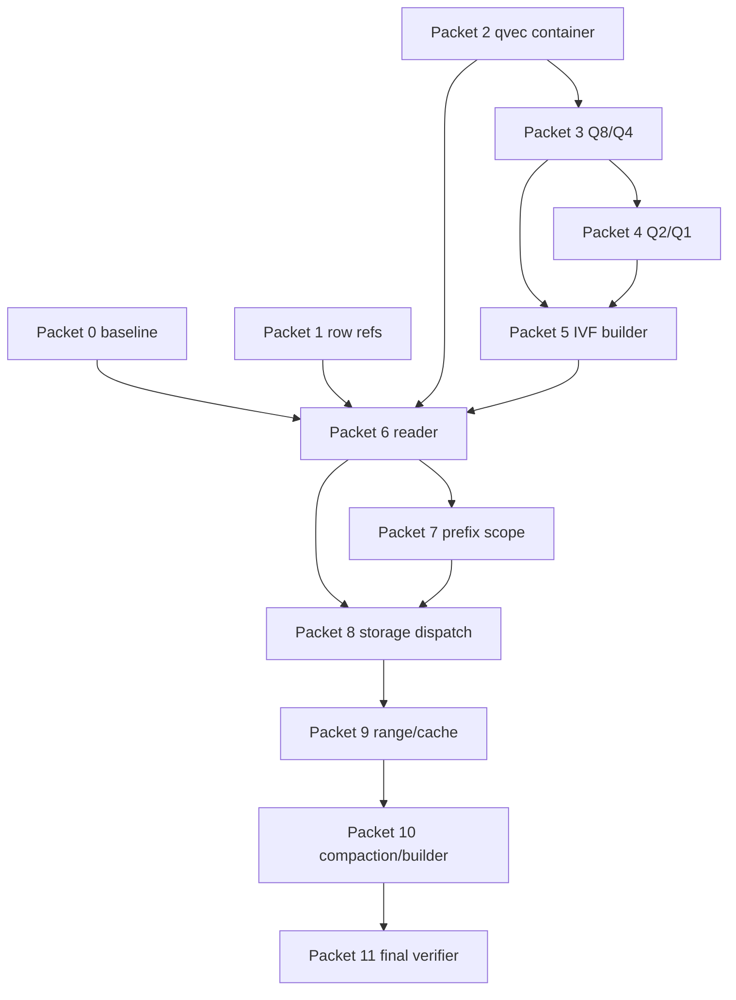

# HVQ C-SPANN Implementation Plan

> **For Hermes:** Use Kanban worktrees after owner answers the grill questions in `specs/proposed/hierarchical-vector-quantization.md`.

**Goal:** Implement an additive quantized, prefix-scoped, C-SPANN-inspired IVFFlat vector index strategy with measurable speed/bytes-read improvement over current full-vector JSON sidecars.

**Architecture:** Build a `.qvec` binary page container and quantized IVFFlat reader/builder in `ferrosa-index`, then wire it into `ferrosa-storage` through minimal dispatch and artifact-resolution seams. Keep broad/full-suite verification serialized in a final verifier lane.

**Tech Stack:** Rust workspace, Cargo tests, Ferrosa storage/index crates, S3-compatible object storage abstractions, future `ferrosa-index-builder` remote builds.

---

## Owner decisions locked 2026-05-29

The owner accepted all blueprint defaults except:

- Storage integration depth is **full depth**: implement through object-range cache, compaction, and remote builder production path in this swarm.
- Final output is an **integrated branch ready for human testing/review**, with local CI passing and ready to push. Do not push or open a PR without explicit approval.

All other defaults stand: quantized IVFFlat first, ferrosa-memory embeddings plus synthetic corpus when available, recall@10 >= 0.95, >=5x bytes-read and >=2x p95 speed gates, tenant_id+session_id prefix proof, exact rerank default, Q1 experimental, one worktree per packet, focused tests in implementation cards, broad CI in final verifier.

## Work packet rules

- Strict TDD: every code card must report RED command, RED failure excerpt, GREEN command, and GREEN pass excerpt.
- Implementation cards must return `IMPLEMENTED` with changed files or `BLOCKED` with exact repro.
- Focused tests only inside implementation cards; broad tests belong to final verifier.
- Avoid overlapping ownership of `ferrosa-storage/src/store.rs`; only one storage integration card edits it.
- Do not touch existing HNSW/IVFFlat behavior except compatibility tests or additive dispatch.

## Packet 0 — Baseline benchmark and test-spec harness

**Objective:** Establish current full-vector JSON sidecar behavior and the benchmark assertions the new path must beat.

**Files:**
- Create/modify: `ferrosa-index/benches/` or `ferrosa-index/tests/quantized_baseline.rs`
- Modify only if needed: `ferrosa-index/Cargo.toml`
- Reference: `ferrosa-index/src/vector/{hnsw,ivfflat}.rs`

**RED:** Add a test/bench assertion that records current sidecar bytes read/decode behavior and fails until instrumentation exists.

**GREEN:** Instrument current path enough to produce baseline metrics without changing behavior.

**Commands:**

```bash
cargo test -p ferrosa-index baseline -- --nocapture
```

## Packet 1 — Generation-aware `VectorRowRef`

**Objective:** Prevent cross-SSTable row-offset collisions in ANN merge identity.

**Files:**
- Modify: `ferrosa-index/src/vector/mod.rs`
- Modify: `ferrosa-storage/src/store.rs` only if needed for merge test
- Test: `ferrosa-storage` focused ANN merge tests

**RED:** Two SSTable generations have row offset `0`; ANN merge must not dedupe them as the same result.

**GREEN:** Introduce a generation/object-aware row ref or keep generation context in a typed merge key.

**Commands:**

```bash
cargo test -p ferrosa-storage ann_same_offset -- --nocapture
```

## Packet 2 — `.qvec` container skeleton

**Objective:** Add versioned binary manifest, page table, checksum, and file-backed range-read test store.

**Files:**
- Create: `ferrosa-index/src/vector/quantized/mod.rs`
- Create: `ferrosa-index/src/vector/quantized/container.rs`
- Modify: `ferrosa-index/src/vector/mod.rs`

**RED:** Parser tests for bad magic/checksum/short read fail because no container exists.

**GREEN:** Minimal binary container passes golden and fail-loud tests.

**Commands:**

```bash
cargo test -p ferrosa-index quantized_container -- --nocapture
```

## Packet 3 — Q8/Q4 codecs

**Objective:** Implement higher-precision scalar quantization codecs.

**Files:**
- Create: `ferrosa-index/src/vector/quantized/codec.rs`
- Test: module tests in codec file or `ferrosa-index/tests/quantized_codec.rs`

**RED:** Known vectors cannot encode/decode within declared error bounds.

**GREEN:** Q8/Q4 encode/decode and distance-estimate tests pass.

**Commands:**

```bash
cargo test -p ferrosa-index quantized_codec_q8_q4 -- --nocapture
```

## Packet 4 — Q2/Q1 codecs and recall characterization

**Objective:** Add low-bit codecs behind benchmark gates; do not make Q1 default without evidence.

**Files:**
- Modify: `ferrosa-index/src/vector/quantized/codec.rs`
- Test/bench: quantized codec and recall characterization tests

**RED:** Q2/Q1 codec tests absent/failing.

**GREEN:** Q2/Q1 pass declared error bounds and benchmark report flags recall impact.

**Commands:**

```bash
cargo test -p ferrosa-index quantized_codec_low_bits -- --nocapture
```

## Packet 5 — Quantized IVFFlat builder

**Objective:** Build centroids and emit tiered `.qvec` list pages from deterministic corpus.

**Files:**
- Create: `ferrosa-index/src/vector/quantized/ivf.rs`
- Modify: `ferrosa-index/src/vector/quantized/mod.rs`

**RED:** Deterministic corpus expected manifest/page table cannot be built.

**GREEN:** Builder emits stable manifest, list headers, tier pages, row refs, and optional F32 pages.

**Commands:**

```bash
cargo test -p ferrosa-index quantized_ivf_builder -- --nocapture
```

## Packet 6 — Quantized IVFFlat reader

**Objective:** Implement centroid routing, tiered pruning, page-read budgets, and exact survivor rerank.

**Files:**
- Modify: `ferrosa-index/src/vector/quantized/ivf.rs`
- Modify: `ferrosa-index/src/vector/quantized/container.rs` if needed for page-store hooks

**RED:** Reader cannot meet top-k/recall/page-budget assertions.

**GREEN:** Reader returns stable top-k, honors page budget, and reranks survivors exactly.

**Commands:**

```bash
cargo test -p ferrosa-index quantized_ivf_reader -- --nocapture
```

## Packet 7 — Prefix-scoped ANN routing

**Objective:** Make tenant/session/user prefix scope constrain vector search before distance work.

**Files:**
- Likely modify: `ferrosa-schema` index metadata
- Likely modify: `ferrosa-cql` planner/executor seam
- Likely modify: `ferrosa-storage` ANN search API

**RED:** Multi-tenant corpus returns/scans cross-tenant candidates or reads pages outside prefix scope.

**GREEN:** Scoped ANN searches only relevant prefix partitions and records fewer page reads.

**Commands:**

```bash
cargo test -p ferrosa-storage vector_prefix_scope -- --nocapture
cargo test -p ferrosa-cql ann_prefix -- --nocapture
```

## Packet 8 — Storage dispatch for additive quantized method

**Objective:** Wire quantized method into flush/search without changing legacy HNSW/IVFFlat sidecars.

**Files:**
- Modify: `ferrosa-storage/src/store.rs`
- Modify: `ferrosa-storage/src/flush.rs`
- Modify schema/index method option parsing as needed

**RED:** Quantized method cannot flush/search or legacy sidecar compatibility breaks.

**GREEN:** Memtable + flushed `.qvec` results merge correctly; legacy HNSW tests still pass.

**Commands:**

```bash
cargo test -p ferrosa-storage quantized_ann -- --nocapture
cargo test -p ferrosa-index hnsw ivfflat -- --nocapture
```

Note: Cargo accepts one test filter per command. Split HNSW/IVFFlat compatibility commands if needed.

## Packet 9 — Object-range and cache integration

**Objective:** Add S3-compatible range-read artifact resolution and bounded cache semantics.

**Files:**
- Modify/create storage artifact resolver/page store paths after reconnaissance
- Modify local cache metadata as needed

**RED:** Query requires full local sidecar materialization or fails when cache is smaller than index.

**GREEN:** Range reads rehydrate missing pages; cache smaller than index still returns correct results.

**Commands:**

```bash
cargo test -p ferrosa-storage quantized_range_cache -- --nocapture
```

## Packet 10 — Compaction and remote builder production path

**Objective:** Publish replacement quantized generations safely and shape remote builder direct-upload handoff.

**Files:**
- Modify: `ferrosa-index-builder`
- Modify: storage/index artifact manifest seams
- Modify: compaction integration tests

**RED:** Compaction can use stale cached pages or partial artifacts become visible.

**GREEN:** Generation/build/checksum-keyed cache prevents stale reads; publish-after-upload tests pass.

**Commands:**

```bash
cargo test -p ferrosa-storage quantized_compaction -- --nocapture
cargo test -p ferrosa-index-builder quantized -- --nocapture
```

## Packet 11 — Final verifier

**Objective:** Serialize broad validation and benchmark evidence after implementation lanes land.

**Commands:**

```bash
cargo fmt --all -- --check
cargo clippy --workspace --all-targets -- -D warnings
cargo test -p ferrosa-index -- --nocapture
cargo test -p ferrosa-storage -- --nocapture
cargo test -p ferrosa-cql -- --nocapture
cargo test --workspace --lib --bins --no-fail-fast
```

**Benchmark evidence:** collect p50/p95 latency, bytes read/query, page reads/query, sidecar size, candidates scanned, exact rerank count, recall@10/@100.

## Dependency graph


