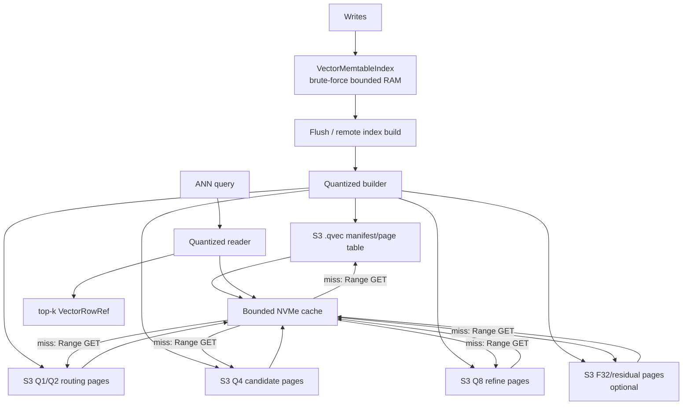
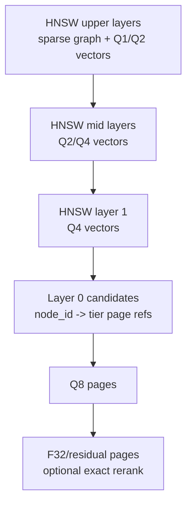
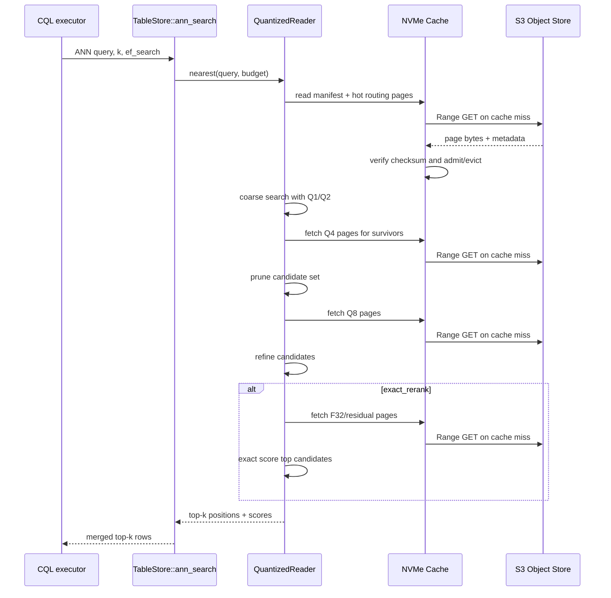

# Hierarchical Vector Quantization for S3-Durable, NVMe-Cached ANN

> Last updated: 2026-05-29
> Status: Draft / design investigation; CockroachDB C-SPANN review incorporated

## Executive Summary

Ferrosa currently stores flushed vector indexes as per-SSTable JSON sidecars that contain full `f32` vectors for HNSW. `ferrosa-index` also has an IVFFlat implementation with the same whole-file/full-vector shape, but `ferrosa-storage`'s flushed vector sidecar path currently builds and searches HNSW only. That is correct for small sidecars, but it does not scale to a 100B-vector target: every searched sidecar must be read and decoded as full precision before it can narrow the candidate set.

This spec proposes a hierarchical quantized vector index: store progressively more precise vector representations (`Q1 -> Q2 -> Q4 -> Q8 -> F32` or residual/PQ equivalents) in S3-durable, page-addressable `.qvec` objects, use bounded NVMe cache only for hot manifests/routing/pages, eliminate most candidates with bounded object-range reads, then fetch finer tiers only for survivors. The first implementation should be an additive index method (`quantized_ivf_flat` first, then `quantized_hnsw`) rather than a rewrite of existing HNSW/IVFFlat.

Important invariant: local compute-node disk is not assumed to hold the full vector index. S3-compatible object storage is authoritative and durable; NVMe is a bounded, evictable cache.

## CockroachDB C-SPANN Lessons to Incorporate

The ByteByteGo/CockroachDB article on C-SPANN is useful because it frames vector indexing as a distributed-database integration problem, not merely an ANN library choice. The following lessons are now scope inputs for this proposal:

1. **Index partitions should be storage-native artifacts.** CockroachDB stores C-SPANN partitions as ordinary KV/table data so range split, rebalance, replication, caching, and restart behavior come from the database. Ferrosa should mirror the principle with manifest-published, S3-durable, page-addressable index artifacts whose object keys and liveness follow SSTable/index-artifact rules. Do not create a separate durability/discovery subsystem for vectors.
2. **Prefer a wide, shallow hierarchical K-means/IVF shape for distributed scale.** HNSW is strong in-memory, but it resists sharding and warm-restart constraints. A C-SPANN-like tree gives explicit partition units that can map to object ranges, cache pages, compaction jobs, and future token/range placement.
3. **Make prefix-scoped vector indexes first-class.** Real workloads query within tenant/user/session/region scopes. Prefix columns should select a shard-local tree before any vector distance work. This is both a performance feature and a security/isolation boundary.
4. **Use quantized candidate generation plus exact survivor rerank.** Low-bit vectors should cheaply find a candidate set; exact `f32` or residual pages should be fetched only for survivors when the index is configured for correctness-sensitive results.
5. **Support incremental maintenance as background/index-builder work.** C-SPANN/SPFresh split, merge, and nearest-partition reassignment are the right long-term quality-maintenance model. Ferrosa v1 can keep immutable per-SSTable artifacts, but the design must not block compaction/index-builder replacement generations that rebalance partitions.
6. **Avoid central coordinators and hot roots.** The root/routing layer can be cached, but the serving model must not require one leader, one hot partition, or all routing state in RAM. Prefix scope, root partition caching, and page budgets are mandatory design surfaces.
7. **Benchmark the integration, not just ANN recall.** Required evidence includes bytes read/query, object-range reads/query, p95 latency, cache hit/miss behavior, build memory, and recall@k versus exact search.

## Scope Outlines

### Scope A — Ferrosa-core data model and public contract

- Add vector index metadata for prefix columns: tenant/user/session/region style equality predicates must be available to the ANN search path before vector routing.
- Keep existing CQL ANN syntax working; map current `ef_search`/limit semantics to an internal budget first, then consider explicit ANN budget options later.
- Preserve existing HNSW/IVFFlat JSON sidecars as legacy methods. Quantized indexes are additive and require rebuild, not in-place upgrade.
- Define `VectorRowRef` or equivalent generation-aware identity before global or cross-SSTable merges rely on row offsets.

### Scope B — Quantized format and page-store foundation

- Introduce `.qvec` as a versioned binary container with magic, manifest, page table, checksums, tier metadata, object key/build id/generation identity, and explicit metric/dimension fields.
- Implement a `QuantizedPageStore` over byte ranges, with file-backed tests first and object-store/NVMe cache integration later.
- Fail loudly on unknown magic/version, checksum mismatch, stale generation, missing page, short read, dimension mismatch, or codec confusion.
- Prove range reads are used in tests; whole-sidecar materialization is forbidden for quantized query paths.

### Scope C — Quantized ANN algorithm v1

- Start with IVFFlat / hierarchical K-means rather than HNSW for the first implementation.
- Build centroids from full vectors, write tiered list/partition pages, and perform staged pruning through Q2/Q4/Q8 plus optional F32/residual rerank.
- Keep Q1/RaBitQ-style ultra-low-bit routing benchmark-gated. It is in scope as an experiment, not a default before recall evidence.
- Keep HNSW quantized traversal as a later prototype after IVFFlat evidence is green.

### Scope D — Storage, durability, and compaction integration

- Publish quantized artifacts only after durable object upload and manifest validation.
- Treat NVMe/local files as cache only; S3-compatible object storage is authoritative outside local test mode.
- Extend index artifact manifests so engine bootstrap and query paths can discover vector artifacts without scanning local directories or materializing full files.
- Compaction must publish replacement `.qvec` generations before old-object GC, and cache keys must include generation/build/checksum to avoid stale page reuse.

### Scope E — Benchmark and TDD acceptance spec

- Build a reproducible benchmark/test corpus with clustered synthetic vectors plus a ferrosa-memory embedding corpus when available.
- Required comparison: current full-vector JSON HNSW/IVFFlat path vs quantized staged reader.
- Required speed evidence: p50/p95 latency, bytes read/query, sidecar bytes, object-range count, candidates scanned, exact rerank count, and recall@10/@100.
- Default enablement gate: recall@10 >= 0.95 against exact `f32` brute force on benchmark corpora, with a measurable bytes-read and latency improvement over current sidecar search.

## Current Codebase Findings

### Existing vector module

- `ferrosa-index/src/vector/mod.rs` defines vector traits and distance functions.
  - `IndexFactory::create_builder(dir)` and `open_reader(dir)` are directory/file based.
  - `IndexBuilder::add_row(position, value)` accumulates rows and `finish()` writes the index.
  - `IndexReader::nearest(query, k, ef_search)` returns `IndexResult { position, score }`.
  - `RowPosition` is currently only `offset: u64`, not an SSTable/object/page locator.
- `ferrosa-index/src/vector/hnsw.rs` stores `HnswGraphData` as JSON with:
  - `layers: Vec<Vec<Vec<usize>>>`
  - `vectors: Vec<Vec<f32>>`
  - `positions: Vec<RowPosition>`
  - `entry_point`, `max_layer`, `m`, `ef_construction`, `metric`
- `ferrosa-index/src/vector/ivfflat.rs` stores `IvfFlatData` as JSON with:
  - `centroids: Vec<Vec<f32>>`
  - `lists: Vec<Vec<IvfEntry>>`
  - each `IvfEntry` embeds `position: RowPosition` and `vector: Vec<f32>`
- `ferrosa-storage/src/memtable/vector_index.rs` is not HNSW despite stale comments. It is a bounded brute-force memtable index: `Vec<Vec<f32>> + Vec<RowPosition>` behind `RwLock`.

### Current flush/search path

- `TableStore::flush()` drains each `VectorMemtableIndex` and writes one `{gen}-VEC-{index_name}.db` sidecar per SSTable generation.
- Persistent vector sidecar dispatch in `ferrosa-storage` currently builds and searches HNSW sidecars only. `ferrosa-index` has IVFFlat code, but the storage flush/search path does not currently persist IVFFlat vector sidecars.
- `TableStore::ann_search()` searches the active memtable, then loops all SSTable generation IDs, reads each vector sidecar with `flush_target.read_vector_sidecar(gen, index_name)`, dispatches to the HNSW decoder, merges by `position.offset`, sorts by score, and truncates to `k`. This is a correctness and scale seam: offsets can collide across generations, and the current file-backed `FlushTarget` writes vector sidecars but does not provide a matching remote/object-range read path.
- `FlushTarget::write_vector_sidecar/read_vector_sidecar` currently treat the whole sidecar as one byte blob. File-based sidecars are named `{generation}-VEC-{index_name}.db`.

### Spill-safety review findings

Parallel review of vector, storage, and remote-builder code found these seams
that must be closed before production HVQ:

- HNSW and IVFFlat both serialize monolithic JSON blobs containing graph/list
  structures plus full `f32` vectors. Query code must not copy this pattern for
  `.qvec`; it needs page-addressable graph/list/vector tiers.
- `FileFlushTarget` writes vector sidecars locally, while the query seam is
  `FlushTarget::read_vector_sidecar() -> Option<Vec<u8>>`. HVQ requires an
  artifact resolver with S3 range reads and cache-backed page fetches instead
  of whole-sidecar byte loading.
- `LocalCache` tracks only local paths and sizes. It has no object key,
  generation/build id, page id, checksum, range-fetch callback, or partial
  residency state.
- Engine bootstrap and `register_table()` currently discover SSTables and
  sidecars through local directory scans. HVQ must make manifests/object refs
  authoritative so a node can query before local full-file materialization.
- `ferrosa-index-builder` currently downloads full SSTable components into temp
  disk and uses local builder paths. HVQ builders must stream/range-read input,
  reserve scratch before fetch, spill bounded work pages, and publish `.qvec`
  manifest entries only after validation.
- `RemoteBackend` local fallback is unsafe for HVQ-scale jobs. If builders are
  down, the safe behavior is stale-index serving, queueing, or fail-loud status,
  not unbounded local build.
- Candidate identity must evolve from `RowPosition { offset }` to a row ref that
  includes SSTable generation/object identity; offsets can collide across
  generations.

### Hotspots

Git churn over the last year for the vector-relevant paths:

- `ferrosa-storage/src/store.rs`: 45 commits touching it; 25 bug/fix commits touching it.
- `ferrosa-index/src/vector/hnsw.rs`: 6 commits; 2 bug/fix commits.
- `ferrosa-index/src/vector/ivfflat.rs`: 5 commits; 1 bug/fix commit.
- `ferrosa-index/src/vector/mod.rs`: 3 commits.
- `ferrosa-storage/src/memtable/vector_index.rs`: 1 commit.

Interpretation: put minimal new dispatch in `store.rs`; keep new quantized formats inside `ferrosa-index/src/vector/quantized.rs` plus a small `IndexMethod` extension.

## Target Problem

At 100B vectors, full precision sidecars are untenable:

- Raw `f32` storage = `N * dims * 4` bytes.
  - 100B x 768 dims x 4 bytes = 307.2 TB before graph/list metadata.
  - 100B x 1536 dims x 4 bytes = 614.4 TB before metadata.
- JSON adds unacceptable overhead and decode CPU.
- Existing `ann_search()` reads per-SSTable whole sidecars, which becomes an O(number-of-SSTables * sidecar-size) anti-pattern.
- Data volume can exceed the local disk capacity of any compute node. A correct design cannot require all quantized sidecars, F32 rerank pages, or candidate tiers to be locally resident before query execution.
- Existing storage architecture is S3-first/write-behind; vector index sidecars must follow the same durability model rather than becoming a local-only exception.
- HNSW and IVFFlat both currently store full vectors at their leaf/candidate layer.

The design goal is not merely smaller storage. It is bounded bytes read per query across a two-tier storage model: S3/object storage as durable backing, NVMe as a bounded cache, and representation precision matched to search phase.

## Design Goals

1. Keep all existing vector index methods working.
1. Add a new method whose durable format is page-addressable, binary, versioned, and S3/object-store addressable.
1. Make every quantized index artifact S3-durable before it is advertised in table/index manifests.
1. Support object-range reads for manifests, page tables, routing pages, quantized tiers, and optional F32/residual pages.
1. Treat NVMe as an optional bounded cache, not a correctness requirement.
1. Continue serving queries when total index data exceeds compute-node disk by fetching cold pages from S3 on demand.
1. Define cache admission, eviction, rehydration, and fail-loud behavior for cache misses and S3 read failures.
1. Store coarse quantized representations in upper/coarse routing nodes.
1. Fetch more precise representations only after candidate narrowing.
1. Keep exact `f32` vectors optional and cold; use them only for final rerank when configured.
1. Make cost/recall tunable per query and per index.
1. Avoid global in-memory graph requirements. The reader may cache manifests, routing summaries, and hot top-level pages in NVMe/RAM, but must never require all vectors or all tier pages to fit locally.
1. Preserve fail-loud behavior: unknown format, missing tier page, dimension mismatch, or corrupted checksum returns an error and records telemetry.

## Non-Goals for First Implementation

- No mutation-in-place of an existing quantized sidecar. Build immutable sidecars during flush or remote index build.
- No global 100B index across all SSTables in v1. The first cut remains per-SSTable artifacts, then adds a higher-level manifest/fanout layer later.
- No assumption that one node's NVMe can contain all sidecars for its assigned SSTables. Even v1 per-SSTable artifacts must be readable from S3 object ranges with local caching.
- No GPU requirement.
- No approximate delete handling beyond current SSTable/tombstone semantics.
- No replacement of scalar secondary index machinery.

## Proposed Architecture



### Components

#### `ferrosa-index::vector::quantized`

New module for binary quantized ANN formats.

Responsibilities:

- Quantization codecs: `Q1`, `Q2`, `Q4`, `Q8`, optional residual/PQ codecs.
- Versioned binary manifest and page table.
- Builders from drained `(RowPosition, Vec<f32>)` entries.
- Readers that perform staged candidate narrowing without decoding every vector.
- Recall/latency test hooks and golden corpus tests.

#### `QuantizedVectorManifest`

A small, eagerly loaded metadata file. Suggested fields:

```rust
struct QuantizedVectorManifest {
    magic: [u8; 8],              // FERQVE01
    version: u16,
    dimensions: u16,
    metric: DistanceMetric,
    method: QuantizedMethod,     // HNSW, IVFFlat, IVF_HNSW, future
    storage: QuantizedStorageDescriptor,
    tiers: Vec<QuantizedTier>,
    routing_root: PageId,
    row_count: u64,
    manifest_generation: u64,
    checksum: u32,
}

struct QuantizedStorageDescriptor {
    durable_backend: DurableBackend, // S3-compatible object store in production
    object_key: String,              // canonical .qvec object key
    object_etag: Option<String>,
    object_size: u64,
    local_cache_policy: CachePolicyId,
}

struct QuantizedTier {
    precision: PrecisionTier,    // Q1, Q2, Q4, Q8, F32
    page_size: u32,              // e.g. 4 KiB, 16 KiB, 64 KiB
    page_count: u64,
    codec: CodecId,
    object_key: String,
    byte_range: ByteRange,
    page_index_range: Range<u64>,
    checksum: u32,
}
```

#### `QuantizedPageStore`

A page-addressable reader/writer abstraction over durable object storage plus an optional local NVMe cache. It must not require reading the entire sidecar into memory or materializing the full sidecar on local disk.

Required backends:

- `ObjectRangePageStore`: reads `.qvec` page byte ranges from S3-compatible object storage using ranged GETs.
- `NvmeCachePageStore`: wraps the object-range store with bounded local cache admission and eviction.
- `FilePageStore`: test/prototype backend only; implements the same range-read contract.

Cache misses are normal. A miss should issue an object-range read, verify checksum, optionally admit the page to NVMe cache, and return the page. S3/object read failure, checksum mismatch, short read, wrong object generation, or missing page must fail loudly; never return partial or empty results as success.

#### S3 durability and object layout

S3-compatible object storage is the durable source of truth for `.qvec` artifacts. Local files and NVMe pages are cache entries only.

Requirements:

1. A quantized index is not visible to query planning until object upload completes, object checksum/metadata is recorded, and the table/index manifest publish succeeds.
1. Upload must be atomic from the reader perspective: readers either see the old index generation or the fully uploaded new generation.
1. `.qvec` objects must support HTTP/S3 Range GET for the manifest/header, page table, routing pages, tier pages, and optional F32/residual pages.
1. Object metadata should include checksum, format version, table/index/generation identity, and build id.
1. Compaction must publish replacement `.qvec` objects before removing old objects from the live manifest.
1. Garbage collection of old quantized objects must follow the same manifest/liveness rules as SSTable components.

The implementation should align with existing storage primitives:

- `object_store::ObjectStore` for durable remote reads/writes.
- `ferrosa-storage/src/upload/manager.rs` `UploadTask::IndexFiles` for uploading index artifacts.
- `hex_prefix_for` and `sstable_object_key` path conventions for object distribution.
- `ferrosa_sstable::io::ReadAt` for range-addressable data access.
- `LocalCache` as cache bookkeeping to extend for vector artifacts.
- `IndexBuildBackend`, `RemoteBackend`, and `IndexBuildResult::sidecar_written_to_s3` for remote builder integration.

Suggested logical object key:

```text
{s3_prefix}/indexes/{table_id}/{sstable_generation}/{index_name}/{build_id}.qvec
```

#### NVMe cache and eviction requirements

NVMe is a bounded cache, not durability.

Requirements:

1. Correctness must not depend on any page remaining cached.
1. Cache keys must include object key, generation/build id, byte range/page id, tier, and checksum/version.
1. Admission policy should prefer manifests/page tables, top-level routing pages, frequently hit Q2/Q4 pages, and only selectively admit Q8/F32 pages.
1. Eviction policy must be deterministic and observable; LRU or TinyLFU is acceptable for v1.
1. Rehydration must fetch the required byte range, not the whole object.
1. Cache must expose metrics for hit/miss/eviction/fill bytes and S3 range-read latency.

#### Index artifact manifest

The existing SSTable manifest/discovery paths focus on SSTable components. Quantized vector artifacts need explicit manifest entries or an equivalent index-artifact manifest so remote-built sidecars are durable and discoverable without scanning local directories.

Suggested fields:

```rust
struct IndexArtifactManifestEntry {
    table_id: TableId,
    sstable_generation: u64,
    index_name: String,
    artifact_kind: IndexArtifactKind, // vector_hnsw, hvq_qvec, fti, future
    object_key: String,
    format_version: u16,
    object_size: u64,
    checksum: u32,
    build_id: BuildId,
    build_epoch: u64,
}
```

This manifest is the bridge that makes `sidecar_written_to_s3 = true` safe: the query path must be able to resolve and range-read the S3 artifact even when no local file exists.

#### Query planner

The reader needs a staged search budget:

```rust
struct QuantizedSearchBudget {
    coarse_k: usize,       // candidates retained after Q1/Q2
    mid_k: usize,          // retained after Q4
    refine_k: usize,       // retained after Q8
    final_k: usize,        // requested k
    max_page_reads: usize,
    exact_rerank: bool,
}
```

`ef_search` can map to this budget initially, but the public CQL/engine contract should eventually expose clearer options.

## HNSW Mapping

HNSW already has hierarchy, but Ferrosa's current HNSW stores full vectors on every node and clones the whole graph into memory when reading.

Recommended mapping:

- Keep graph adjacency separate from vector payloads.
- Store upper layers with compact routing vectors (`Q1` or `Q2`) and node IDs.
- Store layer 0 candidates with page references to finer tiers.
- Use quantized distance for graph traversal, then fetch `Q8`/`F32` only for candidate rerank.



Open design point: HNSW edge selection with low-bit quantized vectors can degrade graph quality. Build should probably still use `f32` input, then quantize for persisted search. The builder can discard full vectors after writing optional rerank pages.

## IVFFlat Mapping

IVFFlat naturally separates routing from candidate scans.

Recommended mapping:

- Keep centroids in `Q8` or `f16` initially; their count is small relative to rows.
- Store each inverted list as tiered pages:
  - list header and row count
  - `Q1/Q2` sketch for fast pruning inside large lists
  - `Q4` candidate payload pages
  - `Q8` refine pages
  - optional full/residual final pages
- Query path:
  1. rank centroids
  2. read selected list headers
  3. scan low-bit sketches
  4. read only pages containing surviving candidates
  5. rerank survivors

This is the easier first target than HNSW because it minimizes graph traversal error from very low precision.

## Sidecar Layout

Replace one JSON blob with a small manifest plus binary tier pages. Suggested v1: one logical `.qvec` object per SSTable/index generation with internal byte ranges. The object may be cached partially or wholly on NVMe, but the canonical copy is S3-durable. Multiple physical objects per tier can be considered later if S3 range-read behavior, object size limits, or independent tier lifecycle justify it.

```text
{gen}-VEC-{index_name}.qvec
  header
  manifest
  adjacency/routing section
  tier Q1 pages
  tier Q2 pages
  tier Q4 pages
  tier Q8 pages
  optional F32/residual pages
  checksum footer
```

The existing `{gen}-VEC-{index_name}.db` can remain for JSON HNSW/IVFFlat. New method should use `.qvec` or a magic header so decode never guesses.

Canonical object layout should be manifest-addressable rather than local-directory-scanned. A v1 path can use:

```text
{s3_prefix}/indexes/{table_id}/{sstable_generation}/{index_name}/{build_id}.qvec
```

## Query Flow



## API and Configuration Sketch

Extend `IndexMethod` without changing existing methods:

```rust
enum IndexMethod {
    Hnsw { m: usize, ef_construction: usize },
    IvfFlat { lists: usize },
    Quantized {
        base: QuantizedBase,       // hnsw | ivf_flat
        tiers: Vec<PrecisionTier>, // q2,q4,q8,f32
        lists: Option<usize>,      // for IVF
        m: Option<usize>,          // for HNSW
        ef_construction: Option<usize>,
        exact_rerank: bool,
        storage: QuantizedStorageMode, // s3_backed | local_test_only
        cache_policy: CachePolicy,
        max_local_cache_bytes: Option<u64>,
        max_object_range_bytes_per_query: Option<u64>,
    },
}
```

CQL examples:

```sql
CREATE INDEX idx_embed ON docs (embedding) USING 'vector'
    WITH OPTIONS = {
        'method': 'quantized',
        'base': 'ivf_flat',
        'metric': 'cosine',
        'tiers': 'q2,q4,q8,f32',
        'lists': '65536',
        'exact_rerank': 'true',
        'storage': 's3_backed',
        'cache_policy': 'routing_hot_lru',
        'max_page_reads': '512'
    };
```

Questions before locking the public DDL:

- Should `Q1` be exposed, or should the planner choose it internally only when row counts justify it?
- Should tier selection be per-index immutable config or query-time adjustable?
- Should existing `ef_search` be retained as the sole query knob, or should CQL expose `WITH ANN_OPTIONS` later?

## Implementation Plan

### Phase 0 — Measurement Harness

1. Add a benchmark fixture generator for random, clustered, and real embedding distributions.
1. Measure current JSON HNSW/IVFFlat sidecar sizes and query decode time.
1. Establish recall@k and latency baselines for full precision.
1. Add instrumentation for candidates scanned, sidecar bytes read, page reads, and rerank count.

### Phase 1 — S3-Durable Binary Page Container

1. Implement a versioned binary `.qvec` container with manifest, page table, object keys, byte ranges, and checksums.
1. Add `QuantizedPageStore` with object-range reads, checksum verification, and a file-backed test backend using the same range-read contract.
1. Add `NvmeCachePageStore` wrapper semantics for cache miss/fill/evict behavior.
1. Add golden encode/decode tests, corruption tests, short-read tests, and missing-object tests.
1. Add fail-loud errors for magic/version/checksum/dimension/object-generation mismatch.

### Phase 2 — Quantization Codecs

1. Implement per-dimension scalar quantization for `Q8`, `Q4`, `Q2`, `Q1` with per-block scale/zero-point.
1. Add SIMD-friendly distance kernels later; first implementation can be scalar and verified.
1. Add property tests for monotonic behavior bounds and decode error ranges.
1. Compare scalar quantization against product quantization before committing to storage format.

### Phase 3 — IVFFlat Quantized Reader/Builder

1. Build IVF centroids from full vectors as today.
1. Write list pages by tier.
1. Query centroid routing, then staged list pruning.
1. Verify recall/latency/storage against full IVFFlat.

### Phase 4 — HNSW Quantized Reader/Builder

1. Split adjacency from vector payloads.
1. Use quantized vectors for persisted traversal.
1. Keep optional full/residual pages for final rerank.
1. Verify graph recall degradation at each precision tier.

### Phase 5 — Storage Integration

1. Extend `IndexMethod::from_options` for `quantized`.
1. Add dispatch in `TableStore::flush()` and `ann_search()`.
1. Add vector artifact upload through `UploadTask::IndexFiles` and publish manifest entries only after durable upload verification.
1. Add cache-backed object-range reads for quantized query path; keep whole-blob reads only for legacy JSON sidecars.
1. Update `FlushTarget` docs to clarify it is local materialization, not S3 durability.
1. Preserve old `.db` sidecars for existing HNSW/IVFFlat methods.

### Phase 6 — Remote Index Builder / Production Tuning

1. Move large quantized builds to `ferrosa-index-builder` for production-sized SSTables.
1. Have the builder read SSTable/object artifacts from S3 and write `.qvec` artifacts back to S3 through the object-store/index-artifact path.
1. Add page prefetch and admission policy for hot routing pages.
1. Add compaction merge behavior: publish replacement quantized sidecars for compacted SSTables before old-object GC.
1. Tune page clustering and range-read budgets to control S3 latency and request amplification.

## Test Strategy

- Unit tests:
  - codec round trips by precision tier
  - manifest parse errors
  - page table bounds checking
  - dimension mismatch errors
- Property tests:
  - random vectors decode within expected quantization error
  - staged search never returns more than `k`
  - exact rerank score ordering equals full `f32` scoring for survivor set
- Integration tests:
  - flush/build uploads `.qvec` artifact to S3/MinIO before manifest publish
  - restart/read path opens sidecar without full decode or full local materialization
  - deleting local cache still allows query by S3 range reads
  - cache size smaller than total index size still allows correct queries
  - cache eviction during repeated queries does not change correctness
  - missing S3 object, short range read, checksum mismatch, or stale object generation fails loudly
  - `ann_search()` merges active memtable + quantized SSTable results
  - compaction publishes replacement quantized sidecars and prevents stale cached pages from being used
- Benchmarks:
  - bytes read/query
  - p50/p95 latency
  - recall@10/100
  - build time
  - sidecar size by tier config

## Risks

| Risk | Impact | Mitigation |
|---|---|---|
| Low-bit traversal breaks HNSW recall | Bad results despite fast search | Start with IVFFlat; keep HNSW exact/rerank pages; benchmark recall before enabling by default |
| JSON compatibility churn | Existing sidecars fail to decode | New magic/versioned `.qvec`; no change to old `.db` readers |
| `RowPosition { offset }` insufficient | Cannot uniquely identify rows across SSTables/pages | Keep generation context at `TableStore` merge layer initially; consider future `VectorRowRef { generation, offset }` in quantized sidecar internals |
| Whole-sidecar `read_vector_sidecar` API | Destroys object-range and cache-read goal | Add page/range read API for quantized method; keep old blob API only for legacy formats |
| Large builder RAM use | Cannot build production-size indexes during flush | Use remote index builder and streaming/page-spilling builder before production use |
| Quantization calibration drift | Poor recall on skewed embedding distributions | Store per-block/per-list scales; benchmark on real corpus embeddings |
| Spec assumes local NVMe contains full index | Production cannot handle index volume > compute disk | Make S3 durable backing mandatory; test with cache smaller than index |
| S3 range-read amplification | High latency/cost under scattered candidate pages | Page clustering, query read budgets, prefetch, tier-aware layout |
| Cache eviction removes needed pages | Query failure/perf cliff if cache is treated as source of truth | Cache is non-authoritative; rehydrate from S3 by object range |
| Stale cached pages after compaction | Wrong nearest-neighbor results | Cache key includes generation/build/checksum; manifest controls liveness |
| Partial upload visible to readers | Corrupt/incomplete query results | Publish-after-upload CAS; checksum and object-size validation |


## Blueprint Expansion

This section captures the request as a blueprint-level design package rather than only a storage-format sketch. It is intentionally implementation-facing: each item should become a work item, benchmark, or explicit owner decision before coding starts.

### Phase 0 — Plan Interrogation Defaults

Until the grill-me answers below are resolved, use these defaults for planning:

| Decision | Default | Why |
|---|---|---|
| First base algorithm | IVFFlat | IVFFlat has explicit centroid/list phases, so low-bit approximation is easier to bound than HNSW graph traversal error. |
| HNSW scope | Research/prototype after IVFFlat | HNSW can still use tiered payload pages, but low-bit vectors can corrupt greedy routing decisions. |
| First storage format | New `.qvec` object | Avoids changing existing JSON `.db` sidecars and makes version/magic/checksum checks fail loud. |
| First durability model | Immutable S3-durable per-SSTable object, NVMe cached | Matches current flush/compaction semantics, avoids mutable quantized trees, and supports data volume greater than compute-node disk. |
| First precision ladder | Q2 -> Q4 -> Q8 -> optional F32 | Q1 should be benchmark-gated; it is attractive for routing but high-risk for recall. |
| First query guarantee | Approximate narrow + exact survivor rerank | Keeps correctness understandable while storage and recall are measured. |
| First build path | Local prototype builder, remote production builder later | Local keeps tests simple; remote builder is required before production-scale flushes. |

### Phase 1 — Reconnaissance Summary

- Stack: Rust workspace with GitHub Actions, Cargo, Make, clippy, and pre-commit.
- Existing vector implementations are concentrated in `ferrosa-index/src/vector/{mod,hnsw,ivfflat}.rs`.
- Existing persistence/search integration is concentrated in `ferrosa-storage/src/{store,flush}.rs` and `ferrosa-storage/src/memtable/vector_index.rs`.
- `store.rs` is the main churn hotspot, so quantized search should add one dispatch seam there and keep page format/search logic inside `ferrosa-index`.
- Existing sidecar upload/bootstrap paths handle standard SSTable components first; vector/FTI sidecars need explicit object-store artifact manifest/discovery.
- `UploadTask::IndexFiles` and remote index-builder `sidecar_written_to_s3` are the right write-side seams, but the read-side resolver/materializer is missing.
- `ferrosa-index-builder` is already the natural production path for large index construction; this design should not assume flush-time training at production scale.

### Phase 2 — Architecture Boundary

Split the work into five stable seams:

| Seam | Owns | Should not own |
|---|---|---|
| Quantized codecs | Bit-packing, scale/zero-point metadata, distance kernels | SSTable generation, CQL parsing, compaction policy |
| `.qvec` container | Manifest, object keys, page table, checksums, range reads | Search algorithm policy |
| Quantized ANN reader/builder | IVFFlat/HNSW staged narrowing and rerank | Flush target implementation details |
| Storage dispatch | Method selection, artifact manifest publish, per-generation merge | Codec internals |
| Benchmark harness | Recall/latency/bytes-read gates | Production query execution |

The critical dependency direction should be:

```text
ferrosa-storage -> vector artifact resolver -> ferrosa-index::vector::quantized -> quantized codecs/container
```

Do not let codec/container code depend back on storage, table schema, or CQL executor types. Pass durable vector row references and object-key/byte-range abstractions.

### Phase 3 — Threat / Data Integrity Model

High-confidence static threat scan findings for the vector paths were empty, but the new format introduces data-integrity risks that should be treated as first-class threats:

| Threat | Failure mode | Required control |
|---|---|---|
| Tampered/corrupt sidecar | Wrong nearest-neighbor results without a crash | Magic/version/checksum per file and per page; fail query on mismatch. |
| Dimension drift | Query vector scored against wrong-width pages | Store dimensions in manifest and every tier header; reject mismatches. |
| Codec confusion | Q4 bytes decoded as Q8 or stale format | Per-tier codec id and version; no extension-based guessing. |
| Partial compaction cleanup | Old sidecars searched with new sidecars | Generation-scoped manifests and compaction delete/replace tests. |
| Recall regression hidden by speed | Fast but bad ANN results | Recall gates in benchmarks before enabling defaults. |
| NVMe cache miss storm | Query fans out across too many cold pages | Budgeted `max_page_reads`, telemetry, and fallback behavior. |

### Phase 4 — FMEA

| Failure mode | Severity | Occurrence | Detection | RPN | Mitigation / test |
|---|---:|---:|---:|---:|---|
| Q1/Q2 routing eliminates true neighbors too early | 9 | 5 | 4 | 180 | Keep coarse candidate multiplier high; benchmark recall@k by tier; default exact rerank. |
| `.qvec` page table points outside file | 8 | 3 | 2 | 48 | Bounds-check every byte range; corruption tests. |
| Builder OOMs on large SSTable flush | 8 | 5 | 5 | 200 | Streaming builder, spill pages, and production offload to `ferrosa-index-builder`. |
| Whole sidecar read path accidentally used | 7 | 4 | 3 | 84 | Instrument bytes read/query; assert quantized reader uses range reads in tests. |
| Compaction leaves orphaned quantized sidecars | 6 | 4 | 4 | 96 | Integration test compaction replacement and cleanup. |
| Score ordering differs after exact rerank | 7 | 3 | 3 | 63 | Golden tests comparing survivor-set f32 order to exact search. |
| HNSW graph traversal degrades under quantization | 9 | 4 | 5 | 180 | HNSW is phase 2; benchmark before exposing in default DDL. |

RPN >= 180 items should be treated as gating work before any production/default enablement.

### Phase 5 — Correctness Hazards

- JSON-to-binary migration must not silently reinterpret old `.db` files. Use a new extension or magic header and explicit method dispatch.
- Bit-packing codecs are easy to get subtly wrong. Require golden vectors, property tests, and cross-tier decode error bounds.
- Approximate distance kernels must declare whether they estimate cosine, dot, or Euclidean distance after quantization. Metric mismatch is a correctness bug, not a tuning issue.
- `RowPosition { offset }` is probably too weak for future cross-SSTable/global routing. Keep generation context in the storage merge path for v1 and plan a future `VectorRowRef`.
- Query budgets must be deterministic and observable. If `ef_search` maps to internal `coarse_k/mid_k/refine_k`, log/metric the derived budget.

### Phase 6 — Work Plan

| Sprint | Scope | Acceptance gate |
|---|---|---|
| S0 Measurement | Current HNSW/IVFFlat size, decode latency, bytes read, recall baselines | Benchmark report checked into `specs/` or `benches/` output documented. |
| S1 Container | `.qvec` manifest/page-table/checksum/range-read implementation | Golden encode/decode and corruption tests pass. |
| S2 Codecs | Q8/Q4/Q2/Q1 scalar codecs and exact decode tests | Property tests prove error bounds and no panics on malformed input. |
| S3 Quantized IVFFlat | Tiered list pages, staged narrowing, exact rerank | Recall@10 gate met against exact/f32 baseline on synthetic and real embeddings. |
| S4 Storage integration | New index method dispatch in flush/search; old methods unchanged | Restart/read and memtable+SSTable merge tests pass. |
| S5 HNSW research | Split adjacency/payload and quantized traversal prototype | Recall regression characterized before product decision. |
| S6 Productionization | Remote builder, S3 artifact manifest, NVMe cache policy, compaction rebuild | Build memory bounded; S3 range-read/cache telemetry available. |

### Phase 7 — Test Specification

Required layers before merge-ready implementation:

1. Codec unit tests: packing/unpacking, scale headers, malformed bytes.
1. Container unit tests: manifest versioning, page table bounds, checksum failure.
1. Distance kernel tests: exact vs quantized scoring on known vectors for each metric.
1. Builder tests: tier files/pages generated from deterministic small corpora.
1. Reader tests: staged narrowing returns stable top-k and honors page-read budget.
1. Storage integration tests: flush, restart, search, compaction replacement.
1. Benchmark tests: recall@k, p95 latency, bytes read/query, sidecar size.

### Phase 8 — Observability and Operations

Add metrics before tuning:

- `vector_quantized_page_reads_total{tier,index}`
- `vector_quantized_bytes_read_total{tier,index}`
- `vector_quantized_cache_hit_total{tier,index}`
- `vector_quantized_cache_miss_total{tier,index}`
- `vector_quantized_cache_evictions_total{tier,reason}`
- `vector_quantized_cache_fill_bytes_total{tier,index}`
- `vector_quantized_s3_range_reads_total{tier,index}`
- `vector_quantized_s3_range_read_bytes_total{tier,index}`
- `vector_quantized_s3_range_read_latency_seconds{tier,index}`
- `vector_quantized_object_generation_mismatch_total`
- `vector_quantized_cache_resident_bytes{tier,index}`
- `vector_quantized_candidates_total{stage,index}`
- `vector_quantized_exact_rerank_total{index}`
- `vector_quantized_recall_benchmark{tier,corpus}` for offline benchmark output, not runtime production metrics
- `vector_quantized_decode_errors_total{reason}`

Operational rule: a decode/checksum/dimension/object-read failure should fail the query/index read loudly and emit telemetry. It should not fall back to a plausible empty result set.

### Phase 9 — Compiled Implementation DAG

1. `container-types`: define manifest/page table structs, object-key/byte-range fields, and binary encoding.
1. `container-reader-writer`: implement object-range and file-backed test range reads/writes plus checksum checks.
1. `codec-q8-q4`: implement and test higher-precision scalar codecs first.
1. `codec-q2-q1`: add lower-bit codecs after Q8/Q4 gates are stable.
1. `bench-baseline`: measure current f32 HNSW/IVFFlat before comparing new code.
1. `ivf-builder`: write quantized inverted-list pages.
1. `ivf-reader`: staged scan Q2/Q4/Q8/F32 survivor rerank.
1. `storage-dispatch`: add `IndexMethod::Quantized`, S3 artifact publish, artifact manifest entries, and cache-backed object-range API.
1. `integration-tests`: flush/restart/search/compaction coverage.
1. `hnsw-prototype`: only after IVFFlat gates pass.

Parallelizable batches:

- Batch A: `container-types`, `bench-baseline`.
- Batch B: `container-reader-writer`, `codec-q8-q4`.
- Batch C: `codec-q2-q1`, `ivf-builder`.
- Batch D: `ivf-reader`, `storage-dispatch`.
- Batch E: `integration-tests`, then `hnsw-prototype`.

## Grill-Me Questions

These are the decisions that need owner input before implementation starts:

1. Scope: Is the first target Ferrosa core only, or specifically ferrosa-memory/entity embeddings as the driving workload?
   - Recommended: use ferrosa-memory embeddings as the benchmark corpus, but implement in Ferrosa core.
1. Base method: Should v1 target IVFFlat or HNSW?
   - Recommended: IVFFlat first; HNSW quantized traversal has more recall risk.
1. Precision ladder: Do you want literal `Q8 -> Q4 -> Q2 -> Q1`, or is product/residual quantization acceptable if it wins recall/storage?
   - Recommended: expose precision tiers generically, benchmark scalar Q tiers and PQ before freezing the format.
1. Exact rerank: Must final top-k be reranked against full `f32` vectors, or is approximate `Q8` final scoring acceptable?
   - Recommended: default exact rerank for correctness-sensitive workloads; allow approximate-only for cost-sensitive workloads.
1. Storage invariant: Confirm that S3-compatible object storage is the durable source of truth and NVMe is only a bounded cache. Are there any deployments where `local_test_only` should be allowed outside unit/integration tests?
   - Recommended: no; production index artifacts are S3-durable, and local-only is a test/prototype mode.
1. Cache sizing: What max local cache fraction should benchmarks assume: 1%, 5%, or 10% of total vector index bytes?
   - Recommended: test at 1% and 5% so the design proves it works with data larger than disk.
1. S3 budget: What S3 range-read budget/latency SLO is acceptable per ANN query?
   - Recommended: expose `max_page_reads` and `max_object_range_bytes_per_query`, then tune per corpus.
1. F32/residual cache policy: Should F32/residual pages default to S3-only with cache admission disabled unless explicitly configured?
   - Recommended: yes; route/cache coarse tiers first.
1. Object layout: Is one `.qvec` object per SSTable/index generation acceptable for v1, or do we need multi-object tier layout now to reduce range-read scatter?
   - Recommended: one object for v1, but keep tier `object_key` fields so multi-object layout is compatible.
1. Remote builder upload path: Should the remote index builder upload `.qvec` directly to S3, or return artifacts to the engine for upload?
   - Recommended: remote builder uploads directly and returns manifest metadata; engine publishes only after validation.
1. Query contract: Should CQL continue using `ef_search`, or add explicit ANN budget knobs?
   - Recommended: keep `ef_search` for compatibility now; add internal budget mapping and later expose explicit options.
1. Build path: Is synchronous flush-time build acceptable for v1 prototypes?
   - Recommended: yes for tests/prototype; production should use `ferrosa-index-builder` because quantized training/builds are too heavy for flush critical path.
1. Recall SLO: What minimum recall@k is acceptable at each latency/storage tier?
   - Recommended default gate: recall@10 >= 0.95 against full `f32` exact search for benchmark corpora before enabling by default.
1. Scale unit: Is the design target one table with 100B rows, or 100B vectors across many tenant/table/SSTable shards?
   - Recommended: design for shard-local quantized sidecars plus a future global routing manifest.
1. Compatibility: Can quantized vector indexes require a rebuild, or must existing HNSW/IVFFlat sidecars be upgradable in place?
   - Recommended: rebuild only; no in-place upgrade.

## Owner Decisions Locked 2026-05-29

The initial implementation swarm should use the defaults above with two overrides:

1. **Storage integration depth:** implement through full production-oriented scope in this swarm: `ferrosa-index` container/codecs/IVF reader-builder, `ferrosa-storage` dispatch, S3/object-range cache, compaction replacement, and `ferrosa-index-builder` production handoff shape.
2. **Final output:** produce an integrated branch ready for human testing/review, passing local CI and ready to push. Do not push or open a PR without explicit approval.

The first algorithm remains quantized IVFFlat / hierarchical K-means; HNSW remains a later prototype after IVFFlat evidence is green.
