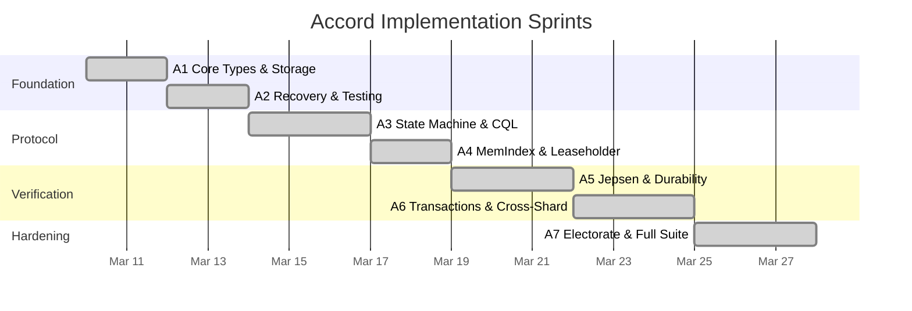

# Accord Transaction Project Plan

> Last updated: 2026-03-22
> Status: Complete (all 7 sprints delivered)

## Overview

The Accord transaction implementation was delivered across 7 sprints (A1-A7), building from core types through full Jepsen-verified consensus with electorate reconfiguration. Total: 2,808 passing tests.

## Sprint Summary

## Sprint A1: Core Types and Storage Integration

**Status: Complete**

| Deliverable | Status |
|-------------|--------|
| `Timestamp` (HLC hybrid logical clock) | Done |
| `TxnId` (transaction identifier: node + sequence + HLC) | Done |
| `Ballot` (ballot numbers for consensus voting) | Done |
| `ConflictIndex` (key-range conflict detection) | Done |
| `ProtocolLog` (durable transaction decision log) | Done |
| `SyncWriter` (durable write-ahead for Accord commits) | Done |
| `WriteGate` (DDL drain-and-block gate) | Done |

## Sprint A2: Recovery and Foundation Testing

**Status: Complete**

| Deliverable | Status |
|-------------|--------|
| `ReorderBuffer` (dependency-ordered apply) | Done |
| `RecoveryCoordinator` (interrupted transaction recovery) | Done |
| `TestCluster` (in-process multi-node test harness) | Done |
| 24-step EPaxos protocol round-trip test | Done |
| IF condition parsing in CQL parser | Done |
| Pagination support | Done |
| Heartbeat and SkewMax clock handling | Done |
| Accord internode messages (PreAccept, Accept, Commit, etc.) | Done |
| CQL functions: `now()`, `toTimestamp()`, `TTL()` | Done |
| SERIAL / LOCAL_SERIAL consistency levels | Done |
| Debouncer Accord ordering | Done |

## Sprint A3: State Machine and CQL Integration

**Status: Complete**

| Deliverable | Status |
|-------------|--------|
| `AccordStateMachine` (39 tests) | Done |
| `AccordCoordinator` (fast/slow path, quorum formulas) | Done |
| CQL Router → Accord integration | Done |
| LWT: INSERT IF NOT EXISTS | Done |
| LWT: IF conditions on UPDATE/DELETE | Done |
| Batch CAS | Done |
| `DepWaitGraph` (dependency-wait with cycle detection) | Done |
| `DdlDrain` (DDL drain-and-block) | Done |
| 11 recovery scenarios | Done |
| 4 property-based tests | Done |

## Sprint A4: MemIndex and Leaseholder

**Status: Complete**

| Deliverable | Status |
|-------------|--------|
| `MemIndex` (BTreeMap-based in-memory conflict index) | Done |
| Leaseholder assignment | Done |
| Linearizable local reads via leaseholder | Done |

## Sprint A5: Jepsen Infrastructure and Durability

**Status: Complete**

| Deliverable | Status |
|-------------|--------|
| Jepsen `TestCluster` (in-process multi-node) | Done |
| `NemesisController` (fault injection) | Done |
| `HistoryRecorder` (operation logging) | Done |
| `LinearizabilityChecker` (linearizability verification) | Done |
| Jepsen register test (3 workloads: read, write, CAS) | Done |
| Crash recovery replay from `.accord` sidecar files | Done |
| `.accord` sidecar file format and I/O | Done |
| `DurabilityService` | Done |
| `ExclusiveSyncPoint` | Done |
| Performance baseline measurements | Done |
| SUBSCRIBE dual timestamps (Accord ordering) | Done |

## Sprint A6: Transactions and Cross-Shard

**Status: Complete**

| Deliverable | Status |
|-------------|--------|
| `BEGIN TRANSACTION` / `COMMIT` / `ROLLBACK` parser | Done |
| Read-set / write-set extraction | Done |
| Transaction limits (max statements, max keys, timeout) | Done |
| Cross-shard execution | Done |
| Client retry on Accord contention | Done |
| Cross-shard conflict detection | Done |
| Jepsen bank test (balance preservation) | Done |
| Jepsen write-skew test (serializable isolation) | Done |
| 9 Accord observability metrics | Done |

## Sprint A7: Electorate Reconfiguration and Full Suite

**Status: Complete**

| Deliverable | Status |
|-------------|--------|
| Transactional secondary index reads (READ_2I, 5-layer merge) | Done |
| Electorate reconfiguration: epoch propagation | Done |
| `JoinElectorate` 4-gate (Prepare → Transfer → Activate → Verify) | Done |
| Electorate shrink/resize on node decommission | Done |
| Epoch transition drain | Done |
| Two-phase DDL with Accord coordination | Done |
| Full Jepsen nemesis suite | Done |
| Chaos minority kill | Done |
| Performance regression suite | Done |
| UDF/UDA integration with Accord (18 tests) | Done |

## Test Count Breakdown

| Category | Count |
|----------|-------|
| AccordStateMachine unit tests | 39 |
| AccordCoordinator tests | ~50 |
| ConflictIndex / MemIndex tests | ~30 |
| ProtocolLog tests | ~20 |
| RecoveryCoordinator (11 scenarios) | ~40 |
| DepWaitGraph tests | ~15 |
| DdlDrain / WriteGate tests | ~15 |
| CrossShard tests | ~20 |
| Leaseholder / DurabilityService tests | ~15 |
| Electorate reconfiguration tests | ~30 |
| Property-based tests | 4 |
| 24-step EPaxos test | 1 |
| Jepsen register (3 workloads) | ~30 |
| Jepsen bank test | ~10 |
| Jepsen write-skew test | ~10 |
| Chaos nemesis suite | ~20 |
| CQL LWT integration tests | ~40 |
| CQL transaction integration tests | ~30 |
| UDF/UDA integration tests | 18 |
| Pagination / built-in function tests | ~30 |
| Performance regression tests | ~10 |
| Other (SUBSCRIBE, debouncer, etc.) | ~30 |
| **Approximate total (Accord-related)** | **~500** |

Combined with existing test suite (~2,300), total reaches ~2,808.

## Risk Mitigations

| Risk | Mitigation | Status |
|------|-----------|--------|
| Split brain during partition | Jepsen register + nemesis testing | Verified |
| Data loss on coordinator crash | `.accord` sidecar files + recovery | Verified |
| Dependency cycle deadlock | Cycle detection in DepWaitGraph | Verified |
| DDL during active transactions | DdlDrain + WriteGate + two-phase DDL | Verified |
| Performance regression | Baseline + automated regression suite | Monitored |
| Electorate reconfiguration races | 4-gate join protocol + epoch drain | Verified |
| Write skew anomaly | Jepsen write-skew test | Verified |
| Balance invariant violation | Jepsen bank test | Verified |

## Related Specs

- [Accord Specification](accord.md) — protocol details and component descriptions
- [Status](status.md) — overall project status
- [Components](components.md) — crate architecture
- [Testing](testing.md) — test infrastructure
