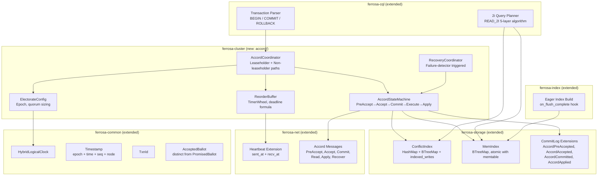
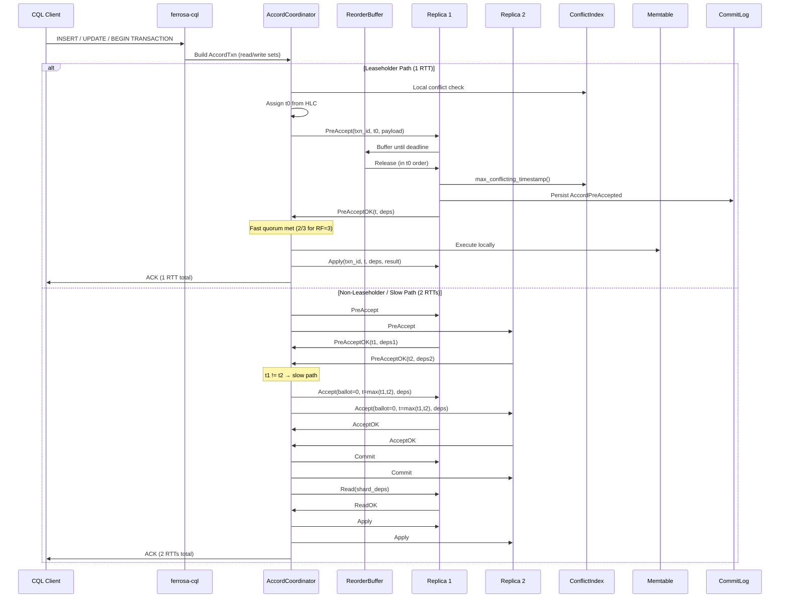
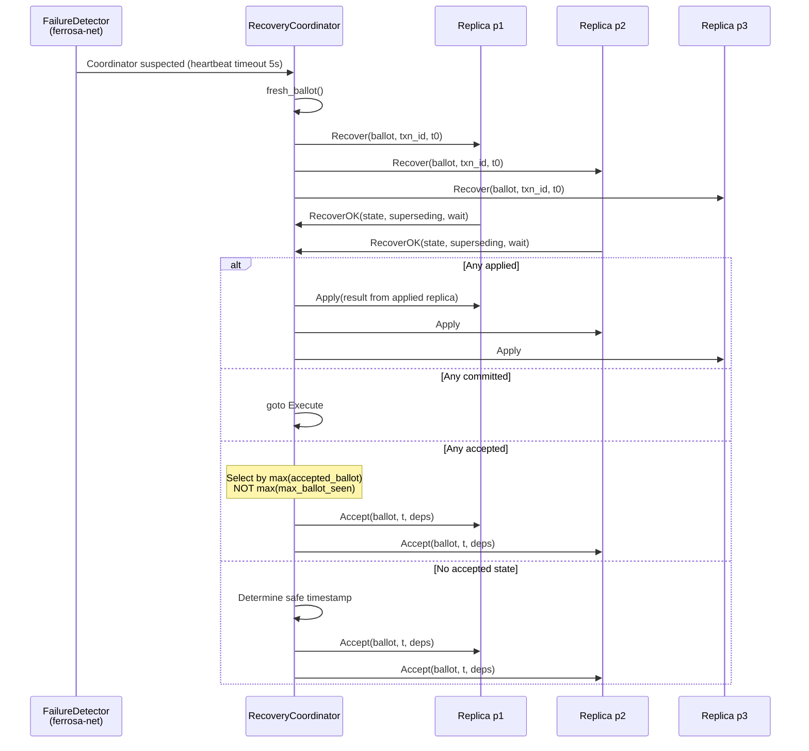
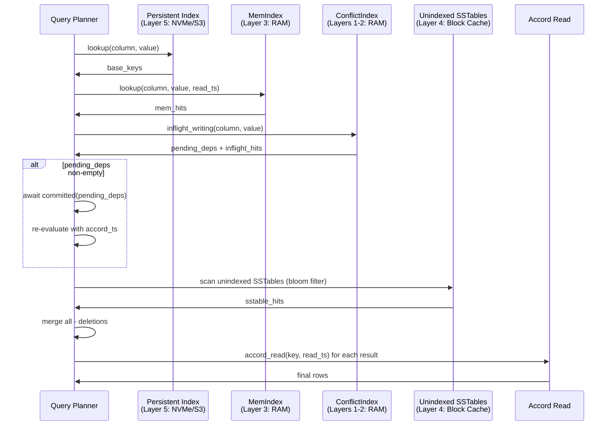

# Accord Distributed Transactions

> Last updated: 2026-03-21
> Status: Draft
> Source: research/SPEC-accord-transactions.md

## Overview

Accord is a leaderless distributed transaction protocol that provides strict-serializable ACID transactions across multiple CQL tables and partitions. All writes — including single-key INSERTs — are routed through Accord, eliminating the mixing problem where non-Accord writes are invisible to dependency tracking.

### Goals

- G1: Single-key writes in 1 RTT at P50 (normal conditions)
- G2: Multi-key transactions in 1-2 RTTs
- G3: Strict serializability for all writes regardless of CL setting
- G4: Linearizable reads with no extra RTT (no-conflict case)
- G5: Secondary indexes always consistent within a transaction
- G6: No lost commits or stale reads after node failure + recovery
- G7: All Jepsen correctness tests pass (bank, long-fork, monotonic, register, write-skew)
- G8: No regression in P50 write latency vs current QUORUM baseline (+/-15%)

### Non-Goals

- Byzantine fault tolerance
- Cross-datacenter transactions (initial release)
- Cassandra LWT (Paxos) API compatibility

## Component Architecture



## Crate Integration Map

| Crate | Changes | New Types/Modules |
|-------|---------|-------------------|
| ferrosa-common | Extended | `HybridLogicalClock`, `Timestamp{epoch,time,seq,node}`, `TxnId`, `AcceptedBallot`, `PromisedBallot`, `BallotNumber` |
| ferrosa-storage | Extended | `ConflictIndex`, `MemIndex`, `CommitLogEntry::{AccordPreAccepted, AccordAccepted, AccordCommitted, AccordApplied}` |
| ferrosa-cluster | New submodule | `accord/` module: `AccordStateMachine`, `AccordCoordinator`, `ReorderBuffer`, `ElectorateConfig`, `RecoveryCoordinator` |
| ferrosa-net | Extended | `Message::{PreAccept, PreAcceptOK, Accept, AcceptOK, Commit, Read, ReadOK, Apply, ApplyOK, Recover, RecoverOK}`, heartbeat `sent_at`/`recv_at` |
| ferrosa-cql | Extended | `Statement::BeginTransaction`, `Statement::Commit`, `Statement::Rollback`; `READ_2I` in planner |
| ferrosa-index | Extended | `on_flush_complete` eager build trigger |

## Data Flow: Write Path with Accord



## Data Flow: Recovery Protocol



## Data Flow: Transactional 2i Read



## Core Data Structures

### Timestamp (ferrosa-common)

```
Timestamp { epoch: u64, time: u64, seq: u32, node: NodeId }
```

- **epoch**: Electorate configuration epoch. Transactions in different epochs cannot form fast-path quorums.
- **time**: Wall-clock nanoseconds from local HLC. Loosely synchronized via NTP/PTP.
- **seq**: Logical sequence, incremented on conflict bump. Starts at 0.
- **node**: Assigning node's ID. Ensures global uniqueness.
- **Ordering**: Fields sorted `epoch > time > seq > node` for `PartialOrd` correctness.

### TxnState (per-replica, per-transaction)

Two ballot fields (MANDATORY — see ADR below):

- `max_ballot_seen: PromisedBallot` — highest ballot promised (joined)
- `accepted_ballot: AcceptedBallot` — highest ballot voted in

These are distinct Rust types to prevent confusion at compile time.

### ConflictIndex (ferrosa-storage)

Three-tier conflict detection:

1. **single_key**: `HashMap<PartitionKey, SmallVec<[InFlightWrite; 4]>>` — O(1) for >95% of operations
2. **range_ops**: `BTreeMap<TokenRange, BTreeSet<(Timestamp, TxnId)>>` — O(log n) for range queries
3. **indexed_writes**: `HashMap<ColumnId, HashMap<CellValue, Vec<TxnId>>>` — column projections for transactional 2i

Bounded size: ~500 entries at 100K TPS x 5ms avg latency.

### ReorderBuffer (ferrosa-cluster)

TimerWheel-based buffer (NOT individual tokio::time::sleep calls) that delays PreAccept processing until arrival deadline:

```
Deadline(t0, C, P) = wall_clock(t0.time) + SkewMax + max(Latency(C', P)) - Latency(C, P)
```

- SkewMax: P99.9 of observed clock offsets (measured via heartbeats, not NTP config)
- Latency: P99 of one-way message delay (heartbeat RTT / 2)
- Buffer depth bounded: SkewMax + max_latency x TPS per shard (~100 entries at 1ms, 100K TPS)
- In-memory only; lost messages re-sent by coordinators after timeout

### MemIndex (ferrosa-storage)

```
BTreeMap<CellValue, BTreeMap<Timestamp, MemIndexEntry>>
```

- Updated atomically with memtable in Apply handler
- GC'd on flush: `flush_gc(flushed_up_to_ts)` removes entries covered by persistent index
- Partition reverse lookup: `HashMap<PartitionKey, HashSet<CellValue>>` for DELETE handling

## Commit Log Extensions

Four new entry types added to `CommitLogEntry` enum:

| Entry | Persisted Before | GC Condition |
|-------|-----------------|--------------|
| `AccordPreAccepted` | Sending `PreAcceptOK` | After `AccordApplied` flushed to SSTable |
| `AccordAccepted` | Sending `AcceptOK` | After `AccordApplied` flushed to SSTable |
| `AccordCommitted` | Setting `committed` flag | After `AccordApplied` flushed to SSTable |
| `AccordApplied` | Setting `applied` flag | After SSTable uploaded to S3 |

Write amplification: 4 commit log entries per transaction vs 1 today. Monitor `FERROSA_S3_UPLOAD_QUEUE_DEPTH`.

## Flexible Electorates

Quorum sizing computed dynamically from electorate size:

| Config | RF=3, f_fast=0 | RF=5, f_fast=1 |
|--------|----------------|----------------|
| Fast quorum | 2/3 | 4/5 |
| Slow quorum | 2/3 (majority) | 3/5 (majority) |

Electorate changes managed by existing openraft metadata group. Epoch field in Timestamp prevents cross-epoch fast-path quorums. New members wait for `JoinElectorate` notifications from prior electorate before participating.

## UDF/UDA Branch Integration Points

The `feature/udf-uda-query-time` branch introduces changes that interact with Accord:

| Component | Change | Accord Impact |
|-----------|--------|---------------|
| `LateDataDebouncer` (timeseries) | Local state, not replicated | Must be deterministic or consensus-ordered for re-aggregation |
| `DeleteTarget` enum (CQL AST) | `Column(String)` + `MapElement{column, key}` | Must serialize correctly in Accord commit log |
| `WhereClause.token_fn` | Token-range predicates | Accord routing must recognize range scans vs point lookups |
| Row-level deletion LWW (sharded memtable) | Deletion timestamp comparison | Must be idempotent when replayed from Accord log |
| Oversized commit log entries | Now returns error instead of panic | Accord error path must handle gracefully |
| `pk_indexes` in PREPARE | Driver token-aware routing metadata | Must be consistent across all replicas |
| Built-in aggregates (AVG, MIN, MAX, SUM) | Read-only | No conflict resolution needed |

## Architectural Decision Records

### ADR: Two Ballot Variables (MANDATORY)

**Context:** Sutra (2019) proved that EPaxos's single ballot variable allows replicas to misreport voting history during recovery, producing linearizability violations (24-step counter-example).

**Decision:** `TxnState` maintains two separate ballot fields as distinct Rust types:

- `max_ballot_seen: PromisedBallot` — updated when joining a ballot
- `accepted_ballot: AcceptedBallot` — updated only when voting

Recovery coordinators select values by `max(accepted_ballot)`, never `max(max_ballot_seen)`.

**Enforcement:** Distinct newtype wrappers prevent compile-time confusion. The 24-step EPaxos correctness test is a mandatory CI gate.

### ADR: All Writes Through Accord

**Context:** Mixing Accord and non-Accord writes makes non-Accord writes invisible to dependency tracking, violating strict serializability.

**Decision:** All writes — including single-key INSERT/UPDATE — route through Accord. No bypass for any CL setting.

**Trade-off:** Single-key writes add one network round-trip (PreAccept) vs current direct quorum write. Leaseholder optimization recovers most of this cost.

### ADR: Superset Dependency Model

**Context:** Caesar's precise dependency tracking causes livelock under contention.

**Decision:** Use Accord's superset dependency model. `deps(tau)` may contain entries beyond the minimum required (adds unnecessary waits, not incorrect waits). Missing a dependency is unsafe; extra dependencies are safe.

### ADR: Timer Wheel for ReorderBuffer

**Context:** One tokio::time::sleep per enqueued message = O(n) timers = unacceptable overhead at high TPS.

**Decision:** Use a timer wheel (hierarchical timing wheel) for O(1) insert/expire. Single thread drives all deadlines for a shard.

### ADR: Eager Index Build

**Context:** Deferred index builds leave a gap (Layer 4 in READ_2I) that grows under write load.

**Decision:** Trigger async secondary index build immediately after each SSTable flush at `Priority::High`. Keeps Layer 4 at 0-1 entries in steady state.

## Implementation Phases

| Phase | Gate | Key Deliverables |
|-------|------|-----------------|
| 0: Foundation | Unit tests + 24-step test pass | HLC, Timestamp, TxnId, ConflictIndex, MemIndex, commit log types, ReorderBuffer, heartbeat extension |
| 1: Single-Key Accord | Jepsen register + P50 within 15% baseline | AccordStateMachine, leaseholder fast path, linearizable reads, recovery, commit log replay, ElectorateConfig |
| 2: Multi-Key Txns | Jepsen bank + write-skew pass | BEGIN/COMMIT/ROLLBACK parser, cross-shard Execute, client retry |
| 3: Transactional 2i | 2i correctness + dep-wait P99 < 5ms | MemIndex integration, READ_2I algorithm, CommitIndex projections, eager index build |
| 4: Electorate Reconfig | Chaos test + Jepsen all-tests with nemesis | Epoch propagation, JoinElectorate, electorate shrink |

## Open Questions

1. **CL=ONE bypass?** Proposed: CL=ONE still goes through Accord but skips Execute phase (fire-and-forget after Commit). Preserves dependency tracking.
2. **Schema changes as Accord transactions?** Phase 1: blocking drain. Phase 4: model DDL as spanning all partitions.
3. **SUBSCRIBE ordering with Accord timestamps.** Apply order becomes deterministic (Accord `t` ordering). Expose `accord_ts` in change event payload.
4. **S3 upload queue depth.** 4x commit log entries may need queue increase from 16 to 64.
5. **AccordApplied.result in SSTables.** Options: (a) separate column family, (b) hidden system column, (c) separate file per SSTable. Needs profiling.
