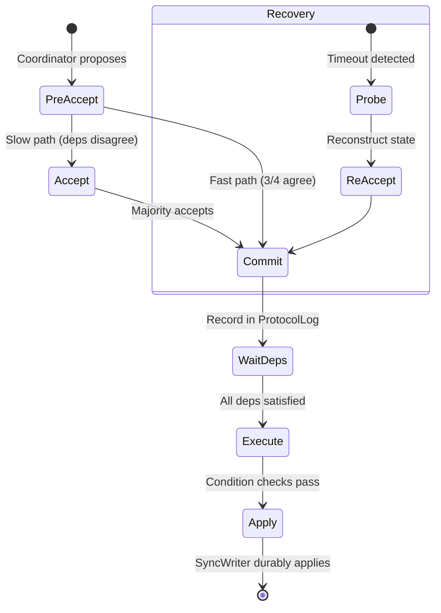

# Accord Consensus Protocol

> Last updated: 2026-03-22
> Status: Implemented (Sprints A1-A7 complete)

## Overview

Ferrosa implements the Accord consensus protocol for distributed transactions, providing serializable isolation without a dedicated coordinator. The implementation is based on the Accord protocol from Cassandra 5.x, adapted for Ferrosa's Rust architecture.

Accord enables:

- **Lightweight Transactions (LWT)**: INSERT IF NOT EXISTS, IF conditions on UPDATE/DELETE
- **Multi-statement transactions**: BEGIN TRANSACTION / COMMIT / ROLLBACK
- **Cross-shard transactions**: Transactions spanning multiple token ranges
- **Serializable isolation**: Linearizable reads via leaseholder optimization

## Protocol Phases



### Phase 1: PreAccept

The coordinator generates a `TxnId` (HLC timestamp + node ID + sequence) and sends `PreAccept` messages to the electorate (replicas responsible for the transaction's key range).

Each replica:

1. Checks `ConflictIndex` for overlapping key ranges with pending transactions
2. Records the transaction in its `ProtocolLog`
3. Returns its dependency set (transactions that must execute before this one)

### Phase 2a: Fast Path

If a 3/4 supermajority of the electorate agrees on the same dependency set, the coordinator skips the Accept phase and proceeds directly to Commit. This is the common case when there is no contention.

### Phase 2b: Slow Path (Accept)

If dependencies disagree (contention detected), the coordinator merges all dependency sets and sends `Accept` messages. A simple majority suffices for the Accept phase.

### Phase 3: Commit

The coordinator sends `Commit` messages to all replicas. Each replica:

1. Records the committed state in `ProtocolLog`
2. Writes to `.accord` sidecar file for crash recovery
3. Notifies the `DepWaitGraph` that this transaction is committed

### Phase 4: Execute

The `DepWaitGraph` monitors dependencies. Once all dependencies of a transaction are satisfied (committed and executed), the transaction proceeds to execution:

1. For LWT: evaluate the IF condition against current data
2. For multi-statement transactions: validate read-set, apply write-set
3. Apply writes via `SyncWriter` (durable write-ahead)

## Core Components

### AccordStateMachine

The core consensus state machine implementing the Accord protocol. Manages transaction state transitions (PreAccepted → Accepted → Committed → Executed → Applied).

- **39 unit tests** covering all state transitions and edge cases
- Thread-safe with interior mutability for concurrent access

### AccordCoordinator

Drives the multi-phase consensus protocol:

- **Fast path**: 3/4 supermajority quorum (e.g., 3 of 4 replicas)
- **Slow path**: Simple majority quorum
- **Quorum formulas**: Configurable per replication factor
- Routes CQL LWT and transaction statements through the Accord protocol

### ConflictIndex

Detects conflicts between concurrent transactions by tracking key ranges:

- Key-range overlap detection for partition and clustering keys
- Thread-safe concurrent access
- Efficient range-based lookups

### MemIndex

BTreeMap-based in-memory conflict index providing O(log n) lookups for conflict detection. Used by the AccordStateMachine for fast key-range intersection queries.

### ProtocolLog

Durable record of all transaction decisions:

- Records PreAccept, Accept, and Commit decisions
- Supports recovery queries by TxnId
- Integrated with `.accord` sidecar files for crash durability

### RecoveryCoordinator

Handles recovery of interrupted transactions (coordinator failure):

- **11 recovery scenarios** covering all protocol phases
- Probes replicas to reconstruct transaction state
- Re-drives Accept/Commit as needed
- Ballot-based leader election prevents concurrent recovery conflicts

### DepWaitGraph

Dependency-wait tracking with cycle detection:

- Tracks which transactions are waiting on which dependencies
- Detects dependency cycles (which indicate protocol bugs)
- Notifies waiting transactions when dependencies complete

### DdlDrain

Coordinates DDL operations with active Accord transactions:

- Closes `WriteGate` to block new transactions
- Waits for all in-flight transactions to complete
- Enables two-phase DDL with epoch-based transitions

### CrossShard

Handles transactions spanning multiple token ranges:

- Partitions transaction keys by token range into per-shard sets
- Coordinates PreAccept/Accept/Commit across multiple electorates
- Merges dependency sets from all shards

### Leaseholder

Optimizes reads for linearizability:

- Assigns leaseholder for each token range
- Leaseholder can serve reads locally without consensus round-trip
- Lease renewal via heartbeat protocol

### DurabilityService

Provides durability guarantees via ExclusiveSyncPoint:

- Ensures committed transactions are durable before acknowledging
- Coordinates with storage SyncWriter for write-ahead logging
- Supports batch durability for throughput optimization

### Electorate Reconfiguration

Handles topology changes (node join/leave) during active transactions:

- **Epoch propagation**: New epoch numbers coordinate reconfiguration
- **JoinElectorate 4-gate**: Staged join process (Prepare → Transfer → Activate → Verify)
- **Shrink/resize**: Safe electorate reduction when nodes decommission
- **Epoch transition drain**: In-flight transactions at old epoch complete before new epoch activates

## Storage Integration

### SyncWriter

Durable write-ahead for Accord transaction commits. Writes to the commit log before acknowledging transaction completion.

### WriteGate

DDL drain-and-block gate. When a DDL operation starts:

1. Gate closes — new Accord transactions are rejected
2. In-flight transactions complete
3. DDL executes
4. Gate opens — new transactions resume

### ReorderBuffer

Ensures transactions are applied in dependency order. Transactions that arrive out of order are buffered until their dependencies complete.

### Sidecar Files

`.accord` sidecar files store in-flight transaction state for crash recovery:

- Written alongside SSTable data
- On restart, sidecar files are replayed to reconstruct `ProtocolLog`
- Enables recovery without re-running full consensus protocol

## CQL Integration

### LWT Statements

```sql
-- INSERT IF NOT EXISTS
INSERT INTO users (id, name) VALUES (1, 'alice') IF NOT EXISTS;

-- UPDATE with IF condition
UPDATE users SET name = 'bob' WHERE id = 1 IF name = 'alice';

-- DELETE with IF condition
DELETE FROM users WHERE id = 1 IF name = 'bob';

-- Batch CAS
BEGIN BATCH
  INSERT INTO users (id, name) VALUES (1, 'alice') IF NOT EXISTS;
  INSERT INTO profiles (id, bio) VALUES (1, 'hello') IF NOT EXISTS;
APPLY BATCH;
```

LWT statements are routed through `AccordCoordinator` when `SERIAL` or `LOCAL_SERIAL` consistency is requested.

### Multi-Statement Transactions

```sql
BEGIN TRANSACTION;
  SELECT balance FROM accounts WHERE id = 1;
  UPDATE accounts SET balance = balance - 100 WHERE id = 1;
  UPDATE accounts SET balance = balance + 100 WHERE id = 2;
COMMIT;
```

The parser extracts read-set and write-set from the transaction body. Transaction limits prevent unbounded resource usage:

- Maximum statements per transaction
- Maximum keys per transaction
- Timeout per transaction

### Consistency Levels

| Level | Behavior |
|-------|----------|
| `SERIAL` | Global serializable via Accord |
| `LOCAL_SERIAL` | DC-local serializable via Accord |
| `QUORUM` | Standard quorum (non-transactional) |

## Observability

9 Accord-specific metrics are exposed via the Prometheus endpoint (`/metrics`):

| Metric | Type | Description |
|--------|------|-------------|
| `ferrosa_accord_transactions_total` | Counter | Total transactions processed |
| `ferrosa_accord_fast_path_total` | Counter | Fast path completions |
| `ferrosa_accord_slow_path_total` | Counter | Slow path completions |
| `ferrosa_accord_contention_total` | Counter | Contention events (client retry) |
| `ferrosa_accord_recovery_total` | Counter | Recovery coordinator invocations |
| `ferrosa_accord_dep_wait_cycles` | Counter | Dependency cycles detected |
| `ferrosa_accord_cross_shard_total` | Counter | Cross-shard transactions |
| `ferrosa_accord_electorate_reconfig_total` | Counter | Electorate reconfigurations |
| `ferrosa_accord_apply_latency_seconds` | Histogram | Transaction apply latency |

## Testing

### Unit Tests

- **AccordStateMachine**: 39 tests covering state transitions, quorum logic, conflict detection
- **AccordCoordinator**: Fast path, slow path, quorum formula validation
- **ConflictIndex**: Overlap detection, concurrent access
- **ProtocolLog**: Durability, recovery queries
- **RecoveryCoordinator**: 11 recovery scenarios at each protocol phase
- **DepWaitGraph**: Dependency tracking, cycle detection
- **DdlDrain**: Drain timing, gate open/close semantics
- **CrossShard**: Multi-shard coordination, partial failure handling

### Property-Based Tests

4 property-based tests verify consensus invariants:

- Agreement: all replicas agree on transaction outcome
- Validity: only proposed values are committed
- Termination: all non-faulty transactions eventually complete
- Serialization: committed transactions have a total order

### 24-Step EPaxos Test

A comprehensive protocol round-trip test with dependency tracking, exercising the full PreAccept → Accept → Commit → Execute → Apply pipeline with multiple concurrent transactions and controlled dependency resolution.

### Jepsen-Style Tests

Built-in Jepsen infrastructure (`TestCluster`, `NemesisController`, `HistoryRecorder`, `LinearizabilityChecker`):

| Test | Workloads | Validates |
|------|-----------|-----------|
| Register test | 3 (read, write, CAS) | Linearizability of single-key operations |
| Bank test | 1 (transfer) | Balance preservation under concurrent transfers |
| Write-skew test | 1 (read-then-write) | Serializable isolation (no write skew anomaly) |

### Chaos / Nemesis Suite

Full nemesis suite for fault injection:

- Network partition (split brain)
- Minority node kill
- Clock skew injection (SkewMax)
- Coordinator crash during each protocol phase
- Crash recovery replay from `.accord` sidecar files

### Performance Tests

- Performance baseline: latency and throughput under normal operation
- Regression suite: automated detection of performance degradation
- Debouncer Accord ordering tests

### UDF/UDA Integration

18 tests validating WASM UDF/UDA execution within Accord transactions:

- UDF calls in transactional SELECT
- UDA state accumulation within transactions
- UDF failure handling (resource exhaustion, timeout) within transactions

## Implementation Sprints

| Sprint | Focus | Status |
|--------|-------|--------|
| A1 | Core types, ConflictIndex, ProtocolLog, SyncWriter, WriteGate | Complete |
| A2 | ReorderBuffer, RecoveryCoordinator, TestCluster, 24-step EPaxos, IF parsing | Complete |
| A3 | AccordStateMachine, AccordCoordinator, CQL Router, LWT, dep-wait, DDL drain | Complete |
| A4 | MemIndex, leaseholder, linearizable local reads | Complete |
| A5 | Jepsen infrastructure, register test, crash recovery, sidecar files, DurabilityService | Complete |
| A6 | BEGIN TRANSACTION/COMMIT/ROLLBACK, cross-shard, client retry, Jepsen bank/write-skew | Complete |
| A7 | Transactional 2i, electorate reconfiguration, two-phase DDL, full nemesis suite, UDF/UDA integration | Complete |

## Related Specs

- [Overview](overview.md) — system overview
- [Components](components.md) — crate architecture (Accord modules listed under ferrosa-cluster)
- [Data Flow](data-flow.md) — Accord transaction flow diagrams
- [Accord Project Plan](accord-project-plan.md) — sprint completion details
- [Testing](testing.md) — test infrastructure
- [CQL](cql.md) — CQL protocol (LWT syntax, transaction syntax)
