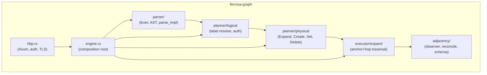
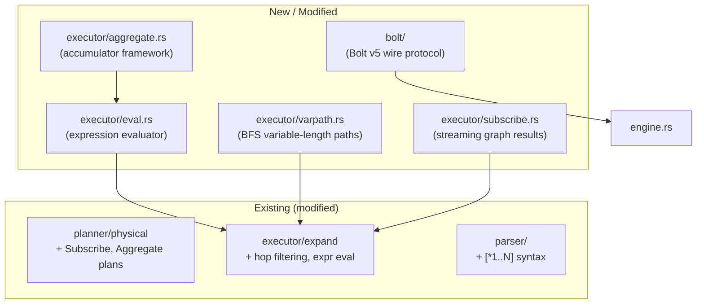
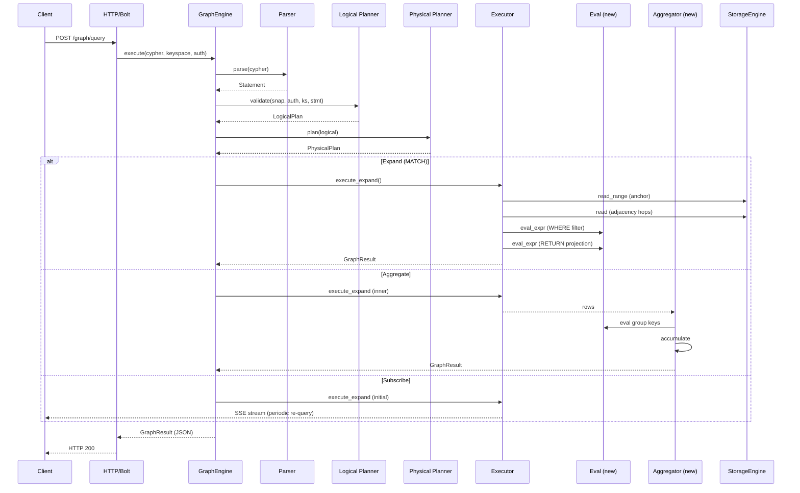

# Graph Gap Closure — Architecture Spec

> Last updated: 2026-03-17
> Status: Completed — all 7 gaps (G1-G7) implemented in v1.0.0-beta.4

## Overview

ferrosa-graph shipped Phase 1 with a Cypher parser, MATCH/CREATE/SET/DELETE planning
and execution, adjacency index with reconciliation, and an HTTP/JSON endpoint with
auth+TLS. This spec covers the remaining gaps to bring the graph engine to feature
parity with the documented Cypher subset.

## Gap Inventory

| # | Gap | Complexity | Dependencies |
|---|-----|-----------|--------------|
| G1 | SUBSCRIBE/UNSUBSCRIBE execution | M | `ferrosa-cql` subscription observer pattern |
| G2 | Aggregation functions (count, sum, avg, min, max, collect) | M | Expression evaluator |
| G3 | Variable-length paths `[*1..N]` | L | Parser extension + BFS/DFS executor |
| G4 | Hop property filtering | S | Expression evaluator |
| G5 | Function calls in RETURN | M | Expression evaluator |
| G6 | Bolt protocol | XL | New wire protocol, separate TCP listener |
| G7 | WCO joins / leapfrog triejoin | XL | Research-grade algorithm, adjacency schema changes |

## Architecture

### Current Module Map



### Proposed New Modules



## Gap Details

### G1: SUBSCRIBE/UNSUBSCRIBE Execution

**Current state:** Parsed and validated in logical planner. Physical planner returns
"not yet supported".

**Design:** Follow the `ferrosa-cql` subscription pattern:

1. Add `PhysicalPlan::Subscribe { inner, interval, delta }` variant
1. `execute_subscribe` runs the inner MATCH plan, returns initial snapshot
1. `GraphEngine` tracks active subscriptions in a `DashMap<u16, SubscriptionHandle>`
1. Background tokio task re-runs the query at `interval` and pushes deltas via
   the HTTP response (SSE) or WebSocket
1. `UNSUBSCRIBE` cancels the task via `JoinHandle::abort()`

**Files:**

- Modify: `planner/physical.rs` — add Subscribe variant + plan function
- Create: `executor/subscribe.rs` — subscription lifecycle
- Modify: `engine.rs` — subscription registry
- Modify: `http.rs` — SSE endpoint for streaming results

### G2: Aggregation Functions

**Current state:** `count()`, `sum()`, etc. parsed as `Expr::Function` but not
evaluated during execution.

**Design:**

1. Create `executor/eval.rs` — expression evaluator operating on `serde_json::Value`
1. Create `executor/aggregate.rs` — accumulator trait + implementations:
   - `CountAcc`, `SumAcc`, `AvgAcc`, `MinAcc`, `MaxAcc`, `CollectAcc`
1. Add `PhysicalPlan::Aggregate { inner, group_keys, accumulators, return_clause }`
1. Physical planner detects aggregate functions in RETURN and emits Aggregate plan
1. Executor collects all rows from inner plan, groups, accumulates, projects

**Expression evaluator** (`eval.rs`):

```rust
pub fn eval_expr(expr: &Expr, bindings: &HashMap<String, Value>) -> Result<Value>
```

Handles: `Property`, `Var`, `Literal`, `Comparison`, `Arithmetic`, `And`/`Or`/`Not`,
`IsNull`/`IsNotNull`, `Function` (delegates to aggregate or built-in).

**Files:**

- Create: `executor/eval.rs`
- Create: `executor/aggregate.rs`
- Modify: `planner/physical.rs` — Aggregate plan variant
- Modify: `executor/expand.rs` — use `eval_expr` for WHERE filtering

### G3: Variable-Length Paths

**Current state:** Not in grammar. Parser does not recognize `[*1..5]`.

**Design:**

1. Extend `Pattern::Rel` with `length_range: Option<(u32, Option<u32>)>`
1. Extend lexer to recognize `*` inside relationship brackets
1. Parser: `[*]`, `[*3]`, `[*1..5]`, `[:KNOWS*1..3]`
1. Add `PhysicalPlan::ExpandVarLength` variant with min/max hops
1. Executor uses BFS with depth tracking and cycle detection (visited set)
1. T4 limits apply: `max_fan_out_per_hop` * `max_hops` caps total work

**Files:**

- Modify: `parser/ast.rs` — add length range to Rel
- Modify: `parser/parse_impl.rs` — parse `*` range syntax
- Create: `executor/varpath.rs` — BFS executor
- Modify: `planner/physical.rs` — ExpandVarLength plan

### G4: Hop Property Filtering

**Current state:** Relationship patterns accept `{key: value}` props in the parser
but they are ignored during execution.

**Design:**

1. Carry `PropMap` from `Pattern::Rel` through to `Hop` in physical plan
1. During adjacency traversal, after reading neighbor rows, evaluate prop
   filters using `eval_expr`
1. Read the edge table row (not just adjacency index) to get property values
1. Filter non-matching edges before adding to `next_keys`

**Files:**

- Modify: `planner/physical.rs` — add `filters: Vec<Expr>` to `Hop`
- Modify: `executor/expand.rs` — apply hop filters during traversal

### G5: Function Calls in RETURN

**Current state:** Parsed as `Expr::Function` but `expr_to_column_name` returns `"?"`.

**Design:** Depends on G2 expression evaluator. Non-aggregate functions (`id()`,
`type()`, `labels()`, `keys()`, `toString()`, `toInteger()`, `toFloat()`,
`coalesce()`, `size()`) evaluated inline during result projection via `eval_expr`.

**Files:**

- Modify: `executor/expand.rs` — use `eval_expr` for RETURN items
- Modify: `executor/eval.rs` — implement built-in scalar functions

### G6: Bolt Protocol

**Current state:** Only HTTP/JSON endpoint on port 7474.

**Design:** Bolt v5.x wire protocol over TCP for Neo4j driver compatibility.

1. New `bolt/` module: `codec.rs` (chunked framing), `message.rs` (PackStream),
   `handshake.rs` (version negotiation), `server.rs` (Tokio TCP listener)
1. Reuse `GraphEngine` for query execution — Bolt is just a transport
1. Map Bolt messages (RUN, PULL, BEGIN, COMMIT, ROLLBACK) to engine operations
1. New TCP listener on configurable port (default 7687)

**Scope:** This is a large standalone effort. Can be deferred without impacting
other gaps since HTTP/JSON covers all functionality.

**Files:**

- Create: `bolt/mod.rs`, `bolt/codec.rs`, `bolt/message.rs`, `bolt/handshake.rs`,
  `bolt/server.rs`
- Modify: `engine.rs` — expose session-oriented API for Bolt transactions
- Modify: `ferrosa/src/main.rs` — start Bolt listener

### G7: WCO Joins / Leapfrog Triejoin

**Current state:** Not implemented. Current executor uses simple nested-loop
expand from anchor.

**Design:** Research-grade optimization for multi-way pattern matching. Leapfrog
triejoin provides worst-case optimal join performance for cyclic patterns like
triangles.

**Prerequisite:** Sorted adjacency index (current B-tree backed storage already
provides this). Requires iterator interface over adjacency entries sorted by
neighbor ID.

**Scope:** XL effort. Defer until the simpler gaps are closed and there's
benchmark evidence that nested-loop expand is the bottleneck.

## Component Interactions



## Related Specs

- [Graph Design](../superpowers/specs/2026-03-12-ferrosa-graph-design.md)
- [Threat Model — Graph](threat-model-graph.md)
- [Status](status.md)
