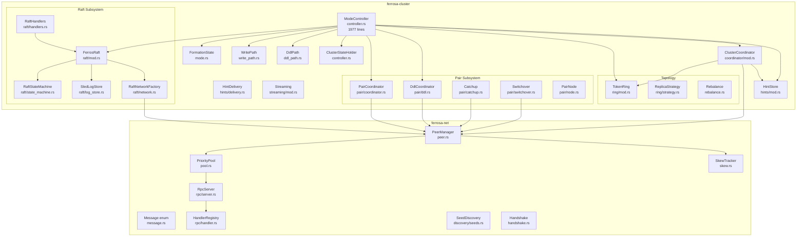
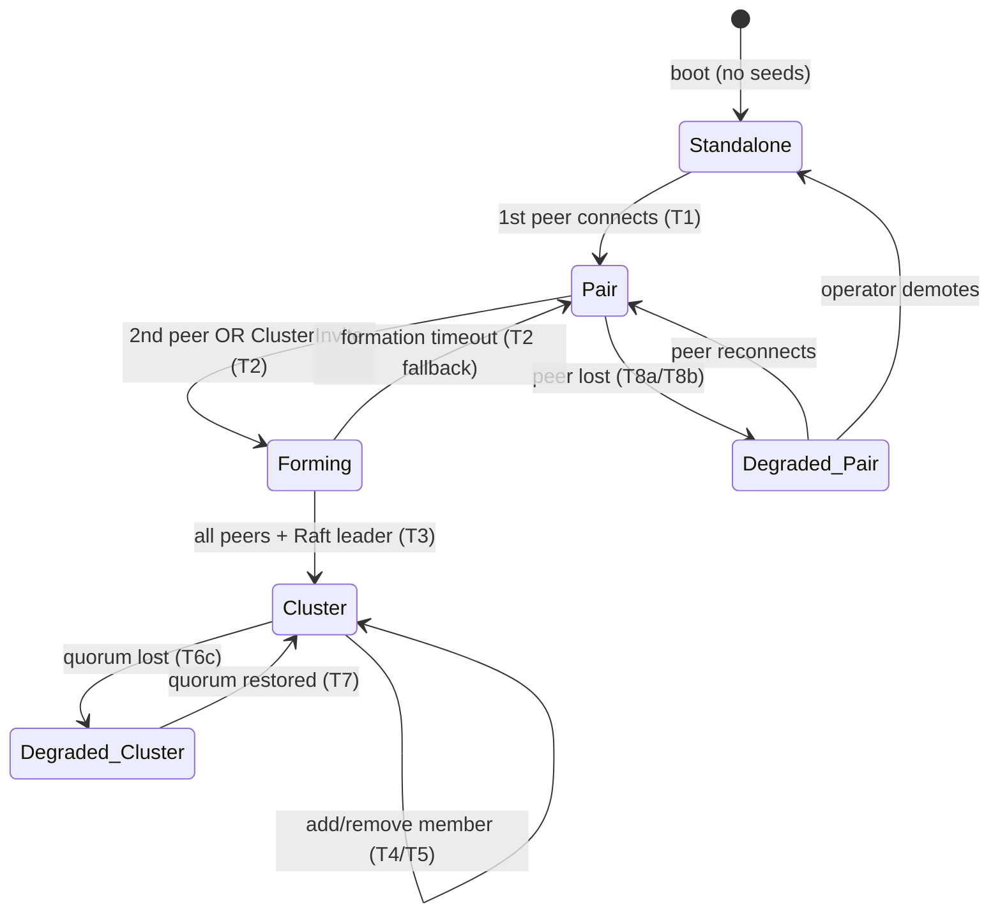
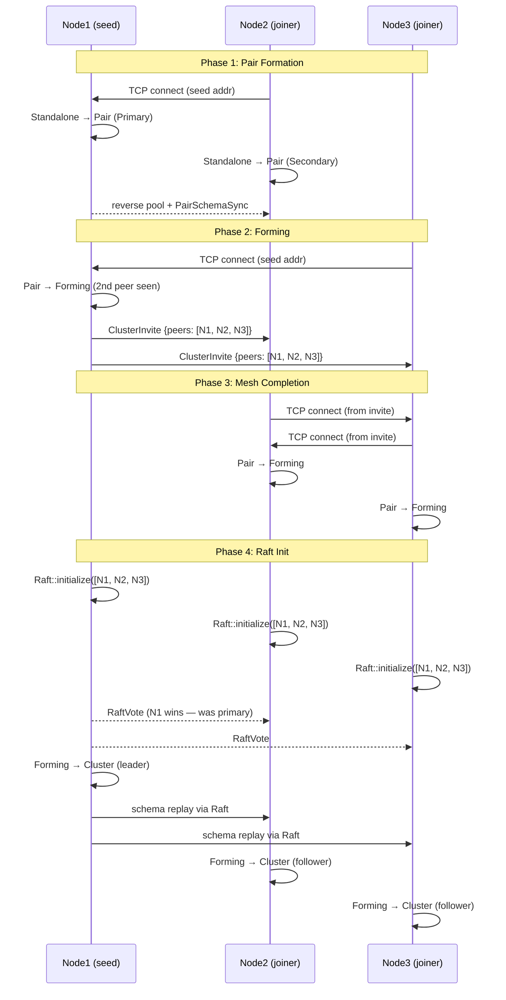
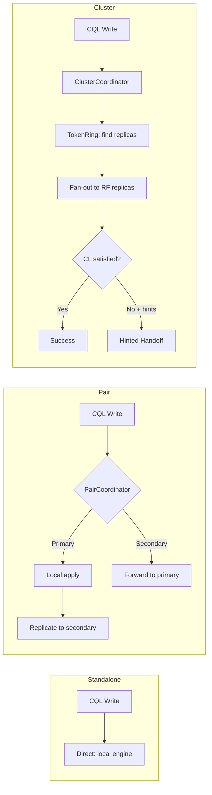

# Cluster Formation Architecture

> Last updated: 2026-04-01
> Status: Draft — implements specs/cluster-formation-state-machine.md
> Scope: Formation state machine, ClusterInvite protocol, degraded modes, decommission

## Overview

Cluster formation is the subsystem that takes a ferrosa node from standalone operation through pair replication to a full Raft-managed cluster. It lives primarily in `ferrosa-cluster` with network transport in `ferrosa-net`.

The current implementation handles Standalone→Pair→Cluster transitions but has 7 known gaps (see [Spec vs Code Gaps](#spec-vs-code-gaps)). This architecture spec defines the target state after those gaps are closed.

## Component Diagram



## State Machine

### Current States (code)

```
DeploymentMode { Standalone, Pair, Cluster }
```

### Target States (spec)



### New Types Required

```rust
// Replace DeploymentMode with richer FormationState
pub enum FormationState {
    Standalone,
    Pair { role: PairRole, peer: PeerInfo },
    Forming {
        initiator: Uuid,
        known_peers: Vec<(Uuid, SocketAddr)>,
        connected: BTreeSet<Uuid>,
        deadline: Instant,
    },
    Cluster,
    DegradedPair {
        role: PairRole,
        peer: PeerInfo,      // remembered peer (disconnected)
        promoted: bool,       // operator ran ferrosa-ctl promote
    },
    DegradedCluster {
        missing: Vec<Uuid>,   // unreachable members
    },
}
```

## Data Flow: Cluster Formation (3 nodes, hub-and-spoke)



## Data Flow: Write Path by Mode



## Data Flow: DDL Path by Mode

| Mode | DDL Path | Consistency | Risk |
|------|----------|-------------|------|
| Standalone | Direct (local schema) | N/A | None |
| Pair | DdlCoordinator → sync to secondary | Best-effort | Secondary may miss DDL; catches up via PairSchemaSync |
| Forming | Direct (local only) | **Unreplicated** | DDL during this window only on initiator. Mitigated by Raft schema replay after leader election |
| Cluster | Raft consensus | Linearizable | None — full consensus |

## Component Responsibilities

### ModeController (`controller.rs`)

The orchestrator. Implements `PeerEventListener` (from ferrosa-net) and `InboundPeerCallback`. On peer events, evaluates the current `FormationState` and triggers transitions.

**Key methods:**
| Method | Lines | Trigger | Effect |
|--------|-------|---------|--------|
| `on_peer_connected` | 1208-1249 | PeerManager callback | Evaluates mode, dispatches to transition_to_* |
| `on_peer_disconnected` | 1251-1266 | PeerManager callback | Pair→Degraded, Cluster→Raft handles |
| `transition_to_pair` | 536-730 | 1st peer | Create PairCoordinator, swap WritePath/DdlPath |
| `transition_to_forming` | NEW | 2nd peer or ClusterInvite | Broadcast ClusterInvite, start mesh formation |
| `transition_to_cluster` | 741-1105 | All peers connected + Raft ready | Init Raft, TokenRing, ClusterCoordinator |
| `force_promote` | 489-504 | Operator command | Emergency: Degraded_Pair → Standalone primary |
| `switchover` | 509-534 | Operator command | Swap Primary/Secondary roles |
| `trigger_cluster_join` | 1112-1192 | Peer connects in Cluster mode | Propose JoinNode + AssignTokens via Raft |

### ClusterInvite Protocol (NEW — not yet implemented)

```rust
// ferrosa-net/src/message.rs — new variants
Message::ClusterInvite {
    initiator: Uuid,
    peers: Vec<(Uuid, SocketAddr)>,
}
Message::ClusterInviteAck {
    host_id: Uuid,
}
```

**Handler logic:**
1. For each peer in invite not already connected: initiate `PriorityPool::connect()`
2. If connected_peers ≥ 2: transition to Forming
3. Re-broadcast ClusterInvite to newly connected peers (propagation guarantee)

### Role Assignment

**Current code:** `PairRole::elect()` — higher UUID wins (deterministic but arbitrary).

**Target (spec):** Connection direction determines role:
- Node receiving connection = **Primary** (seed, has data)
- Node initiating connection = **Secondary** (joiner)
- Deterministic from TCP connection direction — no UUID comparison needed
- Simpler, no race conditions, naturally maps to data authority

### Degraded Modes

**Current code:** Pair disconnect → mode reset to Standalone (loses pair context).

**Target:**

| State | Reads | Writes | DDL | Recovery |
|-------|-------|--------|-----|----------|
| Degraded_Pair (secondary lost) | Full | Full (unreplicated) | Full (local) | Auto on reconnect |
| Degraded_Pair (primary lost) | Stale only | Unavailable | Unavailable | Operator promote or wait |
| Degraded_Cluster (quorum intact) | Full | CL=QUORUM ok, CL=ALL fails | Full (Raft ok) | Auto on reconnect |
| Degraded_Cluster (quorum lost) | Stale only (CL=ONE) | Unavailable | Unavailable | Auto if nodes return; operator force-reconfig if permanent |

## Spec vs Code Gaps

| # | Gap | Severity | Sprint |
|---|-----|----------|--------|
| 1 | Role election: UUID comparison vs connection direction | Medium | 1 |
| 2 | Missing Forming/Degraded states in DeploymentMode | High | 1 |
| 3 | No ClusterInvite message — root cause of hub-and-spoke bug | Critical | 1 |
| 4 | No Forming→Pair fallback timeout | Medium | 1 |
| 5 | No decommission data streaming | High | 2 |
| 6 | Approval race in trigger_cluster_join | Medium | 2 |
| 7 | Degraded handling resets to Standalone (loses pair context) | High | 1 |

## Architectural Decision Records

### ADR-1: Connection Direction for Role Assignment

**Decision:** Replace UUID-based `PairRole::elect()` with connection-direction-based role assignment.

**Context:** The seed node (which receives connections) is the data authority. Making it Primary by virtue of receiving the connection is simpler and more intuitive than UUID comparison.

**Consequences:**
- `PairRole::elect()` removed
- `on_peer_connected` receives `is_inbound: bool` from `InboundPeerCallback`
- Inbound connection → this node is Primary; Outbound → this node is Secondary
- Force-promote flag still overrides (operator authority)

### ADR-2: FormationState Replaces DeploymentMode

**Decision:** Replace 3-variant `DeploymentMode` with richer `FormationState` that tracks degraded modes and forming state.

**Context:** Current code loses pair context on disconnect (resets to Standalone). The Forming state is needed as an intermediate between Pair and Cluster to allow mesh formation before Raft init.

**Consequences:**
- `mode.rs` grows from 69 lines to ~150
- `can_transition_to()` becomes a proper state machine with all valid transitions
- Degraded states preserve peer context for automatic recovery
- `ModeController` fields that track pair context separately (`pair_context`, `force_promoted`) can be moved into `FormationState` variants

### ADR-3: ClusterInvite with Propagation

**Decision:** Add `ClusterInvite` message type with mandatory re-broadcast to newly discovered peers.

**Context:** In hub-and-spoke topology (single seed), non-seed nodes never discover each other. The invite propagates the full peer list transitively.

**Consequences:**
- New `MsgType::ClusterInvite` and `MsgType::ClusterInviteAck` in ferrosa-net codec
- New handler registered in ModeController during Forming state
- Convergence: all nodes eventually know all peers (bounded by peer count)
- DoS risk: attacker could send large peer lists → mitigate with max_peers config + cluster name validation
