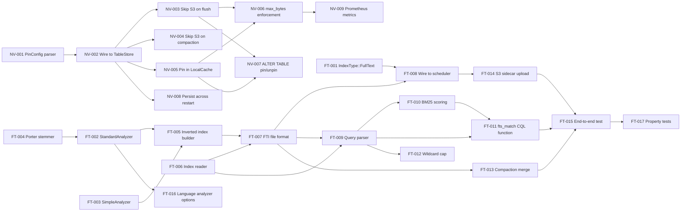

# Compiled Project Plan: NVMe Table Pinning + Full-Text Indexing

**Generated:** 2026-03-29
**Source specs:** specs/nvme-pinning-architecture.md, specs/fulltext-index-architecture.md, specs/project-plan-nvme-fts.md
**Total tasks:** 26
**Estimated parallel batches:** 6
**Ambiguities resolved:** 2
**Ambiguities requiring human input:** 0

---

## Dependency Graph

---

## Execution Batches

**Batch 1** (parallel, no dependencies): NV-001, FT-001, FT-003, FT-004
  -> Verification: `cargo test -p ferrosa-storage pin_config && cargo test -p ferrosa-index fulltext`

**Batch 2** (depends on Batch 1): NV-002, NV-008, FT-002, FT-005, FT-006
  -> Verification: `cargo test -p ferrosa-storage pin && cargo test -p ferrosa-index fulltext`

**Batch 3** (depends on Batch 2): NV-003, NV-004, NV-005, FT-007, FT-008
  -> Verification: `cargo test -p ferrosa-storage pinned && cargo test -p ferrosa-index fts_file`

**Batch 4** (depends on Batch 3): NV-006, NV-007, NV-009, FT-009, FT-010, FT-012, FT-013, FT-014
  -> Verification: `cargo test -p ferrosa-storage && cargo test -p ferrosa-index && cargo test -p ferrosa-cql fts`

**Batch 5** (depends on Batch 4): FT-011, FT-016
  -> Verification: `cargo test -p ferrosa-cql fts_match`

**Batch 6 — Final** (depends on all): FT-015, FT-017
  -> Verification: `cargo test fts_end_to_end && cargo test fts_property`

---

## Ambiguity Log

| # | Ambiguity | Resolution |
|---|-----------|------------|
| A-1 | Should `pin_max_bytes` evict whole SSTables or allow partial? | Evict whole SSTables (oldest first). Partial eviction would require splitting SSTables which defeats the purpose. Re-read ADR-NVMe-03 confirms LRU at SSTable granularity. |
| A-2 | Should FTS index include position offsets for phrase queries? | Yes — positions stored in postings list (`Token.position` field). Without positions, phrase queries degrade to AND queries. Architecture spec already includes position in Token struct. |

---

## Task Definitions

---

### NV-001 · PinConfig Parser

**Sprint:** NV1 | **Status:** [ ] Not started | **Batch:** 1

**Context:** NVMe pinning is configured via table extensions: `storage.pin = "nvme"` and `storage.pin_max_bytes = "N"`. The parser reads these from `HashMap<String, String>` and returns a typed `PinConfig`.

**File:** `ferrosa-storage/src/pin_config.rs` (new)

**Implementation:**
1. Create `PinMode` enum (`None`, `NvMe`)
2. Create `PinConfig` struct with `mode: PinMode` and `max_bytes: Option<u64>`
3. Implement `PinConfig::from_extensions(&HashMap<String, String>) -> Self`
4. Add `pub mod pin_config;` to `ferrosa-storage/src/lib.rs`

**Tests:**
- `pin_config_parses_nvme` — extensions with `storage.pin = "nvme"` returns `PinMode::NvMe`
- `pin_config_default_none` — empty extensions returns `PinMode::None`
- `pin_config_parses_max_bytes` — `storage.pin_max_bytes = "10737418240"` returns `Some(10737418240)`
- `pin_config_invalid_max_bytes_ignored` — non-numeric value returns `None`

**Success criteria:** `cargo test -p ferrosa-storage pin_config` green.
**Hands-off-to:** NV-002, NV-008

---

### NV-002 · Wire PinConfig to TableStore

**Sprint:** NV1 | **Status:** [ ] Not started | **Batch:** 2

**Context:** `register_table()` in `engine.rs` creates a `TableStore` for each table. It needs to parse `PinConfig` from the table's extensions and store it on the `TableStore`.

**File:** `ferrosa-storage/src/engine.rs`, `ferrosa-storage/src/store.rs`

**Implementation:**
1. Add `pin_config: PinConfig` field to `TableStore` (or the per-table state struct)
2. In `register_table()` and `register_table_inner()`, call `PinConfig::from_extensions(&schema.extensions())` — note: `TableSchema` in ferrosa-common doesn't have extensions yet. Either add it or read from schema registry metadata.
3. The table extensions are available on `TableMetadata` in `ferrosa-schema`. Pass them through.

**Tests:**
- `table_store_knows_pin_mode` — register a table with `storage.pin = "nvme"` extensions, verify store's pin_config is NvMe

**Success criteria:** `cargo test -p ferrosa-storage table_store_knows` green.
**Receives-from:** NV-001
**Hands-off-to:** NV-003, NV-004, NV-005, NV-008

---

### NV-003 · Skip S3 Upload for Pinned Tables (Flush Path)

**Sprint:** NV1 | **Status:** [ ] Not started | **Batch:** 3

**Context:** `sync_sstables_to_s3()` in `engine.rs` uploads all SSTables. For pinned tables, skip the upload entirely.

**File:** `ferrosa-storage/src/engine.rs`

**Implementation:**
1. In `sync_sstables_to_s3()`, before enqueuing `UploadTask::SSTable`, check `state.pin_config.is_pinned()`
2. If pinned, skip the upload and log at debug level
3. Still write to commit log (durability within node)

**Tests:**
- `pinned_table_skips_s3_upload` — flush a pinned table, verify InMemory store has no objects for it
- `unpinned_table_still_uploads` — flush a normal table alongside pinned, verify normal table's files are in S3

**Success criteria:** `cargo test -p ferrosa-storage pinned_table_skips` green.
**Receives-from:** NV-002
**Hands-off-to:** NV-006, NV-007

---

### NV-004 · Skip S3 Upload for Pinned Tables (Compaction Path)

**Sprint:** NV1 | **Status:** [ ] Not started | **Batch:** 3

**Context:** `poll_compactions()` uploads compacted output to S3. Skip for pinned tables.

**File:** `ferrosa-storage/src/engine.rs`

**Implementation:** Same pattern as NV-003 but in the `poll_compactions()` method.

**Tests:**
- `pinned_compaction_skips_s3` — compact a pinned table, verify no S3 upload

**Success criteria:** `cargo test -p ferrosa-storage pinned_compaction` green.
**Receives-from:** NV-002

---

### NV-005 · Pin SSTable IDs in LocalCache

**Sprint:** NV1 | **Status:** [ ] Not started | **Batch:** 3

**Context:** After flushing a pinned table, add the SSTable ID to `LocalCache.pinned` so it's never evicted.

**File:** `ferrosa-storage/src/engine.rs`, `ferrosa-storage/src/cache.rs`

**Implementation:**
1. Add `pin(&mut self, id: &str)` and `unpin(&mut self, id: &str)` methods to `LocalCache`
2. In `flush()`, after creating SSTable, if table is pinned, call `self.local_cache.pin(&sstable_id)`

**Tests:**
- `pinned_sstables_never_evicted` — pin an SSTable, fill cache past capacity, verify pinned entry survives eviction

**Success criteria:** `cargo test -p ferrosa-storage pinned_sstables_never` green.
**Receives-from:** NV-002
**Hands-off-to:** NV-006, NV-007

---

### NV-006 · pin_max_bytes Enforcement

**Sprint:** NV1 | **Status:** [ ] Not started | **Batch:** 4

**Context:** When `storage.pin_max_bytes` is set, enforce a size cap. Evict oldest pinned SSTables when the total exceeds the cap.

**File:** `ferrosa-storage/src/engine.rs`, `ferrosa-storage/src/cache.rs`

**Implementation:**
1. Track total pinned bytes per table in `TableStore` or `LocalCache`
2. On flush, after pinning new SSTable: check if total > max_bytes
3. If over cap, unpin and delete oldest pinned SSTables until under cap

**Tests:**
- `pinned_table_respects_max_bytes` — set max_bytes to small value, flush multiple times, verify oldest SSTables unpinned

**Success criteria:** `cargo test -p ferrosa-storage pinned_table_respects` green.
**Receives-from:** NV-003, NV-005

---

### NV-007 · ALTER TABLE Pin/Unpin Transition

**Sprint:** NV1 | **Status:** [ ] Not started | **Batch:** 4

**Context:** ALTER TABLE can toggle pinning. Switching from nvme→none triggers S3 upload of existing SSTables. Switching from none→nvme pins existing SSTables.

**File:** `ferrosa-storage/src/engine.rs`, `ferrosa-cql/src/router.rs`

**Implementation:**
1. When extensions change via ALTER TABLE, re-parse PinConfig
2. If transitioning nvme→none: unpin all SSTable IDs, enqueue S3 upload for each
3. If transitioning none→nvme: pin all SSTable IDs, cancel pending uploads (best-effort)

**Tests:**
- `unpin_resumes_s3_upload` — pin table, flush, unpin via ALTER, verify S3 upload happens
- `pin_stops_s3_upload` — normal table, flush (S3 upload), pin via ALTER, flush again, verify second flush skips S3

**Success criteria:** `cargo test -p ferrosa-storage unpin_resumes pin_stops` green.
**Receives-from:** NV-003, NV-005

---

### NV-008 · Pin Config Persists Across Restart

**Sprint:** NV1 | **Status:** [ ] Not started | **Batch:** 2

**Context:** Pin config is stored in table extensions, which are persisted in schema.json. Verify the full round-trip.

**File:** `ferrosa-storage/src/engine.rs`

**Tests:**
- `pin_config_survives_restart` — create pinned table, drop engine, recreate at same dir, verify table is still pinned

**Success criteria:** `cargo test -p ferrosa-storage pin_config_survives` green.
**Receives-from:** NV-002

---

### NV-009 · Prometheus Metrics for Pinned Tables

**Sprint:** NV1 | **Status:** [ ] Not started | **Batch:** 4

**File:** `ferrosa-storage/src/metrics.rs`

**Tests:**
- `pinned_metrics_accurate` — pin a table, flush, verify gauges report correct count and bytes

**Success criteria:** `cargo test -p ferrosa-storage pinned_metrics` green.
**Receives-from:** NV-006

---

### FT-001 · Add IndexType::FullText

**Sprint:** FT1 | **Status:** [ ] Not started | **Batch:** 1

**File:** `ferrosa-index/src/lib.rs`, `ferrosa-cql/src/router.rs`

**Implementation:**
1. Add `FullText` variant to `IndexType` enum
2. In `resolve_index_type()`, add `Some("fulltext") | Some("fts") => Ok(IndexType::FullText)`
3. Add `pub mod fulltext;` to `ferrosa-index/src/lib.rs`
4. Create empty `ferrosa-index/src/fulltext/mod.rs`

**Tests:**
- `create_fulltext_index_accepted` — `CREATE INDEX ... USING 'fulltext'` doesn't return error

**Success criteria:** `cargo test -p ferrosa-cql create_fulltext && cargo check -p ferrosa-index` green.
**Hands-off-to:** FT-008

---

### FT-002 · StandardAnalyzer

**Sprint:** FT1 | **Status:** [ ] Not started | **Batch:** 2

**File:** `ferrosa-index/src/fulltext/analyzer.rs` (new)

**Implementation:**
1. Define `Analyzer`, `Tokenizer`, `CharFilter`, `TokenFilter`, `Token` traits/structs
2. `UnicodeWordTokenizer` — splits on Unicode word boundaries (use `unicode-segmentation` crate)
3. `LowercaseFilter` — lowercases all tokens
4. `StopWordFilter` — removes English stop words (embedded list)
5. `StandardAnalyzer` = lowercase char filter → unicode word tokenizer → stop word filter → Porter stemmer

**Tests:**
- `standard_analyzer_tokenizes` — `"Hello World! Rust is great"` → `["hello", "world", "rust", "great"]`
- `standard_analyzer_removes_stops` — `"the quick brown fox"` → `["quick", "brown", "fox"]`
- `standard_analyzer_stems` — `"running databases"` → `["run", "databas"]`

**Success criteria:** `cargo test -p ferrosa-index standard_analyzer` green.
**Receives-from:** FT-004
**Hands-off-to:** FT-005, FT-016

---

### FT-003 · SimpleAnalyzer

**Sprint:** FT1 | **Status:** [ ] Not started | **Batch:** 1

**File:** `ferrosa-index/src/fulltext/analyzer.rs`

**Tests:**
- `simple_analyzer_tokenizes` — `"Hello World"` → `["hello", "world"]`
- `simple_analyzer_preserves_numbers` — `"test123 abc"` → `["test123", "abc"]`

**Success criteria:** `cargo test -p ferrosa-index simple_analyzer` green.
**Hands-off-to:** FT-005

---

### FT-004 · Porter Stemmer

**Sprint:** FT1 | **Status:** [ ] Not started | **Batch:** 1

**File:** `ferrosa-index/src/fulltext/stemmer.rs` (new)

**Implementation:** Implement Porter stemming algorithm (5-step suffix stripping). Alternatively, use the `rust-stemmers` crate.

**Tests:**
- `porter_stemmer_basic` — `"running"` → `"run"`, `"jumps"` → `"jump"`
- `porter_stemmer_irregular` — `"databases"` → `"databas"`, `"indices"` → `"indic"`

**Success criteria:** `cargo test -p ferrosa-index porter_stemmer` green.
**Hands-off-to:** FT-002

---

### FT-005 · Inverted Index Builder

**Sprint:** FT1 | **Status:** [ ] Not started | **Batch:** 2

**File:** `ferrosa-index/src/fulltext/builder.rs` (new)

**Implementation:**
1. In-memory map: `HashMap<String, Vec<Posting>>` (term → postings)
2. `add_row()` — extract text from target column cell, run analyzer, accumulate postings
3. `finish()` — sort terms, serialize to FTI format bytes

**Tests:**
- `fts_builder_single_doc` — one row with "hello world", builder produces 2 terms
- `fts_builder_multi_doc` — 3 rows, verify term frequencies and doc frequencies correct
- `fts_builder_handles_invalid_utf8` — row with non-UTF8 bytes doesn't panic (skipped gracefully)
- `fts_builder_empty_field` — row with empty text column produces no terms

**Success criteria:** `cargo test -p ferrosa-index fts_builder` green.
**Receives-from:** FT-002, FT-003
**Hands-off-to:** FT-007

---

### FT-006 · Inverted Index Reader

**Sprint:** FT1 | **Status:** [ ] Not started | **Batch:** 2

**File:** `ferrosa-index/src/fulltext/reader.rs` (new)

**Implementation:**
1. Parse FTI header (magic, version, term_count, doc_count, offsets)
2. Binary search terms dictionary for a given term
3. Read postings list at the returned offset

**Tests:**
- `fts_term_lookup_exact_match` — look up a known term, get correct postings
- `fts_term_lookup_missing` — look up absent term, get None

**Success criteria:** `cargo test -p ferrosa-index fts_term_lookup` green.
**Hands-off-to:** FT-007, FT-009

---

### FT-007 · FTI File Format (Write + Read Roundtrip)

**Sprint:** FT1 | **Status:** [ ] Not started | **Batch:** 3

**File:** `ferrosa-index/src/fulltext/format.rs` (new)

**Implementation:** Wire builder output → reader input. Header + sorted terms dict + postings + CRC32 footer.

**Tests:**
- `fts_file_format_roundtrip` — build from 10 rows, write bytes, read back, verify all terms and postings match
- `fts_sidecar_checksum_verified` — corrupt one byte, reader detects CRC mismatch

**Success criteria:** `cargo test -p ferrosa-index fts_file_format fts_sidecar_checksum` green.
**Receives-from:** FT-005, FT-006
**Hands-off-to:** FT-008, FT-009, FT-013

---

### FT-008 · Wire Builder into IndexBuildScheduler

**Sprint:** FT1 | **Status:** [ ] Not started | **Batch:** 3

**File:** `ferrosa-storage/src/index/mod.rs`, `ferrosa-storage/src/index/scheduler.rs`

**Implementation:**
1. When `index_type == FullText`, construct `FullTextIndexBuilder` with the analyzer from index options
2. After building, write sidecar file as `{gen}-FTI-{index_name}.db`

**Tests:**
- `fts_sidecar_created_on_flush` — create FTS index, insert rows, flush, verify `{gen}-FTI-{name}.db` exists on disk

**Success criteria:** `cargo test -p ferrosa-storage fts_sidecar_created` green.
**Receives-from:** FT-001, FT-007
**Hands-off-to:** FT-014

---

### FT-009 · FTS Query Parser

**Sprint:** FT2 | **Status:** [ ] Not started | **Batch:** 4

**File:** `ferrosa-index/src/fulltext/query.rs` (new)

**Implementation:**
1. Recursive descent parser for: `term`, `"phrase"`, `AND`, `OR`, `NOT`, `prefix*`
2. Default operator is AND (e.g., `"rust database"` = `"rust" AND "database"`)
3. Parentheses for grouping

**Tests:**
- `fts_query_parse_term` — `"hello"` → `Term("hello")`
- `fts_query_parse_phrase` — `'"exact match"'` → `Phrase(["exact", "match"])`
- `fts_query_parse_boolean` — `"a AND b OR c"` → `Or(And(Term("a"), Term("b")), Term("c"))`
- `fts_query_boolean_precedence` — AND binds tighter than OR

**Success criteria:** `cargo test -p ferrosa-index fts_query` green.
**Receives-from:** FT-006, FT-007
**Hands-off-to:** FT-010, FT-011, FT-012

---

### FT-010 · BM25 Scoring

**Sprint:** FT2 | **Status:** [ ] Not started | **Batch:** 4

**File:** `ferrosa-index/src/fulltext/scoring.rs` (new)

**Implementation:** Okapi BM25 with default k1=1.2, b=0.75. Score = sum over query terms of: `IDF * (tf * (k1+1)) / (tf + k1 * (1 - b + b * dl/avgdl))`

**Tests:**
- `bm25_single_term` — known inputs produce expected score
- `bm25_multi_term_ranking` — doc with more matching terms ranks higher

**Success criteria:** `cargo test -p ferrosa-index bm25` green.
**Receives-from:** FT-009
**Hands-off-to:** FT-011

---

### FT-011 · fts_match() CQL Function

**Sprint:** FT2 | **Status:** [ ] Not started | **Batch:** 5

**File:** `ferrosa-cql/src/router.rs`

**Implementation:**
1. Detect `fts_match(column, query_string)` in WHERE clause
2. Look up FullText index on the column
3. Parse query string via FTS query parser
4. For each SSTable: open FTI sidecar reader, execute query, collect scored results
5. Merge results across SSTables, deduplicate by partition key, sort by BM25 score
6. Return matching partition keys to the query executor

**Tests:**
- `fts_match_simple_query` — insert 3 rows, create FTS index, flush, query matches correct rows
- `fts_match_boolean_query` — AND/OR queries return correct subsets

**Success criteria:** `cargo test -p ferrosa-cql fts_match` green.
**Receives-from:** FT-009, FT-010
**Hands-off-to:** FT-015

---

### FT-012 · Wildcard Expansion Cap

**Sprint:** FT2 | **Status:** [ ] Not started | **Batch:** 4

**File:** `ferrosa-index/src/fulltext/query.rs`

**Tests:**
- `fts_wildcard_expansion_capped` — `compac*` expands to matching terms up to 10000
- `fts_wildcard_bare_star_rejected` — `*` alone returns error
- `fts_wildcard_min_prefix` — single char `a*` rejected (min prefix = 2)

**Success criteria:** `cargo test -p ferrosa-index fts_wildcard` green.
**Receives-from:** FT-009

---

### FT-013 · Compaction Merge for FTI Sidecars

**Sprint:** FT2 | **Status:** [ ] Not started | **Batch:** 4

**File:** `ferrosa-index/src/fulltext/merge.rs` (new)

**Implementation:** Merge two sorted FTI files: union terms, merge postings lists, sum frequencies, update doc counts.

**Tests:**
- `fts_compaction_merge_deduplicates` — two FTI files with overlapping docs, merged has no duplicate postings
- `fts_compaction_merge_preserves_scores` — term frequencies summed correctly across merged inputs

**Success criteria:** `cargo test -p ferrosa-index fts_compaction_merge` green.
**Receives-from:** FT-007
**Hands-off-to:** FT-015

---

### FT-014 · S3 Upload Includes FTI Sidecar

**Sprint:** FT2 | **Status:** [ ] Not started | **Batch:** 4

**File:** `ferrosa-storage/src/engine.rs`

**Implementation:** In `collect_sstable_files()`, include `{gen}-FTI-*.db` files alongside Data.db, Partitions.db, etc.

**Tests:**
- `fts_sidecar_uploaded_to_s3` — flush with FTS index, verify FTI file in InMemory store

**Success criteria:** `cargo test -p ferrosa-storage fts_sidecar_uploaded` green.
**Receives-from:** FT-008
**Hands-off-to:** FT-015

---

### FT-015 · End-to-End Test

**Sprint:** FT2 | **Status:** [ ] Not started | **Batch:** 6

**File:** `ferrosa-storage/src/engine.rs` or `ferrosa-cql/src/router.rs` test module

**Tests:**
- `fts_end_to_end_insert_query` — CREATE TABLE, CREATE INDEX USING 'fulltext', INSERT 10 rows, flush, SELECT with fts_match, verify correct rows returned ranked by relevance

**Success criteria:** Full pipeline green.
**Receives-from:** FT-011, FT-013, FT-014

---

### FT-016 · Language Analyzer Options

**Sprint:** FT2 | **Status:** [ ] Not started | **Batch:** 5

**File:** `ferrosa-index/src/fulltext/analyzer.rs`

**Implementation:** Parse `analyzer`, `language`, `stop_words`, `min_token_length` from `IndexMetadata.options`.

**Tests:**
- `fts_custom_stop_words` — custom stop words list filters specified words
- `fts_language_analyzer` — language=english uses English stemmer; language=none skips stemming

**Success criteria:** `cargo test -p ferrosa-index fts_custom fts_language` green.
**Receives-from:** FT-002
**Hands-off-to:** FT-015

---

### FT-017 · Property Tests

**Sprint:** FT2 | **Status:** [ ] Not started | **Batch:** 6

**File:** `ferrosa-index/tests/fulltext_property.rs` (new)

**Tests:**
- `fts_roundtrip_any_text` — proptest: random UTF-8 strings survive analyze → build → write → read → query
- `fts_merge_commutative` — proptest: merge(A,B) == merge(B,A) for random FTI files

**Success criteria:** `cargo test -p ferrosa-index fts_roundtrip fts_merge_commutative` green (1000 iterations each).
**Receives-from:** FT-015
