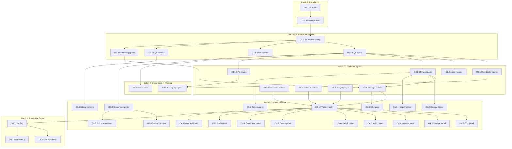

# Compiled Project Plan: Ferrosa Observability

**Generated:** 2026-04-03
**Source specs:**
- `specs/observability-architecture.md` — 9 layers, 12 design principles
- `specs/observability-threat-model.md` — 14 threats, all APPROVED
- `specs/observability-fmea.md` — 12 failure modes, 5 critical (all APPROVED)
**Total tasks:** 38
**Parallel batches:** 6
**Ambiguities resolved:** 3
**Ambiguities requiring human input:** 0
**Status:** READY

---

## Dependency Graph

---

## Execution Batches

**Batch 1** (2 tasks, sequential — schema before layer):
  T-01, T-02
  Verification: `cargo test -p ferrosa-storage -- observability && cargo test -p ferrosa-cluster -- telemetry_layer`

**Batch 2** (5 tasks, parallel):
  T-03, T-04, T-05, T-06, T-07
  Verification: `cargo test -p ferrosa-cql -- instrument && cargo test -p ferrosa -- telemetry`

**Batch 3** (8 tasks, parallel):
  T-08 through T-15
  Verification: `cargo test -p ferrosa-cluster -- span && cargo test -p ferrosa-net -- span`

**Batch 4** (2 tasks, parallel):
  T-16, T-17
  Verification: `cargo test -p ferrosa-net -- trace_context && cargo test -p ferrosa -- flamechart`

**Batch 5** (18 tasks, parallel):
  T-18 through T-35
  Verification: `cargo test --workspace -- observability && cargo test -p ferrosa -- web_panel`

**Batch 6** (3 tasks, parallel):
  T-36, T-37, T-38
  Verification: `cargo test --workspace --features otel -- otel`

**Final:** `cargo test --workspace` (full suite, 3200+ existing + new observability tests)

---

## Ambiguity Log

| # | Source | Ambiguity | Resolution |
|---|--------|-----------|------------|
| 1 | O1.2 | How does direct storage write bypass CQL without duplicating schema management? | Re-read: `StorageEngine::write()` already accepts `(TableId, DecoratedKey, Row, timestamp)` — use the same API with observability-specific TableIds registered at startup. No CQL parsing needed. |
| 2 | O3.2 | Does the 32-byte trace header change the internode wire format version? | Re-read: Architecture spec says all nodes must support it (homogeneous). Bump protocol version from 1 to 2 in handshake. Old nodes rejected. |
| 3 | O5.1 | Should billing counters survive node restart if commit log is truncated? | Human decision captured: 10s flush to commit log is acceptable loss. DBaaS aggregator interpolates missing buckets. No further ambiguity. |

---

## Task Definitions

### T-01: Create `system_observability` Schema (O1.1)

- **Batch:** 1
- **Size:** S
- **Status:** [ ] Not started
- **Dependencies:** None
- **FMEA refs:** OF1 (schema must exist before writes)
- **Threat refs:** OBS-T5 (superuser-only access to observability tables)

**Context:**
Create the `system_observability` keyspace and tables (`spans`, `metrics`, `slow_queries`) at startup, alongside existing system keyspaces. Tables are registered with `StorageEngine` for direct writes (bypassing CQL). Schema definitions in `ferrosa-schema/src/system/`.

**Acceptance criteria:**
- `system_observability` keyspace auto-created on startup
- Tables: `spans`, `metrics`, `slow_queries` with schemas from architecture spec
- Tables registered with StorageEngine for direct write access
- `SELECT * FROM system_observability.spans` returns empty result (CQL read works)
- Only superuser role can SELECT from `system_observability.*`

**Files to modify:**
- `ferrosa-schema/src/system/` — add observability keyspace + table definitions
- `ferrosa-schema/src/registry.rs` — register at startup
- `ferrosa-storage/src/engine.rs` — add `write_observability()` method for direct writes

---

### T-02: Build `FerrosaTelemetryLayer` (O1.2)

- **Batch:** 1 (after T-01)
- **Size:** L
- **Status:** [ ] Not started
- **Dependencies:** T-01
- **FMEA refs:** OF1 (RPN 504, self-write feedback loop), OF2 (CQL endpoint down)
- **Threat refs:** OBS-T8 (bypass CQL), OBS-T9 (try_send, cancel-safe)

**Context:**
Custom `tracing::Layer` implementation. On span close, serialize span data and try_send to a bounded mpsc channel. Background tokio task drains channel in batches (default 100 spans or 1s, whichever first) and writes directly to StorageEngine (NOT through CQL). Channel full → drop oldest span, increment `ferrosa_telemetry_drops_total` counter. All writes cancel-safe.

**Acceptance criteria:**
- `FerrosaTelemetryLayer` implements `tracing_subscriber::Layer`
- Spans written directly to StorageEngine (verified: no CQL parse spans generated by telemetry writes)
- Bounded channel (default 10,000 capacity)
- try_send — never blocks the application
- Drops oldest on full, increments drop counter
- Configurable sample rate via `FERROSA_TELEMETRY_SAMPLE_RATE`
- Configurable batch size and flush interval
- Cancel-safe: dropping the layer mid-flush doesn't panic or leak

**Files to create:**
- `ferrosa-cluster/src/telemetry/mod.rs` — layer + background writer
- `ferrosa-cluster/src/telemetry/layer.rs` — `tracing::Layer` impl
- `ferrosa-cluster/src/telemetry/writer.rs` — batch writer to StorageEngine

---

### T-03: Configure Telemetry Subscriber (O1.3)

- **Batch:** 2
- **Size:** M
- **Status:** [ ] Not started
- **Dependencies:** T-02
- **FMEA refs:** OF4 (0% sample rate), OF5 (100% in prod)

**Context:**
In `ferrosa/src/main.rs`, add `FerrosaTelemetryLayer` to the existing `tracing_subscriber::fmt()` subscriber when `FERROSA_TELEMETRY_ENABLED=true`. Log WARN at startup if sample rate is 0.0 or >0.1 in non-dev mode.

**Acceptance criteria:**
- Telemetry layer conditionally added based on env var
- Startup WARN if sample rate is 0.0
- Startup WARN if sample rate > 0.1 and not in dev mode
- Existing fmt layer still works (logs to stdout unchanged)
- `FERROSA_TELEMETRY_ENABLED=false` means zero telemetry overhead

**Files to modify:**
- `ferrosa/src/main.rs` — subscriber composition

---

### T-04: Instrument CQL Request Lifecycle (O1.4)

- **Batch:** 2
- **Size:** M
- **Status:** [ ] Not started
- **Dependencies:** T-03

**Context:**
Add `#[instrument]` to CQL server accept, parser entry, router dispatch, and per-statement execution handlers. Span attributes: `cql.opcode`, `cql.keyspace`, `cql.table`, `cql.statement_type`, `cql.consistency_level`, `cql.rows_returned`.

**Acceptance criteria:**
- `cql.request` span on every CQL frame
- `cql.parse` child span with statement type
- `cql.route` child span with CL
- `cql.execute` child span with rows returned
- Spans visible in `system_observability.spans` when telemetry enabled
- Existing tests still pass (spans don't change behavior)

**Files to modify:**
- `ferrosa-cql/src/server.rs` — `cql.request` span
- `ferrosa-cql/src/parser.rs` — `cql.parse` span
- `ferrosa-cql/src/router.rs` — `cql.route` + `cql.execute` spans

---

### T-05: Slow Query Table + Threshold Logging (O1.5)

- **Batch:** 2
- **Size:** S
- **Status:** [ ] Not started
- **Dependencies:** T-03
- **Threat refs:** OBS-T3 (parameterize queries, never raw text)

**Context:**
On `cql.execute` span close, check duration against `FERROSA_SLOW_QUERY_THRESHOLD_MS` (default 1000ms). If exceeded, write to `system_observability.slow_queries` with parameterized query text (literals replaced with `?`), duration, keyspace, client address, trace_id. TTL configurable via `FERROSA_SLOW_QUERY_TTL_DAYS` (default 7).

**Acceptance criteria:**
- Slow queries written to `system_observability.slow_queries`
- Query text is parameterized (`?` for all literals) — verified by test
- TTL applied (default 7 days)
- `trace_id` links to spans table
- `SELECT * FROM system_observability.slow_queries` returns results for slow queries
- WARN log emitted for each slow query

**Files to modify:**
- `ferrosa-cluster/src/telemetry/layer.rs` — slow query detection in on_close
- `ferrosa-cql/src/parser.rs` — add `parameterize()` function that replaces literals with `?`

---

### T-06: CQL Request Metrics (O1.6)

- **Batch:** 2
- **Size:** M
- **Status:** [ ] Not started
- **Dependencies:** T-03

**Context:**
Atomic counters for request count by opcode + keyspace, and latency histogram buckets. Written to `system_observability.metrics` on configurable interval (default 10s). Include an ALL-query counter (OBS-T4) that counts every request regardless of fingerprint threshold.

**Acceptance criteria:**
- `cql_requests_total` counter by opcode and keyspace
- `cql_request_duration` histogram with p50/p95/p99
- All-query counter (not just slow/fingerprinted)
- Metrics visible via `SELECT * FROM system_observability.metrics`

---

### T-07: Instrument Commit Log (O2.4)

- **Batch:** 2
- **Size:** S
- **Status:** [ ] Not started
- **Dependencies:** T-03

**Context:**
Add spans on `write_entry` and `sync` (fsync) in the commit log. fsync latency is critical for durability guarantees — this is the primary I/O bottleneck indicator.

**Acceptance criteria:**
- `commitlog.write` span with `segment_id`, `entry_bytes`
- `commitlog.sync` span with `sync_strategy`, `entries_batched`, duration
- fsync duration visible in spans

**Files to modify:**
- `ferrosa-storage/src/commitlog/` — add `#[instrument]` to write and sync paths

---

### T-08 through T-15: Batch 3 Tasks (Cluster + Network Spans)

Tasks O2.1, O2.2, O2.3, O2.5, O3.1, O3.3, O3.4, O3.5 — all follow the same pattern: add `#[instrument]` spans and atomic metric counters to the specified code locations from the architecture spec Layer 2-4 tables. Each task is independent within this batch.

**Common acceptance criteria for all Batch 3 tasks:**
- Spans appear in `system_observability.spans` when sampled
- Metrics written to `system_observability.metrics`
- Existing tests unchanged
- No performance regression >1% at 1% sampling

---

### T-16: Trace Context Propagation (O3.2)

- **Batch:** 4
- **Size:** L
- **Status:** [ ] Not started
- **Dependencies:** T-08, T-12
- **FMEA refs:** OF11 (trace context mandatory)
- **Threat refs:** OBS-T13 (malicious node detection), OBS-T14 (replay detection)

**Context:**
Add 32-byte trace context to internode codec frame (REQUIRED, not optional). Bump protocol version from 1 to 2. Inject current span's trace_id + span_id on send. Extract and create child span on receive. In high-security mode, invalid trace context logs warning and optionally ejects node.

**Acceptance criteria:**
- 32-byte trace context in every internode frame
- Protocol version bumped to 2
- Trace stitching works across nodes (verified: parent_id in remote span matches span_id in local span)
- All-zero trace context = unsampled (no span created)
- High-security mode: invalid context triggers WARN log
- High-security mode + `FERROSA_HIGH_SECURITY_MODE=true`: node ejected from cluster

**Files to modify:**
- `ferrosa-net/src/codec.rs` — frame header extension
- `ferrosa-net/src/rpc/client.rs` — inject trace context on send
- `ferrosa-net/src/rpc/server.rs` — extract trace context on receive
- `ferrosa-cluster/src/controller/` — node ejection in high-security mode

---

### T-17: On-Demand Flame Chart (O3.6)

- **Batch:** 4
- **Size:** M
- **Status:** [ ] Not started
- **Dependencies:** T-04
- **FMEA refs:** OF3 (RPN 280, OOM)
- **Threat refs:** OBS-T1 (DoS), OBS-T2 (info disclosure)

**Context:**
`GET /api/debug/flamechart?seconds=N`. Temporarily installs `tracing-flame` layer, captures folded stacks, renders SVG via `inferno`. Safety: max 60s, 64 MB BufWriter cap, mutex (1 concurrent), admin auth token + IP whitelist, rate limit 1/5min. Strip sensitive span attributes from output.

**Acceptance criteria:**
- Endpoint returns `image/svg+xml` flame chart
- Zero overhead when not profiling (layer not in subscriber)
- Rejects without admin auth token (401)
- Rejects if IP not in whitelist (when configured) (403)
- Rejects if another profile in progress (429)
- Rejects seconds > 60 (400)
- Memory capped at 64 MB (spans dropped beyond cap)
- Sensitive attributes stripped from output

**Crate additions:** `tracing-flame`, `inferno`
**Files to create:** `ferrosa/src/web/debug.rs`

---

### T-18: Virtual Table Registry (O4.1)

- **Batch:** 5
- **Size:** M
- **Status:** [ ] Not started
- **Dependencies:** T-11, T-13, T-14, T-15

**Context:**
Register all 14 `system_observability.*` virtual tables. Each backed by the atomic counters and ring buffers populated by Batch 2-4 instrumentation. Expose via `VirtualTableRegistry` for CQL SELECT.

**Acceptance criteria:**
- All 14 virtual tables queryable via CQL
- `SELECT * FROM system_observability.cql_stats` returns live data
- `DESCRIBE KEYSPACE system_observability` lists all tables

---

### T-19 through T-27: Web UI Panels (O4.2-O4.10)

9 tasks — each adds a panel to `ferrosa/src/web/index.html` backed by a JSON API endpoint in `ferrosa/src/web/api.rs`. Independent within batch.

**Common pattern:**
- Add `/api/observability/<name>` endpoint returning JSON
- Add HTML/JS panel in `web/index.html` with auto-refresh (2s)
- Panel shows the data from the corresponding virtual table

---

### T-28: Billing Metering (O5.1)

- **Batch:** 5
- **Size:** M
- **Status:** [ ] Not started
- **Dependencies:** T-06
- **FMEA refs:** OF10 (billing counter loss)
- **Threat refs:** OBS-T6 (signed billing data)

**Context:**
Per-request byte metering: `bytes_in`, `bytes_out`, `compute_us` attributed to `client_address` + `keyspace`. Aggregate in 1-minute buckets. Flush to commit log every 10s. On startup, replay commit log to recover partial buckets. Billing records cryptographically signed by DBaaS-provided key. Configurable endpoint via `FERROSA_BILLING_ENDPOINT`.

**Acceptance criteria:**
- `system_observability.client_usage` populated with per-client data
- Counters survive node restart (commit log replay)
- Billing records include cryptographic signature
- Signature verification function available for DBaaS
- `FERROSA_BILLING_ENDPOINT` configurable separately from telemetry

---

### T-30: Query Fingerprints (O5.3)

- **Batch:** 5
- **Size:** L
- **Status:** [ ] Not started
- **Dependencies:** T-04

**Context:**
On every CQL parse, extract parameterized fingerprint (hash of query with `?` for literals). Aggregate by fingerprint: count, avg latency, p99, plan type, last_seen. Ring buffer of top 10k fingerprints. Column access patterns extracted from AST (which columns in SELECT, WHERE, ORDER BY).

**Acceptance criteria:**
- `system_observability.query_fingerprints` populated
- Parameterized text (no literal values)
- Top 10k by frequency in ring buffer
- Latency percentiles calculated
- Plan type recorded (PrimaryKey/SingleIndex/FullScan)

---

### T-32: Partition Hotspot Tracker (O5.5)

- **Batch:** 5
- **Size:** M
- **Status:** [ ] Not started
- **Dependencies:** T-10
- **FMEA refs:** OF7 (RPN 210, sampling bias)

**Context:**
Count-min sketch for partition key frequency estimation. Minimum 1000 samples before reporting a partition as hot. Confidence score on all hotspot reports. `system_observability.partition_hotspots` virtual table.

**Acceptance criteria:**
- Count-min sketch implementation (not naive min-heap)
- Minimum sample threshold before reporting
- Confidence score in output
- Top-1000 hot partitions queryable via CQL

---

### T-36 through T-38: Enterprise OTLP Export (O6.1-O6.3)

- **Batch:** 6
- **Size:** S/M/S
- **Status:** [ ] Not started
- **Dependencies:** T-18
- **Threat refs:** OBS-T10 (data-safe export), OBS-T11 (allow lists)

**Context:**
Behind `otel` feature flag. OTLP exporter sanitizes all data: no query text, no data values, no partition keys. Only span names, durations, status codes, and operational metrics. Allow list of exportable attributes modifiable only by admin. Prometheus `/metrics` renders virtual table data.

**Acceptance criteria:**
- `cargo build` without `--features otel` does NOT compile OTel deps
- `cargo build --features otel` adds OTLP layer
- Exported spans contain NO query text or data values (verified by test)
- Allow list enforced (non-allowed attributes stripped)
- `/metrics` endpoint renders Prometheus text format
