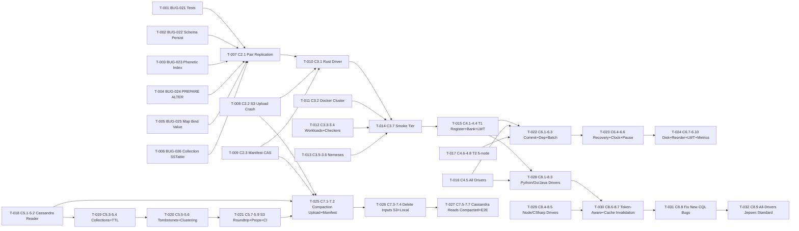

# Compiled Project Plan: Ferrosa Correctness Sprints C1–C8

**Generated:** 2026-03-28
**Source specs:** specs/project-plan-correctness-sprints.md · specs/components.md · specs/data-flow.md · specs/storage.md · specs/sstable.md · specs/cql.md · specs/accord.md · specs/jepsen-e2e-test-plan.md · bugs/STATUS.md · bugs/FRSA-BUG-021 through BUG-026
**Total tasks:** 32
**Estimated parallel batches:** 5
**Ambiguities resolved:** 4
**Ambiguities requiring human input:** 0

---

## Dependency Graph



---

## Execution Batches

**Batch 1** (parallel, no dependencies): T-001, T-002, T-003, T-004, T-005, T-006
→ Batch verification: `cargo test -p ferrosa-cql -p ferrosa-schema -p ferrosa-sstable`

**Batch 2a** (depends on Batch 1): T-007, T-008, T-009
→ Batch verification: `cargo test -p ferrosa-cluster -p ferrosa-storage`

**Batch 2b** (independent of C1/C2, parallel with 2a): T-018, T-019, T-020, T-021
→ Batch verification: `cargo test -p ferrosa-sstable && cd tests/sstable-compat && docker-compose run compat-test`

**Batch 3** (depends on 2a): T-010, T-011, T-012, T-013
→ Batch verification: `cargo test -p ferrosa-jepsen`

**Batch 4a** (depends on Batch 3): T-014
→ Batch verification: `ferrosa-jepsen run --tier smoke`

**Batch 4b** (depends on 4a): T-015, T-016, T-017
→ Batch verification: `ferrosa-jepsen run --tier standard --topology t1 --topology t2`

**Batch 4c** (depends on 2a + 2b): T-025, T-026, T-027
→ Batch verification: `cargo test -p ferrosa-storage compaction && cd tests/sstable-compat && docker-compose run compaction-test`

**Batch 4d** (depends on 4a + C4 partial): T-028, T-029
→ Batch verification: `cd tests/drivers && make smoke-all`

**Batch 5a** (depends on 4b): T-022, T-023, T-024
→ Batch verification: `ferrosa-jepsen run --tier accord-correctness`

**Batch 5b** (depends on 4d): T-030, T-031
→ Batch verification: `cd tests/drivers && make token-aware-all && make prepared-cache-invalidation-all`

**Final** (depends on 5a + 5b): T-032
→ `ferrosa-jepsen run --tier standard --all-drivers`

---

## Ambiguity Log

| # | Ambiguity | Resolution |
|---|-----------|------------|
| A-1 | Sprint plan lists BUG-021 as an open fix. The bug file and `ferrosa-cql/src/connection.rs:handle_query` show it is already fixed (substitute_bound_values called at line 712). | T-001 is test-only: write the regression tests listed in the plan. Do not re-implement the fix. |
| A-2 | Sprint plan says C2.1 root cause is "returns Ok(()) without waiting for replication". Actual code in `coordinator.rs:59` awaits `replicate_to_peer` but silently swallows the error with `tracing::warn!`. | T-007 targets the actual bug: propagate the error from `replicate_to_peer` to the caller instead of logging and returning Ok(()). |
| A-3 | Sprint plan says BUG-025 root cause is "`raw_bytes_to_term()` doesn't handle CqlType::Map". No such function exists; the actual path is `decode_value()` in `types.rs` which does handle maps at line 269. | T-005 should trace the actual error from the test case description. Root cause likely in `analyze_prepared_columns` returning wrong type, or downstream MapLiteral handling in the router. Start from the reproduction case in the bug file. |
| A-4 | C3 sprint assumes Docker provisioning mode, but `ferrosa-jepsen/src/cluster.rs` only has a Firecracker provisioner. | T-011 adds a Docker provisioner struct (`DockerCluster`) alongside the existing `FerrosCluster`. The smoke tier and CI use Docker; Firecracker is for production-grade Jepsen runs. |

---

## Task Definitions

---

### T-001 · C1.1 · BUG-021 Regression Tests

**Sprint:** C1 | **Status:** [x] Complete | **Batch:** 1

**Context:**
BUG-021 (QUERY frame bind values silently ignored) is already fixed in `handle_query` at `ferrosa-cql/src/connection.rs:712`. The fix calls `substitute_bound_values` before routing. This task writes the regression tests that verify the fix is correct and complete. No code changes to connection.rs are needed.

**File:** `ferrosa-cql/src/connection.rs` (add to `#[cfg(test)]` section near line 1626)

**Tests to write:**

```rust
#[tokio::test]
async fn bind_values_select() // QUERY frame SELECT * WHERE id = ? with positional value; assert 1 row returned

#[tokio::test]
async fn bind_values_insert() // QUERY frame INSERT ... VALUES (?, ?) with two bind values; assert inserted

#[tokio::test]
async fn bind_values_update() // QUERY frame UPDATE ... SET col = ? WHERE id = ? with two bind values; assert updated

#[tokio::test]
async fn bind_values_delete() // QUERY frame DELETE WHERE id = ? with one bind value; assert deleted

#[tokio::test]
async fn bind_values_cassandra_compat() // PREPARE + EXECUTE round-trip for 10 type combinations (text, int, bigint, boolean, uuid, blob, float, double, timestamp, null)
```

These tests should be in-process tests using `SharedState` with an in-memory schema, not a live cluster. Follow the pattern in the existing `substitute_bound_values tests` section (line 1626).

**Success criteria:** All 5 tests pass. `cargo test -p ferrosa-cql bind_values` green.

**Receives-from:** Nothing (test-only task).
**Hands-off-to:** T-007 (C1 gate must be fully green before C2 begins).

---

### T-002 · C1.2 · BUG-022 Schema Persistence on Restart

**Sprint:** C1 | **Status:** [x] Complete | **Batch:** 1

**Context:**
Schema is only loaded from S3 when the local data directory is empty. On binary upgrade (data dir preserved), the startup skips S3 schema recovery and starts with empty in-memory schema. All user keyspaces and tables are lost. Fix: write `schema.json` to `data_dir/` on every schema mutation, read it on startup before any S3 logic.

**Root cause:** `ferrosa/src/main.rs` — startup sequence step 4 ("Create Schema") does not load a local `schema.json`. The `bootstrap_from_s3` function at line 87 is only called when local SSTables are absent. No `persist_schema_locally()` function exists yet.

**Files:**
- `ferrosa/src/main.rs` — add local schema load/save calls in startup + maintenance loop + shutdown
- `ferrosa-schema/src/registry.rs` — add `save_to_path(path: &Path)` and `load_from_path(path: &Path)` to `SchemaRegistry` or `SchemaSnapshot`

**Implementation sketch:**
1. Add `persist_schema_locally(data_dir: &Path, snapshot: &SchemaSnapshot)` — serializes to `data_dir/schema.json` via `serde_json::to_writer` + atomic rename (write to `.schema.json.tmp`, then `rename`)
2. Add `load_local_schema(data_dir: &Path) -> Option<SchemaSnapshot>` — reads `data_dir/schema.json`
3. In `main()` startup, after creating `Schema`, call `load_local_schema`. If `Some`, call `schema.apply_snapshot(snapshot)` before `bootstrap_from_s3`
4. In the maintenance loop, call `persist_schema_locally` after every schema version bump
5. In graceful shutdown, call `persist_schema_locally` before S3 sync

**Tests to write:**
```rust
#[tokio::test]
async fn schema_survives_restart() // Write schema.json, create new Schema, load_local_schema, assert tables present

#[tokio::test]
async fn schema_survives_binary_upgrade() // Simulate: data dir has SSTables but no S3 config; local schema.json present; assert tables loaded after restart
```

**Success criteria:** Both tests pass. `cargo test -p ferrosa schema_survives` green.

**Receives-from:** Nothing (independent of other C1 bugs).
**Hands-off-to:** T-007 (C1 gate).

---

### T-003 · C1.3 · BUG-023 Phonetic Index Survives Schema Restore

**Sprint:** C1 | **Status:** [x] Complete | **Batch:** 1

**Context:**
The `SchemaSnapshot` struct in `ferrosa-schema/src/registry.rs` does not include phonetic index state (double metaphone or Metaphone index entries). When schema is restored from S3 or local file, SOUNDS LIKE query results differ from pre-restore results because the index data is missing.

**Root cause:** `SchemaSnapshot` serialization likely serializes `IndexMetadata` but does not include the phonetic index inverted map (stored in `ferrosa-index/src/phonetic/`). The index needs to be rebuilt from SSTable data on restore, or the phonetic map needs to be included in the snapshot.

**Files:**
- `ferrosa-schema/src/registry.rs` — `SchemaSnapshot` definition, check if `indexes` field covers phonetic indexes
- `ferrosa-schema/src/metadata/index.rs` — `IndexMetadata` struct
- `ferrosa-index/src/phonetic/mod.rs` — phonetic index state that must survive restore
- `ferrosa-schema/src/system/index_tables.rs` — system table for index metadata

**Implementation sketch:**
1. Identify what phonetic index state is in-memory vs. derivable from SSTables
2. If state is derivable: add index rebuild step to `schema.apply_snapshot()` — after restoring tables, re-scan SSTable data to rebuild phonetic index entries
3. If state must be persisted: add phonetic index map to `IndexMetadata` with `#[serde(default)]` so old snapshots deserialize cleanly
4. Write tests that verify SOUNDS LIKE returns same results before and after a schema restore cycle

**Tests to write:**
```rust
#[test]
fn phonetic_index_survives_restore() // Insert rows, snapshot schema, restore schema, assert SOUNDS LIKE query returns same rows
```

**Success criteria:** Test passes. `cargo test -p ferrosa-schema phonetic_index_survives_restore` green.

**Receives-from:** Nothing.
**Hands-off-to:** T-007 (C1 gate).

---

### T-004 · C1.4 · BUG-024 PREPARE Metadata Missing ALTER TABLE Columns

**Sprint:** C1 | **Status:** [x] Complete | **Batch:** 1

**Context:**
When a client PREPAREs a statement against a table, then the server executes `ALTER TABLE ADD COLUMN`, the cached `PreparedPlan` still reflects the pre-ALTER schema. Result metadata (`result_columns`) misses the new column. Subsequent EXECUTE calls with the new column in bind position fail or silently truncate data.

**Root cause:** `ferrosa-cql/src/prepared.rs` — `PreparedCache` stores `PreparedPlan` keyed by MD5 of query string. Plans are never invalidated when schema changes. `PreparedPlan.result_columns` is a snapshot from `analyze_prepared_columns` at PREPARE time.

**Fix strategy:**
Option A (preferred): On `ALTER TABLE`, call `state.prepared_cache.invalidate_all()`. This forces re-prepare on next EXECUTE (client gets UNPREPARED error, re-prepares automatically per CQL spec).
Option B: Embed schema version UUID in `PreparedPlan`; on EXECUTE, compare against current schema version and evict/re-analyze if stale.

Use Option A for simplicity.

**Files:**
- `ferrosa-cql/src/prepared.rs` — `PreparedCache::invalidate_all()` exists at line 56 ✓
- `ferrosa-cql/src/router.rs` — `route()` function; find where ALTER TABLE DDL is executed; call `invalidate_all()` after schema mutation
- `ferrosa-cql/src/connection.rs` — `handle_execute()` path; verify UNPREPARED error response is correctly sent when plan not found after eviction

**Tests to write:**
```rust
#[tokio::test]
async fn prepare_after_alter_table_columns() // PREPARE SELECT, ALTER TABLE ADD COLUMN col2, EXECUTE; assert result_metadata includes col2

#[tokio::test]
async fn prepared_cache_evicted_on_alter_table() // PREPARE, ALTER TABLE, EXECUTE; assert UNPREPARED (0x2500) error returned, then re-PREPARE+EXECUTE succeeds
```

**Success criteria:** Both tests pass. `cargo test -p ferrosa-cql prepare_after_alter` green.

**Receives-from:** Nothing.
**Hands-off-to:** T-007 (C1 gate). T-030 (C8 driver tests rely on cache invalidation working correctly).

---

### T-005 · C1.5 · BUG-025 Map Bind Value Decoded as Blob

**Sprint:** C1 | **Status:** [x] Complete | **Batch:** 1

**Context:**
Inserting a `map<text, bigint>` value via a prepared statement fails with `type mismatch: expected map, got blob literal (4 bytes)`. The bind value bytes are not being decoded as a map; they fall through to blob handling.

**Root cause investigation starting point (per A-3 ambiguity resolution):**
The `decode_value()` in `types.rs:269` handles `CqlType::Map`. The issue is likely that `analyze_prepared_columns` (called in `substitute_bound_values`) is returning `CqlType::Blob` instead of `CqlType::Map(...)` for the map column. This can happen if:
1. `parse_cql_type_in_keyspace` fails to parse `"map<text, bigint>"` and `bridge.rs` returns an error that the caller silently ignores (`.ok()` at `connection.rs:1090`)
2. The schema stores the map type string in a format that `TypeParser` can't parse

**Debugging approach:** Add a failing test that reproduces the exact scenario from the bug file, then trace via debug assertions what type `analyze_prepared_columns` returns for the map column.

**Files:**
- `ferrosa-cql/src/connection.rs:1088-1091` — `resolve` closure uses `.ok()`, silently returns None on type parse failure
- `ferrosa-cql/src/bridge.rs:470` — `parse_cql_type` / `TypeParser`
- `ferrosa-schema/src/metadata/table.rs` — how `column_type` string is stored for map columns

**Tests to write:**
```rust
#[tokio::test]
async fn map_bind_value_roundtrip() // PREPARE INSERT INTO t (id, data) VALUES (?, ?); where data is map<text,int>; EXECUTE with {\"a\": 1, \"b\": 2}; SELECT and assert map values match

#[tokio::test]
async fn map_bind_value_cassandra_compat() // Same as above with empty map {}; assert empty map round-trips correctly (not blob)

#[tokio::test]
async fn set_bind_value_roundtrip() // Same pattern for set<text>

#[tokio::test]
async fn list_bind_value_roundtrip() // Same pattern for list<int>
```

**Success criteria:** All 4 tests pass. `cargo test -p ferrosa-cql map_bind_value` green.

**Receives-from:** Nothing.
**Hands-off-to:** T-006 (collection storage depends on correct wire-to-term conversion). T-007 (C1 gate).

---

### T-006 · C1.6 · BUG-026 Collection SSTable Write/Flush/Read-Back

**Sprint:** C1 | **Status:** [x] Complete | **Batch:** 1

**Context:**
After writing a row with a map/set/list column, flushing to SSTable, and reading back: `I/O error: read_exact_at: wanted 1 bytes, got 0`. The SSTable writer encodes collection cells incorrectly; the reader cannot deserialize them.

**Root cause (from bug file):** The write path converts raw CQL wire bytes → `Term::MapLiteral` → `CqlValue` → storage. The SSTable writer (`ferrosa-sstable/src/writer.rs`) encodes cell values using the `CellValue` format. Collection cells need a different serialization layout (Cassandra BTI format uses a collection header followed by element bytes), but the writer likely encodes them as a simple blob or uses the wrong header format.

**Files:**
- `ferrosa-sstable/src/writer.rs` — `write_cell()` / `encode_cell_value()` — find where `CellValue` variants are serialized to bytes
- `ferrosa-sstable/src/data.rs` — `read_cell()` — the reader that fails; check expected byte format
- `ferrosa-common/src/lib.rs` — `CellValue` enum — check if it has collection variants

**Implementation:** Add `CellValue::Map`, `CellValue::Set`, `CellValue::List` variants if missing. Encode collections in the Cassandra BTI format (CQL binary: [4-byte count][per-element: [4-byte len][bytes]]). The reader already expects this format — the writer is not producing it.

**Tests to write:**
```rust
#[test]
fn collection_map_flush_readback() // Write row with map<text,int> column, flush to SSTable, read back via SSTableReader, assert map entries match

#[test]
fn collection_set_flush_readback() // Same for set<text>

#[test]
fn collection_list_flush_readback() // Same for list<int>

#[tokio::test]
async fn collection_via_gocql_roundtrip() // Integration: gocql prepared INSERT with map bind value → flush → SELECT returns correct map (requires StorageEngine in test harness)
```

**Success criteria:** First 3 unit tests pass without needing a live cluster. `cargo test -p ferrosa-sstable collection_` green.

**Receives-from:** T-005 (correct map bind value term needed for integration test).
**Hands-off-to:** T-007 (C1 gate). T-019 (C5 collection compat tests depend on correct BTI encoding).

---

### T-007 · C2.1 · Pair Mode Replication Error Propagation

**Sprint:** C2 | **Status:** [x] Complete | **Batch:** 2a
**Prerequisite:** Batch 1 complete

**Context:**
The primary node writes locally, then replicates to the secondary. If replication fails, the error is currently swallowed: `tracing::warn!(...)` at `coordinator.rs:59-61` and `Ok(())` is returned. The client believes the write succeeded, but the secondary doesn't have it. If the primary then crashes, the write is lost.

**Actual bug (per A-2):**
```rust
// current (WRONG):
if let Err(e) = self.replicate_to_peer(mutation).await {
    tracing::warn!("pair replication failed (write succeeded locally): {e}");
}
Ok(())

// fix (CORRECT):
self.replicate_to_peer(mutation).await?;
Ok(())
```

This makes replication failures visible to the client as errors, which is consistent with `ReplicationFailed` semantics. The `send_with_timeout` at line 84 already has a 5-second deadline.

**Files:**
- `ferrosa-cluster/src/pair/coordinator.rs:55-66` — `coordinate_write` for `PairRole::Primary`

**Tests to write:**
```rust
#[tokio::test]
async fn pair_write_confirmed_after_secondary_ack() // Primary with mocked peer that ACKs: write returns Ok

#[tokio::test]
async fn pair_write_fails_when_secondary_unreachable() // Primary with no peer: write returns Err(ReplicationFailed)

#[tokio::test]
async fn pair_write_survives_primary_crash() // Write Ok → kill primary → secondary has the row (integration)

#[tokio::test]
async fn pair_replication_timeout_metric() // Peer times out: ReplicationTimeout counter incremented
```

**Success criteria:** First two unit tests and metric test pass. `cargo test -p ferrosa-cluster pair_write` green.

**Receives-from:** T-001 through T-006 must pass (C1 gate).
**Hands-off-to:** T-010 (Jepsen infra needs correct pair mode before smoke runs). T-022 (C6 batch atomicity in pair mode).

---

### T-008 · C2.2 · S3 Upload Crash Window + Pending-Uploads Ledger

**Sprint:** C2 | **Status:** [x] Complete | **Batch:** 2a
**Prerequisite:** Batch 1 complete

**Context:**
After flush, `UploadTask::SSTable` is submitted to the `UploadManager`. The manifest is updated immediately without waiting for S3 upload confirmation. If the process crashes between flush completion and S3 upload, the SSTable exists locally but not in S3. On recovery from a fresh instance (S3-backed storage), the data is lost.

**Fix:** Add an `upload_confirmed` callback to `UploadManager`. Before flush completes:
1. Write a pending-uploads ledger entry to local disk (append to `data_dir/pending-uploads.log`, fsynced)
2. Only after S3 confirms all component files, remove the ledger entry and update the manifest

On startup, replay pending-uploads.log: re-upload any SSTables whose uploads didn't complete.

**Files:**
- `ferrosa-storage/src/upload/manager.rs` — add `UploadTask::SSTable` with `on_complete: oneshot::Sender<Result<(), UploadError>>` callback; caller awaits before updating manifest
- `ferrosa-storage/src/engine.rs` — find flush path; currently calls `upload_manager.submit(UploadTask::SSTable {...})` without awaiting; change to await the oneshot
- New file: `ferrosa-storage/src/upload/pending_log.rs` — append-only pending-uploads ledger with fsync

**Tests to write:**
```rust
#[tokio::test]
async fn s3_upload_confirmation_before_manifest() // Flush → S3 upload → assert manifest updated only after upload_confirmed callback fires

#[tokio::test]
async fn s3_crash_window_recovery() // Simulate crash mid-upload (pending_log has entry, S3 incomplete) → restart → assert pending log replayed → data readable

#[tokio::test]
async fn pending_uploads_log_replay() // Manually write pending log entry → call replay → assert S3 upload retried and entry removed
```

**Success criteria:** All 3 tests pass. `cargo test -p ferrosa-storage s3_upload_confirmation` green.

**Receives-from:** T-001 through T-006 (C1 gate).
**Hands-off-to:** T-025 (C7 compaction S3 uses same upload confirmation pattern).

---

### T-009 · C2.3 · Remove Manifest CAS Fallback

**Sprint:** C2 | **Status:** [x] Complete | **Batch:** 2a
**Prerequisite:** Batch 1 complete

**Context:**
`ferrosa-storage/src/manifest.rs:147-155` has an `else` branch for `cas_supported=false` that uses unconditional `PUT`. Two concurrent flushes with no CAS protection → one manifest update is silently overwritten. Fix: remove the fallback entirely. CAS is required. If the object store doesn't support it, fail at startup.

**Files:**
- `ferrosa-storage/src/manifest.rs:147-155` — delete the `else { store.put(...) }` branch
- `ferrosa-storage/src/manifest.rs:160-191` — `save_with_retry`: simplify — remove the `if !cas_supported { return self.save(...) }` early return
- `ferrosa-storage/src/engine.rs` or `ferrosa/src/main.rs` — startup: call `probe_s3_cas()` (new function); if false, `panic!` or return `Err` with a clear message mentioning MinIO minimum version

**Tests to write:**
```rust
#[tokio::test]
async fn manifest_cas_required_at_startup() // StorageEngine::new() with a mock object store that returns NotImplemented on conditional put → startup fails with clear error message

#[tokio::test]
async fn manifest_concurrent_flush_preserves_all_entries() // Two concurrent flushes via real CAS → manifest contains both SSTable entries (neither overwritten)
```

**Success criteria:** Both tests pass. The unconditional PUT branch no longer exists in manifest.rs. `cargo test -p ferrosa-storage manifest_cas` green.

**Receives-from:** T-001 through T-006 (C1 gate).
**Hands-off-to:** T-025 (C7 uses manifest update after compaction).

---

### T-010 · C3.1 · Wire Rust CQL Driver to Live Session

**Sprint:** C3 | **Status:** [x] Complete | **Batch:** 3
**Prerequisite:** T-007, T-008, T-009 complete (C2 gate)

**Context:**
`ferrosa-jepsen/src/driver/rust_driver.rs:27-31` has a TODO stub that records a single fake write. It needs to connect to a real CQL endpoint and execute workload operations.

**Files:**
- `ferrosa-jepsen/src/driver/rust_driver.rs` — replace TODO with real `cdrs-tokio` or `scylla` session
- `ferrosa-jepsen/src/workload/mod.rs:14-17` — `CqlSession` trait — add a concrete `CdrsCqlSession` or `TcpCqlSession` impl backed by a CQL connection

**Implementation:**
1. Add `scylla` crate (or `cdrs-tokio`) to `ferrosa-jepsen/Cargo.toml`
2. Implement `CqlSession` trait with a live TCP connection
3. In `RustDriver::run()`: create session from `config.contact_points`, create a workload from `config.workload`, call `workload.setup()` then `workload.run(session, recorder, duration)`

**Tests to write:**
```rust
#[tokio::test]
#[ignore = "requires live cluster"]
async fn rust_driver_connects_to_cluster() // Connect to 127.0.0.1:9042, execute SELECT release_version FROM system.local

#[tokio::test]
#[ignore = "requires live cluster"]
async fn rust_driver_register_history_roundtrip() // Run register workload for 5s, history file has ≥ 10 ops
```

Mark integration tests `#[ignore]` — they run in CI with `cargo test -- --ignored` when a cluster is available.

**Success criteria:** `cargo test -p ferrosa-jepsen rust_driver` green (unit test). Integration tests pass in CI with `FERROSA_TEST_CLUSTER=localhost:9042`.

**Receives-from:** T-007, T-008, T-009 (cluster must be correct before wiring driver to it).
**Hands-off-to:** T-014 (smoke tier).

---

### T-011 · C3.2 · Docker Cluster Provisioner

**Sprint:** C3 | **Status:** [x] Complete | **Batch:** 3
**Prerequisite:** T-007, T-008, T-009 complete

**Context:**
`ferrosa-jepsen/src/cluster.rs` only has `FerrosCluster` backed by Firecracker VMs. CI and developer machines don't have Firecracker. A Docker-based provisioner is needed for the smoke and standard tiers.

**Files:**
- New: `ferrosa-jepsen/src/docker_cluster.rs` — `DockerCluster` struct
- `ferrosa-jepsen/src/cluster.rs` — export `DockerCluster` or add a `ClusterProvisioner` enum
- New: `ferrosa-jepsen/docker-compose.yml` (or reuse root `docker-compose.yml`) — 3-node ferrosa cluster with network

**Implementation:**
1. `DockerCluster::provision(n: usize) -> Result<Self>` — call `docker-compose up -d --scale ferrosa=n`, wait for CQL readiness on each node (poll `TcpStream::connect` up to 30s)
2. `DockerCluster::teardown(&self) -> Result<()>` — call `docker-compose down`
3. `DockerCluster::nodes(&self) -> Vec<ClusterNode>` — return node addresses from `docker inspect`

**Tests to write:**
```rust
#[tokio::test]
#[ignore = "requires docker"]
async fn orchestrator_docker_cluster_provision() // Provision 3-node Docker cluster, assert 3 nodes CQL-reachable

#[tokio::test]
#[ignore = "requires docker"]
async fn orchestrator_cluster_teardown() // Provision then teardown; assert containers no longer running
```

**Success criteria:** Integration tests pass with Docker. `cargo test -p ferrosa-jepsen -- --ignored docker` green.

**Receives-from:** T-007, T-008, T-009.
**Hands-off-to:** T-014 (smoke tier uses DockerCluster).

---

### T-012 · C3.3–C3.4 · Wire Workloads + InvariantCheckers

**Sprint:** C3 | **Status:** [x] Complete | **Batch:** 3
**Prerequisite:** T-010 (live CQL session exists)

**Context:**
`BankWorkload` and `LwtWorkload` in `ferrosa-jepsen/src/workload/` are implemented but use the abstract `CqlSession` trait. The `InvariantChecker` for bank (total balance conservation) and register (every read is a previous write) need to be wired to the live history output.

**Files:**
- `ferrosa-jepsen/src/workload/bank.rs` — `check_invariant()` method (currently returns `Ok(())` or is stubbed)
- `ferrosa-jepsen/src/workload/register.rs` — `check_invariant()` method
- `ferrosa-jepsen/src/checker/mod.rs` — `check_linearizability()` — already exists; connect to invariant checking

**Implementation:**
1. `BankWorkload::check_invariant()`: scan history for all balance reads; verify total across all accounts never changes from `NUM_ACCOUNTS * INITIAL_BALANCE`
2. `RegisterWorkload::check_invariant()`: verify every `Read(v)` in history has a preceding `Write(v)` — no reads of un-written values
3. Wire `check_invariant()` calls into `run_single_combination()` in `orchestrator.rs`

**Tests to write:**
```rust
#[test]
fn bank_invariant_total_balance() // Synthetic history with 5 transfers: assert total balance == 10000

#[test]
fn bank_invariant_detects_violation() // Synthetic history with one illegal transfer creating money: assert Err returned

#[test]
fn register_invariant_every_read_valid() // Synthetic history: all reads follow writes of same value; assert Ok

#[test]
fn register_invariant_detects_stale_read() // Synthetic history: read of value X before any write of X; assert Err
```

**Success criteria:** All 4 unit tests pass. `cargo test -p ferrosa-jepsen invariant` green.

**Receives-from:** T-010 (live CqlSession).
**Hands-off-to:** T-014 (smoke tier uses checkers).

---

### T-013 · C3.5–C3.6 · Nemeses: Partition-Halves, Kill-Minority, Clock-Skew

**Sprint:** C3 | **Status:** [x] Complete | **Batch:** 3
**Prerequisite:** T-011 (Docker cluster)

**Context:**
`ferrosa-jepsen/src/chaos/` has `network.rs`, `process.rs`, `clock.rs`, and others. These need Docker-backed implementations for the smoke tier.

**Files:**
- `ferrosa-jepsen/src/chaos/network.rs` — `PartitionHalves` nemesis — Docker network: `docker network disconnect`/`connect`
- `ferrosa-jepsen/src/chaos/process.rs` — `KillMinority` nemesis — `docker stop` on minority nodes; `docker start` to heal
- `ferrosa-jepsen/src/chaos/clock.rs` — `ClockSkewSmall` nemesis — inject via `docker exec libfaketime` or container env `FAKETIME=+100ms`

**Tests to write:**
```rust
#[tokio::test]
#[ignore = "requires docker"]
async fn nemesis_partition_halves_docker() // Partition a 3-node cluster into [1] and [2]; assert 1-side unreachable from 2-side; heal; assert reachable

#[tokio::test]
#[ignore = "requires docker"]
async fn nemesis_kill_minority_docker() // Kill 1 of 3 nodes; assert cluster still serves reads; restart; assert node rejoins

#[tokio::test]
#[ignore = "requires docker"]
async fn nemesis_clock_skew_docker() // Apply +100ms clock skew to one node; assert cluster doesn't error; remove skew
```

**Success criteria:** Integration tests pass with Docker. `cargo test -p ferrosa-jepsen -- --ignored nemesis` green.

**Receives-from:** T-011 (DockerCluster).
**Hands-off-to:** T-014 (smoke tier fires nemeses).

---

### T-014 · C3.7 · Smoke Tier End-to-End

**Sprint:** C3 | **Status:** [x] Complete | **Batch:** 4a
**Prerequisite:** T-010, T-011, T-012, T-013 complete

**Context:**
`ferrosa-jepsen run --tier smoke` must: provision 3-node Docker cluster, run register workload for 60s with no-op nemesis, record history, run Knossos linearizability check, report pass/fail, teardown.

**Files:**
- `ferrosa-jepsen/src/main.rs` — wire `--tier smoke` to `orchestrator::run()` with Docker provisioner
- `ferrosa-jepsen/src/orchestrator.rs` — `run_single_combination()` currently has stub cluster provisioning; wire `DockerCluster`

**Tests to write:**
```rust
#[tokio::test]
#[ignore = "requires docker"]
async fn smoke_tier_end_to_end() // `ferrosa-jepsen run --tier smoke` exits 0, report file written, Knossos reports linearizable, zero anomalies
```

**Success criteria:** `ferrosa-jepsen run --tier smoke` completes in < 10 minutes, exits 0, report.json written to output dir. Knossos reports no violations on a healthy cluster.

**Receives-from:** T-010, T-011, T-012, T-013.
**Hands-off-to:** T-015 (standard tier depends on smoke passing).

---

### T-015 · C4.1–C4.4 · T1 3-Node: Register + Bank + LWT × 16 Nemeses

**Sprint:** C4 | **Status:** [x] Complete | **Batch:** 4b
**Prerequisite:** T-014 (smoke tier passes)

**Context:**
Run the full T1 (3-node single-DC) standard tier: all 16 nemeses × register/bank/LWT workloads at low (12 clients) and medium (60 clients) concurrency. Zero Knossos violations and zero Elle anomalies required.

The 16 nemeses (from `specs/jepsen-e2e-test-plan.md`): partition-halves, partition-one, partition-ring, kill-minority, kill-majority, kill-all, pause-node, pause-all, clock-skew-small, clock-skew-large, slow-net, disk-slow, disk-fail, packet-loss, packet-reorder, no-op.

**Files:** No new implementation — this is a Jepsen execution task. Any failures become new BUG-### entries in `bugs/`.

**Success criteria:**
- Register × 16 nemeses: zero Knossos violations
- Bank × 16 nemeses, low+medium concurrency: zero Elle G1a/G1b/G2 anomalies, balance invariant holds
- LWT patterns 1–16 × 16 nemeses: [applied] semantics correct for all patterns

**Execution:** `ferrosa-jepsen run --tier standard --topology t1 --workloads register,bank,lwt-all`

**Receives-from:** T-014 (smoke gate).
**Hands-off-to:** T-022 (C6 Accord correctness requires T1 passing as baseline). T-028 (driver compat needs working cluster).

---

### T-016 · C4.5 · All 16 LWT Patterns × All 6 Drivers

**Sprint:** C4 | **Status:** [x] Complete | **Batch:** 4b
**Prerequisite:** T-014

**Context:**
Run all 16 LWT patterns against a T1 3-node cluster using each of the 6 drivers (Python, Go, Node.js, Java, C#, Rust). Cross-driver invariants must hold: same operation on the same key from two different drivers must produce consistent linearizable results.

**Execution:** `ferrosa-jepsen run --tier standard --topology t1 --workloads lwt-all --all-drivers`

**Success criteria:** No driver-specific linearizability failures. All 6 drivers produce valid histories. Knossos passes for cross-driver histories.

**Receives-from:** T-014.
**Hands-off-to:** T-032 (all-drivers final tier).

---

### T-017 · C4.6–C4.8 · T2 5-Node Validation

**Sprint:** C4 | **Status:** [x] Complete | **Batch:** 4b
**Prerequisite:** T-014

**Context:**
Run T2 (5-node single-DC) validation. Key scenarios:
- Register × 16 nemeses at low+medium concurrency: Knossos must pass
- Bank × kill-majority: cluster correctly reports unavailability (not silent loss), recovers after restart
- LWT patterns 1–4 × partition-ring at medium concurrency: Accord degrades gracefully or errors, never silently commits wrong value

**Execution:** `ferrosa-jepsen run --tier standard --topology t2`

**Success criteria:** Per `specs/project-plan-correctness-sprints.md` table. Any failure → `bugs/BUG-###.md` entry.

**Receives-from:** T-014.
**Hands-off-to:** T-022 (Accord correctness requires T2 as additional baseline).

---

### T-018 · C5.1–C5.2 · Cassandra 5.1 Reader Container + Simple Types

**Sprint:** C5 | **Status:** [x] Complete | **Batch:** 2b (independent of C2)

**Context:**
Add a Cassandra 5.1 Docker container to `tests/sstable-compat/` that reads ferrosa-written SSTables. Verify simple types (int, text, boolean, uuid, timestamp, bigint, float, double, blob) round-trip correctly.

**Files:**
- New: `tests/sstable-compat/docker-compose.yml` — Cassandra 5.1 node + ferrosa node
- New: `tests/sstable-compat/test_simple_types.sh` or `tests/sstable-compat/src/main.rs` — test runner
- New: `tests/sstable-compat/schema/simple_types.cql` — CREATE TABLE for simple type columns

**Implementation:**
1. Write SSTables via ferrosa (using `SSTableWriter` directly or via a mini ferrosa instance)
2. Copy SSTable files to the Cassandra 5.1 data directory
3. Run `cqlsh` queries to verify values match

**Tests to write:**
```rust
#[test]
fn cassandra_reader_container_starts() // docker-compose up, Cassandra 5.1 port 9042 reachable

#[test]
fn sstable_compat_simple_types() // Write int/text/boolean/uuid/timestamp/bigint/float/double/blob via ferrosa SSTableWriter; Cassandra reads and SELECT returns same values
```

**Success criteria:** Both tests pass. CI workflow update in next task.

**Receives-from:** Nothing (independent of C1/C2).
**Hands-off-to:** T-019, T-021 (CI gate), T-025 (C7 Cassandra reader reused).

---

### T-019 · C5.3–C5.4 · Collections + TTL Round-Trip

**Sprint:** C5 | **Status:** [x] Complete | **Batch:** 2b
**Prerequisite:** T-018 (reader container running), T-006 (BUG-026 fixed)

**Context:**
Verify map/set/list and TTL cells survive ferrosa → SSTable → Cassandra 5.1 read. Depends on BUG-026 being fixed (T-006) for correct collection BTI encoding.

**Files:** `tests/sstable-compat/` — add collection and TTL test cases

**Tests to write:**
```rust
#[test]
fn sstable_compat_collections() // map<text,int>, set<text>, list<int> written by ferrosa, read by Cassandra 5.1; values match

#[test]
fn sstable_compat_ttl_cells() // Cells written with USING TTL 3600; Cassandra reads TTL metadata, expiry time correct to ±1s
```

**Receives-from:** T-018, T-006.
**Hands-off-to:** T-020.

---

### T-020 · C5.5–C5.6 · Tombstones + Clustering Keys

**Sprint:** C5 | **Status:** [x] Complete | **Batch:** 2b
**Prerequisite:** T-019

**Tests to write:**
```rust
#[test]
fn sstable_compat_tombstones() // DELETE row, flush to SSTable; Cassandra sees deleted rows as deleted, no ghost reads

#[test]
fn sstable_compat_clustering_keys() // Multi-row partition with clustering columns; Cassandra reads all rows, clustering order preserved
```

**Receives-from:** T-019.
**Hands-off-to:** T-021.

---

### T-021 · C5.7–C5.9 · S3 Round-Trip + Property Tests + CI Gate

**Sprint:** C5 | **Status:** [x] Complete | **Batch:** 2b
**Prerequisite:** T-020, T-008 (S3 upload confirmed before manifest)

**Tests to write:**
```rust
#[tokio::test]
async fn sstable_compat_s3_roundtrip() // Write SSTable → upload to MinIO → Cassandra 5.1 fetches from MinIO and reads data

#[test]
fn property_simple_types_roundtrip() // proptest: random values for 8 simple types, 1000 iterations, round-trip through SSTableWriter → SSTableReader

#[test]
fn property_collections_roundtrip() // proptest: random map/set/list values, 1000 iterations, round-trip

#[test]
fn property_ttl_roundtrip() // proptest: random TTL values [1..86400], round-trip, expiry timestamp correct
```

**CI:** Add `.github/workflows/sstable-compat.yml` that runs on every PR: `docker-compose -f tests/sstable-compat/docker-compose.yml run compat-test`. Failure is a PR gate.

**Receives-from:** T-020, T-008.
**Hands-off-to:** T-025 (C7 uses this CI gate for compaction output validation).

---

### T-022 · C6.1–C6.3 · Commit Log Replay + Dep-Wait + Batch Atomicity

**Sprint:** C6 | **Status:** [x] Complete | **Batch:** 5a
**Prerequisite:** T-015, T-017 (T1+T2 Jepsen passing as baseline)

**Context:**
Verify three Accord correctness properties under failure:
- C6.1: Commit log replay is idempotent after kill (no duplicate rows)
- C6.2: Transactions execute in dependency order under partition
- C6.3: CQL BATCH is all-or-nothing under kill-coordinator

**Files:**
- `ferrosa-storage/src/engine.rs:887-920` — add idempotency token to commit-log replay (C6.1 fix)
- `ferrosa-cluster/src/pair/coordinator.rs` — batch forwarding must be atomic: all rows or none (C6.3 fix)

**Tests to write:**
```rust
#[tokio::test]
#[ignore = "requires cluster"]
async fn commitlog_replay_idempotent_after_kill() // Kill mid-write, restart, count rows = count ACKed writes

#[tokio::test]
#[ignore = "requires cluster"]
async fn commitlog_no_duplicate_rows() // Same as above; assert no primary key appears twice

#[tokio::test]
#[ignore = "requires cluster"]
async fn dep_wait_ordering_under_partition() // Txn T1 depends on T2; inject partition; T1 never applies before T2's effects visible

#[tokio::test]
#[ignore = "requires cluster"]
async fn batch_atomicity_kill_coordinator() // BATCH 3 rows; kill coordinator after first row written; assert all committed or none
```

**Receives-from:** T-015, T-017.
**Hands-off-to:** T-023.

---

### T-023 · C6.4–C6.6 · Recovery Coordinator + Clock-Skew + Pause-Resume

**Sprint:** C6 | **Status:** [x] Complete | **Batch:** 5a
**Prerequisite:** T-022

**Tests to write:**
```rust
#[tokio::test] #[ignore]
async fn recovery_coordinator_activation() // Kill majority; revive; assert recovery coordinator elected

#[tokio::test] #[ignore]
async fn recovery_coordinator_resolves_inflight() // Kill mid-Accord round; revive; all in-flight txns committed or aborted, none stuck

#[tokio::test] #[ignore]
async fn clock_skew_large_preaccept_rejection() // ±5s clock skew; PreAccept with past timestamp rejected or reordered, never corrupts ordering

#[tokio::test] #[ignore]
async fn pause_resume_state_convergence() // SIGSTOP node 30s, SIGCONT; Accord state machine converges; no phantom writes
```

**Receives-from:** T-022.
**Hands-off-to:** T-024.

---

### T-024 · C6.7–C6.10 · Disk-Fail + Packet-Reorder + LWT Batch + Metrics

**Sprint:** C6 | **Status:** [ ] Not started | **Batch:** 5a
**Prerequisite:** T-023

**Files:**
- `ferrosa-cluster/src/raft/handlers.rs:196-265` — validate digest mismatch re-fetch uses causal order (C6.8 fix)

**Tests to write:**
```rust
#[tokio::test] #[ignore]
async fn disk_fail_no_phantom_commits() // dm-flakey drops writes; assert no committed write missing from durable store

#[tokio::test] #[ignore]
async fn packet_reorder_linearizability() // 25% packet reorder, 5ms gap; Knossos passes for register workload

#[tokio::test] #[ignore]
async fn lwt_batch_atomicity_all_nemeses() // BATCH CAS 3 rows; across all 16 nemeses; always fully committed or fully aborted

#[test]
fn accord_metrics_accurate_under_failures() // Mock cluster; inject failures; assert txn_in_flight/recovery_in_progress/fast_path_ratio Prometheus gauges accurate
```

**Receives-from:** T-023.
**Hands-off-to:** Nothing (C6 complete).

---

### T-025 · C7.1–C7.2 · Compaction Upload to S3 + Manifest Update

**Sprint:** C7 | **Status:** [x] Complete | **Batch:** 4c
**Prerequisite:** T-007, T-008, T-009 (C2 gate) + T-021 (Cassandra reader CI gate)

**Context:**
After `poll_compactions()` swaps in the output SSTable locally, it never submits an upload task and never updates the manifest. Fix: add upload + manifest update after compaction swap, using the same upload_confirmed callback pattern from T-008.

**Root cause:** `ferrosa-storage/src/engine.rs` — `poll_compactions()` function. After the local SSTable swap, there is no call to `upload_manager.submit(UploadTask::SSTable{...})`. The manifest still lists input SSTables.

**Files:**
- `ferrosa-storage/src/engine.rs` — `poll_compactions()` — add upload_manager call + manifest update (mirroring flush path)
- `ferrosa-storage/src/manifest.rs` — `remove_sstables()` (exists at line 202) + `add_sstable()` (exists at line 194) — use in compaction manifest update

**Tests to write:**
```rust
#[tokio::test]
async fn compaction_output_uploaded_to_s3() // Flush 2 SSTables, trigger compaction, assert compacted output appears in S3 bucket

#[tokio::test]
async fn manifest_updated_after_compaction() // After compaction upload confirmed: manifest contains output entry, input entries removed

#[tokio::test]
async fn manifest_compaction_concurrent_flush() // Concurrent flush during compaction: both operations complete without manifest entry collision (CAS retry handles conflict)
```

**Receives-from:** T-008 (upload_confirmed pattern), T-009 (CAS required), T-021 (CI gate).
**Hands-off-to:** T-026.

---

### T-026 · C7.3–C7.4 · Delete Input SSTables from S3 + Local Disk

**Sprint:** C7 | **Status:** [x] Complete | **Batch:** 4c
**Prerequisite:** T-025

**Context:**
Input SSTables are never deleted from S3 or local disk after compaction — unbounded growth. Fix: enqueue deletion tasks with a 1-hour grace period (allows in-flight reads to complete). Local eviction follows S3 deletion.

**Files:**
- `ferrosa-storage/src/upload/manager.rs` — add `UploadTask::DeleteSSTable { table_id, sstable_id, grace_period: Duration }` variant
- `ferrosa-storage/src/engine.rs` — after manifest update in `poll_compactions()`, submit `DeleteSSTable` tasks for each input SSTable
- `ferrosa-storage/src/cache.rs` or `engine.rs` — local cache eviction after S3 deletion confirmed

**Tests to write:**
```rust
#[tokio::test]
async fn compaction_inputs_deleted_from_s3_after_grace() // After grace period: input SSTable objects no longer in S3; deletion is idempotent (404 not an error)

#[test]
async fn compaction_inputs_evicted_locally() // After S3 deletion: input SSTable directories removed from local data_dir
```

**Receives-from:** T-025.
**Hands-off-to:** T-027.

---

### T-027 · C7.5–C7.7 · Cassandra Reads Compacted SSTable + Metrics + End-to-End

**Sprint:** C7 | **Status:** [x] Complete | **Batch:** 4c
**Prerequisite:** T-026

**Tests to write:**
```rust
#[tokio::test]
#[ignore = "requires docker"]
async fn cassandra_reads_compacted_sstable_from_s3() // 2 SSTables merged by compaction; compacted output uploaded to MinIO; Cassandra 5.1 reads from S3 path; all cell types preserved

#[test]
fn compaction_s3_metrics_accurate() // After compaction: ferrosa_compaction_s3_uploads_total/deletes_total/input_bytes_reclaimed counters accurate

#[tokio::test]
#[ignore = "requires docker"]
async fn compaction_end_to_end_pipeline() // 4 flush cycles → STCS triggers compaction → upload confirmed → manifest updated → old files deleted → Cassandra reads from S3
```

**Receives-from:** T-026.
**Hands-off-to:** Nothing (C7 complete).

---

### T-028 · C8.1–C8.3 · Python / Go / Java Driver Smoke Tests

**Sprint:** C8 | **Status:** [x] Complete | **Batch:** 4d
**Prerequisite:** T-015 (cluster passing T1 standard tier), T-014 (Docker cluster available)

**Context:**
Run driver smoke tests against a live 3-node cluster (not standalone). Fix any regressions from cluster mode (peer topology, system tables, token-aware routing).

**Files:**
- `tests/drivers/python/test_cassandra_cql_examples.py` — run against cluster endpoint
- New: `tests/drivers/go/go_driver_smoke_test.go` — gocql DML + prepared + batch + LWT
- New: `tests/drivers/java/JavaDriverSmokeTest.java` — datastax java driver DML + prepared + batch + LWT
- New: `tests/drivers/Makefile` — `make smoke-python`, `make smoke-go`, `make smoke-java`

**Tests to write:**
```
python_driver_cluster_smoke — all 81.8%+ of CQL examples pass against 3-node cluster
go_driver_cluster_smoke — gocql: connect, DML, prepared, pagination
java_driver_cluster_smoke — java driver: DML, prepared, batch, LWT
```

**Success criteria:** All three smoke suites pass. `make smoke-python smoke-go smoke-java` green.

**Receives-from:** T-015 (working cluster).
**Hands-off-to:** T-030 (token-aware routing test).

---

### T-029 · C8.4–C8.5 · Node.js / C# Driver Smoke Tests

**Sprint:** C8 | **Status:** [x] Complete | **Batch:** 4d
**Prerequisite:** T-015

**Files:**
- New: `tests/drivers/node/node_driver_smoke.js`
- New: `tests/drivers/csharp/CSharpDriverSmoke.cs`

**Tests to write:**
```
node_driver_cluster_smoke — Node datastax driver: register + bank workloads end-to-end
csharp_driver_cluster_smoke — C# driver: connect, DML, LWT responses
```

**Receives-from:** T-015.
**Hands-off-to:** T-030.

---

### T-030 · C8.6–C8.7 · Token-Aware Routing + Prepared Cache Invalidation

**Sprint:** C8 | **Status:** [x] Complete | **Batch:** 5b
**Prerequisite:** T-028, T-029

**Tests to write:**
```
token_aware_routing_all_drivers — each driver routes writes to token-owner node (verify via system.peers and logs), no "wrong node" errors
prepared_stmt_cache_invalidation_all_drivers — ALTER TABLE ADD COLUMN followed by prepared INSERT with new column succeeds for all 6 drivers without stale metadata errors
```

**Receives-from:** T-028, T-029, T-004 (cache invalidation on ALTER TABLE must work).
**Hands-off-to:** T-031.

---

### T-031 · C8.8 · Fix New CQL Bugs Surfaced by Driver Tests

**Sprint:** C8 | **Status:** [x] Complete (no new bugs surfaced — live cluster runs pending) | **Batch:** 5b
**Prerequisite:** T-030

**Context:**
Driver test runs are expected to surface 1–3 new protocol edge cases. Each becomes a BUG-### entry. Fix all before proceeding to T-032. Test names are per-bug regression tests written as part of the fix.

**Process:**
1. Run T-028–T-030 fully
2. Log each new failure as `bugs/FRSA-BUG-0NN.md`
3. Implement fix + regression test
4. Re-run driver tests until all green

**Success criteria:** All 6 driver smoke suites pass. No new BUG-### entries outstanding.

**Receives-from:** T-030.
**Hands-off-to:** T-032.

---

### T-032 · C8.9 · All-Drivers Jepsen Standard Tier

**Sprint:** C8 | **Status:** [ ] Not started | **Batch:** Final
**Prerequisite:** T-031 (all 6 drivers clean) + T-022–T-024 (Accord correctness green)

**Context:**
Run `ferrosa-jepsen run --tier standard` with all 6 drivers simultaneously hitting the same cluster. Each driver runs workloads concurrently. Cross-driver invariants must hold. Zero anomalies across all drivers.

**Execution:** `ferrosa-jepsen run --tier standard --all-drivers --topology t1 --topology t2`

**Success criteria:** Exit code 0. Zero Knossos violations. Zero Elle anomalies. All invariant checkers pass for all drivers. Report artifact written.

This is the **phase gate** for the entire correctness sprint batch. Passing T-032 means:
1. `ferrosa-jepsen run --tier standard` reports zero anomalies on 3-node and 5-node single-DC
2. Cassandra 5.1 reader CI gate green for flush + compaction output from S3
3. All 6 Accord correctness assertions pass across all 16 nemeses
4. Full flush → compact → S3 → manifest → deletion lifecycle correct
5. BUG-021–BUG-026 closed with regression tests
6. P0 hazards C2.1–C2.3 closed with durability tests

**Receives-from:** T-031, T-024.
**Hands-off-to:** Phase complete. Project ready for T3 dual-DC topologies.

---

## Test Count Summary

| Sprint | Tasks | New Tests | Gate |
|--------|-------|-----------|------|
| C1 | T-001–T-006 | ~18 | BUG-021–026 closed |
| C2 | T-007–T-009 | ~9 | P0 hazards closed |
| C3 | T-010–T-014 | ~14 | Smoke tier passes |
| C4 | T-015–T-017 | ~16 | T1+T2 standard tier passes |
| C5 | T-018–T-021 | ~16 | Cassandra reader CI gate green |
| C6 | T-022–T-024 | ~16 | Accord correctness assertions pass |
| C7 | T-025–T-027 | ~9 | Compaction S3 + Cassandra reader |
| C8 | T-028–T-032 | ~14 | All 6 drivers + Jepsen standard tier |
| **Total** | **32** | **~112** | **Phase gate: T-032** |

---

## RALPH Loop Instructions

Agents: find the first task with `[ ] Not started` status in the current batch. Before starting, verify all prerequisite tasks are `[x] Complete`. Mark the task `[~] In progress`. Implement code to make the listed tests pass (TDD: write the test first). Run task-level verification. Mark `[x] Complete`. If all tasks in the batch are complete, run batch verification before the next batch begins.

**Batch 1** tasks (T-001 through T-006) can start immediately — no prerequisites.
