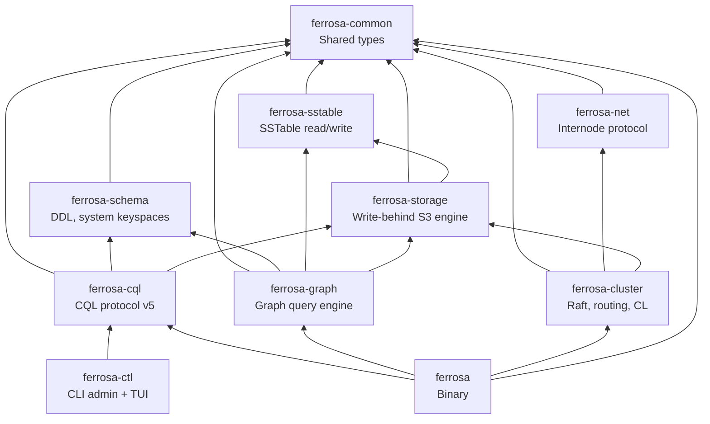

# Component Architecture

> Last updated: 2026-03-13
> Status: Approved

## Overview

Ferrosa is a Cargo workspace of 9 crates with a clean, acyclic dependency graph. Each crate has a single responsibility and can be tested independently.

## Dependency Graph

## Components

### ferrosa-common

- **Purpose**: Shared low-level types used across all crates
- **Location**: `ferrosa-common/`
- **Dependencies**: None (leaf crate)
- **Key types**: `Token` (i64, Murmur3), `PartitionKey`, `DecoratedKey`, `CellValue` (bytes + timestamp + TTL), `Timestamp`, error types (`Error`, `Result`)
- **Boundary**: CQL-level type definitions (text, int, collections, UDTs) live in `ferrosa-cql`, not here

### ferrosa-sstable

- **Purpose**: Read and write Cassandra-compatible SSTable files (BTI format)
- **Location**: `ferrosa-sstable/`
- **Dependencies**: `ferrosa-common`, `lz4_flex`, `zstd`, `crc32fast`
- **Detailed spec**: [SSTable Format Specification](sstable.md)
- **Key interfaces**:
  - `ReadAt` — abstract positional I/O trait (file-system impl here, S3 impl in ferrosa-storage)
  - `SSTableReader<R: ReadAt>` — open and query BTI SSTables from `SSTableComponents<R>`
  - `SSTableWriter` — write BTI SSTables to in-memory `Vec<u8>` buffers (`WrittenSSTable`), caller provides `SerializationHeader`, `WriteOptions`, and pre-computed byte-comparable keys + Bloom filter hashes
- **Formats**: Phase 1: BTI (trie-based, Cassandra 5.x default) read + write. Phase 2: Big (legacy) read for migration. Phase 3: native Ferrosa format behind feature flag.
- **Components handled**: Data.db, Partitions.db (trie partition index), Rows.db (trie row index), Filter.db (Bloom filter), Statistics.db, CompressionInfo.db, TOC.txt
- **On-disk trie**: 16 node types with page-aware packing (4096-byte pages), bottom-up incremental construction, used by both partition and row indices
- **Compression**: LZ4 (default, `lz4_flex`), Zstd (`zstd`). Snappy/Deflate deferred to post-1.0.
- **Bloom filter**: Cassandra-compatible double-hashing using Murmur3 h1 + h2 from ferrosa-common
- **Standalone tools** (Phase 2): `ferrosa-sstable-dump`, `ferrosa-sstable-import`

### ferrosa-storage

- **Purpose**: Storage engine with S3 write-behind
- **Location**: `ferrosa-storage/`
- **Dependencies**: `ferrosa-common`, `ferrosa-sstable`, `arc-swap`, `parking_lot`, `crc32fast`, `object_store` (S3), `tokio`, `serde`, `serde_json`, `bytes`, `crossbeam-skiplist` (optional)
- **Status**: Parts A/B/C implemented — memtable, flush, merge, commit log, compaction, S3 upload manager, manifest, local cache, StorageEngine composition, `WriteObserver` trait (sync/async modes with bounded-channel backpressure)
- **Modules**:
  - `memtable/` — `Memtable` trait with two implementations: `ShardedBTreeMemtable` (64-shard `BTreeMap` with `parking_lot::RwLock`), `SkipListMemtable` (lock-free, behind `skiplist-memtable` feature flag)
  - `flush.rs` — `FlushTarget` trait, `FileFlushTarget` (disk), `InMemoryFlushTarget` (testing)
  - `merge.rs` — Read-path merge across memtable + multiple SSTables (last-write-wins)
  - `store.rs` — `TableStore`: lock-free per-table composition via `arc-swap`
  - `commitlog/` — CAS-allocated segments, CRC32-checksummed entries, configurable sync strategies (Periodic/Batch/Group), checkpoint tracking per table, CDC reader
  - `compaction/` — `SizeTieredStrategy` (STCS), `CompactionExecutor` (background `std::thread` with `mpsc`)
  - `upload/` — `UploadManager` (tokio task with bounded `mpsc`, exponential backoff retry), `ObjectStoreConfig` (12-factor env vars)
  - `manifest.rs` — S3 manifest with etag-based CAS (conditional put via `PutMode::Update`)
  - `cache.rs` — `LocalCache` with LRU eviction, pinned entries, size tracking
  - `engine.rs` — `StorageEngine` composing all components, `StorageEngineConfig` with `from_env()` for 12-factor config
  - `observer.rs` — `WriteObserver` trait with `ObserverMode::Sync`/`Async`, bounded `mpsc` channel for async dispatch with backpressure (T9 mitigation)
  - `subscription_observer.rs` — `SubscriptionObserver` (`WriteObserver` impl, async mode), pushes write events to connected subscribers
  - `virtual_tables.rs` — `StorageStatsTable`, `StorageStatsProvider` trait for exposing memtable/SSTable/cache metrics to virtual table queries
- **Concurrency**:
  - *Memtable writes*: 64-shard `BTreeMap` — different partitions write in parallel; same-shard writes serialize on a per-shard `RwLock`. Alternative: `SkipListMemtable` (lock-free, `crossbeam-skiplist`, behind feature flag).
  - *Memtable flush*: Atomic swap via `arc-swap` — current memtable replaced with a fresh one; old memtable flushed to SSTable. Reads check both active and flushing memtable.
  - *SSTable reads during compaction*: `Arc`-based refcounting. Compaction creates new SSTables and atomically swaps the active set via `arc-swap`. In-flight reads hold references to old SSTables, cleaned up when last reference drops.
  - *S3 upload concurrency*: Independent tokio task observes new SSTables via bounded `mpsc` channel (backpressure), uploads without holding storage engine locks. Local files retained until S3 upload confirms.
- **Compaction strategies**: Size-Tiered (STCS) implemented; Leveled (LCS) and Time-Window (TWCS) are follow-on work
- **Follow-on work**: Compaction execution wiring (merge I/O), metadata collection from SSTables, S3 upload trigger from flush, manifest CAS loop integration, commit log recovery/replay, commit log S3 shipping, LCS/TWCS strategies, disk backpressure, grace period GC, orphan cleanup

### ferrosa-schema

- **Purpose**: Schema management, auth, audit, and system keyspaces
- **Location**: `ferrosa-schema/`
- **Dependencies**: `ferrosa-common`, `arc-swap`, `bcrypt`, `argon2`, `uuid`, `serde`, `serde_json`, `indexmap`, `tracing`, `password-hash`
- **Status**: Implemented — metadata types, schema registry with lock-free snapshots, auth (roles, permissions, RBAC, rate limiting), audit logging (composite sinks, graph audit events), system keyspace queries, secrets provider, production mode validation, `TableMetadata` extensions map + `is_system` flag, `graph.*` extension validation (T6), system table protection (T7), `schema_ref()` for lock-free observer reads
- **Modules**:
  - `metadata/` — `KeyspaceMetadata`, `TableMetadata`, `ColumnMetadata`, replication params, caching params
  - `registry.rs` — `Schema` with `ArcSwap<SchemaSnapshot>` for lock-free reads, `AuthMethod` config
  - `auth/` — `AuthContext`, `Permission`, `Resource`, RBAC with `check_permission()`, `PasswordHasher` (bcrypt/argon2id), `AuthRateLimiter`
  - `audit/` — `AuditEvent`, `AuditSink` trait, `LogAuditSink`, `SystemTableAuditSink`, `CompositeSink`
  - `system/` — System keyspace queries: `system.local`, `system.peers`, `system_schema.keyspaces/tables/columns`, `system_auth.roles/role_members/role_permissions`
  - `secrets/` — `SecretsProvider` trait, `EnvSecretsProvider`
  - `startup.rs` — `validate_production_requirements()`, `DeploymentMode`
  - `convert.rs` — CQL-to-marshal type conversion
  - `virtual_table.rs` — `VirtualTable` trait, `VirtualRow`, `VirtualColumnDef`, `RowPredicate`, `SubscriptionMode` (None/Polling/Push)
  - `virtual_registry.rs` — `VirtualTableRegistry` with lock-free `ArcSwap` for concurrent reads, register/lookup by keyspace.table
- **Key interfaces**: Table/keyspace definitions, CREATE/ALTER/DROP validation, system keyspace queries (`system.local`, `system.peers`, `system_schema.*`)
- **Persistence**: Schema is Raft-committed metadata (via `ferrosa-cluster`). All nodes have identical schema at the same Raft index.
- **Agreement**: Raft applied index comparison, not gossip-based version UUIDs (though UUIDs maintained for driver compat)

### ferrosa-cql

- **Purpose**: CQL native protocol v5 and query execution
- **Location**: `ferrosa-cql/`
- **Dependencies**: `ferrosa-common`, `ferrosa-schema`, `ferrosa-storage`, `tokio`, `tokio-util`, `bytes`, `futures`, `arc-swap`, `uuid`, `num-bigint`, `phf`, `md-5`, `moka`, `tracing`
- **Status**: Parts A-D implemented — protocol framing, CQL type system, TCP server, SASL PLAIN auth, recursive descent parser, full query routing (SELECT/INSERT/UPDATE/DELETE/BATCH/DDL), prepared statement cache (moka W-TinyLFU), connection state machine with security hardening
- **Modules**:
  - `frame.rs` — CQL v5 binary framing, `CqlCodec` (Tokio `Encoder`/`Decoder`)
  - `types.rs` — `CqlValue` enum with encode/decode for all CQL types
  - `server.rs` — TCP listener, per-connection Tokio tasks, max connection limit
  - `connection.rs` — Connection state machine (AwaitingStartup → Authenticating → Ready), idle timeout (300s)
  - `auth.rs` — SASL PLAIN authentication, max 3 attempts per connection
  - `error.rs` — CQL error codes
  - `lexer.rs` — Zero-allocation tokenizer with `phf` keyword map
  - `parser.rs` — Hand-written recursive descent parser (LL(2)), nesting depth cap (32), collection element cap (65,536)
  - `ast.rs` — `Statement` enum (Select, Insert, Update, Delete, CreateKeyspace, CreateTable, AlterTable, DropTable, Use, Batch, Prepare, etc.)
  - `bridge.rs` — `CqlValue` to `CellValue` conversion, partition key serialization, clustering key encoding
  - `router.rs` — Query routing to schema/storage, `SharedState`, `SingleNodeClusterState`
  - `prepared.rs` — `PreparedCache` (moka W-TinyLFU, weight-based, MD5 IDs)
  - `result.rs` — CQL result encoding
  - `virtual_tables/connections.rs` — `ConnectionTracker` (`RwLock`-backed), `ConnectionInfo` for tracking active CQL connections
  - `virtual_tables/active_queries.rs` — `QueryTracker`, `QueryInfo`, `QueryGuard` (RAII auto-deregister), `ActiveQueriesTable` for in-flight query monitoring
  - `subscribe.rs` — `SubscriptionState`, `SubscriptionHandle` for per-connection lifecycle management of virtual table subscriptions
  - `prometheus.rs` — `render_metrics()` — Prometheus text exposition format from virtual tables (connections, queries, storage stats)
  - `client.rs` — `CqlClient`, thin async CQL client for admin tooling (`QueryResult`, `ResultRow`)
- **Key interfaces**: Full CQL query lifecycle — frame decode → parse → route → execute → encode result
- **Auth**: SASL PLAIN with `Schema::authenticate()`, rate limiting, connection state machine
- **Supported operations**: SELECT, INSERT, UPDATE, DELETE, BATCH, CREATE/ALTER/DROP KEYSPACE/TABLE, CREATE/ALTER/DROP ROLE, GRANT/REVOKE, TRUNCATE, USE, PREPARE/EXECUTE, system table queries
- **Target**: All standard CQL drivers connect without modification

### ferrosa-graph

- **Purpose**: Graph query engine with Cypher support, adjacency index, HTTP endpoint
- **Location**: `ferrosa-graph/`
- **Dependencies**: `ferrosa-common`, `ferrosa-schema`, `ferrosa-sstable`, `ferrosa-storage`, `arc-swap`, `axum`, `axum-server` (TLS), `base64`, `hex`, `indexmap`, `phf`, `serde`, `serde_json`, `tokio`, `tower-http`, `tracing`, `uuid`
- **Status**: Phase 1 implemented — Cypher parser, logical/physical planners, hop-by-hop executor, adjacency index with async observer, HTTP endpoint with auth/TLS, background reconciliation
- **Modules**:
  - `parser/` — Cypher lexer, recursive descent parser, AST types
  - `error.rs` — `GraphError` enum (Parse, Validation, PermissionDenied, ResourceLimit, Timeout, Storage, Schema, Internal)
  - `adjacency/schema.rs` — Adjacency table schema (`system_graph_<ks>.adjacency`), direction constants
  - `adjacency/observer.rs` — `AdjacencyIndexObserver` (`WriteObserver` impl, async mode), generates OUT+IN entries per edge write
  - `adjacency/reconcile.rs` — Background reconciliation task (T5), periodic scan for index/edge divergence
  - `planner/logical.rs` — Label resolution against schema, per-hop auth checks (T3)
  - `planner/physical.rs` — `PhysicalPlan::Expand` with anchor selection, hop planning
  - `executor/expand.rs` — Hop-by-hop traversal, fan-out limits (T4), query timeout, `GraphEngineConfig`
  - `executor/result.rs` — `GraphResult` and `QueryStats` (serializable)
  - `engine.rs` — `GraphEngine` composition root: startup wiring, execute/explain/schema APIs, graceful shutdown
  - `http.rs` — Axum routes (POST `/graph/query`, `/graph/explain`, GET `/graph/schema`, `/graph/health`), Basic auth middleware (T2), error sanitization (T8), TLS enforcement (T11), `CatchPanicLayer`, `RequestBodyLimitLayer`
- **Security mitigations**: T2 (HTTP auth), T3 (per-hop auth), T4 (timeout + fan-out limits), T5 (reconciliation), T6 (extension validation in schema), T7 (system table protection), T8 (error sanitization), T9 (observer backpressure), T10 (audit events), T11 (TLS)
- **Design**: Data stored in normal CQL tables with `graph.*` extensions, accessed via system-managed adjacency index per keyspace

### ferrosa-ctl

- **Purpose**: CLI admin tool with TUI monitor for inspecting and managing a running Ferrosa node
- **Location**: `ferrosa-ctl/`
- **Dependencies**: `ferrosa-cql`, `clap`, `ratatui`, `crossterm`, `tabled`, `tokio`
- **Status**: Implemented — CLI subcommands for node inspection, live TUI dashboard with auto-refresh
- **Modules**:
  - `main.rs` — CLI entry point with `clap` derive, subcommands: `status`, `connections`, `queries`, `storage`, `topology`, `peers`, `monitor`
  - `commands.rs` — Async subcommand implementations using `CqlClient` to query virtual tables
  - `tui.rs` — `ratatui` TUI with `Panel` enum (`Connections`/`Queries`/`Storage`), `AppState`, 2-second auto-refresh, keyboard navigation
- **Key interfaces**: Connects to a Ferrosa node via CQL protocol using `ferrosa-cql::CqlClient`, queries `system_virtual.*` tables for live metrics
- **Usage**: `ferrosa-ctl --host 127.0.0.1 --port 9042 <subcommand>`

### ferrosa-net

- **Purpose**: Custom internode protocol
- **Location**: `ferrosa-net/`
- **Dependencies**: `ferrosa-common`
- **Key interfaces**: Connection pooling, multiplexing, message framing, TLS (`rustls`)
- **Transport**: TCP + length-prefixed framing initially. QUIC is a research item.
- **Versioning**: Connection-level version negotiation handshake. Major version = breaking, minor = compatible.

### ferrosa-cluster

- **Purpose**: Distributed coordination
- **Location**: `ferrosa-cluster/`
- **Dependencies**: `ferrosa-common`, `ferrosa-net`, `ferrosa-storage`
- **Key interfaces**: Raft metadata consensus, node membership, token ring (Murmur3, vnodes), request routing, tunable CL, read repair, hinted handoff, anti-entropy repair
- **Raft design**: Single cluster-wide group via `openraft`. 3-5 voter nodes, rest are learners. Log on local disk + async S3 snapshots. New nodes bootstrap from S3 snapshot.
- **Research**: Accord/Tempo/EPaxos for transactions, HLC for clock sync

### ferrosa (binary)

- **Purpose**: Compose all crates into the running database
- **Location**: `ferrosa/` (workspace root binary)
- **Dependencies**: `ferrosa-common`, `ferrosa-schema`, `ferrosa-storage`, `ferrosa-cql`, `ferrosa-graph`, `axum`, `rust-embed`, `tokio`, `tracing`, `tracing-subscriber`
- **Status**: Single-node operation implemented — starts CQL server on port 9042, optionally starts graph HTTP on port 7474, starts web admin server on port 9090
- **Modules**:
  - `web/mod.rs` — `WebConfig`, `start_web_server()` on port 9090 (configurable), Axum router composition
  - `web/api.rs` — Axum JSON API routes: `/api/connections`, `/api/storage_stats`, `/api/active_queries`, `/api/tables`
  - `web/static_files.rs` — `rust-embed` static file serving for the dashboard UI
  - `web/index.html` — Single-file HTML/CSS/JS dashboard with auto-refresh, connection/query/storage panels
- **Startup sequence**: tracing init → `StorageEngine::new()` → `Schema::new()` → `CqlServer::start_background()` → optional `GraphEngine` + HTTP (gated by `FERROSA_GRAPH_ENABLED`) → web admin server on port 9090 → ctrl-c → graceful shutdown
- **Environment variables**: `FERROSA_CQL_BIND` (default `0.0.0.0:9042`), `FERROSA_AUTH_DISABLED` (default false), `FERROSA_GRAPH_ENABLED` (default false), `FERROSA_WEB_BIND` (default `0.0.0.0:9090`), plus storage/schema env vars

## Build Order

```mermaid
gantt
    title Crate Build Sequence
    dateFormat X
    axisFormat %s

    section Foundation
    ferrosa-common          :done, 0, 1
    ferrosa-sstable         :done, 1, 3

    section Engine
    ferrosa-storage         :done, 3, 5
    ferrosa-schema          :done, 5, 6

    section Protocol
    ferrosa-cql             :done, 6, 8
    ferrosa-graph           :done, 6, 7
    ferrosa-net             :7, 8

    section Tools
    ferrosa-ctl             :done, 8, 9

    section Distributed
    ferrosa-cluster         :9, 11
    ferrosa binary          :done, 11, 12
```

| Order | Crate | Testable Milestone |
|-------|-------|--------------------|
| 1 | ferrosa-common | Type definitions compile — **done** |
| 2 | ferrosa-sstable | Read real Cassandra SSTables, round-trip BTI — **done** |
| 3 | ferrosa-storage | Single-node writes + reads with S3 backend — **done** (core engine; follow-on items tracked) |
| 4 | ferrosa-schema | Schema registry, auth, audit, system keyspaces queryable — **done** |
| 5 | ferrosa-cql | cqlsh connects and runs basic queries — **done** (full CQL lifecycle: parse, route, execute, prepared cache) |
| 5b | ferrosa-graph | Graph queries via HTTP with auth — **done** (Phase 1: parser, planner, executor, adjacency index, HTTP) |
| 5c | ferrosa-ctl | CLI admin connects and displays node status — **done** (subcommands, TUI monitor) |
| 6 | ferrosa-net | Two nodes exchange messages |
| 7 | ferrosa-cluster | 3-node cluster at QUORUM |
| 8 | ferrosa (binary) | Single-node binary accepts CQL on 9042 — **done**; distributed mode pending ferrosa-net/cluster |

## Related Specs

- [Overview](overview.md) — system overview and design principles
- [Data Flow](data-flow.md) — write/read paths
- [Storage](storage.md) — storage engine details
- [CQL](cql.md) — CQL native protocol v5
