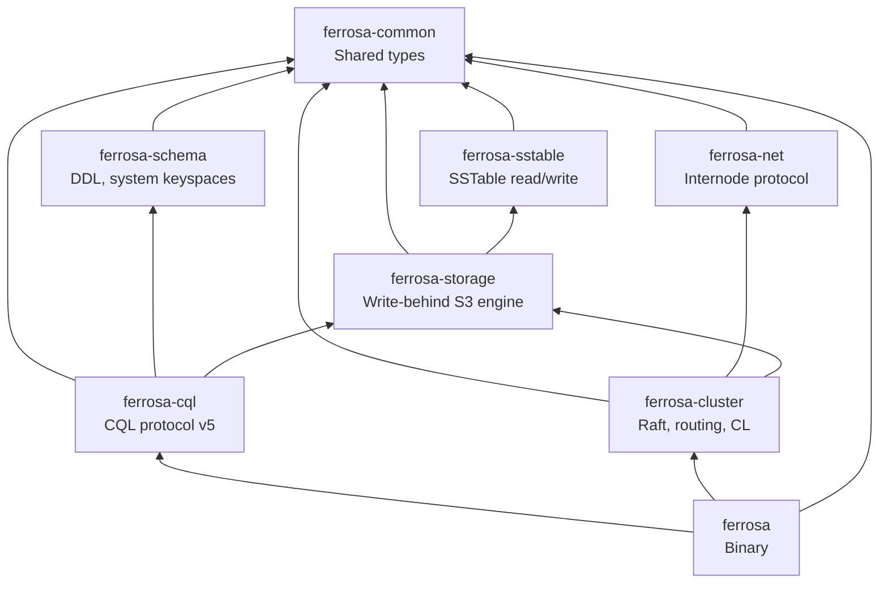

# Component Architecture

> Last updated: 2026-03-12
> Status: Approved

## Overview

Ferrosa is a Cargo workspace of 8 crates with a clean, acyclic dependency graph. Each crate has a single responsibility and can be tested independently.

## Dependency Graph

## Components

### ferrosa-common

- **Purpose**: Shared low-level types used across all crates
- **Location**: `ferrosa-common/`
- **Dependencies**: None (leaf crate)
- **Key types**: `Token` (i64, Murmur3), `PartitionKey`, `DecoratedKey`, `CellValue` (bytes + timestamp + TTL), `Timestamp`, error types (`Error`, `Result`)
- **Boundary**: CQL-level type definitions (text, int, collections, UDTs) live in `ferrosa-cql`, not here

### ferrosa-sstable

- **Purpose**: Read and write Cassandra-compatible SSTable files (BTI format)
- **Location**: `ferrosa-sstable/`
- **Dependencies**: `ferrosa-common`, `lz4_flex`, `zstd`, `crc32fast`
- **Detailed spec**: [SSTable Format Specification](sstable.md)
- **Key interfaces**:
  - `ReadAt` / `WriteAt` — abstract positional I/O traits (file-system impl here, S3 impl in ferrosa-storage)
  - `SSTableReader` — open and query BTI SSTables
  - `SSTableWriter` — write new BTI SSTables from sorted input
- **Formats**: Phase 1: BTI (trie-based, Cassandra 5.x default) read + write. Phase 2: Big (legacy) read for migration. Phase 3: native Ferrosa format behind feature flag.
- **Components handled**: Data.db, Partitions.db (trie partition index), Rows.db (trie row index), Filter.db (Bloom filter), Statistics.db, CompressionInfo.db, TOC.txt
- **On-disk trie**: 16 node types with page-aware packing (4096-byte pages), bottom-up incremental construction, used by both partition and row indices
- **Compression**: LZ4 (default, `lz4_flex`), Zstd (`zstd`). Snappy/Deflate deferred to post-1.0.
- **Bloom filter**: Cassandra-compatible double-hashing using Murmur3 h1 + h2 from ferrosa-common
- **Standalone tools** (Phase 2): `ferrosa-sstable-dump`, `ferrosa-sstable-import`

### ferrosa-storage

- **Purpose**: Storage engine with S3 write-behind
- **Location**: `ferrosa-storage/`
- **Dependencies**: `ferrosa-common`, `ferrosa-sstable`, `arc-swap`, `parking_lot`, `crc32fast`, `object_store` (S3), `tokio`, `serde`, `serde_json`, `bytes`
- **Status**: Parts A/B/C implemented — memtable, flush, merge, commit log, compaction, S3 upload manager, manifest, local cache, StorageEngine composition
- **Modules**:
  - `memtable/` — `ShardedBTreeMemtable` (16-shard `BTreeMap` with `parking_lot::RwLock`)
  - `flush.rs` — `FlushTarget` trait, `FileFlushTarget` (disk), `InMemoryFlushTarget` (testing)
  - `merge.rs` — Read-path merge across memtable + multiple SSTables (last-write-wins)
  - `store.rs` — `TableStore`: lock-free per-table composition via `arc-swap`
  - `commitlog/` — CAS-allocated segments, CRC32-checksummed entries, configurable sync strategies (Periodic/Batch/Group), checkpoint tracking per table
  - `compaction/` — `SizeTieredStrategy` (STCS), `CompactionExecutor` (background `std::thread` with `mpsc`)
  - `upload/` — `UploadManager` (tokio task with bounded `mpsc`, exponential backoff retry), `ObjectStoreConfig` (12-factor env vars)
  - `manifest.rs` — S3 manifest with etag-based CAS (conditional put via `PutMode::Update`)
  - `cache.rs` — `LocalCache` with LRU eviction, pinned entries, size tracking
  - `engine.rs` — `StorageEngine` composing all components, `StorageEngineConfig` with `from_env()` for 12-factor config
- **Concurrency**:
  - *Memtable writes*: 16-shard `BTreeMap` — different partitions write in parallel; same-shard writes serialize on a per-shard `RwLock`.
  - *Memtable flush*: Atomic swap via `arc-swap` — current memtable replaced with a fresh one; old memtable flushed to SSTable. Reads check both active and flushing memtable.
  - *SSTable reads during compaction*: `Arc`-based refcounting. Compaction creates new SSTables and atomically swaps the active set via `arc-swap`. In-flight reads hold references to old SSTables, cleaned up when last reference drops.
  - *S3 upload concurrency*: Independent tokio task observes new SSTables via bounded `mpsc` channel (backpressure), uploads without holding storage engine locks. Local files retained until S3 upload confirms.
- **Compaction strategies**: Size-Tiered (STCS) implemented; Leveled (LCS) and Time-Window (TWCS) are follow-on work
- **Follow-on work**: Compaction execution wiring (merge I/O), metadata collection from SSTables, S3 upload trigger from flush, manifest CAS loop integration, commit log recovery/replay, commit log S3 shipping, LCS/TWCS strategies, disk backpressure, grace period GC, orphan cleanup

### ferrosa-schema

- **Purpose**: Schema management and system keyspaces
- **Location**: `ferrosa-schema/`
- **Dependencies**: `ferrosa-common`
- **Key interfaces**: Table/keyspace definitions, CREATE/ALTER/DROP validation, system keyspace queries (`system.local`, `system.peers`, `system_schema.*`)
- **Persistence**: Schema is Raft-committed metadata (via `ferrosa-cluster`). All nodes have identical schema at the same Raft index.
- **Agreement**: Raft applied index comparison, not gossip-based version UUIDs (though UUIDs maintained for driver compat)

### ferrosa-cql

- **Purpose**: CQL native protocol v5 and query execution
- **Location**: `ferrosa-cql/`
- **Dependencies**: `ferrosa-common`, `ferrosa-schema`, `ferrosa-storage`
- **Key interfaces**: Protocol framing, CQL parser, query planner, result serialization, CQL type system
- **Auth**: Password-only initially, pluggable auth provider trait
- **Minimum viable subset**: STARTUP, OPTIONS, QUERY, PREPARE, EXECUTE, REGISTER, RESULT + basic types + system keyspace queries
- **Target**: All standard CQL drivers connect without modification

### ferrosa-net

- **Purpose**: Custom internode protocol
- **Location**: `ferrosa-net/`
- **Dependencies**: `ferrosa-common`
- **Key interfaces**: Connection pooling, multiplexing, message framing, TLS (`rustls`)
- **Transport**: TCP + length-prefixed framing initially. QUIC is a research item.
- **Versioning**: Connection-level version negotiation handshake. Major version = breaking, minor = compatible.

### ferrosa-cluster

- **Purpose**: Distributed coordination
- **Location**: `ferrosa-cluster/`
- **Dependencies**: `ferrosa-common`, `ferrosa-net`, `ferrosa-storage`
- **Key interfaces**: Raft metadata consensus, node membership, token ring (Murmur3, vnodes), request routing, tunable CL, read repair, hinted handoff, anti-entropy repair
- **Raft design**: Single cluster-wide group via `openraft`. 3-5 voter nodes, rest are learners. Log on local disk + async S3 snapshots. New nodes bootstrap from S3 snapshot.
- **Research**: Accord/Tempo/EPaxos for transactions, HLC for clock sync

### ferrosa (binary)

- **Purpose**: Compose all crates into the running database
- **Location**: `ferrosa/` (workspace root binary)
- **Dependencies**: All crates
- **Key interfaces**: CLI, configuration loading, service startup/shutdown

## Build Order

```mermaid
gantt
    title Crate Build Sequence
    dateFormat X
    axisFormat %s

    section Foundation
    ferrosa-common          :done, 0, 1
    ferrosa-sstable         :done, 1, 3

    section Engine
    ferrosa-storage         :done, 3, 5
    ferrosa-schema          :active, 5, 6

    section Protocol
    ferrosa-cql             :6, 8
    ferrosa-net             :6, 7

    section Distributed
    ferrosa-cluster         :8, 10
    ferrosa binary          :10, 11
```

| Order | Crate | Testable Milestone |
|-------|-------|--------------------|
| 1 | ferrosa-common | Type definitions compile — **done** |
| 2 | ferrosa-sstable | Read real Cassandra SSTables, round-trip BTI — **done** |
| 3 | ferrosa-storage | Single-node writes + reads with S3 backend — **done** (core engine; follow-on items tracked) |
| 4 | ferrosa-schema | Parse CREATE TABLE, system keyspaces queryable |
| 5 | ferrosa-cql | cqlsh connects and runs basic queries |
| 6 | ferrosa-net | Two nodes exchange messages |
| 7 | ferrosa-cluster | 3-node cluster at QUORUM |
| 8 | ferrosa (binary) | Full database, characterization tests pass |

## Related Specs

- [Overview](overview.md) — system overview and design principles
- [Data Flow](data-flow.md) — write/read paths
