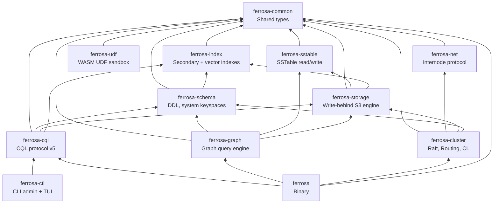

# Component Architecture

> Last updated: 2026-04-02
> Status: Approved

## Overview

Ferrosa is a Cargo workspace of 12 crates with a clean, acyclic dependency graph. Each crate has a single responsibility and can be tested independently.

## Dependency Graph

## Components

### ferrosa-common

- **Purpose**: Shared low-level types used across all crates
- **Location**: `ferrosa-common/`
- **Dependencies**: None (leaf crate)
- **Key types**: `Token` (i64, Murmur3), `PartitionKey`, `DecoratedKey`, `CellValue` (bytes + timestamp + TTL), `Timestamp`, error types (`Error`, `Result`). **Accord types**: `accord::Timestamp` (HLC hybrid logical clock), `TxnId` (transaction identifier with node + sequence + HLC), `Ballot` (ballot numbers for consensus voting rounds).
- **Boundary**: CQL-level type definitions (text, int, collections, UDTs) live in `ferrosa-cql`, not here

### ferrosa-sstable

- **Purpose**: Read and write Cassandra-compatible SSTable files (BTI format)
- **Location**: `ferrosa-sstable/`
- **Dependencies**: `ferrosa-common`, `lz4_flex`, `zstd`, `crc32fast`
- **Detailed spec**: [SSTable Format Specification](sstable.md)
- **Key interfaces**:
  - `ReadAt` — abstract positional I/O trait (file-system impl here, S3 impl in ferrosa-storage)
  - `SSTableReader<R: ReadAt>` — open and query BTI SSTables from `SSTableComponents<R>`
  - `SSTableWriter` — write BTI SSTables to in-memory `Vec<u8>` buffers (`WrittenSSTable`), caller provides `SerializationHeader`, `WriteOptions`, and pre-computed byte-comparable keys + Bloom filter hashes
- **Formats**: Phase 1: BTI (trie-based, Cassandra 5.x default) read + write. Phase 2: Big (legacy) read for migration. Phase 3: native Ferrosa format behind feature flag.
- **Components handled**: Data.db, Partitions.db (trie partition index), Rows.db (trie row index), Filter.db (Bloom filter), Statistics.db, CompressionInfo.db, TOC.txt
- **On-disk trie**: 16 node types with page-aware packing (4096-byte pages), bottom-up incremental construction, used by both partition and row indices. Sign-bit fix in `encode_signed_bytes` ensures correct byte-comparable ordering for negative values.
- **Compression**: LZ4 (default, `lz4_flex`), Zstd (`zstd`). Snappy/Deflate deferred to post-1.0.
- **Bloom filter**: Cassandra-compatible double-hashing using Murmur3 h1 + h2 from ferrosa-common
- **Robustness fixes**: Range tombstone markers are skipped gracefully (instead of returning an error). 0-clustering column serialization fix for tables with no clustering key. `i32` overflow fix in `local_deletion_time` delta decoding.
- **Standalone tools** (Phase 2): `ferrosa-sstable-dump`, `ferrosa-sstable-import`

### ferrosa-index

- **Purpose**: Pluggable secondary index framework with multiple index type implementations
- **Location**: `ferrosa-index/`
- **Dependencies**: `ferrosa-common`, `serde`, `serde_json`, `rand`, `tracing`
- **Status**: Implemented — 8 index types with build/read/factory trait system
- **Modules**:
  - `lib.rs` — Core types (`IndexType`, `IndexKey`, `RowPosition`, `IndexFiles`, `IndexConfig`, `IndexCapabilities`, `FilterPredicate`), traits (`IndexBuilder`, `IndexReader`, `IndexFactory`), error types
  - `btree.rs` — B-tree index (sorted key → row position, binary search lookup, range scan)
  - `hash.rs` — Hash index (O(1) point lookup via HashMap)
  - `composite.rs` — Composite multi-column index (concatenated column keys with length prefixes)
  - `phonetic/` — Phonetic index with `PhoneticEncoder` trait and 4 algorithms: `soundex.rs`, `metaphone.rs`, `double_metaphone.rs`, `caverphone.rs`
  - `filtered.rs` — Filtered index wrapper (evaluates `FilterPredicate` at build time, delegates to inner factory)
  - `vector/mod.rs` — Distance functions (L2, cosine, inner product), dimension constants (4096 f32 / 8192 f16)
  - `vector/hnsw.rs` — HNSW graph index (multi-layer navigable small world, beam search)
  - `vector/ivfflat.rs` — IVFFlat index (k-means clustering, inverted list probing)
- **Key interfaces**: Two trait APIs — secondary indexes use `IndexFactory`/`IndexBuilder`/`IndexReader` with partition/clustering key addressing; vector indexes use their own trait set in `vector::` module with byte-offset `RowPosition` and `nearest(query, k, ef_search)` for ANN queries. Storage-attached design — indexes are per-SSTable companion files built asynchronously after flush.
- **Vector index type**: `IndexType::Vector` registered in the factory for `CREATE INDEX ... USING 'vector'` DDL.
- **Phonetic encoder public API**: `PhoneticEncoder` trait and Double Metaphone algorithm are public, usable outside of index builds.
- **Spec**: [Secondary Indexes Design](../superpowers/specs/2026-03-14-secondary-indexes-design.md)

### ferrosa-udf

- **Purpose**: WASM-sandboxed user-defined function execution
- **Location**: `ferrosa-udf/`
- **Dependencies**: `ferrosa-common`, `wasmtime` (component-model), `moka`, `num-bigint`, `uuid`, `thiserror`, `tracing`
- **Status**: Done — parser, schema, DDL replication, Wasmtime compilation, router wiring all complete. Remaining: wit-bindgen invoke integration.
- **Modules**:
  - `wit/ferrosa-udf.wit` — WebAssembly Component Model contract defining `cql-value` type (all CQL types including UDTs, collections, temporal) with single `invoke(args) -> result<cql-value, string>` export
  - `executor.rs` — `UdfExecutor` with moka compilation cache (configurable capacity, default 256), real Wasmtime `Component` compilation, `compile()`, `invalidate()`, `call()` methods
  - `sandbox.rs` — `SandboxConfig` with resource limits: 16MB memory, 1M fuel, 5s timeout, 10MB binary upload limit, 10M aggregate fuel
  - `convert.rs` — `CqlValue` to WIT `cql-value` bidirectional conversion covering primitives, collections, UDTs, decimal/varint
  - `error.rs` — `UdfError` enum: CompilationFailed, NotFound, ResourceExhausted, ExecutionFailed, TypeMismatch, BinaryTooLarge
- **Design**: UDFs are uploaded as WASM binaries via `CREATE FUNCTION ... LANGUAGE wasm AS <hex>`. The executor compiles and caches modules with real Wasmtime `Component` instantiation, enforcing per-invocation resource limits via Wasmtime fuel and epoch interruption. CREATE/DROP FUNCTION and CREATE/DROP AGGREGATE are parsed by the CQL parser, routed through `DdlPath` with permission checks, and replicated via `DdlOperation`/`RaftCommand`. `FunctionMetadata` and `AggregateMetadata` are stored in the schema registry with `system_schema.functions` and `system_schema.aggregates` virtual tables. Rust is the preferred authoring language but any language targeting WASM Component Model works.

### ferrosa-storage

- **Purpose**: Storage engine with S3 write-behind
- **Location**: `ferrosa-storage/`
- **Dependencies**: `ferrosa-common`, `ferrosa-sstable`, `arc-swap`, `parking_lot`, `crc32fast`, `object_store` (S3), `tokio`, `serde`, `serde_json`, `bytes`, `crossbeam-skiplist` (optional)
- **Status**: Parts A/B/C implemented + PITR (archiver, snapshots, restore) + sidecar index persistence + Accord storage module
- **Modules**:
  - `memtable/` — `Memtable` trait with two implementations: `ShardedBTreeMemtable` (64-shard `BTreeMap` with `parking_lot::RwLock`), `SkipListMemtable` (lock-free, behind `skiplist-memtable` feature flag)
  - `flush.rs` — `FlushTarget` trait, `FileFlushTarget` (disk), `InMemoryFlushTarget` (testing)
  - `merge.rs` — Read-path merge across memtable + multiple SSTables (last-write-wins)
  - `store.rs` — `TableStore`: lock-free per-table composition via `arc-swap`
  - `commitlog/` — CAS-allocated segments, CRC32-checksummed entries, configurable sync strategies (Periodic/Batch/Group), checkpoint tracking per table, CDC reader
  - `compaction/` — `SizeTieredStrategy` (STCS), `CompactionExecutor` (background `std::thread` with `mpsc`)
  - `upload/` — `UploadManager` (tokio task with bounded `mpsc`, exponential backoff retry), `ObjectStoreConfig` (12-factor env vars)
  - `manifest.rs` — S3 manifest with etag-based CAS (conditional put via `PutMode::Update`)
  - `cache.rs` — `LocalCache` with LRU eviction, pinned entries, size tracking
  - `engine.rs` — `StorageEngine` composing all components, `StorageEngineConfig` with `from_env()` for 12-factor config
  - `observer.rs` — `WriteObserver` trait with `ObserverMode::Sync`/`Async`, bounded `mpsc` channel for async dispatch with backpressure (T9 mitigation)
  - `subscription_observer.rs` — `SubscriptionObserver` (`WriteObserver` impl, async mode), pushes write events to connected subscribers
  - `virtual_tables.rs` — `StorageStatsTable`, `StorageStatsProvider` trait for exposing memtable/SSTable/cache metrics to virtual table queries
  - `index/tracker.rs` — `IndexStateTracker` (per-index staleness: Current/Building/Stale/Failed), `IndexState`, coverage tracking
  - `index/scheduler.rs` — `IndexBuildScheduler` (channel-based worker pool following `CompactionExecutor` pattern), `IndexBuildJob`, `BuildPriority`
  - `index/virtual_table.rs` — `SecondaryIndexesVirtualTable` for `system_views.secondary_indexes` operational metrics
  - `archiver.rs` — `CommitLogArchiver` (tokio task polling closed segments, S3 upload with exponential backoff, SHA-256 checksums, archive manifest with CAS)
  - `snapshot.rs` — `SnapshotManager` (atomic snapshot creation: flush + manifest + schema copy, `SnapshotMetadata` with serde, list/delete, TTL cleanup)
  - `restore.rs` — `RestoreManager` (full restore workflow: snapshot download, segment continuity validation, timestamp-filtered replay, node-id validation, schema validation)
  - `sidecar.rs` — Sidecar index file I/O: header (magic/version/count/CRC32) + sorted entries, read/write roundtrip
  - `accord/sync_writer.rs` — `SyncWriter` for durable write-ahead of Accord transaction commits
  - `accord/write_gate.rs` — `WriteGate` DDL drain-and-block gate, pauses Accord writes during schema changes
  - `accord/reorder_buffer.rs` — `ReorderBuffer` for dependency-ordered transaction apply
  - `accord/sidecar.rs` — `.accord` sidecar files for crash recovery replay of in-flight transactions
- **Concurrency**:
  - *Memtable writes*: 64-shard `BTreeMap` — different partitions write in parallel; same-shard writes serialize on a per-shard `RwLock`. Alternative: `SkipListMemtable` (lock-free, `crossbeam-skiplist`, behind feature flag).
  - *Memtable flush*: Atomic swap via `arc-swap` — current memtable replaced with a fresh one; old memtable flushed to SSTable. Reads check both active and flushing memtable.
  - *SSTable reads during compaction*: `Arc`-based refcounting. Compaction creates new SSTables and atomically swaps the active set via `arc-swap`. In-flight reads hold references to old SSTables, cleaned up when last reference drops.
  - *S3 upload concurrency*: Independent tokio task observes new SSTables via bounded `mpsc` channel (backpressure), uploads without holding storage engine locks. Local files retained until S3 upload confirms.
- **Read path**: `read_range()` merges data from both memtable and flushed SSTables (previously memtable-only). Range queries now return the full merged view.
- **DELETE**: Row-level tombstone merge in memtable — DELETE operations merge tombstones at the row level, correctly suppressing older cells across multiple write sources.
- **Commit log**: Oversized entries (exceeding segment capacity) are handled gracefully with a descriptive error instead of a panic or silent corruption.
- **Serialization**: 0-clustering column serialization fix for tables with no clustering key.
- **Compaction strategies**: Size-Tiered (STCS) implemented; Leveled (LCS) and Time-Window (TWCS) are follow-on work
- **Follow-on work**: LCS/TWCS strategies, disk backpressure, `io_uring` I/O backend

### ferrosa-schema

- **Purpose**: Schema management, auth, audit, and system keyspaces
- **Location**: `ferrosa-schema/`
- **Dependencies**: `ferrosa-common`, `arc-swap`, `bcrypt`, `argon2`, `uuid`, `serde`, `serde_json`, `indexmap`, `tracing`, `password-hash`
- **Status**: Implemented — metadata types, schema registry with lock-free snapshots, auth (roles, permissions, RBAC, rate limiting), audit logging (composite sinks, graph audit events), system keyspace queries, secrets provider, production mode validation, `TableMetadata` extensions map + `is_system` flag, `graph.*` extension validation (T6), system table protection (T7), `schema_ref()` for lock-free observer reads, `UserTypeMetadata` for UDTs with `system_schema.types` virtual table, `IndexMetadata` with `system_schema.indexes` virtual table
- **Modules**:
  - `metadata/` — `KeyspaceMetadata`, `TableMetadata`, `ColumnMetadata`, `IndexMetadata`, `UserTypeMetadata`, replication params, caching params
  - `registry.rs` — `Schema` with `ArcSwap<SchemaSnapshot>` for lock-free reads, `AuthMethod` config
  - `auth/` — `AuthContext`, `Permission`, `Resource`, RBAC with `check_permission()`, `PasswordHasher` (bcrypt/argon2id), `AuthRateLimiter`
  - `audit/` — `AuditEvent`, `AuditSink` trait, `LogAuditSink`, `SystemTableAuditSink`, `CompositeSink`
  - `system/` — System keyspace queries: `system.local`, `system.peers`, `system_schema.keyspaces/tables/columns/indexes`, `system_auth.roles/role_members/role_permissions`
  - `secrets/` — `SecretsProvider` trait, `EnvSecretsProvider`
  - `startup.rs` — `validate_production_requirements()`, `DeploymentMode`
  - `convert.rs` — CQL-to-marshal type conversion
  - `virtual_table.rs` — `VirtualTable` trait, `VirtualRow`, `VirtualColumnDef`, `RowPredicate`, `SubscriptionMode` (None/Polling/Push)
  - `virtual_registry.rs` — `VirtualTableRegistry` with lock-free `ArcSwap` for concurrent reads, register/lookup by keyspace.table
- **Key interfaces**: Table/keyspace definitions, CREATE/ALTER/DROP validation, system keyspace queries (`system.local`, `system.peers`, `system_schema.*`)
- **Persistence**: Schema is Raft-committed metadata (via `ferrosa-cluster`). All nodes have identical schema at the same Raft index.
- **Agreement**: Raft applied index comparison, not gossip-based version UUIDs (though UUIDs maintained for driver compat)

### ferrosa-cql

- **Purpose**: CQL native protocol v4/v5 and query execution
- **Location**: `ferrosa-cql/`
- **Dependencies**: `ferrosa-common`, `ferrosa-schema`, `ferrosa-storage`, `tokio`, `tokio-util`, `bytes`, `futures`, `arc-swap`, `uuid`, `num-bigint`, `phf`, `md-5`, `moka`, `tracing`
- **Status**: Parts A-D implemented + Accord integration — protocol framing, CQL type system (including `vector<float, N>` via Custom wire type 0x0000), TCP server, SASL PLAIN auth, recursive descent parser, full query routing (SELECT/INSERT/UPDATE/DELETE/BATCH/DDL), prepared statement cache (moka W-TinyLFU), connection state machine with security hardening, protocol v4/v5 negotiation, LWT (IF NOT EXISTS, IF conditions), BEGIN TRANSACTION/COMMIT/ROLLBACK, SERIAL/LOCAL_SERIAL consistency levels, pagination
- **Modules**:
  - `frame.rs` — CQL v5 binary framing, `CqlCodec` (Tokio `Encoder`/`Decoder`)
  - `types.rs` — `CqlValue` enum with encode/decode for all CQL types, including `CqlType::Vector` (`vector<float, N>`) encoded as Custom wire type 0x0000
  - `server.rs` — TCP listener, per-connection Tokio tasks, max connection limit, RAII `IpSlotGuard` for connection slot cleanup (prevents leak on client death/panic), TCP keepalive (30s probe, 10s interval via `socket2`)
  - `connection.rs` — Connection state machine (AwaitingStartup → Authenticating → Ready), idle timeout (300s)
  - `auth.rs` — SASL PLAIN authentication, max 3 attempts per connection
  - `error.rs` — CQL error codes
  - `lexer.rs` — Zero-allocation tokenizer with `phf` keyword map
  - `parser.rs` — Hand-written recursive descent parser (LL(2)), nesting depth cap (32), collection element cap (65,536)
  - `ast.rs` — `Statement` enum (Select, Insert, Update, Delete, CreateKeyspace, CreateTable, AlterTable, DropTable, Use, Batch, Prepare, etc.)
  - `bridge.rs` — `CqlValue` to `CellValue` conversion, partition key serialization, clustering key encoding
  - `router.rs` — Query routing to schema/storage, `SharedState`, `SingleNodeClusterState`
  - `prepared.rs` — `PreparedCache` (moka W-TinyLFU, weight-based, MD5 IDs)
  - `result.rs` — CQL result encoding
  - `virtual_tables/connections.rs` — `ConnectionTracker` (`RwLock`-backed), `ConnectionInfo` for tracking active CQL connections
  - `virtual_tables/active_queries.rs` — `QueryTracker`, `QueryInfo`, `QueryGuard` (RAII auto-deregister), `ActiveQueriesTable` for in-flight query monitoring
  - `subscribe.rs` — `SubscriptionState`, `SubscriptionHandle` for per-connection lifecycle management of virtual table subscriptions
  - `prometheus.rs` — `render_metrics()` — Prometheus text exposition format from virtual tables (connections, queries, storage stats)
  - `client.rs` — `CqlClient`, thin async CQL client for admin tooling (`QueryResult`, `ResultRow`)
  - `planner.rs` — `ScanPlan` enum (PrimaryKey/SingleIndex/IndexIntersection/FullScan), `plan()` function resolving indexes by (keyspace, table, column)
- **Key interfaces**: Full CQL query lifecycle — frame decode → parse → route → execute → encode result
- **Auth**: SASL PLAIN with `Schema::authenticate()`, rate limiting, connection state machine
- **Supported operations**: SELECT (with ALLOW FILTERING, CONTAINS, CONTAINS KEY, SELECT DISTINCT, token() in WHERE), INSERT (IF NOT EXISTS / LWT, IF conditions), UPDATE (counter increment/decrement, collection +/- operators, IF conditions), DELETE (map element syntax, IF conditions), BATCH (CAS), CREATE/ALTER/DROP KEYSPACE/TABLE, CREATE/DROP INDEX (USING 'btree'/'hash'/'composite'/'phonetic'/'vector'), CREATE/ALTER/DROP ROLE, DROP ROLE, GRANT/REVOKE, TRUNCATE, USE, PREPARE (with pk_count metadata)/EXECUTE (positional bind values), EXPLAIN, BEGIN TRANSACTION/COMMIT/ROLLBACK, system table queries
- **Built-in functions**: `toJson()`, `token()`, `now()`, `toTimestamp()`, `TTL()`, `avg`, `min`, `max`, `sum`
- **Consistency levels**: ONE, QUORUM, ALL, LOCAL_ONE, LOCAL_QUORUM, SERIAL, LOCAL_SERIAL
- **Pagination**: Result set paging with page state, configurable page size
- **ANN ORDER BY**: Parsed for `ORDER BY <column> ANN OF <vector>` syntax; execution deferred pending vector index query path integration
- **Protocol compatibility**: CQL protocol v4 and v5 negotiation, supporting drivers like cdrs-tokio
- **Target**: All standard CQL drivers connect without modification

### ferrosa-graph

- **Purpose**: Graph query engine with Cypher support, adjacency index, HTTP endpoint
- **Location**: `ferrosa-graph/`
- **Dependencies**: `ferrosa-common`, `ferrosa-schema`, `ferrosa-sstable`, `ferrosa-storage`, `arc-swap`, `axum`, `axum-server` (TLS), `base64`, `hex`, `indexmap`, `phf`, `serde`, `serde_json`, `tokio`, `tower-http`, `tracing`, `uuid`
- **Status**: Phase 1 implemented — Cypher parser, logical/physical planners, hop-by-hop executor, adjacency index with async observer, HTTP endpoint with auth/TLS, background reconciliation
- **Modules**:
  - `parser/` — Cypher lexer, recursive descent parser, AST types
  - `error.rs` — `GraphError` enum (Parse, Validation, PermissionDenied, ResourceLimit, Timeout, Storage, Schema, Internal)
  - `adjacency/schema.rs` — Adjacency table schema (`system_graph_<ks>.adjacency`), direction constants
  - `adjacency/observer.rs` — `AdjacencyIndexObserver` (`WriteObserver` impl, async mode), generates OUT+IN entries per edge write
  - `adjacency/reconcile.rs` — Background reconciliation task (T5), periodic scan for index/edge divergence
  - `planner/logical.rs` — Label resolution against schema, per-hop auth checks (T3)
  - `planner/physical.rs` — `PhysicalPlan::Expand` with anchor selection, hop planning
  - `executor/expand.rs` — Hop-by-hop traversal, fan-out limits (T4), query timeout, `GraphEngineConfig`
  - `executor/result.rs` — `GraphResult` and `QueryStats` (serializable)
  - `engine.rs` — `GraphEngine` composition root: startup wiring, execute/explain/schema APIs, graceful shutdown
  - `http.rs` — Axum routes (POST `/graph/query`, `/graph/explain`, GET `/graph/schema`, `/graph/health`), Basic auth middleware (T2), error sanitization (T8), TLS enforcement (T11), `CatchPanicLayer`, `RequestBodyLimitLayer`
- **Security mitigations**: T2 (HTTP auth), T3 (per-hop auth), T4 (timeout + fan-out limits), T5 (reconciliation), T6 (extension validation in schema), T7 (system table protection), T8 (error sanitization), T9 (observer backpressure), T10 (audit events), T11 (TLS)
- **Recent fixes**: Property resolution via schema metadata (not hardcoded), Cypher double-quoted string literals, path assignment syntax (`p = (a)-[r]->(b)`), `COLLECT(DISTINCT ...)` aggregation, `NOT` pattern support in WHERE clauses, `variable_tables` for DELETE operations, tokio runtime check to avoid nested runtime panics.
- **Design**: Data stored in normal CQL tables with `graph.*` extensions, accessed via system-managed adjacency index per keyspace

### ferrosa-ctl

- **Purpose**: CLI admin tool with TUI monitor for inspecting and managing a running Ferrosa node
- **Location**: `ferrosa-ctl/`
- **Dependencies**: `ferrosa-cql`, `clap`, `ratatui`, `crossterm`, `tabled`, `tokio`
- **Status**: Implemented — CLI subcommands for node inspection, live TUI dashboard with auto-refresh
- **Modules**:
  - `main.rs` — CLI entry point with `clap` derive, subcommands: `status`, `connections`, `queries`, `storage`, `topology`, `peers`, `monitor`, `snapshot` (create/list/delete), `restore`
  - `commands.rs` — Async subcommand implementations using `CqlClient` to query virtual tables
  - `tui.rs` — `ratatui` TUI with `Panel` enum (`Connections`/`Queries`/`Storage`), `AppState`, 2-second auto-refresh, keyboard navigation
- **Key interfaces**: Connects to a Ferrosa node via CQL protocol using `ferrosa-cql::CqlClient`, queries `system_virtual.*` tables for live metrics
- **Usage**: `ferrosa-ctl --host 127.0.0.1 --port 9042 <subcommand>`

### ferrosa-net

- **Purpose**: Custom internode protocol — transport, RPC, failure detection
- **Location**: `ferrosa-net/`
- **Dependencies**: `bytes`, `tokio`, `tokio-util`, `futures`, `hmac`, `sha2`, `rand`, `uuid`
- **Status**: Phase 1 complete — 26 message types, PSK auth, priority-lane RPC, CQL broadcast propagation
- **No dependency on ferrosa-common** (standalone crate)
- **Modules**:
  - `codec.rs` — 12-byte frame header, `MsgType` enum (0x01-0x47), `InternodeCodec`
  - `message.rs` — `Message` enum, encode/decode for all types including `ClusterInvite` (peer list with 10k cap) and `ClusterInviteAck`
  - `handshake.rs` — PSK-authenticated handshake (HMAC-SHA256), cluster name + protocol version + bidirectional CQL broadcast address exchange
  - `config.rs` — `NetConfig` with 12-factor env var support, `cql_broadcast: Option<String>` (`FERROSA_CQL_BROADCAST`)
  - `pool.rs` — `PriorityPool` (3 TCP connections per peer: Raft/Data/Bulk lanes), `peer_cql_broadcast()` accessor
  - `peer.rs` — `PeerManager` with heartbeat-based failure detection, `peer_cql_broadcasts: RwLock<HashMap<Uuid, String>>` for storing handshake-learned CQL broadcast addresses, `get_peer_cql_broadcast_sync()` (non-blocking `try_read` for CQL query path)
  - `rpc/` — `RpcServer`, `RpcClient`, `HandlerRegistry` with runtime-dynamic registration (supports `LazyRaft` pattern), request-response + fire-and-forget
  - `discovery/` — static seed resolution
- **Transport**: TCP + length-prefixed binary framing. TLS (rustls) and QUIC are Phase 2.

### ferrosa-cluster

- **Purpose**: Distributed coordination — Raft consensus, token ring, tunable CL, progressive join, DDL replication, failover
- **Location**: `ferrosa-cluster/`
- **Dependencies**: `ferrosa-common`, `ferrosa-net`, `ferrosa-storage`, `ferrosa-schema`, `openraft`, `sled`, `arc-swap`, `async-trait`, `bytes`, `serde`, `serde_json`, `tokio`, `uuid`
- **Status**: Phase 3 complete + Accord transactions (Sprints A1-A7) + progressive join (Standalone→Pair→Forming→Cluster) — Raft consensus, token ring, coordinator, hinted handoff, node lifecycle, ClusterInvite protocol, LazyRaft handler registration, bootstrap streaming (all nodes participate), CQL broadcast propagation via PeerManager
- **Modules**:
  - `controller/cluster.rs` — `transition_to_forming()`, `transition_to_cluster()` with 3-phase bootstrap (A: schema convergence, B: all-node streaming, C: promote Joining→Normal), `ClusterInviteHandler` (RPC handler for peer discovery + re-broadcast), reverse connection pool setup, `LazyRaft` channel for pre-init handler registration
  - `controller/mod.rs` — `ModeController` (Standalone→Pair→Forming→Cluster→DegradedPair→DegradedCluster), `formation_epoch` + `seen_invite_initiators` for idempotent invite dedup, tracked `JoinSet` for background tasks
  - `controller/peer_events.rs` — `on_inbound_peer()` with CQL broadcast extraction from handshake, progressive join transitions
  - `write_path.rs` — `WritePath` enum (Direct/Pair/Cluster/Unavailable) for atomic write routing
  - `ddl_path.rs` — `DdlPath` enum (Direct/Pair/Cluster/Unavailable) for atomic DDL routing
  - `pair/coordinator.rs` — `PairCoordinator` (write forwarding + replication)
  - `pair/ddl.rs` — `DdlOperation`, `DdlCoordinator`, `PairDdlForwardHandler`, `PairSchemaSyncHandler`, `WireSchemaSnapshot`
  - `pair/handler.rs` — `PairWriteForwardHandler` (role-based dispatch)
  - `pair/switchover.rs` — `initiate_switchover`, `RoleSwapHandler` (bidirectional)
  - `pair/catchup.rs` — `request_catchup`, `PairCatchUpHandler`
  - `pair/node.rs` — `PairNode` integration struct
  - `raft/mod.rs` — `FerrosRaftConfig` (openraft type config), `RaftCommand` enum (15 schema + 3 topology + 1 config variant), `cql_broadcast` field in `NodeInfo`
  - `raft/log_store.rs` — `SledLogStore` (sled-backed persistent Raft log with vote/commit persistence)
  - `raft/state_machine.rs` — `FerrosStateMachine` (deterministic apply with `BTreeMap`-based `RaftState`, schema + topology + token map, snapshot build/install)
  - `raft/network.rs` — `FerrosRaftNetwork` + factory (wraps PeerManager for Raft RPC)
  - `raft/handlers.rs` — `LazyRaft` (watch channel for async init), `RaftAppendHandler`, `RaftVoteHandler`, `RaftSnapshotHandler`, `ReadRequestHandler`, `RangeReadHandler`, `RepairWriteHandler` — all registered BEFORE Raft init via LazyRaft to prevent handler-registration race
  - `ring/mod.rs` — `TokenRing` with `BTreeMap<Token, u64>` for O(log n) replica lookup, clockwise walk
  - `ring/strategy.rs` — `SimpleStrategy` with vnode-aware dedup
  - `coordinator/mod.rs` — `ClusterCoordinator` composition
  - `coordinator/write.rs` — Write fan-out with tunable CL enforcement (`blockFor(CL)` ACK collection)
  - `coordinator/read.rs` — Read fan-out with local-replica optimization
  - `consistency.rs` — `ConsistencyLevel` with `blockFor()` + property tests
  - `state.rs` — `RaftClusterState` with `PeerManager` binding for 3-tier CQL broadcast resolution (ring → PeerManager → internode fallback), `system.peers` native_address/tokens population
  - `config.rs` — `ClusterConfig` with `cql_broadcast: Option<String>` (`FERROSA_CQL_BROADCAST`), `formation_timeout_secs`, `auto_join`, `node_role`
  - `error.rs`, `mode.rs`
  - `accord/state_machine.rs` — `AccordStateMachine` (core consensus state machine, 39 tests)
  - `accord/coordinator.rs` — `AccordCoordinator` (fast path 3/4 quorum, slow path majority, quorum formulas)
  - `accord/conflict_index.rs` — `ConflictIndex` (key-range conflict detection for concurrent transactions)
  - `accord/protocol_log.rs` — `ProtocolLog` (durable record of transaction decisions)
  - `accord/mem_index.rs` — `MemIndex` (BTreeMap-based in-memory conflict index)
  - `accord/recovery.rs` — `RecoveryCoordinator` (11 recovery scenarios for interrupted transactions)
  - `accord/dep_wait.rs` — `DepWaitGraph` (dependency-wait with cycle detection)
  - `accord/ddl_drain.rs` — `DdlDrain` (drain-and-block for DDL during active transactions)
  - `accord/cross_shard.rs` — Cross-shard conflict detection and execution
  - `accord/leaseholder.rs` — Leaseholder assignment for linearizable local reads
  - `accord/durability.rs` — `DurabilityService`, `ExclusiveSyncPoint` for durability guarantees
  - `accord/electorate.rs` — Electorate reconfiguration: epoch propagation, JoinElectorate 4-gate, shrink/resize, epoch transition drain
  - `accord/metrics.rs` — 9 Accord-specific Prometheus metrics
  - `accord/jepsen/` — TestCluster, NemesisController, HistoryRecorder, LinearizabilityChecker
- **Key interfaces**: `ModeController::force_promote()`, `ModeController::switchover()`, `ModeController::transition_to_cluster()`, `ClusterCoordinator` (write/read fan-out), `TokenRing` (replica selection), `AccordCoordinator` (transaction coordination), `AccordStateMachine` (consensus state), REST API (`/api/cluster/status`, `/api/cluster/promote`, `/api/cluster/switchover`)
- **Remaining**: NetworkTopologyStrategy (multi-DC), read repair (full inline), Quorum Lease / Mencius optimizations

### ferrosa (binary)

- **Purpose**: Compose all crates into the running database
- **Location**: `ferrosa/` (workspace root binary)
- **Dependencies**: `ferrosa-common`, `ferrosa-schema`, `ferrosa-storage`, `ferrosa-cql`, `ferrosa-graph`, `ferrosa-cluster`, `ferrosa-net`, `axum`, `rust-embed`, `tokio`, `tracing`, `tracing-subscriber`, `uuid`
- **Status**: Cluster-mode operation — CQL on 9042, graph HTTP on 7474, Bolt on 7687, web console + cluster API on 9090, Prometheus metrics, internode on 7000
- **Modules**:
  - `web/mod.rs` — `WebConfig`, `start_web_server()` on port 9090 (configurable), Axum router composition
  - `web/api.rs` — Axum JSON API routes: `/api/connections`, `/api/storage_stats`, `/api/active_queries`, `/api/tables`, `/api/cluster/status`, `/api/cluster/promote`, `/api/cluster/switchover`, `GET/POST/DELETE /api/snapshots`, `GET /api/archive_status`, `POST /api/restore/preflight`, `POST /api/restore`
  - `web/static_files.rs` — `rust-embed` static file serving for the dashboard UI
  - `web/index.html` — Single-file HTML/CSS/JS dashboard with auto-refresh, connection/query/storage panels
- **Startup sequence**: tracing init → host_id load/generate → `StorageEngine::new()` → `Schema::new()` → `ModeController::new()` → `PeerManager::new()` → RPC server on :7000 → `CqlServer::start_background()` → optional `GraphEngine` + HTTP → web admin + cluster API on :9090 → background seed connection → ctrl-c → graceful shutdown
- **Environment variables**: `FERROSA_CQL_BIND`, `FERROSA_CQL_BROADCAST` (advertised CQL address for system.peers, hostname resolution supported), `FERROSA_AUTH_DISABLED`, `FERROSA_GRAPH_ENABLED`, `FERROSA_WEB_BIND`, `FERROSA_DATA_DIR`, `FERROSA_HOST_ID`, `FERROSA_INTERNODE_BIND`, `FERROSA_INTERNODE_BROADCAST`, `FERROSA_SEED`, `FERROSA_CLUSTER_NAME`, plus storage/schema/S3 env vars

## Build Order

```mermaid
gantt
    title Crate Build Sequence
    dateFormat X
    axisFormat %s

    section Foundation
    ferrosa-common          :done, 0, 1
    ferrosa-sstable         :done, 1, 3
    ferrosa-index           :done, 1, 3

    section Engine
    ferrosa-storage         :done, 3, 5
    ferrosa-schema          :done, 5, 6

    section Protocol
    ferrosa-cql             :done, 6, 8
    ferrosa-graph           :done, 6, 7
    ferrosa-net             :done, 7, 8

    section Tools
    ferrosa-ctl             :done, 8, 9

    section Distributed
    ferrosa-cluster         :done, 9, 11
    ferrosa binary          :done, 11, 12
```

| Order | Crate | Testable Milestone |
|-------|-------|--------------------|
| 1 | ferrosa-common | Type definitions compile — **done** |
| 2 | ferrosa-sstable | Read real Cassandra SSTables, round-trip BTI — **done** |
| 2b | ferrosa-index | Pluggable secondary indexes (8 types) — **done** |
| 3 | ferrosa-storage | Single-node writes + reads with S3 backend — **done** (core engine; follow-on items tracked) |
| 4 | ferrosa-schema | Schema registry, auth, audit, system keyspaces queryable — **done** |
| 5 | ferrosa-cql | cqlsh connects and runs basic queries — **done** (full CQL lifecycle: parse, route, execute, prepared cache) |
| 5b | ferrosa-graph | Graph queries via HTTP with auth — **done** (Phase 1: parser, planner, executor, adjacency index, HTTP) |
| 5c | ferrosa-ctl | CLI admin connects and displays node status — **done** (subcommands, TUI monitor) |
| 6 | ferrosa-net | Two nodes exchange messages — **done** (Phase 1: 24 msg types, PSK, RPC, pool) |
| 7 | ferrosa-cluster | Two-node pair mode with failover — **done** (Phase 1: write/DDL forwarding, catch-up, switchover) |
| 8 | ferrosa (binary) | Pair-mode binary with CQL + cluster API — **done** |

## Related Specs

- [Overview](overview.md) — system overview and design principles
- [Data Flow](data-flow.md) — write/read paths, Accord transaction flow
- [Storage](storage.md) — storage engine details
- [CQL](cql.md) — CQL native protocol v4/v5
- [Accord](accord.md) — Accord consensus protocol specification
