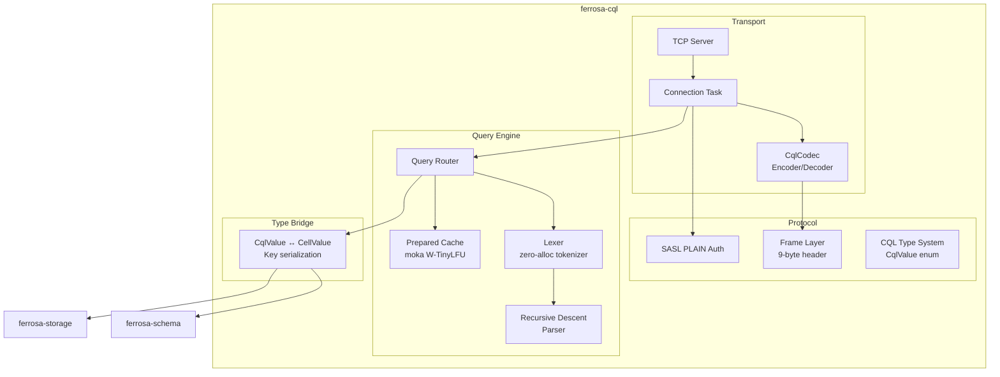

# CQL Protocol Specification

> Last updated: 2026-03-30 (vector type, LWT, counters, protocol v4 compat, Accord transactions, pagination, fts_match)
> Status: Approved

## Overview

`ferrosa-cql` implements CQL native protocol v4 and v5 — the client-facing interface to Ferrosa. It handles TCP connections, binary protocol framing, CQL parsing, query execution, prepared statement caching, and SASL PLAIN authentication. Protocol version is negotiated during STARTUP, with v4 supported for compatibility with drivers like cdrs-tokio.

All hot paths are lock-free. The system parallelizes across all cores via Tokio's multi-threaded runtime.

## Design Decisions

| Decision | Choice | Rationale |
|----------|--------|-----------|
| Concurrency | Lock-free via `ArcSwap` + `moka` | No contention on hot paths; see [ADR-006](decisions/006-cql-architecture.md) |
| Parser | Hand-written recursive descent | CQL is LL(2); no backtracking needed; see [ADR-006](decisions/006-cql-architecture.md) |
| Prepared cache | `moka` W-TinyLFU | Lock-free reads, frequency+recency eviction |
| `ALLOW FILTERING` | Supported — full-scan with WHERE post-filter | Enables queries without secondary index when explicitly requested |
| Auth | SASL PLAIN only | Standard CQL driver expectation; pluggable trait for future |

## Dependencies

```
ferrosa-cql
├── ferrosa-common   (Token, DecoratedKey, CellValue, Error)
├── ferrosa-schema   (Schema, auth, permissions)
├── ferrosa-storage  (StorageEngine reads/writes)
├── tokio            (async runtime, TCP, task spawning)
├── tokio-util       (Codec/Framed for protocol framing)
├── bytes            (zero-copy byte buffers)
├── futures          (stream combinators)
├── arc-swap         (lock-free schema snapshot access)
├── phf              (compile-time perfect hash for keywords)
├── md-5             (MD5 for prepared statement IDs)
├── uuid             (UUID type support)
├── num-bigint       (varint/decimal support)
├── tracing          (structured logging)
├── moka             (lock-free prepared statement cache)
├── lz4_flex         (LZ4 frame compression)
└── snap             (Snappy frame compression)
```

## Architecture



## Frame Layer

### Binary Framing (CQL v5)

9-byte header per frame:

| Field | Size | Description |
|-------|------|-------------|
| version | 1 byte | Protocol version (`0x04`/`0x05` request, `0x84`/`0x85` response) |
| flags | 1 byte | Compression, tracing, custom payload, warning |
| stream ID | 2 bytes | Multiplexing identifier (big-endian i16) |
| opcode | 1 byte | Operation type |
| length | 4 bytes | Body length (big-endian u32) |

### Opcodes

| Opcode | Value | Direction | Purpose |
|--------|-------|-----------|---------|
| ERROR | 0x00 | Response | Error with code + message |
| STARTUP | 0x01 | Request | Initiate connection |
| READY | 0x02 | Response | Server ready (no auth needed) |
| AUTHENTICATE | 0x03 | Response | Auth required |
| OPTIONS | 0x05 | Request | Query supported options |
| SUPPORTED | 0x06 | Response | Supported options response |
| QUERY | 0x07 | Request | Execute CQL query |
| RESULT | 0x08 | Response | Query result |
| PREPARE | 0x09 | Request | Prepare a statement |
| EXECUTE | 0x0A | Request | Execute prepared statement |
| REGISTER | 0x0B | Request | Register for events |
| EVENT | 0x0C | Response | Event notification |
| BATCH | 0x0D | Request | Batch of statements |
| AUTH_CHALLENGE | 0x0E | Response | Auth challenge |
| AUTH_RESPONSE | 0x0F | Request | Auth response |
| AUTH_SUCCESS | 0x10 | Response | Auth success |

### Implementation

- **Zero-copy**: `bytes::BytesMut` for read buffers
- **Tokio codec pattern**: `Encoder`/`Decoder` traits on `Framed<TcpStream, CqlCodec>`
- **Multiplexing**: stream IDs allow concurrent in-flight requests per connection
- **Max frame size**: configurable, default 256 MiB
- **Frame compression**: LZ4 and Snappy negotiated during STARTUP. Compression applied transparently by `CqlCodec` after handshake completes. Only compresses when output is smaller than input.

## CQL Type System

Single `CqlValue` enum covering all CQL types with `encode`/`decode` methods.

### Type Mapping

| CQL Type | Wire Format | Rust Type |
|----------|------------|-----------|
| `ascii`, `text`, `varchar` | UTF-8 bytes | `String` |
| `int` | 4-byte big-endian | `i32` |
| `bigint`, `counter` | 8-byte big-endian | `i64` |
| `smallint` | 2-byte big-endian | `i16` |
| `tinyint` | 1 byte | `i8` |
| `float` | 4-byte IEEE 754 | `f32` |
| `double` | 8-byte IEEE 754 | `f64` |
| `boolean` | 1 byte (0/1) | `bool` |
| `blob` | raw bytes | `Vec<u8>` / `Bytes` |
| `uuid`, `timeuuid` | 16 bytes | `uuid::Uuid` |
| `timestamp` | 8-byte millis since epoch | `i64` |
| `inet` | 4 or 16 bytes | `std::net::IpAddr` |
| `varint` | variable-length signed | `num_bigint::BigInt` |
| `decimal` | varint scale + varint unscaled | `(i32, BigInt)` |
| `list<T>` | `[n][element]*n` | `Vec<CqlValue>` |
| `set<T>` | `[n][element]*n` | `Vec<CqlValue>` |
| `map<K,V>` | `[n][key,val]*n` | `Vec<(CqlValue, CqlValue)>` |
| `tuple` | concatenated elements | `Vec<Option<CqlValue>>` |
| `frozen<UDT>` | concatenated named fields | `Vec<(String, Option<CqlValue>)>` |
| `vector<float, N>` | Custom wire type (0x0000), N * 4-byte IEEE 754 floats | `Vec<f32>` |

### CqlValue / CellValue Bridge

`CqlValue` (protocol-facing) converts to/from `ferrosa-common::CellValue` (storage-facing):

- **Cell values**: CQL wire format bytes (big-endian), avoiding a second serialization format
- **Partition keys**: Composite key format — `[2-byte length][value bytes][0x00 terminator]` per component
- **Clustering keys**: Byte-comparable encoding from `ferrosa-sstable::byte_comparable`
- **Null handling**: CQL null (length = -1) maps to `CellValue::Empty`

## Parser

### Pipeline

```
Input: &str → Lexer (Token stream) → Parser (AST) → Statement enum
```

- **Lexer**: Single-pass, zero-allocation tokenizer, `Token<'input>` borrows from source. Keywords via `phf` perfect-hash map.
- **Parser**: One function per grammar rule. LL(2) — no backtracking. Returns `Result<Statement>` with span info.
- **AST**: `Statement` enum with variants: `Select` (with ALLOW FILTERING, DISTINCT, ANN ORDER BY), `Insert` (with IF NOT EXISTS, IF conditions), `Update` (counter ops, collection +/-, IF conditions), `Delete` (map element, IF conditions), `CreateKeyspace`, `CreateTable`, `AlterTable`, `DropTable`, `CreateIndex`, `DropIndex`, `CreateRole`, `AlterRole`, `DropRole`, `Grant`, `Revoke`, `Use`, `Batch` (with CAS), `BeginTransaction`, `Commit`, `Rollback`, etc.

### Secondary Index DDL

```sql
-- CREATE INDEX with pluggable type
CREATE INDEX [IF NOT EXISTS] [index_name] ON [keyspace.]table (column [, column ...])
    [USING 'btree' | 'hash' | 'composite' | 'phonetic' | 'vector' | 'fulltext']
    [WITH OPTIONS = {'key': 'value', ...}];

-- DROP INDEX
DROP INDEX [IF EXISTS] [keyspace.]index_name;

-- Examples
CREATE INDEX idx_email ON users (email) USING 'btree';
CREATE INDEX idx_embed ON docs (embedding) USING 'vector'
    WITH OPTIONS = {'method': 'hnsw', 'metric': 'cosine', 'dimensions': '768'};
CREATE INDEX idx_name ON users (last_name) USING 'phonetic'
    WITH OPTIONS = {'algorithm': 'soundex'};
```

When `USING` is omitted, the default index type is `btree`. The router's `resolve_index_type()` maps the USING string + options to the `IndexType` enum from `ferrosa-index`. All index DDL routes through `DdlPath` for pair-mode replication.

### Vector Type

```sql
-- Column definition
CREATE TABLE docs (
    id uuid PRIMARY KEY,
    embedding vector<float, 768>
);

-- Insert with vector literal
INSERT INTO docs (id, embedding) VALUES (uuid(), [0.1, 0.2, ...]);

-- ANN ORDER BY (parsed, execution deferred)
SELECT * FROM docs ORDER BY embedding ANN OF [0.1, 0.2, ...] LIMIT 10;
```

The `vector<float, N>` type is represented as `CqlType::Vector { dimensions: u16 }` in the AST and encoded on the wire as a Custom type (option ID 0x0000) with the Cassandra-compatible class name `org.apache.cassandra.db.marshal.VectorType(org.apache.cassandra.db.marshal.FloatType,N)`. Values are N consecutive IEEE 754 f32 values with no length prefix per element.

### Additional Query Features

**ALLOW FILTERING:**

```sql
SELECT * FROM users WHERE age > 25 ALLOW FILTERING;
```

Enables full-table scan with post-filter evaluation of WHERE predicates. When a secondary index exists on the filtered column, the index is used instead of a full scan.

**Built-in Functions:**

| Function | Description |
|----------|-------------|
| `toJson(column)` | Converts a column value to its JSON string representation |
| `token(pk_columns...)` | Returns the Murmur3 token for the given partition key |
| `avg(column)` | Aggregate: arithmetic mean |
| `min(column)` | Aggregate: minimum value |
| `max(column)` | Aggregate: maximum value |
| `sum(column)` | Aggregate: sum |
| `fts_match(column, query)` | Full-text search predicate with BM25 ranking (see below) |

### Full-Text Search (`fts_match`)

```sql
-- Single term
SELECT * FROM articles WHERE fts_match(body, 'distributed');

-- Boolean AND/OR
SELECT * FROM articles WHERE fts_match(body, 'rust AND cassandra');

-- Phrase
SELECT * FROM articles WHERE fts_match(body, '"S3 backed storage"');

-- Prefix wildcard
SELECT * FROM articles WHERE fts_match(body, 'compac*');

-- NOT
SELECT * FROM articles WHERE fts_match(body, 'NOT deprecated');

-- Combined with regular WHERE
SELECT * FROM articles WHERE category = 'tech' AND fts_match(body, 'distributed') ALLOW FILTERING;
```

Requires a `CREATE INDEX ... USING 'fulltext'` on the target column. Results ranked by BM25 score.

**Lightweight Transactions (LWT):**

```sql
-- INSERT IF NOT EXISTS
INSERT INTO users (id, name) VALUES (1, 'alice') IF NOT EXISTS;

-- UPDATE with IF condition
UPDATE users SET name = 'bob' WHERE id = 1 IF name = 'alice';

-- DELETE with IF condition
DELETE FROM users WHERE id = 1 IF name = 'bob';

-- Batch CAS
BEGIN BATCH
  INSERT INTO users (id, name) VALUES (1, 'alice') IF NOT EXISTS;
  INSERT INTO profiles (id, bio) VALUES (1, 'hello') IF NOT EXISTS;
APPLY BATCH;
```

Full LWT support via the Accord consensus protocol. INSERT IF NOT EXISTS, IF conditions on UPDATE/DELETE, and Batch CAS are all routed through `AccordCoordinator` when `SERIAL` or `LOCAL_SERIAL` consistency is requested. Returns a `[applied]` boolean column indicating whether the operation was performed.

**Counter Operations:**

```sql
UPDATE counters SET page_views = page_views + 1 WHERE url = '/home';
UPDATE counters SET page_views = page_views - 5 WHERE url = '/home';
```

Counter increment and decrement via `column = column + N` and `column = column - N` syntax. Counter columns use `bigint` (i64) storage.

**Collection Mutations:**

```sql
UPDATE users SET tags = tags + {'new_tag'} WHERE id = 1;
UPDATE users SET tags = tags - {'old_tag'} WHERE id = 1;
UPDATE users SET props = props + {'key': 'value'} WHERE id = 1;
```

Collection append (`+`) and remove (`-`) operators for sets, lists, and maps.

**CONTAINS / CONTAINS KEY:**

```sql
SELECT * FROM users WHERE tags CONTAINS 'admin';
SELECT * FROM users WHERE props CONTAINS KEY 'role';
```

Collection element filtering operators for use in WHERE clauses (requires ALLOW FILTERING or a secondary index).

**SOUNDS LIKE (phonetic comparison):**

```sql
SELECT * FROM people WHERE name SOUNDS LIKE 'Jon Smyth' ALLOW FILTERING;
```

Phonetic comparison using Double Metaphone encoding. Matches words that sound similar regardless of spelling (e.g., "John Smith" matches "Jon Smyth"). Works with or without a phonetic index on the column. Requires ALLOW FILTERING when used without a phonetic index.

**SELECT DISTINCT:**

```sql
SELECT DISTINCT partition_key FROM table_name;
```

Returns unique partition key values only, without scanning row data.

**token() in WHERE:**

```sql
SELECT * FROM users WHERE token(id) > -9223372036854775808
                      AND token(id) < 9223372036854775807;
```

Token-range queries for partition scanning, used by drivers for parallel full-table reads.

**DROP ROLE:**

```sql
DROP ROLE [IF EXISTS] role_name;
```

**Multi-Statement Transactions:**

```sql
BEGIN TRANSACTION;
  SELECT balance FROM accounts WHERE id = 1;
  UPDATE accounts SET balance = balance - 100 WHERE id = 1;
  UPDATE accounts SET balance = balance + 100 WHERE id = 2;
COMMIT;

-- Or abort
BEGIN TRANSACTION;
  SELECT balance FROM accounts WHERE id = 1;
ROLLBACK;
```

Multi-statement transactions provide serializable isolation via the Accord consensus protocol. The parser extracts read-set and write-set from the transaction body. Transaction limits prevent unbounded resource usage (max statements, max keys, timeout). Client retry handles Accord contention automatically.

**Consistency Levels (SERIAL):**

```sql
-- Global serializable via Accord
SELECT * FROM users WHERE id = 1 USING CONSISTENCY SERIAL;

-- DC-local serializable via Accord
INSERT INTO users (id, name) VALUES (1, 'alice') IF NOT EXISTS
    USING CONSISTENCY LOCAL_SERIAL;
```

| Level | Behavior |
|-------|----------|
| `SERIAL` | Global serializable via Accord consensus |
| `LOCAL_SERIAL` | DC-local serializable via Accord consensus |

**Pagination:**

Result set paging is supported via the standard CQL paging protocol:

- QUERY and EXECUTE requests include an optional page size
- Results larger than the page size return a `paging_state` token
- Subsequent requests include the `paging_state` to fetch the next page
- Compatible with standard CQL driver auto-paging

**Additional Built-in Functions:**

| Function | Description |
|----------|-------------|
| `now()` | Returns the current timestamp as a timeuuid |
| `toTimestamp(timeuuid)` | Converts a timeuuid to a timestamp |
| `TTL(column)` | Returns the remaining TTL in seconds for a column value |

**PREPARE with pk_count:**

PREPARE responses include `pk_count` metadata indicating the number of partition key bind markers, enabling drivers to compute routing keys for token-aware load balancing.

**EXECUTE with positional bind values:**

EXECUTE requests support positional bind values (in addition to named), matching the standard CQL protocol wire format. Values are bound in order of their appearance in the prepared statement.

## Query Routing

```
Statement → DDL        → ferrosa-schema::Schema (via DdlDrain when Accord active)
          → DML reads  → ferrosa-storage::StorageEngine::read()
          → DML writes → ferrosa-storage::StorageEngine::write()
          → LWT (IF)   → ferrosa-cluster::AccordCoordinator → storage
          → TRANSACTION → ferrosa-cluster::AccordCoordinator → storage
          → USE        → connection-local state
          → PREPARE    → parse + validate + cache
          → EXECUTE    → lookup cached plan, bind, re-enter router
```

LWT statements (IF NOT EXISTS, IF conditions) and multi-statement transactions (BEGIN TRANSACTION) are routed through the `AccordCoordinator` in `ferrosa-cluster`, which runs the Accord consensus protocol before applying writes to storage.

## Authentication

SASL PLAIN flow:

1. STARTUP → AUTHENTICATE (`org.apache.cassandra.auth.PasswordAuthenticator`)
1. Client sends AUTH_RESPONSE: `\0<username>\0<password>`
1. Server validates via `ferrosa-schema::Schema::authenticate()`
1. Success: AUTH_SUCCESS; failure: ERROR(Bad Credentials)
1. Max 3 auth attempts per connection

In development mode with no auth configured, STARTUP returns READY directly.

## Prepared Statement Cache

- **Cache**: `moka` W-TinyLFU, weight-based capacity (default 10 MiB)
- **ID**: MD5 of query string (protocol convention)
- **Schema invalidation**: background sweep on schema snapshot update
- **No TTL**: statements live until evicted by size pressure or schema change

## Error Codes

| Code | Name | When |
|------|------|------|
| `0x0000` | Server Error | Unexpected internal failure |
| `0x000A` | Protocol Error | Malformed frame, wrong version |
| `0x0100` | Bad Credentials | AUTH_RESPONSE rejected |
| `0x1000` | Unavailable | Not enough replicas |
| `0x1100` | Overloaded | Server backpressure |
| `0x2000` | Syntax Error | Parser failed |
| `0x2100` | Unauthorized | Permission denied |
| `0x2200` | Invalid | Semantic error (unknown table, type mismatch) |
| `0x2300` | Config Error | Invalid DDL |
| `0x2400` | Already Exists | CREATE without IF NOT EXISTS |
| `0x2500` | Unprepared | EXECUTE with unknown prepared ID |

## Crate Structure

```
ferrosa-cql/
├── Cargo.toml
└── src/
    ├── lib.rs           # Public API: CqlServer, start()
    ├── frame.rs         # Frame header, CqlCodec, opcodes          (Part A)
    ├── types.rs         # CqlValue enum, encode/decode, type IDs   (Part A)
    ├── auth.rs          # SASL PLAIN handshake                     (Part A)
    ├── error.rs         # CqlError enum, error codes               (Part A)
    ├── server.rs        # TCP listener, backpressure               (Part A)
    ├── connection.rs    # Connection state machine, idle timeout   (Parts A + D)
    ├── bridge.rs        # CqlValue ↔ CellValue conversion         (Part B)
    ├── lexer.rs         # Zero-alloc tokenizer, keyword map        (Part B)
    ├── parser.rs        # Recursive descent parser                 (Part B)
    ├── ast.rs           # Statement enum, AST nodes                (Part B)
    ├── router.rs        # Query routing, SharedState               (Part B)
    ├── prepared.rs      # PreparedPlan, moka cache                 (Part C)
    └── result.rs        # CQL result encoding                      (Part B)
```

## Implementation Parts

- **Part A**: Protocol + Types (frame layer, CQL type system, TCP server with auth) — **done**
- **Part B**: Parser + Execution (hand-written recursive descent, query routing) — **done**
- **Part C**: Prepared statements + System queries (moka cache, system keyspace routing) — **done**
- **Part D**: Threat model + security hardening (connection state machine, depth/size limits, idle timeout) — **done**

## Testing Strategy

- **Frame codec**: round-trip for every opcode, truncated/oversized frames
- **Type system**: encode/decode for every CQL type, nested collections, nulls
- **Parser**: one test per statement type, bind markers, nested types
- **Property tests**: `CqlValue` round-trip, frame decode safety, parser safety
- **Integration**: in-memory server with test harness sending raw frames
- **No mocks**: real schema and storage objects

## Virtual Tables in CQL

The query router intercepts `SELECT` queries targeting `system_observability.*` tables. Instead of dispatching to `ferrosa-storage`, the router looks up the table name in `VirtualTableRegistry` and calls `table.read(predicate)`.

**Constraints:**

- Virtual tables are **read-only** — `INSERT`, `UPDATE`, and `DELETE` return `Invalid` error
- `PREPARE` / `EXECUTE` are **not supported** for virtual table queries — returns `Invalid` error
- Virtual tables expose **live system state**, not persisted data

**Registry lookup flow:**

```
SELECT → Parser → Router
  → is keyspace "system_observability"?
    → yes: VirtualTableRegistry::get(table_name)
      → found: table.read(predicate) → RESULT rows
      → not found: ERROR(Invalid, "Unknown table")
    → no: normal storage path
```

## system_observability Keyspace

Three virtual tables expose live system state. All are read-only.

### connections

Active CQL client connections.

| Column | CQL Type | Description |
|--------|----------|-------------|
| `peer_address` | `inet` | Remote IP address |
| `port` | `int` | Remote port |
| `state` | `text` | Connection state (`AUTHENTICATING`, `READY`, `CLOSING`) |
| `username` | `text` | Authenticated username (null if unauthenticated) |
| `connected_at` | `timestamp` | Connection establishment time |
| `requests_served` | `bigint` | Total requests processed on this connection |
| `protocol_version` | `int` | CQL protocol version negotiated |

### active_queries

Currently executing CQL queries.

| Column | CQL Type | Description |
|--------|----------|-------------|
| `query_id` | `uuid` | Unique query identifier |
| `client_address` | `inet` | Client IP address |
| `username` | `text` | Authenticated username |
| `query_text` | `text` | CQL query string |
| `keyspace` | `text` | Active keyspace (null if none) |
| `start_time` | `timestamp` | Query start time |
| `elapsed_ms` | `bigint` | Milliseconds since query started |
| `state` | `text` | Query state (`PARSING`, `EXECUTING`, `STREAMING`) |

### storage_stats

Per-table storage statistics. Backed by `ferrosa-storage::StorageStatsProvider`.

| Column | CQL Type | Description |
|--------|----------|-------------|
| `keyspace` | `text` | Keyspace name |
| `table_name` | `text` | Table name |
| `memtable_size_bytes` | `bigint` | Active memtable size in bytes |
| `memtable_count` | `int` | Number of partitions in active memtable |
| `sstable_count` | `int` | Number of local SSTables |
| `sstable_size_bytes` | `bigint` | Total SSTable size on disk |
| `s3_object_count` | `int` | Number of S3 objects for this table |
| `s3_bytes` | `bigint` | Total bytes stored in S3 |
| `pending_compactions` | `int` | Number of pending compaction tasks |

## SUBSCRIBE / UNSUBSCRIBE

CQL extensions for streaming query results. These are Ferrosa-specific extensions, not part of the CQL v5 standard.

### Lexer Tokens

Four new keyword tokens added to the `phf` keyword map:

- `SUBSCRIBE`
- `UNSUBSCRIBE`
- `EVERY`
- `DELTA`

### AST Variants

```rust
enum Statement {
    // ... existing variants ...
    Subscribe {
        inner: Box<Statement>,          // the SELECT to re-execute
        interval: Option<Duration>,     // from EVERY clause
        delta: bool,                    // DELTA flag — only send changed rows
    },
    Unsubscribe {
        stream_id: Option<u16>,         // None = unsubscribe all
    },
}
```

### Parser

Handles the following syntax:

```
SUBSCRIBE <select_statement> [EVERY <n>s] [DELTA]
UNSUBSCRIBE [<stream_id>]
```

- `<select_statement>` must be a valid `SELECT` statement (parser reuses `parse_select()`)
- `EVERY <n>s` specifies the re-evaluation interval (integer seconds, e.g. `EVERY 5s`)
- `DELTA` enables differential delivery — only rows that changed since the last push are sent
- `UNSUBSCRIBE` with no argument unsubscribes all active streams on the connection

### Frame Flags

| Flag | Value | Description |
|------|-------|-------------|
| `COMPRESSION` | `0x01` | Frame body is compressed (LZ4 or Snappy) |
| `STREAMING` | `0x10` | Response is part of an active subscription stream |

### Frame Compression

Compression is negotiated during the STARTUP/OPTIONS handshake:

1. Client sends OPTIONS; server responds with SUPPORTED listing `lz4` and `snappy`
1. Client sends STARTUP with `COMPRESSION` key set to chosen algorithm
1. Server validates the algorithm and sends READY
1. All subsequent frames (both directions) may have `COMPRESSION` flag set
1. STARTUP and READY frames themselves are never compressed

Implementation in `CqlCodec`:

- `Compression` enum: `Lz4` and `Snappy` variants with `protocol_name()`/`from_protocol_name()`
- `set_compression()` enables compression after handshake completes
- Encoder compresses body and sets flag only when compression reduces size
- Decoder checks flag and decompresses; rejects compressed frames if no compression negotiated
- LZ4 uses CQL v5 wire format: 4-byte big-endian uncompressed length prefix + lz4 block
- Snappy uses raw Snappy encoding via `snap` crate

The stream ID in the frame header identifies the subscription. Multiple subscriptions can be active concurrently on the same connection using different stream IDs.

## ConnectionTracker and QueryTracker

Two tracking components on `SharedState` support the `system_observability` virtual tables.

### ConnectionTracker

```rust
pub struct ConnectionTracker {
    connections: DashMap<SocketAddr, ConnectionInfo>,
}

pub struct ConnectionInfo {
    pub peer_address: IpAddr,
    pub port: u16,
    pub state: ConnectionState,
    pub username: Option<String>,
    pub connected_at: Instant,
    pub requests_served: AtomicU64,
    pub protocol_version: u8,
}
```

- `register()` — called on TCP accept, inserts `ConnectionInfo` with state `AUTHENTICATING`
- `deregister()` — called on TCP disconnect (or connection error), removes entry
- `update_state()` — transitions state on auth success (`READY`) or close (`CLOSING`)
- `increment_requests()` — called after each request completes, `AtomicU64` fetch_add

### QueryTracker

```rust
pub struct QueryTracker {
    active: DashMap<Uuid, QueryInfo>,
}

pub struct QueryInfo {
    pub query_id: Uuid,
    pub client_address: IpAddr,
    pub username: String,
    pub query_text: String,
    pub keyspace: Option<String>,
    pub start_time: Instant,
    pub state: QueryState,
}
```

- `begin()` — called before query execution, inserts `QueryInfo`, returns `QueryGuard`
- `complete()` — called by `QueryGuard::drop()`, removes entry from `active`
- **RAII cleanup**: `QueryGuard` holds the query ID and a reference to the tracker. On drop (normal completion or panic), it removes the query from `active`. This prevents stale entries if query execution panics.

```rust
pub struct QueryGuard<'a> {
    tracker: &'a QueryTracker,
    query_id: Uuid,
}

impl Drop for QueryGuard<'_> {
    fn drop(&mut self) {
        self.tracker.active.remove(&self.query_id);
    }
}
```

### SharedState Integration

Both trackers are fields on `SharedState`, which is shared across all connection tasks:

```rust
pub struct SharedState {
    pub schema: ArcSwap<Schema>,
    pub storage: StorageEngine,
    pub prepared_cache: moka::sync::Cache<[u8; 16], PreparedPlan>,
    pub connection_tracker: ConnectionTracker,
    pub query_tracker: QueryTracker,
    pub virtual_tables: VirtualTableRegistry,
}
```

## Prometheus Metrics

`prometheus.rs` exposes a `render_metrics()` function that produces [Prometheus text exposition format](https://prometheus.io/docs/instrumenting/exposition_formats/).

**Implementation:**

- Iterates virtual tables in `VirtualTableRegistry`
- Reads rows from each virtual table (calls `table.read(None)` — no predicate filter)
- Outputs `# HELP`, `# TYPE`, and metric lines for numeric columns
- Metric names follow Prometheus conventions: `ferrosa_{table}_{column}`

**Example output:**

```
# HELP ferrosa_connections_requests_served Total requests served per connection
# TYPE ferrosa_connections_requests_served gauge
ferrosa_connections_requests_served{peer_address="10.0.1.5",port="9042"} 1523

# HELP ferrosa_storage_stats_memtable_size_bytes Active memtable size
# TYPE ferrosa_storage_stats_memtable_size_bytes gauge
ferrosa_storage_stats_memtable_size_bytes{keyspace="my_ks",table_name="my_table"} 4194304
```

## CQL Client Module

`client.rs` provides a programmatic CQL client for use by `ferrosa-ctl` and integration tests.

```rust
pub struct CqlClient {
    // internal: Framed<TcpStream, CqlCodec>
}

pub struct QueryResult {
    pub columns: Vec<ColumnSpec>,
    pub rows: Vec<ResultRow>,
}

pub struct ResultRow {
    pub values: Vec<Option<CqlValue>>,
}
```

**Public API:**

```rust
impl CqlClient {
    pub async fn connect(addr: SocketAddr) -> Result<Self>;
    pub async fn connect_with_auth(addr: SocketAddr, username: &str, password: &str) -> Result<Self>;
    pub async fn query(&mut self, cql: &str) -> Result<QueryResult>;
    pub async fn use_keyspace(&mut self, keyspace: &str) -> Result<()>;
    pub async fn close(self) -> Result<()>;
}
```

- **Async**: all methods are async, using tokio's TCP stream
- **SocketAddr-based**: connect takes a `SocketAddr` directly, no service discovery
- **Protocol**: uses the same `CqlCodec` from `frame.rs` for wire compatibility
- **Auth**: `connect()` expects no-auth mode; `connect_with_auth()` performs SASL PLAIN handshake
- **No connection pooling**: single connection per `CqlClient` instance. Pooling is the caller's responsibility.

## Crate Structure (Updated)

New files added for observability support:

```
ferrosa-cql/
└── src/
    ├── ... (existing files)
    ├── virtual_table.rs    # VirtualTable trait, VirtualTableRegistry
    ├── tracker.rs          # ConnectionTracker, QueryTracker, QueryGuard
    ├── prometheus.rs       # render_metrics() — text exposition format
    ├── client.rs           # CqlClient, QueryResult, ResultRow
    └── subscribe.rs        # SUBSCRIBE/UNSUBSCRIBE handling, stream management
```

## Related Specs

- [Overview](overview.md) — system overview
- [Components](components.md) — crate architecture
- [Storage](storage.md) — storage engine (StorageStatsProvider, SubscriptionObserver)
- [Accord](accord.md) — Accord consensus protocol (LWT and transaction routing)
- [ADR-006](decisions/006-cql-architecture.md) — CQL architectural decisions
