# Ferrosa Crates — Index

> Crate-centric overview of the 25-crate workspace. Each crate carries its own
> `README.md` (what's implemented, how it works, dependencies) and a `specs/`
> directory (overview / FMEA / roadmap). This page is the map; the detail lives
> with each crate. Cross-cutting topic specs live under [`reference/`](reference/).

> **Process rule:** changing a crate's behavior, public API, or dependencies is
> not done until that crate's `README.md` + `specs/` are updated to match. See
> [`CLAUDE.md`](../CLAUDE.md) / [`AGENTS.md`](../AGENTS.md).

## Crates by layer

### Front-ends & query

| Crate | Purpose | Runtime deps | Docs |
|-------|---------|--------------|------|
| `ferrosa-cql` | CQL native-protocol v4/v5 server — parse, route, LWT/Accord, prepared, SUBSCRIBE | ferrosa-cdc, ferrosa-cluster, ferrosa-common, ferrosa-index, ferrosa-net, ferrosa-row-bridge, ferrosa-schema, ferrosa-session, ferrosa-sstable, ferrosa-storage, ferrosa-udf | [README](../ferrosa-cql/README.md) · [specs](../ferrosa-cql/specs/) |
| `ferrosa-postgres` | PostgreSQL v3 wire front-end (preview) — SELECT/DML/transactions, SCRAM | ferrosa-common, ferrosa-row-bridge, ferrosa-schema, ferrosa-sql, ferrosa-sstable, ferrosa-storage | [README](../ferrosa-postgres/README.md) · [specs](../ferrosa-postgres/specs/) |
| `ferrosa-flight` | Apache Arrow Flight gRPC endpoint — CQL SELECT -> Arrow batches, bearer auth | ferrosa-cluster, ferrosa-common, ferrosa-cql, ferrosa-schema | [README](../ferrosa-flight/README.md) · [specs](../ferrosa-flight/specs/) |
| `ferrosa-graph` | Property-graph engine — Cypher, Bolt v5, HTTP, adjacency index | ferrosa-cluster, ferrosa-common, ferrosa-schema, ferrosa-sstable, ferrosa-storage | [README](../ferrosa-graph/README.md) · [specs](../ferrosa-graph/specs/) |
| `ferrosa-sparql` | SPARQL 1.1 endpoint (Query + Update, RDF*, property paths) | ferrosa-cluster, ferrosa-common, ferrosa-index, ferrosa-schema, ferrosa-sstable, ferrosa-storage | [README](../ferrosa-sparql/README.md) · [specs](../ferrosa-sparql/specs/) |
| `ferrosa-sql` | Bespoke relational engine (D3, no DataFusion) backing the Postgres front-end | — | [README](../ferrosa-sql/README.md) · [specs](../ferrosa-sql/specs/) |
| `ferrosa-udf` | User-defined functions — Wasmtime sandbox, fuel/epoch limits, AssemblyScript | ferrosa-common | [README](../ferrosa-udf/README.md) · [specs](../ferrosa-udf/specs/) |
| `ferrosa-row-bridge` | The single canonical CQL row codec shared by both front-ends (D10) | ferrosa-common, ferrosa-schema, ferrosa-sstable | [README](../ferrosa-row-bridge/README.md) · [specs](../ferrosa-row-bridge/specs/) |

### Consensus & cluster

| Crate | Purpose | Runtime deps | Docs |
|-------|---------|--------------|------|
| `ferrosa-cluster` | Raft metadata consensus, tunable CL, routing, repair, hinted handoff, Accord | ferrosa-cdc, ferrosa-common, ferrosa-index, ferrosa-net, ferrosa-schema, ferrosa-sstable, ferrosa-storage | [README](../ferrosa-cluster/README.md) · [specs](../ferrosa-cluster/specs/) |
| `ferrosa-session` | Connection/session state extracted for reuse across front-ends (extraction WIP) | ferrosa-cluster, ferrosa-common, ferrosa-net, ferrosa-schema, ferrosa-storage, ferrosa-udf | [README](../ferrosa-session/README.md) · [specs](../ferrosa-session/specs/) |

### Storage & schema

| Crate | Purpose | Runtime deps | Docs |
|-------|---------|--------------|------|
| `ferrosa-storage` | Write-behind S3 engine — memtable, commit log, compaction, cache, PITR | ferrosa-cdc, ferrosa-common, ferrosa-index, ferrosa-schema, ferrosa-sstable | [README](../ferrosa-storage/README.md) · [specs](../ferrosa-storage/specs/) |
| `ferrosa-schema` | Table/keyspace metadata, DDL, system keyspaces, auth/RBAC, audit, virtual tables | ferrosa-common, ferrosa-index, ferrosa-sstable | [README](../ferrosa-schema/README.md) · [specs](../ferrosa-schema/specs/) |
| `ferrosa-index` | Secondary + vector (HNSW/IVFFlat) + full-text + geo indexes | ferrosa-common | [README](../ferrosa-index/README.md) · [specs](../ferrosa-index/specs/) |
| `ferrosa-cdc` | Bounded change-data-capture bus (WrittenOnNode + CommittedToCluster streams) | ferrosa-common, ferrosa-sstable | [README](../ferrosa-cdc/README.md) · [specs](../ferrosa-cdc/specs/) |
| `ferrosa-sstable` | Read/write Cassandra-compatible BTI SSTables; ReadAt/WriteAt I/O boundary | ferrosa-common | [README](../ferrosa-sstable/README.md) · [specs](../ferrosa-sstable/specs/) |

### Foundation

| Crate | Purpose | Runtime deps | Docs |
|-------|---------|--------------|------|
| `ferrosa-common` | Shared leaf types (Token, keys, CellValue, CqlType/CqlValue, Accord HLC/TxnId) | — | [README](../ferrosa-common/README.md) · [specs](../ferrosa-common/specs/) |
| `ferrosa-net` | Custom internode protocol — framing, PSK-HMAC, priority lanes, TLS | ferrosa-common | [README](../ferrosa-net/README.md) · [specs](../ferrosa-net/specs/) |

### Binary & tooling

| Crate | Purpose | Runtime deps | Docs |
|-------|---------|--------------|------|
| `ferrosa` | Main binary / composition root — wires every subsystem + listeners | ferrosa-cdc, ferrosa-cluster, ferrosa-common, ferrosa-cql, ferrosa-flight, ferrosa-graph, ferrosa-net, ferrosa-postgres, ferrosa-schema, ferrosa-session, ferrosa-sparql, ferrosa-storage, ferrosa-udf | [README](../ferrosa/README.md) · [specs](../ferrosa/specs/) |
| `ferrosa-ctl` | CLI + ratatui TUI — cluster mgmt, snapshot/restore, monitoring over CQL | ferrosa-cluster, ferrosa-common, ferrosa-cql, ferrosa-sstable, ferrosa-storage | [README](../ferrosa-ctl/README.md) · [specs](../ferrosa-ctl/specs/) |
| `ferrosa-index-builder` | Standalone HTTP service to offload secondary-index construction | ferrosa-common, ferrosa-index, ferrosa-sstable, ferrosa-storage | [README](../ferrosa-index-builder/README.md) · [specs](../ferrosa-index-builder/specs/) |
| `ferrosa-worker` | Background task runner (nascent; IndexBuild task is a stub) | ferrosa-common, ferrosa-index, ferrosa-sstable | [README](../ferrosa-worker/README.md) · [specs](../ferrosa-worker/specs/) |
| `ferrosa-view` | Materialized-view primitives (island; not yet wired into the engine) | ferrosa-schema | [README](../ferrosa-view/README.md) · [specs](../ferrosa-view/specs/) |
| `ferrosa-loadgen` | Load/stress tool — UCS compaction soak, ground-truth integrity checks | ferrosa-common, ferrosa-cql, ferrosa-schema, ferrosa-sstable, ferrosa-storage | [README](../ferrosa-loadgen/README.md) · [specs](../ferrosa-loadgen/specs/) |

### Testing & simulation

| Crate | Purpose | Runtime deps | Docs |
|-------|---------|--------------|------|
| `ferrosa-jepsen` | Distributed-testing harness (Docker/Firecracker), live-infra-gated | ferrosa-sim | [README](../ferrosa-jepsen/README.md) · [specs](../ferrosa-jepsen/specs/) |
| `ferrosa-sim` | Deterministic Raft/cluster simulation harness + TLA+ refinement | — | [README](../ferrosa-sim/README.md) · [specs](../ferrosa-sim/specs/) |

## Runtime dependency graph

Edges are **runtime** `[dependencies]` (dev-dependencies omitted — e.g. `ferrosa-graph`→`ferrosa-net` and `ferrosa-ctl`→`schema/session/udf` are test-only).

```mermaid
graph TD
    ferrosa_session[ferrosa-session]
    ferrosa_cdc[ferrosa-cdc]
    ferrosa_postgres[ferrosa-postgres]
    ferrosa_view[ferrosa-view]
    ferrosa_net[ferrosa-net]
    ferrosa_sparql[ferrosa-sparql]
    ferrosa_loadgen[ferrosa-loadgen]
    ferrosa_flight[ferrosa-flight]
    ferrosa_index_builder[ferrosa-index-builder]
    ferrosa_cql[ferrosa-cql]
    ferrosa_jepsen[ferrosa-jepsen]
    ferrosa_row_bridge[ferrosa-row-bridge]
    ferrosa_graph[ferrosa-graph]
    ferrosa_storage[ferrosa-storage]
    ferrosa_common[ferrosa-common]
    ferrosa_schema[ferrosa-schema]
    ferrosa_index[ferrosa-index]
    ferrosa_udf[ferrosa-udf]
    ferrosa_worker[ferrosa-worker]
    ferrosa_ctl[ferrosa-ctl]
    ferrosa_sim[ferrosa-sim]
    ferrosa_sstable[ferrosa-sstable]
    ferrosa_cluster[ferrosa-cluster]
    ferrosa[ferrosa]
    ferrosa_sql[ferrosa-sql]
    ferrosa --> ferrosa_cdc
    ferrosa --> ferrosa_cluster
    ferrosa --> ferrosa_common
    ferrosa --> ferrosa_cql
    ferrosa --> ferrosa_flight
    ferrosa --> ferrosa_graph
    ferrosa --> ferrosa_net
    ferrosa --> ferrosa_postgres
    ferrosa --> ferrosa_schema
    ferrosa --> ferrosa_session
    ferrosa --> ferrosa_sparql
    ferrosa --> ferrosa_storage
    ferrosa --> ferrosa_udf
    ferrosa_cdc --> ferrosa_common
    ferrosa_cdc --> ferrosa_sstable
    ferrosa_cluster --> ferrosa_cdc
    ferrosa_cluster --> ferrosa_common
    ferrosa_cluster --> ferrosa_index
    ferrosa_cluster --> ferrosa_net
    ferrosa_cluster --> ferrosa_schema
    ferrosa_cluster --> ferrosa_sstable
    ferrosa_cluster --> ferrosa_storage
    ferrosa_cql --> ferrosa_cdc
    ferrosa_cql --> ferrosa_cluster
    ferrosa_cql --> ferrosa_common
    ferrosa_cql --> ferrosa_index
    ferrosa_cql --> ferrosa_net
    ferrosa_cql --> ferrosa_row_bridge
    ferrosa_cql --> ferrosa_schema
    ferrosa_cql --> ferrosa_session
    ferrosa_cql --> ferrosa_sstable
    ferrosa_cql --> ferrosa_storage
    ferrosa_cql --> ferrosa_udf
    ferrosa_ctl --> ferrosa_cluster
    ferrosa_ctl --> ferrosa_common
    ferrosa_ctl --> ferrosa_cql
    ferrosa_ctl --> ferrosa_sstable
    ferrosa_ctl --> ferrosa_storage
    ferrosa_flight --> ferrosa_cluster
    ferrosa_flight --> ferrosa_common
    ferrosa_flight --> ferrosa_cql
    ferrosa_flight --> ferrosa_schema
    ferrosa_graph --> ferrosa_cluster
    ferrosa_graph --> ferrosa_common
    ferrosa_graph --> ferrosa_schema
    ferrosa_graph --> ferrosa_sstable
    ferrosa_graph --> ferrosa_storage
    ferrosa_index --> ferrosa_common
    ferrosa_index_builder --> ferrosa_common
    ferrosa_index_builder --> ferrosa_index
    ferrosa_index_builder --> ferrosa_sstable
    ferrosa_index_builder --> ferrosa_storage
    ferrosa_jepsen --> ferrosa_sim
    ferrosa_loadgen --> ferrosa_common
    ferrosa_loadgen --> ferrosa_cql
    ferrosa_loadgen --> ferrosa_schema
    ferrosa_loadgen --> ferrosa_sstable
    ferrosa_loadgen --> ferrosa_storage
    ferrosa_net --> ferrosa_common
    ferrosa_postgres --> ferrosa_common
    ferrosa_postgres --> ferrosa_row_bridge
    ferrosa_postgres --> ferrosa_schema
    ferrosa_postgres --> ferrosa_sql
    ferrosa_postgres --> ferrosa_sstable
    ferrosa_postgres --> ferrosa_storage
    ferrosa_row_bridge --> ferrosa_common
    ferrosa_row_bridge --> ferrosa_schema
    ferrosa_row_bridge --> ferrosa_sstable
    ferrosa_schema --> ferrosa_common
    ferrosa_schema --> ferrosa_index
    ferrosa_schema --> ferrosa_sstable
    ferrosa_session --> ferrosa_cluster
    ferrosa_session --> ferrosa_common
    ferrosa_session --> ferrosa_net
    ferrosa_session --> ferrosa_schema
    ferrosa_session --> ferrosa_storage
    ferrosa_session --> ferrosa_udf
    ferrosa_sparql --> ferrosa_cluster
    ferrosa_sparql --> ferrosa_common
    ferrosa_sparql --> ferrosa_index
    ferrosa_sparql --> ferrosa_schema
    ferrosa_sparql --> ferrosa_sstable
    ferrosa_sparql --> ferrosa_storage
    ferrosa_sstable --> ferrosa_common
    ferrosa_storage --> ferrosa_cdc
    ferrosa_storage --> ferrosa_common
    ferrosa_storage --> ferrosa_index
    ferrosa_storage --> ferrosa_schema
    ferrosa_storage --> ferrosa_sstable
    ferrosa_udf --> ferrosa_common
    ferrosa_view --> ferrosa_schema
    ferrosa_worker --> ferrosa_common
    ferrosa_worker --> ferrosa_index
    ferrosa_worker --> ferrosa_sstable
```

