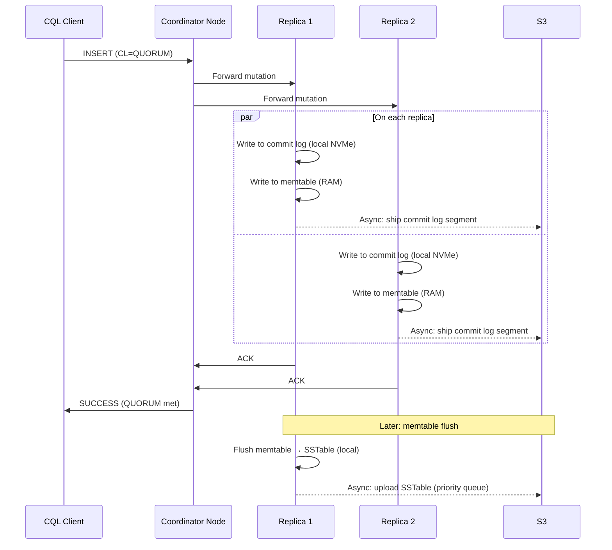
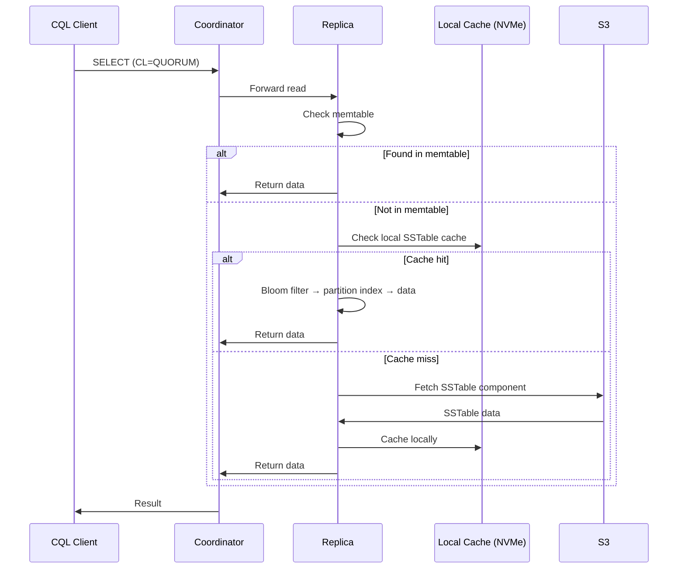
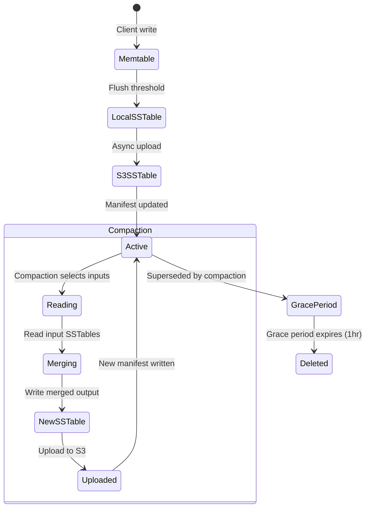
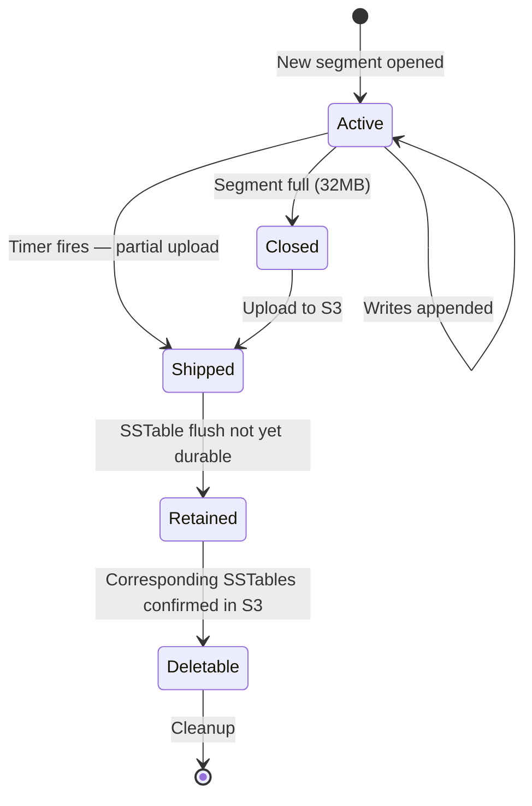
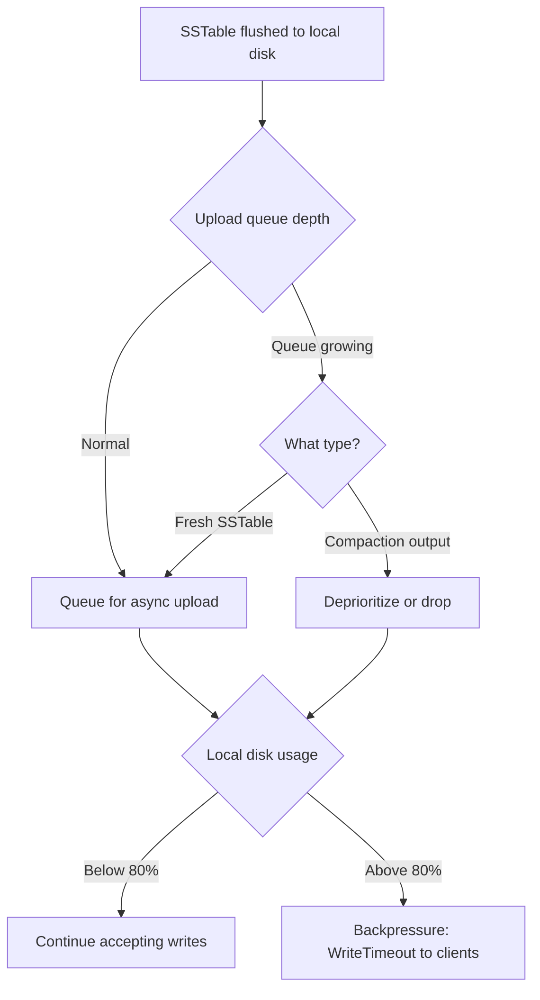
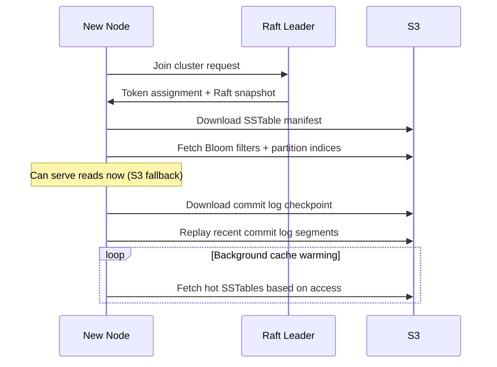

# Data Flow

> Last updated: 2026-03-11
> Status: Approved

## Overview

Ferrosa uses a write-behind async S3 storage model. Writes go to local ephemeral storage first, then are asynchronously uploaded to S3. Reads check memtable, local cache, then fall back to S3 on cache miss.

## Write Path



## Read Path



## SSTable Lifecycle in S3



### Manifest

Each table has a `manifest.json` in S3 that lists the current set of active SSTable generations. The manifest is the source of truth for what SSTables are live. It is a complete document (not a diff) — each update writes a new version. Since S3 PUT is atomic for a single object, the manifest transitions atomically from one consistent state to another. A generation counter detects stale writes.

### Safe Deletion Protocol

1. Compaction completes: new SSTables uploaded, confirmed durable in S3
1. Updated `manifest.json` written (atomic S3 PUT — new generations in, old out)
1. Old SSTables marked for deletion with grace period (default 1 hour)
1. Background GC deletes S3 objects whose grace period has expired
1. Grace period ensures nodes reading old SSTables from S3 (cache miss during transition) have time to complete

### Orphan Cleanup

A periodic sweep compares SSTable objects in S3 against all known manifests. Objects not referenced by any manifest and older than the grace period are deleted. This catches orphans from partial upload failures or interrupted compactions.

## Commit Log Lifecycle



### Commit Log Entry Format

Self-describing binary records:

| Field | Size | Description |
|-------|------|-------------|
| Length prefix | 4 bytes | Record length |
| Logical timestamp | 8 bytes | Monotonic per node |
| Mutation payload | Variable | Serialized CQL partition update |
| Checksum | 4 bytes | CRC32 |

Segments are fixed-size files (default 32MB). A segment is closed and a new one opened when it reaches capacity.

### S3 Shipping

Closed segments are uploaded to S3 immediately. The active (not yet full) segment is uploaded on a configurable timer (`commitlog_ship_interval`, default TBD — candidate values: 1-10 seconds, trading durability window for upload overhead) as a partial segment. The `checkpoint.json` per node tracks:

- The latest segment ID and offset confirmed durable in S3
- The latest SSTable generation confirmed durable in S3
- A mapping of segment IDs to their S3 object keys

### Replay Protocol

1. Read `checkpoint.json` from S3 to find the replay starting point
1. Determine which commit log segments contain data newer than the latest durable SSTable
1. Download and replay those segments in order, applying mutations to the memtable
1. Once replay is complete, the node is current and can begin serving

### Commit Log Cleanup

Segments in S3 are deleted once the data they contain has been flushed to SSTables and those SSTables are confirmed durable in S3. The checkpoint tracks this boundary.

## S3 Upload Backpressure



### Backpressure Details

1. **Queue depth monitoring**: Track pending uploads by count and total bytes.
1. **Priority shedding**: Drop compaction output uploads first — they can be re-compacted. Freshly-flushed SSTables always get priority.
1. **Disk space threshold**: When local ephemeral disk usage exceeds a configurable threshold (default 80%), begin rejecting writes with backpressure (return `WriteTimeout` to clients). This prevents the node from filling its ephemeral storage.
1. **S3 outage behavior**: Writes continue locally as long as disk space permits. Uploads queue and retry with exponential backoff. When S3 returns, the queue drains in priority order.

## Node Recovery



## Data Loss Mitigations

| Layer | Mechanism | Window Covered |
|-------|-----------|---------------|
| 1. Quorum writes | Data on >= 2 nodes before ACK (RF=3, CL=QUORUM) | Node death before S3 upload |
| 2. Commit log shipping | Async S3 upload on configurable interval (`commitlog_ship_interval`) | Node death before SSTable flush |
| 3. SSTable upload priority | Fresh flushes before compaction output | Node death between flush and upload |
| 4. Replica coordination | Track S3 upload confirmation per replica | Multi-node failure before any upload |
| 5. Increased quorum (optional) | CL=ALL or higher RF | Catastrophic multi-node failure |

## S3 Object Layout

```
s3://ferrosa-data/{cluster_id}/
  {keyspace}/{table}/
    sstables/{generation}-{component}.db
    manifest.json
  commitlog/
    {node_id}/{segment_id}.log
    {node_id}/checkpoint.json
  metadata/
    schema.json
    topology.json
```

## S3 Object Metadata (per SSTable component)

| Key | Value | Purpose |
|-----|-------|---------|
| `x-amz-meta-ferrosa-table` | `keyspace.table_name` | Quick identification |
| `x-amz-meta-ferrosa-generation` | `42` | SSTable generation |
| `x-amz-meta-ferrosa-format` | `bti-1.0` | Format version |
| `x-amz-meta-ferrosa-min-token` | `-9223372036854775808` | Partition range start (cache warming) |
| `x-amz-meta-ferrosa-max-token` | `3074457345618258602` | Partition range end |
| `x-amz-meta-ferrosa-level` | `0` | Compaction level |
| `x-amz-meta-ferrosa-checksum` | `sha256:abc123...` | Integrity verification |
| `x-amz-meta-ferrosa-uploaded-by` | `node-3` | Source node |
| `x-amz-meta-ferrosa-created-at` | `2026-03-11T...` | Lifecycle policies |

## Related Specs

- [Overview](overview.md) — system overview
- [Components](components.md) — crate architecture
- [Testing](testing.md) — data integrity and chaos tests
